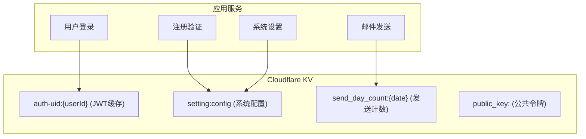
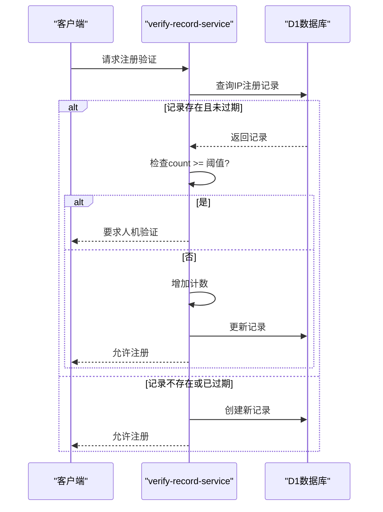
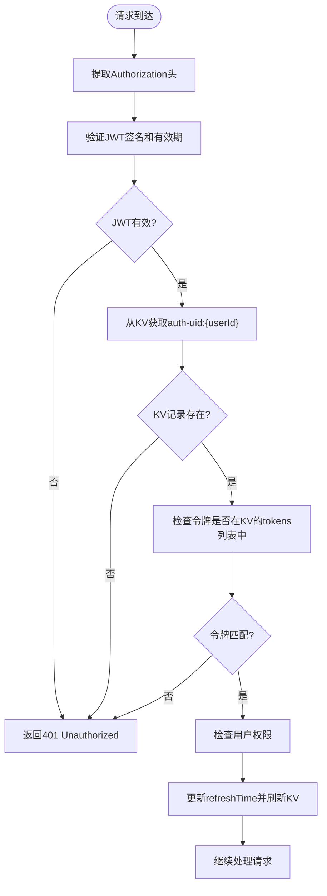
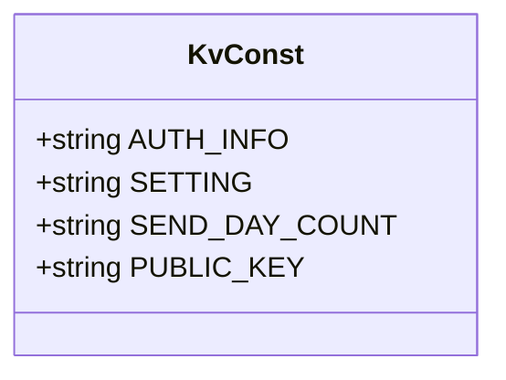

# KV缓存策略

<cite>
**本文档引用的文件**  
- [verify-record-service.js](file://mail-worker/src/service/verify-record-service.js)
- [security.js](file://mail-worker/src/security/security.js)
- [verify-utils.js](file://mail-worker/src/utils/verify-utils.js)
- [kv-const.js](file://mail-worker/src/const/kv-const.js)
- [constant.js](file://mail-worker/src/const/constant.js)
- [entity-const.js](file://mail-worker/src/const/entity-const.js)
- [jwt-utils.js](file://mail-worker/src/utils/jwt-utils.js)
</cite>

## 目录
1. [引言](#引言)
2. [KV缓存设计概述](#kv缓存设计概述)
3. [核心应用场景分析](#核心应用场景分析)
4. [TTL机制与自动清理策略](#ttl机制与自动清理策略)
5. [基于KV的请求频率限制](#基于kv的请求频率限制)
6. [KV与D1数据库的协同关系](#kv与d1数据库的协同关系)
7. [KV读写性能优化建议](#kv读写性能优化建议)
8. [最佳实践代码示例](#最佳实践代码示例)
9. [总结](#总结)

## 引言
Cloudflare KV作为cloud-mail系统中的关键缓存组件，承担着存储轻量级、高频访问数据的核心职责。本文档详细阐述其在用户会话管理、注册验证、系统配置等场景下的设计与实现，深入分析其与D1数据库的协同机制，并提供性能优化与最佳实践指导。

## KV缓存设计概述
Cloudflare KV在cloud-mail系统中被用于高效存储临时性、高并发访问的数据。其设计目标是通过低延迟的键值存储，减轻数据库压力，提升系统响应速度和安全性。

主要缓存对象包括：
- 用户会话令牌（JWT缓存）
- 注册验证记录（verify-record）
- 系统配置快照
- 公共访问令牌（public key）

**图示来源**  
- [kv-const.js](file://mail-worker/src/const/kv-const.js#L1-L8)
- [security.js](file://mail-worker/src/security/security.js#L1-L172)

## 核心应用场景分析
### 用户会话令牌（JWT）缓存
系统通过JWT实现用户身份认证，并将用户会话信息缓存在KV中，以实现快速验证和状态管理。

**会话验证流程：**
1. 用户登录后生成JWT令牌
2. 令牌信息与用户ID关联存储于KV（键名为`auth-uid:{userId}`）
3. 后续请求携带令牌，服务端通过KV快速验证会话有效性
4. KV中的会话信息包含令牌列表和刷新时间，支持多设备登录管理

### 注册验证记录（verify-record）
系统利用D1数据库中的`verify_record`表记录用户IP的注册行为，并结合KV缓存实现动态验证策略。

**验证逻辑：**
- 当注册验证模式为`COUNT`时，系统查询同一IP的注册次数
- 若达到阈值，则要求进行人机验证（Turnstile）
- 此机制有效防止自动化脚本的暴力注册

### 系统配置快照
系统将运行时配置（如站点密钥、重发令牌等）缓存于KV中，避免每次请求都查询数据库。

**配置缓存特点：**
- 键名为`setting:config`
- 包含敏感信息的脱敏显示（如密钥仅显示前12位）
- 支持动态更新，无需重启服务

**本节来源**  
- [security.js](file://mail-worker/src/security/security.js#L1-L172)
- [verify-record-service.js](file://mail-worker/src/service/verify-record-service.js#L1-L90)
- [setting-service.js](file://mail-worker/src/service/setting-service.js#L51-L89)

## TTL机制与自动清理策略
### verify-record-service中的TTL应用
虽然`verify_record`表本身存储在D1数据库中，但系统通过业务逻辑实现了类似TTL的自动清理机制。

**自动清理逻辑：**
- 系统定期调用`clearRecord`方法清理过期或无效的验证记录
- 每次验证请求都会更新记录的时间戳
- 结合业务规则（如每日限额），过期记录在下次查询时被视为无效

**图示来源**  
- [verify-record-service.js](file://mail-worker/src/service/verify-record-service.js#L35-L51)
- [account-service.js](file://mail-worker/src/service/account-service.js#L17-L92)

## 基于KV的请求频率限制
### security.js中的速率限制实现
系统在安全中间件中利用KV实现了精细的请求频率控制和会话管理。

**核心机制：**
- **会话验证**：所有受保护接口首先验证`Authorization`头中的JWT令牌
- **KV会话检查**：从KV中获取`auth-uid:{userId}`对应的会话信息，验证令牌是否在有效列表中
- **自动刷新**：每日首次访问时刷新会话的`refreshTime`，并更新KV中的缓存

**安全优势：**
- 实现了服务端会话控制，可主动使令牌失效
- 防止令牌被盗用，即使JWT未过期，若不在KV的令牌列表中则拒绝访问
- 减少了对数据库的频繁查询，提升了验证效率

**本节来源**  
- [security.js](file://mail-worker/src/security/security.js#L1-L172)
- [constant.js](file://mail-worker/src/const/constant.js#L1-L17)
- [jwt-utils.js](file://mail-worker/src/utils/jwt-utils.js)

## KV与D1数据库的协同关系
### 分层存储架构
cloud-mail系统采用了清晰的分层存储策略，合理划分KV与D1的职责。

| 存储类型 | Cloudflare KV | D1数据库 |
|--------|-------------|---------|
| **数据性质** | 临时状态、缓存数据 | 持久化、核心业务数据 |
| **访问频率** | 极高 | 中高 |
| **数据量** | 小（键值对） | 大（结构化表） |
| **一致性要求** | 最终一致 | 强一致 |
| **典型数据** | 会话令牌、配置快照、计数器 | 用户账户、邮件内容、附件元数据 |

**协同工作流程示例（用户登录）：**
1. 用户凭证通过D1验证
2. 成功后生成JWT令牌
3. 会话信息写入KV缓存
4. 后续请求优先通过KV验证，仅在必要时回查D1

这种设计既保证了数据的持久性和完整性，又通过KV实现了高性能的读取访问。

**本节来源**  
- [security.js](file://mail-worker/src/security/security.js#L1-L172)
- [verify-record-service.js](file://mail-worker/src/service/verify-record-service.js#L1-L90)
- [account-service.js](file://mail-worker/src/service/account-service.js#L15-L228)

## KV读写性能优化建议
### 键名设计规范
遵循清晰、一致的命名约定，提高可维护性和性能。

**推荐规范：**
- 使用小写字母和连字符（`-`）
- 采用`域:子域:标识符`的层级结构
- 避免过长的键名
- 示例：`auth-uid:12345`, `setting:config`, `send_day_count:2024-01-01`

### 批量操作使用场景
对于需要同时读取或更新多个键值的场景，应使用KV的批量操作API，减少网络往返开销。

**适用场景：**
- 批量获取多个用户的会话状态
- 一次性更新多个配置项
- 清理一组相关的临时数据

### 过期策略优化
合理设置`expirationTtl`参数，确保数据及时清理，避免KV空间浪费。

**建议值：**
- 会话令牌：30天（与JWT有效期一致）
- 临时验证码：15-30分钟
- 系统配置：根据更新频率动态调整

## 最佳实践代码示例
### 键常量定义
在`kv-const.js`中集中管理所有KV键的前缀，确保一致性。

**代码路径**  
- [kv-const.js](file://mail-worker/src/const/kv-const.js#L1-L8)

### 会话管理
在安全中间件中，通过KV实现会话的双重验证（JWT + KV白名单）。

**关键代码路径：**
- [security.js](file://mail-worker/src/security/security.js#L65-L85)：从KV获取会话信息并验证令牌
- [security.js](file://mail-worker/src/security/security.js#L155-L165)：更新会话的刷新时间

### 验证计数
利用D1作为持久化存储，实现基于IP的注册计数，并通过业务逻辑模拟TTL。

**关键代码路径：**
- [verify-record-service.js](file://mail-worker/src/service/verify-record-service.js#L35-L51)：检查注册/添加计数是否达到阈值
- [verify-record-service.js](file://mail-worker/src/service/verify-record-service.js#L75-L90)：增加计数，不存在则创建新记录

## 总结
cloud-mail系统通过精心设计的KV缓存策略，有效提升了系统的性能、安全性和可扩展性。KV作为临时状态的高速缓存层，与D1数据库的持久化存储层形成了互补的架构。系统不仅利用KV实现了高效的会话管理和配置缓存，还通过巧妙的业务逻辑设计，实现了类似TTL的自动清理和基于IP的请求频率限制。遵循键名规范、合理使用批量操作和设置适当的过期时间，是充分发挥KV性能优势的关键。这一缓存设计模式为类似的Web应用提供了有价值的参考。