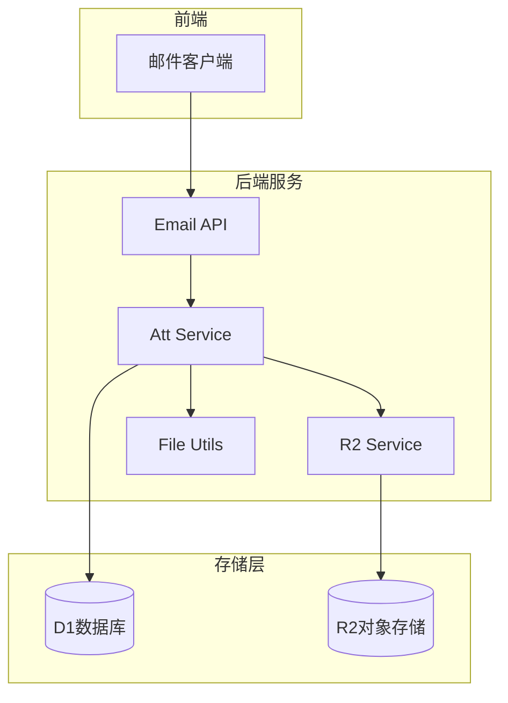
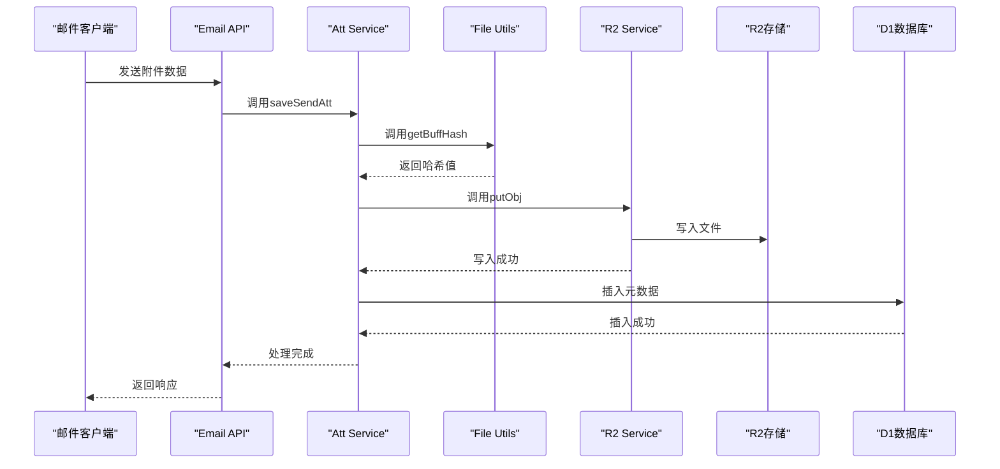
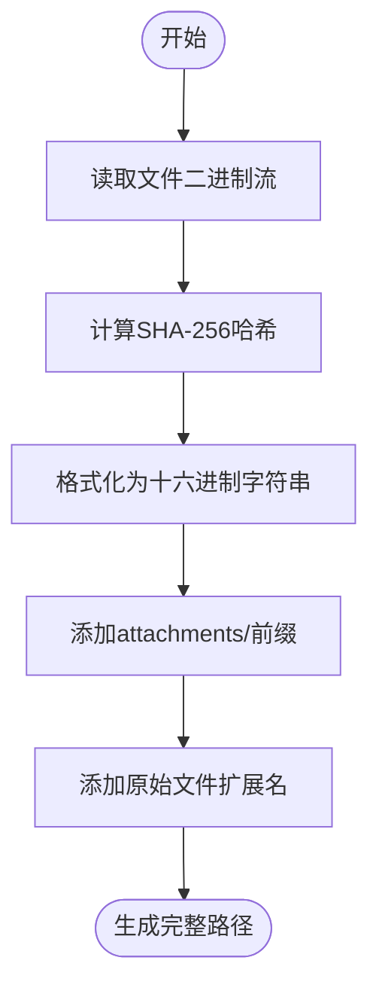
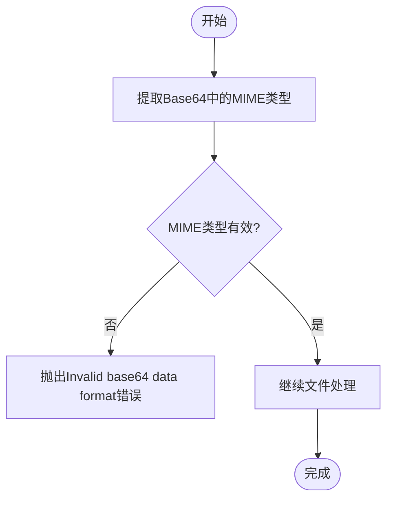
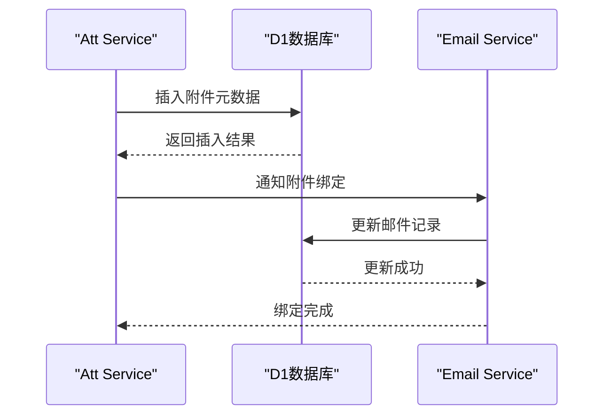
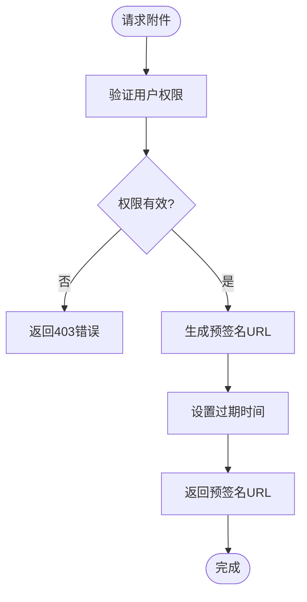

# R2对象存储策略

<cite>
**本文档引用文件**  
- [att.js](file://mail-worker/src/entity/att.js)
- [att-service.js](file://mail-worker/src/service/att-service.js)
- [r2-service.js](file://mail-worker/src/service/r2-service.js)
- [file-utils.js](file://mail-worker/src/utils/file-utils.js)
- [constant.js](file://mail-worker/src/const/constant.js)
- [setting-service.js](file://mail-worker/src/service/setting-service.js)
- [email-service.js](file://mail-worker/src/service/email-service.js)
- [domain-uitls.js](file://mail-worker/src/utils/domain-uitls.js)
- [convert.js](file://mail-vue/src/utils/convert.js)
</cite>

## 目录
1. [引言](#引言)
2. [R2集成架构](#r2集成架构)
3. [附件上传流程](#附件上传流程)
4. [文件路径生成算法](#文件路径生成算法)
5. [元数据管理](#元数据管理)
6. [安全下载机制](#安全下载机制)
7. [成本优化建议](#成本优化建议)
8. [结论](#结论)

## 引言
cloud-mail系统通过R2对象存储实现邮件附件的高效、安全存储。本系统采用元数据与文件分离的架构设计，确保附件管理的可扩展性与安全性。当用户通过email-api上传附件时，系统通过att-service生成唯一标识符，并利用r2-service将二进制流写入R2存储桶。通过预签名URL机制，系统实现了附件的安全访问，避免了存储桶的公开暴露。本文档深入解析该集成架构与附件管理流程。

## R2集成架构
cloud-mail系统采用分层架构实现R2对象存储的集成。核心组件包括att-service、r2-service和file-utils，分别负责附件业务逻辑、存储操作和文件处理。系统通过D1数据库存储附件元数据，而实际文件则存储于R2中，实现数据与元数据的物理分离。



**图表来源**  
- [att-service.js](file://mail-worker/src/service/att-service.js#L11-L199)
- [r2-service.js](file://mail-worker/src/service/r2-service.js#L3-L51)
- [file-utils.js](file://mail-worker/src/utils/file-utils.js#L0-L56)

## 附件上传流程
当用户上传邮件附件时，系统执行以下流程：首先，email-api接收附件数据；然后，att-service调用file-utils生成唯一文件标识符；最后，r2-service将二进制流写入R2存储桶。

### 上传流程序列图


**图表来源**  
- [att-service.js](file://mail-worker/src/service/att-service.js#L87-L112)
- [r2-service.js](file://mail-worker/src/service/r2-service.js#L10-L24)
- [file-utils.js](file://mail-worker/src/utils/file-utils.js#L10-L20)

**章节来源**  
- [att-service.js](file://mail-worker/src/service/att-service.js#L11-L199)
- [email-service.js](file://mail-worker/src/service/email-service.js#L145-L145)

## 文件路径生成算法
系统采用基于哈希的文件路径生成算法，确保文件名的唯一性和安全性。该算法包含哈希命名、目录分片和MIME类型校验三个核心机制。

### 哈希命名机制
系统使用SHA-256算法对文件内容进行哈希计算，生成64位十六进制字符串作为文件名的核心部分。该机制确保相同内容的文件具有相同的标识符，实现内容寻址。



**图表来源**  
- [file-utils.js](file://mail-worker/src/utils/file-utils.js#L10-L15)
- [constant.js](file://mail-worker/src/const/constant.js#L3-L16)

### 目录分片策略
系统采用扁平化存储结构，所有附件统一存储在"attachments/"目录下。该策略简化了文件管理，避免了深层目录结构带来的性能问题。

### MIME类型校验机制
系统在文件处理过程中实施严格的MIME类型校验。通过正则表达式匹配data:前缀的Base64数据，确保文件类型的正确识别和安全性。



**图表来源**  
- [file-utils.js](file://mail-worker/src/utils/file-utils.js#L28-L55)

**章节来源**  
- [file-utils.js](file://mail-worker/src/utils/file-utils.js#L0-L56)
- [constant.js](file://mail-worker/src/const/constant.js#L3-L16)

## 元数据管理
系统通过D1数据库中的attachments表管理附件元数据，实现元数据与实际文件的分离存储。这种设计提高了查询效率和数据管理的灵活性。

### 元数据表结构
| 字段名 | 类型 | 描述 |
|-------|------|------|
| attId | integer | 附件ID，主键 |
| userId | integer | 用户ID |
| emailId | integer | 邮件ID |
| accountId | integer | 账户ID |
| key | text | R2存储键 |
| filename | text | 原始文件名 |
| mimeType | text | MIME类型 |
| size | integer | 文件大小 |
| type | integer | 附件类型 |

**图表来源**  
- [att.js](file://mail-worker/src/entity/att.js#L3-L19)

### 元数据绑定流程
当附件上传完成后，系统将文件元数据与邮件记录进行绑定。这一过程确保了附件与邮件的关联关系，支持高效的附件查询和管理。



**图表来源**  
- [att-service.js](file://mail-worker/src/service/att-service.js#L87-L112)
- [email-service.js](file://mail-worker/src/service/email-service.js#L499-L499)

**章节来源**  
- [att.js](file://mail-worker/src/entity/att.js#L3-L19)
- [att-service.js](file://mail-worker/src/service/att-service.js#L11-L199)

## 安全下载机制
系统通过预签名URL机制实现附件的安全下载，避免了R2存储桶的公开暴露。该机制结合前端转换函数，确保附件访问的安全性和便捷性。

### 预签名URL生成流程


### 前端URL转换
前端通过cvtR2Url函数将R2键转换为可访问的URL。该函数从设置中获取R2域名，并构建完整的访问路径。

```javascript
// mail-vue/src/utils/convert.js
export function cvtR2Url(key) {
    if (!key) return 'https://' + '';
    if (key.startsWith('https://')) return key;
    const { settings } = useSettingStore();
    let domain = settings.r2Domain;
    if (!domain.startsWith('http')) {
        return 'https://' + domain + '/' + key;
    }
    if (domain.endsWith("/")) {
        domain = domain.slice(0, -1);
    }
    return domain + '/' + key;
}
```

**章节来源**  
- [convert.js](file://mail-vue/src/utils/convert.js#L1-L23)
- [domain-uitls.js](file://mail-worker/src/utils/domain-uitls.js#L0-L17)
- [setting-service.js](file://mail-worker/src/service/setting-service.js#L51-L89)

## 成本优化建议
为优化R2存储成本，建议实施以下策略：

### 生命周期规则配置
配置生命周期规则，自动将不常用的附件从标准存储转移到低成本的深度归档存储。例如，可设置30天后转移的规则，显著降低长期存储成本。

### 缓存策略设置