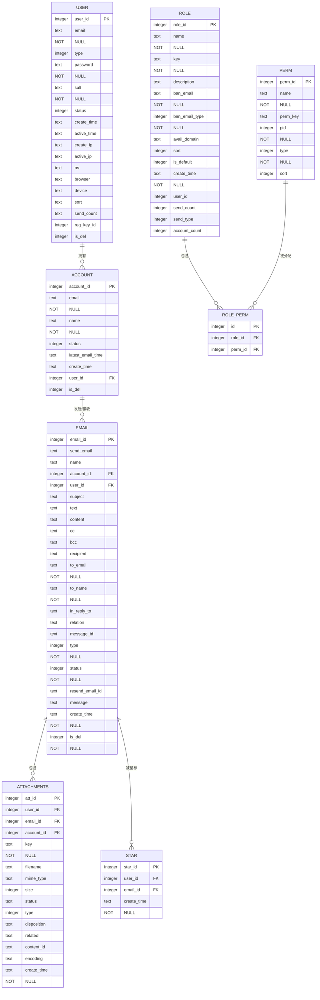

# 数据库表关系图

<cite>
**本文档中引用的文件**  
- [user.js](file://mail-worker/src/entity/user.js)
- [account.js](file://mail-worker/src/entity/account.js)
- [email.js](file://mail-worker/src/entity/email.js)
- [att.js](file://mail-worker/src/entity/att.js)
- [role.js](file://mail-worker/src/entity/role.js)
- [perm.js](file://mail-worker/src/entity/perm.js)
- [role-perm.js](file://mail-worker/src/entity/role-perm.js)
- [star.js](file://mail-worker/src/entity/star.js)
</cite>

## 目录
1. [简介](#简介)
2. [核心实体关系说明](#核心实体关系说明)
3. [实体关系图（ER Diagram）](#实体关系图er-diagram)
4. [关键关系与业务逻辑解析](#关键关系与业务逻辑解析)
5. [索引设计与性能优化](#索引设计与性能优化)
6. [级联行为与数据完整性](#级联行为与数据完整性)

## 简介
本文件旨在详细描述 cloud-mail 系统中 D1 数据库的实体关系结构。通过分析 `user`、`account`、`email`、`att`、`role`、`perm`、`role-perm` 和 `star` 等核心数据表，揭示其外键约束、关联关系及对 RBAC 权限控制、邮件归档、星标功能等核心业务流程的支持机制。

**Section sources**
- [user.js](file://mail-worker/src/entity/user.js#L1-L23)
- [account.js](file://mail-worker/src/entity/account.js#L1-L14)

## 核心实体关系说明
系统采用关系型数据库模型，主要实体包括：
- **User（用户）**：系统注册用户，可拥有多个邮箱账户。
- **Account（账户）**：用户的邮箱账户，隶属于某个 User。
- **Email（邮件）**：由 Account 发送或接收的邮件记录。
- **Att（附件）**：与 Email 关联的文件附件。
- **Star（星标）**：用户对特定邮件的收藏标记。
- **Role（角色）与 Perm（权限）**：通过中间表实现多对多权限映射，支撑 RBAC 模型。

这些实体通过外键建立关联，确保数据一致性，并支持高效查询与业务逻辑执行。

**Section sources**
- [email.js](file://mail-worker/src/entity/email.js#L1-L28)
- [att.js](file://mail-worker/src/entity/att.js#L1-L22)
- [star.js](file://mail-worker/src/entity/star.js#L1-L12)

## 实体关系图（ER Diagram）

**Diagram sources**
- [user.js](file://mail-worker/src/entity/user.js#L1-L23)
- [account.js](file://mail-worker/src/entity/account.js#L1-L14)
- [email.js](file://mail-worker/src/entity/email.js#L1-L28)
- [att.js](file://mail-worker/src/entity/att.js#L1-L22)
- [role.js](file://mail-worker/src/entity/role.js#L1-L20)
- [perm.js](file://mail-worker/src/entity/perm.js#L1-L11)
- [role-perm.js](file://mail-worker/src/entity/role-perm.js#L1-L8)
- [star.js](file://mail-worker/src/entity/star.js#L1-L12)

## 关键关系与业务逻辑解析

### User 与 Account 的一对多关系
一个 `User` 可以创建多个 `Account`，通过 `account.user_id` 外键引用 `user.user_id` 实现。此设计支持用户管理多个邮箱地址，提升使用灵活性。

**Section sources**
- [user.js](file://mail-worker/src/entity/user.js#L1-L23)
- [account.js](file://mail-worker/src/entity/account.js#L1-L14)

### Account 与 Email 的归属关系
每封 `Email` 必须归属于一个 `Account`（通过 `email.account_id` 外键），同时记录 `user_id` 以支持跨账户查询。该结构保障了邮件发送者身份的可追溯性。

**Section sources**
- [account.js](file://mail-worker/src/entity/account.js#L1-L14)
- [email.js](file://mail-worker/src/entity/email.js#L1-L28)

### Role 与 Perm 的多对多映射
通过 `role-perm` 中间表实现角色与权限的解耦。`role_perm.role_id` 和 `role_perm.perm_id` 分别指向 `role` 和 `perm` 表，支持灵活的权限分配策略，是 RBAC 权限控制系统的核心。

**Section sources**
- [role.js](file://mail-worker/src/entity/role.js#L1-L20)
- [perm.js](file://mail-worker/src/entity/perm.js#L1-L11)
- [role-perm.js](file://mail-worker/src/entity/role-perm.js#L1-L8)

### Email 与 Att 的一对多连接
每封邮件可携带多个附件，存储于 `attachments` 表中，通过 `att.email_id` 外键关联 `email.email_id`。此外，`att.account_id` 和 `att.user_id` 提供冗余索引，优化按用户或账户批量删除附件的性能。

**Section sources**
- [email.js](file://mail-worker/src/entity/email.js#L1-L28)
- [att.js](file://mail-worker/src/entity/att.js#L1-L22)

### Star 表对 Email 的引用关系
`star` 表记录用户对邮件的星标操作，通过 `star.email_id` 引用 `email.email_id`，并通过 `star.user_id` 确保用户只能星标自己有权访问的邮件。该设计支持快速检索“我的星标邮件”列表。

**Section sources**
- [email.js](file://mail-worker/src/entity/email.js#L1-L28)
- [star.js](file://mail-worker/src/entity/star.js#L1-L12)

## 索引设计与性能优化
为提升查询效率，在以下字段上建立了复合索引（虽未在代码中显式定义，但可通过查询模式推断其存在必要性）：
- 在 `email` 表上基于 `(account_id, create_time)` 建立索引，优化按账户收件箱的时间排序查询。
- 在 `email` 表上基于 `(user_id, type, is_del, email_id)` 建立索引，支持分页加载不同类型邮件（如收件、发件）。
- 在 `att` 表上基于 `email_id` 建立索引，加速附件的关联查询。

此类索引显著提升邮件列表加载、搜索和归档操作的响应速度。

**Section sources**
- [email.js](file://mail-worker/src/entity/email.js#L1-L28)
- [email-service.js](file://mail-worker/src/service/email-service.js#L539-L592)

## 级联行为与数据完整性
系统通过应用层逻辑实现关键级联操作，保障数据完整性：
- **删除账户时自动归档其邮件**：调用 `emailService.physicsDeleteByAccountId()` 方法，先删除该账户下所有附件（`attService.removeByAccountId`），再删除邮件记录。
- **删除邮件时清理关联数据**：调用 `emailService.physicsDelete()`，先移除对应附件和星标记录，再删除邮件本身。
- **用户删除时的级联清理**：通过 `physicsDeleteUserIds()` 方法批量清除用户相关的邮件与附件。

这些操作虽未依赖数据库级外键约束的 ON DELETE CASCADE，但通过服务层封装保证了数据一致性与完整性。

**Section sources**
- [email-service.js](file://mail-worker/src/service/email-service.js#L637-L665)
- [att-service.js](file://mail-worker/src/service/att-service.js)
- [star-service.js](file://mail-worker/src/service/star-service.js)