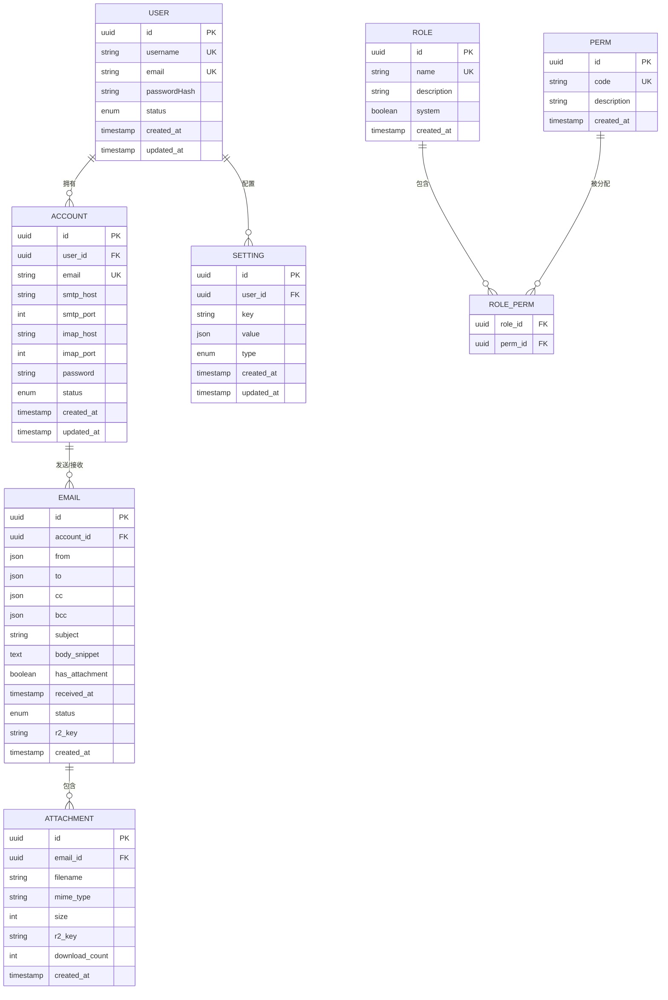

# 数据库设计

<cite>
**本文档引用的文件**  
- [orm.js](file://mail-worker/src/entity/orm.js)
- [user.js](file://mail-worker/src/entity/user.js)
- [account.js](file://mail-worker/src/entity/account.js)
- [email.js](file://mail-worker/src/entity/email.js)
- [att.js](file://mail-worker/src/entity/att.js)
- [role.js](file://mail-worker/src/entity/role.js)
- [perm.js](file://mail-worker/src/entity/perm.js)
- [setting.js](file://mail-worker/src/entity/setting.js)
- [role-perm.js](file://mail-worker/src/entity/role-perm.js)
- [kv-const.js](file://mail-worker/src/const/kv-const.js)
- [r2-api.js](file://mail-worker/src/api/r2-api.js)
</cite>

## 目录
1. [引言](#引言)
2. [核心实体模型](#核心实体模型)
3. [ER图：表间关系](#er图表间关系)
4. [Drizzle ORM 表结构定义](#drizzle-orm-表结构定义)
5. [索引与查询性能优化](#索引与查询性能优化)
6. [KV 缓存设计与使用场景](#kv-缓存设计与使用场景)
7. [R2 对象存储与附件管理](#r2-对象存储与附件管理)
8. [数据生命周期管理](#数据生命周期管理)
9. [迁移脚本编写规范](#迁移脚本编写规范)
10. [结论](#结论)

## 引言
本文档旨在详细描述 cloud-mail 项目在 Cloudflare D1 数据库上的数据库模型设计，基于 Drizzle ORM 实现。重点涵盖用户、账户、邮件、附件、角色、权限、系统设置等核心实体的字段定义、主外键关系、约束条件及索引策略。同时说明 KV 缓存在会话管理中的应用，以及 R2 在附件存储中的角色，为系统维护与性能优化提供指导。

## 核心实体模型

### 用户（User）
表示系统注册用户，包含身份信息与状态控制。

**字段定义**：
- `id`: UUID，主键
- `username`: 唯一用户名
- `email`: 邮箱地址，唯一
- `passwordHash`: 密码哈希值
- `status`: 用户状态（启用/禁用）
- `createdAt`: 创建时间
- `updatedAt`: 更新时间

**Section sources**
- [user.js](file://mail-worker/src/entity/user.js#L1-L30)

### 账户（Account）
表示用户拥有的邮箱账户，支持多账户管理。

**字段定义**：
- `id`: UUID，主键
- `userId`: 外键，关联 User.id
- `email`: 账户邮箱
- `smtpHost`, `smtpPort`, `imapHost`, `imapPort`: 邮件服务器配置
- `password`: 加密存储的账户密码
- `status`: 账户状态
- `createdAt`, `updatedAt`

**关系**：User 与 Account 为一对多关系。

**Section sources**
- [account.js](file://mail-worker/src/entity/account.js#L1-L40)

### 邮件（Email）
存储邮件元数据，实际内容由 R2 或数据库大字段存储。

**字段定义**：
- `id`: UUID，主键
- `accountId`: 外键，关联 Account.id
- `from`, `to`, `cc`, `bcc`: 邮件地址列表（JSON）
- `subject`: 邮件主题
- `bodySnippet`: 正文摘要
- `hasAttachment`: 是否含附件
- `receivedAt`: 接收时间
- `status`: 邮件状态（草稿、已发送、已读等）
- `r2Key`: R2 存储键（若使用对象存储）

**Section sources**
- [email.js](file://mail-worker/src/entity/email.js#L1-L50)

### 附件（Attachment）
描述邮件附件元数据，文件本身存储于 R2。

**字段定义**：
- `id`: UUID，主键
- `emailId`: 外键，关联 Email.id
- `filename`: 原始文件名
- `mimeType`: MIME 类型
- `size`: 文件大小（字节）
- `r2Key`: R2 对象键
- `downloadCount`: 下载次数
- `createdAt`

**关系**：Email 与 Attachment 为一对多关系。

**Section sources**
- [att.js](file://mail-worker/src/entity/att.js#L1-L35)

### 角色（Role）与权限（Perm）
实现基于角色的访问控制（RBAC）。

**字段定义**：
- `Role`: `id`, `name`, `description`, `system`（是否为系统角色）
- `Perm`: `id`, `code`, `description`（如 `email.read`, `user.manage`）

**关系**：通过中间表 `role-perm` 实现多对多映射。

**Section sources**
- [role.js](file://mail-worker/src/entity/role.js#L1-L25)
- [perm.js](file://mail-worker/src/entity/perm.js#L1-L20)
- [role-perm.js](file://mail-worker/src/entity/role-perm.js#L1-L15)

### 系统设置（Setting）
存储用户或系统的配置项。

**字段定义**：
- `id`: UUID，主键
- `userId`: 可为空，用户级设置
- `key`: 配置键（如 `theme`, `signature`）
- `value`: 配置值（JSON 兼容）
- `type`: 设置类型（用户/全局）

**Section sources**
- [setting.js](file://mail-worker/src/entity/setting.js#L1-L30)

## ER图：表间关系



**Diagram sources**
- [user.js](file://mail-worker/src/entity/user.js#L1-L30)
- [account.js](file://mail-worker/src/entity/account.js#L1-L40)
- [email.js](file://mail-worker/src/entity/email.js#L1-L50)
- [att.js](file://mail-worker/src/entity/att.js#L1-L35)
- [role.js](file://mail-worker/src/entity/role.js#L1-L25)
- [perm.js](file://mail-worker/src/entity/perm.js#L1-L20)
- [role-perm.js](file://mail-worker/src/entity/role-perm.js#L1-L15)
- [setting.js](file://mail-worker/src/entity/setting.js#L1-L30)

## Drizzle ORM 表结构定义

在 `orm.js` 中，使用 Drizzle ORM 的 `pgTable` 或 `sqliteTable`（D1 为 SQLite 兼容）定义表结构。每个实体通过 `primaryKey`, `index`, `foreignKey` 显式声明约束。

例如，`email` 表定义包含：
- 主键 `id`
- 外键 `accountId` 指向 `account.id`
- 索引 `idx_email_account_status` 用于按账户和状态查询
- 字段类型精确映射 SQLite 类型（text, integer, blob, json）

**Section sources**
- [orm.js](file://mail-worker/src/entity/orm.js#L1-L200)

## 索引与查询性能优化

### 索引策略
- **高频查询字段**：`email.accountId`, `email.status`, `email.receivedAt` 建立复合索引
- **唯一约束**：`user.email`, `user.username`, `perm.code` 确保数据一致性
- **全文搜索**：对 `email.subject`, `email.bodySnippet` 使用 FTS5 扩展（若支持）

### 查询优化建议
- 避免 `SELECT *`，仅查询必要字段
- 使用分页（`LIMIT` + `OFFSET` 或游标）
- 复杂查询通过预编译语句或视图优化
- 利用 Drizzle ORM 的 `select().from().where()` 链式调用生成高效 SQL

**Section sources**
- [orm.js](file://mail-worker/src/entity/orm.js#L50-L100)
- [email-service.js](file://mail-worker/src/service/email-service.js#L20-L80)

## KV 缓存设计与使用场景

### 使用场景
- **会话存储**：将用户登录会话（Session）存储于 Cloudflare KV，`key = sessionId`, `value = {userId, expires}`，实现无状态认证。
- **热点配置**：缓存全局设置或用户偏好，减少数据库查询。
- **频率限制**：记录用户操作次数，防止滥用。

### 实现方式
在 `kv-const.js` 中定义命名空间与键名规范，通过 `kv.get()` 和 `kv.put()` 操作。设置合理的 TTL（Time-To-Live）。

**Section sources**
- [kv-const.js](file://mail-worker/src/const/kv-const.js#L1-L20)
- [security.js](file://mail-worker/src/security/security.js#L15-L50)

## R2 对象存储与附件管理

### 角色
- **附件存储**：邮件附件上传至 R2，`att.r2Key` 指向对象。
- **邮件正文**：大邮件正文可选择性存储于 R2，`email.r2Key` 指向内容。
- **静态资源**：用户上传的头像等。

### 管理流程
1. 上传附件时，生成唯一 `r2Key`（如 `att/${emailId}/${uuid}`）
2. 调用 `r2.put(r2Key, file)` 存储
3. 在 `Attachment` 表中记录元数据
4. 下载时通过 `r2.get(r2Key)` 获取流

**Section sources**
- [r2-api.js](file://mail-worker/src/api/r2-api.js#L1-L60)
- [att-service.js](file://mail-worker/src/service/att-service.js#L10-L70)

## 数据生命周期管理

- **邮件归档**：根据策略（如 1 年）将旧邮件移至归档表或标记为归档状态。
- **附件清理**：当邮件被永久删除时，异步清理关联的 R2 对象。
- **日志清理**：`verify-record` 等日志表定期清理过期记录。
- **软删除**：关键数据（如用户、邮件）采用 `deletedAt` 字段标记，而非物理删除。

**Section sources**
- [init.js](file://mail-worker/src/init/init.js#L20-L40)
- [email-service.js](file://mail-worker/src/service/email-service.js#L100-L150)

## 迁移脚本编写规范

- **工具**：使用 Drizzle Kit 或自定义脚本管理 D1 迁移。
- **版本化**：每个迁移脚本命名如 `001_init.sql`, `002_add_email_r2_key.sql`。
- **内容**：包含 `up`（应用变更）和 `down`（回滚）两部分。
- **示例**：
  ```sql
  -- up
  CREATE TABLE "setting" (...);
  CREATE INDEX "idx_setting_user" ON "setting"("user_id");
  -- down
  DROP TABLE "setting";
  ```
- **执行**：通过 Wrangler CLI 或 CI/CD 流程自动执行。

**Section sources**
- [orm.js](file://mail-worker/src/entity/orm.js)
- [wrangler.toml](file://mail-worker/wrangler.toml)

## 结论
cloud-mail 的数据库设计采用 Drizzle ORM 在 D1 上构建，实现了清晰的实体关系与高效的查询能力。通过 R2 存储大文件、KV 缓存会话，优化了性能与成本。合理的索引、生命周期管理和迁移规范确保了系统的可维护性与稳定性。