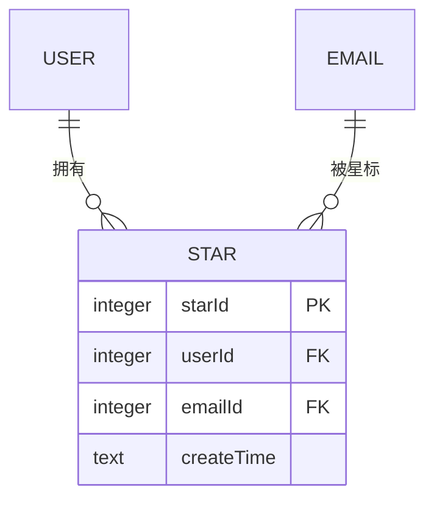
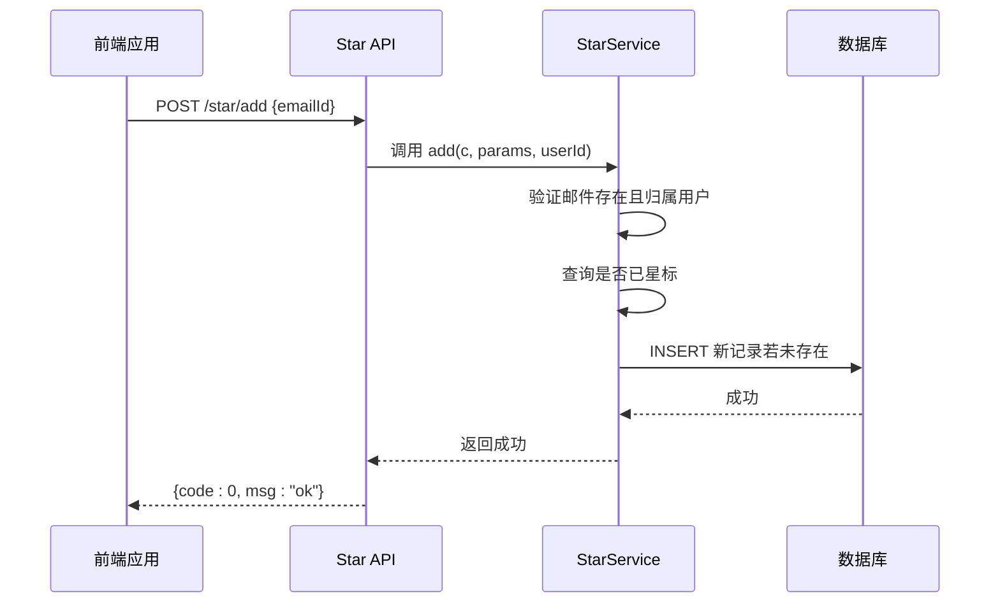
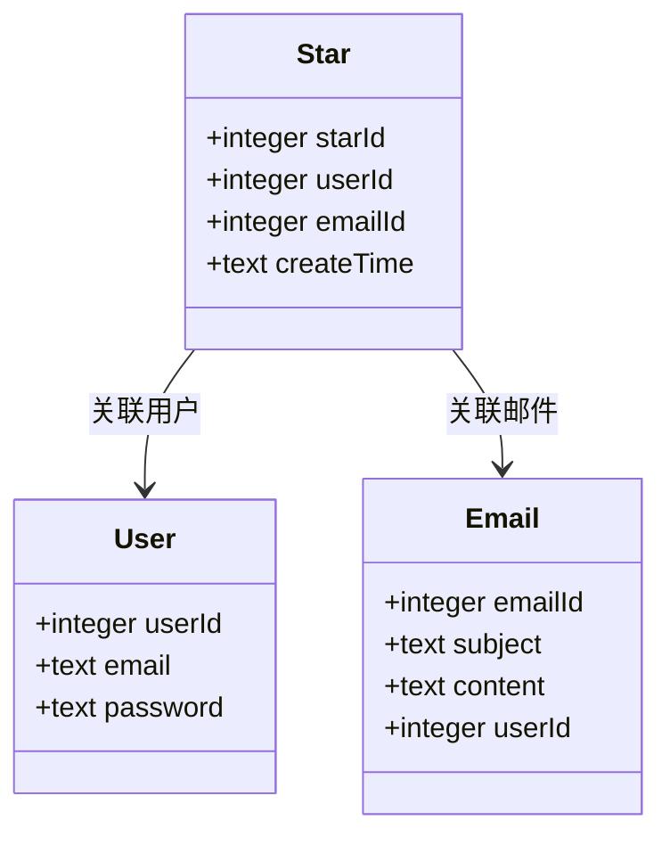

# 星标邮件实体 (Star)

<cite>
**本文档引用的文件**  
- [star.js](file://mail-worker/src/entity/star.js)
- [star-service.js](file://mail-worker/src/service/star-service.js)
- [star-api.js](file://mail-worker/src/api/star-api.js)
- [email.js](file://mail-worker/src/entity/email.js)
- [user.js](file://mail-worker/src/entity/user.js)
- [star.js](file://mail-vue/src/request/star.js)
</cite>

## 目录
1. [简介](#简介)
2. [实体结构与字段定义](#实体结构与字段定义)
3. [唯一性约束设计](#唯一性约束设计)
4. [业务逻辑说明](#业务逻辑说明)
5. [星标状态切换的数据库操作](#星标状态切换的数据库操作)
6. [与其他实体的关联关系](#与其他实体的关联关系)
7. [查询用户所有星标邮件的API示例](#查询用户所有星标邮件的api示例)
8. [高效展示星标邮件列表的设计原理](#高效展示星标邮件列表的设计原理)

## 简介
`Star` 实体是云邮件系统中用于实现邮件星标功能的核心数据结构。它通过记录用户（User）与邮件（Email）之间的关联关系，支持用户对任意收件箱中的邮件进行标记和快速访问。该设计确保了每个用户对特定邮件的星标操作具有唯一性，并为前端提供了高效的星标邮件列表查询能力。

**Section sources**  
- [star.js](file://mail-worker/src/entity/star.js#L0-L10)

## 实体结构与字段定义
`Star` 实体包含以下核心字段：

| 字段名 | 类型 | 是否必填 | 说明 |
|--------|------|----------|------|
| `starId` | 整数 | 是 | 主键，自增ID，唯一标识一条星标记录 |
| `userId` | 整数 | 是 | 用户ID，标识执行星标操作的用户 |
| `emailId` | 整数 | 是 | 邮件ID，标识被星标的邮件 |
| `createTime` | 文本 | 是 | 创建时间，默认值为当前时间戳 |

这些字段共同构成了用户与邮件之间的星标关联记录。

**Section sources**  
- [star.js](file://mail-worker/src/entity/star.js#L0-L10)

## 唯一性约束设计
系统通过 `userId` 和 `emailId` 的组合来确保星标记录的唯一性。这意味着：

- 同一个用户不能对同一篇邮件重复添加星标。
- 不同用户可以对同一篇邮件独立添加星标，互不影响。

这种设计避免了数据冗余，并保证了星标状态的一致性。



**Diagram sources**  
- [star.js](file://mail-worker/src/entity/star.js#L0-L10)
- [user.js](file://mail-worker/src/entity/user.js#L0-L22)
- [email.js](file://mail-worker/src/entity/email.js#L0-L27)

## 业务逻辑说明
用户可以在其权限范围内的任何收件箱中对邮件执行星标操作。系统允许用户对任意可见邮件进行星标，无论该邮件是否由其本人发送或接收。

当用户点击“添加星标”时，系统会：
1. 验证邮件是否存在；
2. 检查当前用户是否有权访问该邮件（通过 `userId` 匹配）；
3. 若尚未星标，则创建新的星标记录。

此机制保障了数据安全与权限控制。

**Section sources**  
- [star-service.js](file://mail-worker/src/service/star-service.js#L5-L25)

## 星标状态切换的数据库操作
星标状态的切换由两个核心操作组成：添加星标和取消星标。

### 添加星标 (`add`)
- **API路径**: `POST /star/add`
- **操作逻辑**:
  - 检查邮件是否存在且属于当前用户；
  - 查询是否已存在相同 `(userId, emailId)` 组合；
  - 若不存在，则插入新记录。
- **数据库操作**: `INSERT INTO star (userId, emailId, createTime) VALUES (?, ?, CURRENT_TIMESTAMP)`

### 取消星标 (`cancel`)
- **API路径**: `DELETE /star/cancel`
- **操作逻辑**:
  - 根据 `userId` 和 `emailId` 删除对应的星标记录。
- **数据库操作**: `DELETE FROM star WHERE userId = ? AND emailId = ?`



**Diagram sources**  
- [star-api.js](file://mail-worker/src/api/star-api.js#L0-L18)
- [star-service.js](file://mail-worker/src/service/star-service.js#L5-L30)

## 与其他实体的关联关系
`Star` 实体与以下两个核心实体存在外键关联：

- **User 实体**: 通过 `userId` 字段关联，表示星标操作的发起者。
- **Email 实体**: 通过 `emailId` 字段关联，表示被星标的邮件对象。

在查询星标邮件列表时，系统通过左连接（LEFT JOIN）将 `Star` 表与 `Email` 表关联，从而获取完整的邮件信息。



**Diagram sources**  
- [star.js](file://mail-worker/src/entity/star.js#L0-L10)
- [user.js](file://mail-worker/src/entity/user.js#L0-L22)
- [email.js](file://mail-worker/src/entity/email.js#L0-L27)

## 查询用户所有星标邮件的API示例
### 请求
```
GET /star/list?emailId=9999999999&size=20
```

### 响应示例
```json
{
  "code": 0,
  "msg": "ok",
  "data": {
    "list": [
      {
        "starId": 1001,
        "isStar": 1,
        "emailId": 5001,
        "subject": "项目进度汇报",
        "sendEmail": "manager@company.com",
        "createTime": "2025-04-05 10:30:00",
        "attList": [
          {
            "attId": 2001,
            "fileName": "report.pdf",
            "size": 1024000
          }
        ]
      },
      {
        "starId": 1000,
        "isStar": 1,
        "emailId": 4999,
        "subject": "会议纪要",
        "sendEmail": "team@company.com",
        "createTime": "2025-04-04 16:45:00",
        "attList": []
      }
    ]
  }
}
```

> **说明**:
> - `emailId` 参数用于分页查询（小于该ID的记录），初始可传入一个极大值以获取最新记录。
> - `size` 控制返回数量。
> - 响应中包含邮件基本信息及附件列表（`attList`）。

**Section sources**  
- [star-service.js](file://mail-worker/src/service/star-service.js#L50-L82)
- [star-api.js](file://mail-worker/src/api/star-api.js#L10-L13)
- [star.js](file://mail-vue/src/request/star.js#L9-L12)

## 高效展示星标邮件列表的设计原理
为支持高效展示星标邮件列表，系统采用了以下优化策略：

1. **索引优化**：在 `(userId, emailId)` 和 `(userId, emailId DESC)` 上建立复合索引，加速查询与排序。
2. **分页机制**：使用基于 `emailId` 的游标分页（Cursor-based Pagination），避免传统 `OFFSET` 分页的性能问题。
3. **联合查询**：通过 `LEFT JOIN` 一次性获取星标记录与邮件详情，减少数据库往返次数。
4. **附件预加载**：在返回结果前批量查询相关附件信息，并注入到邮件对象中，避免 N+1 查询问题。
5. **软删除过滤**：仅返回 `isDel = NORMAL` 的邮件，确保用户不会看到已删除的星标内容。

这些设计共同保障了星标邮件列表在大数据量下的响应速度与用户体验。

**Section sources**  
- [star-service.js](file://mail-worker/src/service/star-service.js#L50-L82)
- [email.js](file://mail-worker/src/entity/email.js#L0-L27)
- [entity-const.js](file://mail-worker/src/const/entity-const.js)