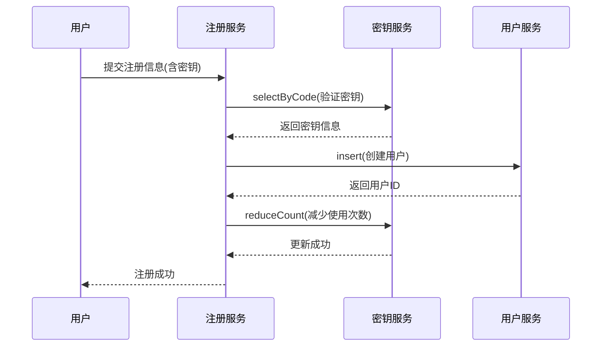

# 注册密钥实体 (RegKey)

<cite>
**本文档引用的文件**   
- [reg-key.js](file://mail-worker/src/entity/reg-key.js)
- [reg-key-service.js](file://mail-worker/src/service/reg-key-service.js)
- [login-service.js](file://mail-worker/src/service/login-service.js)
- [reg-key-api.js](file://mail-worker/src/api/reg-key-api.js)
- [user.js](file://mail-worker/src/entity/user.js)
</cite>

## 目录
1. [介绍](#介绍)
2. [实体结构与字段定义](#实体结构与字段定义)
3. [业务流程分析](#业务流程分析)
4. [状态更新逻辑](#状态更新逻辑)
5. [API接口与使用场景](#api接口与使用场景)
6. [数据示例](#数据示例)
7. [邀请制用户增长机制](#邀请制用户增长机制)

## 介绍
注册密钥（RegKey）实体是系统中实现受控用户注册机制的核心组成部分。该机制允许管理员生成具有特定权限和使用限制的注册密钥，新用户在注册时必须提供有效的注册密钥才能完成账户创建。此设计实现了邀请制的用户增长策略，确保系统的用户扩展处于可控状态。

**Section sources**
- [reg-key.js](file://mail-worker/src/entity/reg-key.js#L0-L11)

## 实体结构与字段定义
注册密钥实体包含以下关键字段及其约束：

- **regKeyId**: 主键，自增整数，唯一标识每个注册密钥
- **code**: 密钥代码，文本类型，非空且默认为空字符串，具有唯一性约束
- **count**: 剩余使用次数，整数类型，非空且默认为0，表示该密钥可被使用的次数
- **roleId**: 关联角色ID，整数类型，非空且默认为0，决定使用该密钥注册的用户将获得的角色权限
- **userId**: 创建者用户ID，整数类型，非空且默认为0，记录生成此密钥的管理员用户
- **expireTime**: 过期时间，文本类型，可为空，表示密钥的有效截止日期
- **createTime**: 创建时间，文本类型，非空且默认为当前时间戳

这些字段共同定义了注册密钥的生命周期、使用权限和状态信息。

**Section sources**
- [reg-key.js](file://mail-worker/src/entity/reg-key.js#L0-L11)

## 业务流程分析
注册密钥的完整业务流程包括密钥生成和用户注册两个主要阶段：

1. **管理员生成注册密钥**：管理员通过管理界面创建新的注册密钥，指定密钥代码、关联角色、使用次数和过期时间等参数
2. **新用户注册**：新用户在注册界面输入收到的注册密钥
3. **系统验证**：系统验证密钥的有效性，包括检查是否存在、是否已用完、是否已过期等
4. **用户创建**：验证通过后，系统创建新用户账户，并将其与密钥关联
5. **使用记录**：系统记录密钥的使用情况，包括使用时间、使用者等信息

此流程确保了只有持有有效注册密钥的用户才能加入系统，实现了受控的用户增长。

**Section sources**
- [reg-key-service.js](file://mail-worker/src/service/reg-key-service.js#L0-L101)
- [login-service.js](file://mail-worker/src/service/login-service.js#L97-L152)

## 状态更新逻辑
当注册密钥被成功使用后，系统会执行一系列状态更新操作：

1. **减少使用次数**：通过`regKeyService.reduceCount()`方法将密钥的`count`字段减1
2. **记录使用信息**：在用户实体的`regKeyId`字段中记录所使用的密钥ID
3. **时间戳记录**：虽然实体中没有直接的`usedAt`字段，但用户创建时间`createTime`可作为使用时间的参考
4. **使用者记录**：通过用户实体的`userId`字段间接记录使用者身份

系统在用户注册过程中调用`regKeyService.reduceCount(c, code, 1)`来更新密钥的剩余使用次数，确保每个密钥只能在规定的次数内被使用。



**Diagram sources**
- [reg-key-service.js](file://mail-worker/src/service/reg-key-service.js#L85-L94)
- [login-service.js](file://mail-worker/src/service/login-service.js#L135-L137)

**Section sources**
- [reg-key-service.js](file://mail-worker/src/service/reg-key-service.js#L85-L94)
- [login-service.js](file://mail-worker/src/service/login-service.js#L135-L137)

## API接口与使用场景
系统提供了完整的API接口来管理注册密钥：

- **POST /regKey/add**: 创建新的注册密钥
- **GET /regKey/list**: 查询注册密钥列表
- **DELETE /regKey/delete**: 删除指定的注册密钥
- **DELETE /regKey/clearNotUse**: 清理已过期或已用完的密钥
- **GET /regKey/history**: 查询密钥使用历史

前端通过`reg-key.js`中的函数调用这些API，实现密钥的增删查和历史查询功能。管理员可以在管理界面中查看密钥状态、复制密钥代码、查看使用历史和删除密钥。

**Section sources**
- [reg-key-api.js](file://mail-worker/src/api/reg-key-api.js#L0-L28)
- [reg-key.js](file://mail-vue/src/request/reg-key.js#L0-L20)

## 数据示例
### 注册密钥创建请求
```json
{
  "code": "ABC123XYZ",
  "roleId": 2,
  "count": 5,
  "expireTime": "2024-12-31"
}
```

### 注册密钥查询响应
```json
[
  {
    "regKeyId": 1,
    "code": "ABC123XYZ",
    "count": 3,
    "roleId": 2,
    "userId": 1001,
    "expireTime": "2024-12-31",
    "createTime": "2024-01-15 10:30:00",
    "roleName": "普通用户"
  }
]
```

### 用户注册请求（使用密钥）
```json
{
  "email": "newuser@example.com",
  "password": "securepassword",
  "code": "ABC123XYZ"
}
```

### 密钥使用历史响应
```json
[
  {
    "email": "user1@example.com",
    "createTime": "2024-01-16 14:20:00"
  },
  {
    "email": "user2@example.com",
    "createTime": "2024-01-17 09:15:00"
  }
]
```

**Section sources**
- [reg-key-service.js](file://mail-worker/src/service/reg-key-service.js#L65-L77)
- [user.js](file://mail-worker/src/entity/user.js#L0-L22)

## 邀请制用户增长机制
系统通过注册密钥机制实现了邀请制的用户增长模式：

1. **权限控制**：不同密钥可关联不同角色，实现差异化权限分配
2. **数量控制**：通过`count`字段限制密钥使用次数，控制用户增长速度
3. **时间控制**：通过`expireTime`字段设置密钥有效期，实现临时邀请功能
4. **来源追踪**：通过`userId`字段记录密钥创建者，便于追踪用户来源
5. **使用审计**：通过查询密钥使用历史，可审计所有通过该密钥注册的用户

这种机制既保证了系统的开放性，又确保了用户增长的可控性，特别适用于需要逐步扩展用户群体的应用场景。

**Section sources**
- [reg-key.js](file://mail-worker/src/entity/reg-key.js#L0-L11)
- [reg-key-service.js](file://mail-worker/src/service/reg-key-service.js#L85-L94)
- [login-service.js](file://mail-worker/src/service/login-service.js#L97-L152)