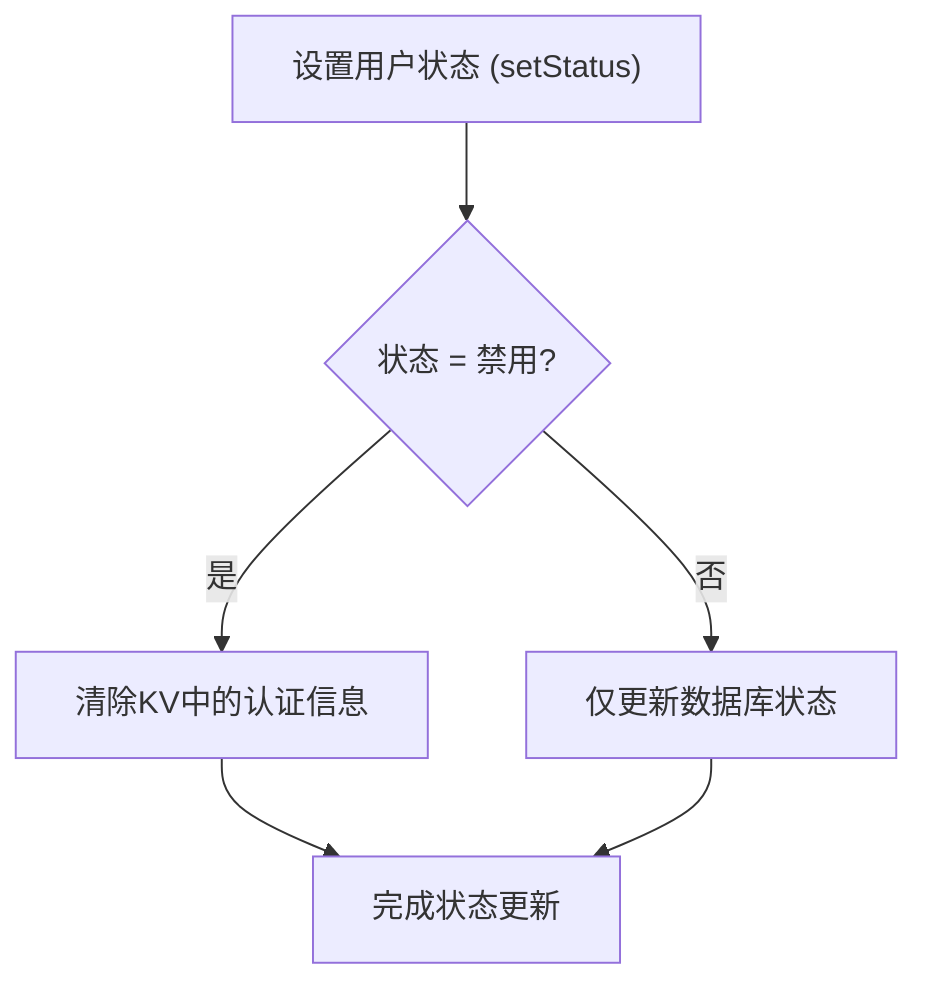
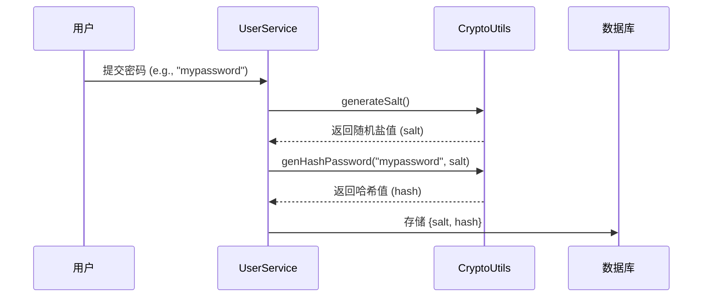
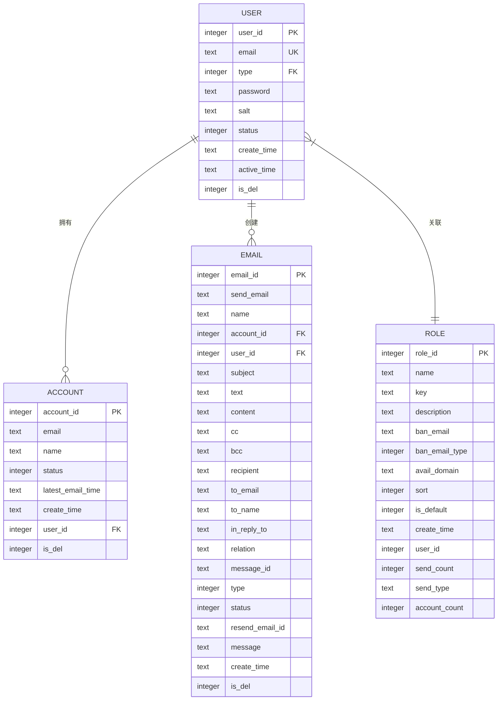

# 用户实体 (User)

<cite>
**本文档中引用的文件**  
- [user.js](file://mail-worker/src/entity/user.js)
- [crypto-utils.js](file://mail-worker/src/utils/crypto-utils.js)
- [user-service.js](file://mail-worker/src/service/user-service.js)
- [entity-const.js](file://mail-worker/src/const/entity-const.js)
- [account.js](file://mail-worker/src/entity/account.js)
- [role.js](file://mail-worker/src/entity/role.js)
- [email.js](file://mail-worker/src/entity/email.js)
</cite>

## 目录
1. [简介](#简介)
2. [核心字段定义](#核心字段定义)
3. [业务规则](#业务规则)
4. [实体关系](#实体关系)
5. [数据示例与序列化](#数据示例与序列化)

## 简介
`User` 实体是 cloud-mail 系统的核心身份管理单元，负责存储用户账户的基本信息、安全凭证和状态控制。该实体通过 `Drizzle ORM` 映射到 SQLite 数据库的 `user` 表，支撑系统的认证、权限控制和用户行为追踪功能。

**Section sources**
- [user.js](file://mail-worker/src/entity/user.js#L2-L20)

## 核心字段定义
`User` 实体包含以下关键字段，定义了用户的身份、安全和状态属性。

| 字段名 | 数据类型 | 默认值 | 约束条件 | 说明 |
|-------|--------|-------|--------|------|
| userId | 整数 | 自增 | 主键 | 用户唯一标识符 |
| email | 文本 | 无 | 非空，唯一性约束（通过业务逻辑） | 用户登录邮箱，作为唯一用户名 |
| type | 整数 | 1 | 非空 | 关联角色ID，决定用户权限 |
| password | 文本 | 无 | 非空 | 存储密码的哈希值 |
| salt | 文本 | 无 | 非空 | 密码哈希的盐值 |
| status | 整数 | 0 | 非空 | 用户状态，0=正常，1=禁用 |
| createTime | 文本 | CURRENT_TIMESTAMP | 无 | 账户创建时间，ISO 8601格式 |
| activeTime | 文本 | 无 | 可为空 | 最后一次活跃时间 |
| isDel | 整数 | 0 | 非空 | 软删除标记，0=正常，1=已删除 |

**Section sources**
- [user.js](file://mail-worker/src/entity/user.js#L2-L20)
- [entity-const.js](file://mail-worker/src/const/entity-const.js#L2-L5)

## 业务规则
`User` 实体的业务逻辑由 `user-service.js` 中的服务方法实现，确保数据的完整性和安全性。

### 用户状态管理
用户状态由 `status` 字段控制，其枚举值定义在 `entity-const.js` 中：
- **正常 (NORMAL)**: `status = 0`，用户可正常登录和使用服务。
- **禁用 (BAN)**: `status = 1`，用户被禁止访问，登录时会失败。

当用户状态被设置为“禁用”时，系统会自动清除其在 KV 存储中的认证信息（`AUTH_INFO`），强制其退出登录。



**Diagram sources**
- [user-service.js](file://mail-worker/src/service/user-service.js#L250-L258)
- [entity-const.js](file://mail-worker/src/const/entity-const.js#L2-L5)

### 密码哈希存储机制
为保障用户密码安全，系统不存储明文密码。密码通过以下机制处理：
1.  **生成盐值 (salt)**: 使用 `crypto.getRandomValues` 生成一个16字节的随机数组，并通过 Base64 编码存储。
2.  **计算哈希**: 将 `salt + password` 作为输入，使用 SHA-256 算法生成哈希值。
3.  **存储**: 将生成的 `salt` 和 `hash` 分别存储在数据库的 `salt` 和 `password` 字段中。

验证时，系统会使用存储的 `salt` 对用户输入的密码进行相同的哈希运算，并与存储的 `hash` 进行比对。



**Diagram sources**
- [crypto-utils.js](file://mail-worker/src/utils/crypto-utils.js#L10-L35)
- [user-service.js](file://mail-worker/src/service/user-service.js#L45-L48)

### 创建时间生成策略
`createTime` 字段的值由数据库在插入记录时自动生成。在 `user.js` 实体定义中，通过 `sql\`CURRENT_TIMESTAMP\`` 设置默认值，确保时间戳由数据库服务器提供，保证了时间的一致性和准确性。

**Section sources**
- [user.js](file://mail-worker/src/entity/user.js#L14)

## 实体关系
`User` 实体是系统的核心，与其他多个实体存在一对多的关系。



**Diagram sources**
- [user.js](file://mail-worker/src/entity/user.js#L2-L20)
- [account.js](file://mail-worker/src/entity/account.js#L2-L13)
- [role.js](file://mail-worker/src/entity/role.js#L2-L19)
- [email.js](file://mail-worker/src/entity/email.js#L2-L27)

- **与 Account (邮箱账户) 的关系**: 一个 `User` 可以拥有多个 `Account`。`Account` 表中的 `userId` 字段是外键，指向 `User` 的 `userId`。这允许一个用户管理多个不同的邮箱地址。
- **与 Role (角色) 的关系**: 一个 `User` 关联一个 `Role`。`User` 表中的 `type` 字段即为 `Role` 的 `roleId`。角色决定了用户的权限和配额。
- **与 Email (邮件) 的关系**: 一个 `User` 可以创建多封 `Email`。`Email` 表中的 `userId` 字段是外键，用于追踪邮件的创建者。

## 数据示例与序列化
以下是一个 `User` 实体的 JSON 数据示例：

```json
{
  "userId": 123,
  "email": "alice@example.com",
  "type": 2,
  "status": 0,
  "createTime": "2023-10-27 10:30:00",
  "activeTime": "2023-10-27 15:45:22",
  "sendCount": "5",
  "isDel": 0
}
```

在 API 响应中，出于安全考虑，敏感字段如 `password` 和 `salt` 会被**脱敏处理**，不会包含在返回的 JSON 数据中。前端应用通过 `loginUserInfo` 等服务方法获取用户信息时，只会收到经过筛选和处理的非敏感数据。

**Section sources**
- [user-service.js](file://mail-worker/src/service/user-service.js#L5-L35)