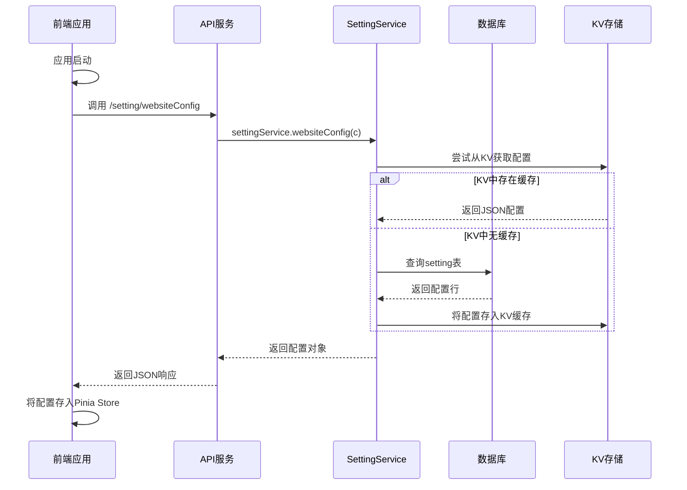

# 系统设置实体 (Setting)

<cite>
**本文档引用文件**  
- [setting.js](file://mail-worker/src/entity/setting.js)
- [setting-service.js](file://mail-worker/src/service/setting-service.js)
- [setting-api.js](file://mail-worker/src/api/setting-api.js)
- [init.js](file://mail-vue/src/init/init.js)
- [setting.js](file://mail-vue/src/store/setting.js)
- [setting.js](file://mail-vue/src/request/setting.js)
- [sys-setting/index.vue](file://mail-vue/src/views/sys-setting/index.vue)
- [login/index.vue](file://mail-vue/src/views/login/index.vue)
- [kv-const.js](file://mail-worker/src/const/kv-const.js)
- [entity-const.js](file://mail-worker/src/const/entity-const.js)
</cite>

## 目录
1. [简介](#简介)
2. [实体结构与字段说明](#实体结构与字段说明)
3. [核心设置项详解](#核心设置项详解)
4. [系统启动时的配置加载流程](#系统启动时的配置加载流程)
5. [前端获取系统设置的API交互](#前端获取系统设置的api交互)
6. [前端动态控制注册入口的实现](#前端动态控制注册入口的实现)
7. [API响应示例](#api响应示例)

## 简介
`Setting` 实体是云邮件系统（cloud-mail）的核心配置模块，负责管理系统的全局个性化设置。它采用键值对（key-value）的存储模式，将所有配置项集中存储于数据库的 `setting` 表中。这种设计使得系统配置高度动态化，管理员可以在不修改代码的情况下，通过管理界面实时调整站点行为、功能开关和外观样式。系统在启动和运行时，会将这些配置加载到内存和前端应用中，以驱动整个应用的个性化表现。

## 实体结构与字段说明
`Setting` 实体在数据库中定义为一个名为 `setting` 的表，其结构由 `mail-worker/src/entity/setting.js` 文件中的 Drizzle ORM 模式定义。该实体不包含传统的 `id` 和 `key` 字段，而是将所有配置项作为表的列（字段）直接存储，这可以看作是一种“宽表”形式的键值对存储。

每个字段都具有明确的数据类型和默认值，确保了配置的稳定性和可预测性。

**字段设计说明：**

- **数据类型**：主要使用 `integer` 和 `text` 两种类型。
  - `integer`：用于存储布尔值（0/1）或数值型配置，如 `register`、`send`、`autoRefreshTime`。
  - `text`：用于存储字符串型配置，如 `title`、`background`、`r2Domain`。
- **默认值**：每个字段都通过 `.default()` 方法设置了默认值，保证了在数据库初始化或字段新增时，系统能以预设状态运行。
- **非空约束**：大多数字段都标记为 `.notNull()`，确保了关键配置项不会缺失。

**Section sources**
- [setting.js](file://mail-worker/src/entity/setting.js)

## 核心设置项详解
以下是系统中一些关键的设置项，它们直接决定了系统的业务逻辑和用户体验。

### 'siteTitle'（站点标题）
- **字段名**: `title`
- **数据类型**: `text`
- **默认值**: `''` (空字符串)
- **业务影响**: 此字段定义了网站在浏览器标签页和登录页面上显示的标题。前端应用会将其设置为 `document.title`，是品牌标识的重要组成部分。

### 'backgroundImage'（背景图URL）
- **字段名**: `background`
- **数据类型**: `text`
- **默认值**: `''` (空字符串)
- **业务影响**: 存储登录页面背景图片的URL。该URL通常指向R2对象存储中的一个文件。前端会根据此值动态设置登录页的背景。系统支持通过Base64编码上传本地图片，并自动将其上传至R2并更新此字段。

### 'allowRegister'（是否允许注册）
- **字段名**: `register`
- **数据类型**: `integer`
- **默认值**: `0`
- **业务影响**: 这是一个核心的业务开关。
  - `0`: 允许注册。登录页面会显示“没有账号？注册”之类的切换链接。
  - `1`: 禁止注册。登录页面将隐藏注册入口，新用户无法创建账户。
  - 此字段的值直接影响系统的用户增长策略。

### 其他重要设置项
- **`r2Domain`**: R2对象存储的自定义访问域名，用于生成附件和背景图的公开URL。
- **`regKey`**: 注册密钥的启用状态（0: 启用, 1: 禁用, 2: 可选），控制用户注册时是否需要输入密钥。
- **`loginOpacity`**: 登录框的背景透明度，取值范围为0.00到1.00，用于个性化登录页外观。
- **`receive` / `send`**: 分别控制邮件的接收和发送功能是否开启。

**Section sources**
- [setting.js](file://mail-worker/src/entity/setting.js)
- [entity-const.js](file://mail-worker/src/const/entity-const.js)

## 系统启动时的配置加载流程
系统在启动时，会通过一系列步骤将 `Setting` 实体中的配置加载到内存和前端应用中，确保应用能以最新的配置运行。

1.  **服务端初始化**：当 `mail-worker` 服务启动时，`init/init.js` 中的 `refresh` 方法会被调用。
2.  **查询数据库**：`settingService.refresh(c)` 方法会从数据库中查询 `setting` 表的唯一一行记录。
3.  **序列化到KV存储**：查询到的配置对象会被序列化为JSON字符串，并通过 `c.env.kv.put(KvConst.SETTING, JSON.stringify(settingRow))` 存储到Cloudflare KV（键值存储）中。这一步是为了实现配置的快速缓存，避免每次请求都查询数据库。
4.  **前端初始化**：当用户访问前端应用时，`main.js` 会执行 `init()` 函数。
5.  **调用API获取配置**：`init.js` 中的 `init()` 函数会调用 `websiteConfig()` API。
6.  **注入到前端状态**：API返回的配置数据被存储到Pinia状态管理库的 `useSettingStore` 中。前端组件通过访问这个store来获取配置，例如登录页通过 `settingStore.settings.title` 来设置页面标题。



**Diagram sources**
- [setting-service.js](file://mail-worker/src/service/setting-service.js)
- [setting-api.js](file://mail-worker/src/api/setting-api.js)
- [init.js](file://mail-vue/src/init/init.js)
- [setting.js](file://mail-vue/src/store/setting.js)

## 前端获取系统设置的API交互
前端通过 `mail-vue/src/request/setting.js` 中定义的 `websiteConfig()` 函数来获取系统设置。该函数向 `/setting/websiteConfig` 端点发起一个 `GET` 请求。

后端的 `setting-api.js` 文件定义了此端点的处理逻辑：
```javascript
app.get('/setting/websiteConfig', async (c) => {
    const setting = await settingService.websiteConfig(c);
    return c.json(result.ok(setting));
});
```
`settingService.websiteConfig(c)` 方法会调用 `get(c, true)` 获取配置，并筛选出前端需要的字段（如 `register`, `title`, `background` 等），然后返回给前端。

**Section sources**
- [setting-api.js](file://mail-worker/src/api/setting-api.js)
- [setting.js](file://mail-vue/src/request/setting.js)

## 前端动态控制注册入口的实现
前端根据 `allowRegister` (`register`) 字段的值，动态决定是否显示注册入口。

在 `mail-vue/src/views/login/index.vue` 文件中，有如下代码：
```vue
<template>
  ...
  <template v-if="settingStore.settings.register === 0">
    <div class="switch" @click="show = 'register'" v-if="show === 'login'">{{ $t('noAccount') }}
      <span>{{ $t('regSwitch') }}</span></div>
    <div class="switch" @click="show = 'login'" v-else>{{ $t('hasAccount') }} <span>{{ $t('loginSwitch') }}</span>
    </div>
  </template>
  ...
</template>
```
**实现逻辑：**
1.  组件从 `useSettingStore` 中读取 `settingStore.settings.register` 的值。
2.  使用 `v-if` 指令进行条件渲染。
3.  只有当 `register` 的值为 `0`（允许注册）时，`<template>` 标签内的“没有账号？注册”链接才会被渲染到页面上。
4.  如果管理员在后台将 `register` 设置为 `1`（禁止注册），则此条件不成立，注册入口将从登录页面上消失。

**Section sources**
- [login/index.vue](file://mail-vue/src/views/login/index.vue)

## API响应示例
当客户端调用 `GET /setting/websiteConfig` 接口时，服务器返回的JSON响应示例如下：

```json
{
  "code": 200,
  "msg": "OK",
  "data": {
    "register": 0,
    "title": "我的云邮箱",
    "manyEmail": 1,
    "addEmail": 0,
    "autoRefreshTime": 5,
    "addEmailVerify": 1,
    "registerVerify": 0,
    "send": 1,
    "r2Domain": "https://mail.example.com",
    "siteKey": "0x4AAAAAA...",
    "background": "backgrounds/1a2b3c4d.jpg",
    "loginOpacity": 0.88,
    "domainList": ["@example.com", "@demo.com"],
    "regKey": 0,
    "regVerifyOpen": false,
    "addVerifyOpen": false,
    "noticeTitle": "系统维护通知",
    "noticeContent": "本系统将于今晚12点进行维护。",
    "noticeType": "warning",
    "noticeDuration": 5000,
    "noticePosition": "top-right",
    "noticeWidth": 400,
    "noticeOffset": 20,
    "notice": 0,
    "loginDomain": 0
  }
}
```

此响应中的 `data` 字段即为 `Setting` 实体的部分配置，前端应用会将其用于初始化和动态渲染。

**Section sources**
- [setting-service.js](file://mail-worker/src/service/setting-service.js)
- [setting-api.js](file://mail-worker/src/api/setting-api.js)