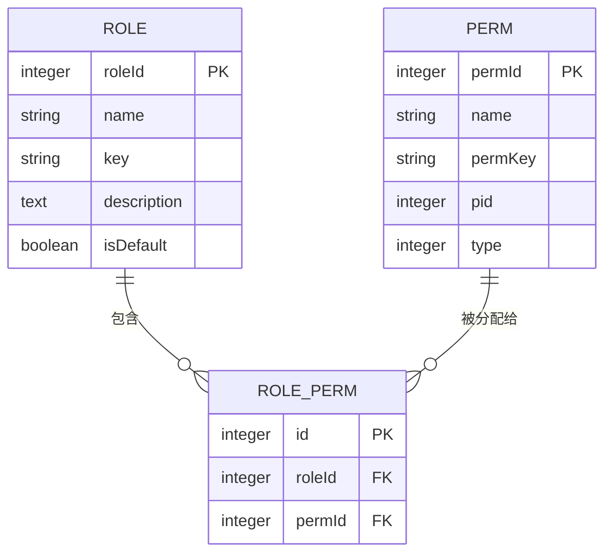

# 角色与权限实体 (Role & Perm)

<cite>
**本文档引用的文件**
- [perm.js](file://mail-vue/src/perm/perm.js)
- [perm.js](file://mail-worker/src/entity/perm.js)
- [role.js](file://mail-worker/src/entity/role.js)
- [role-perm.js](file://mail-worker/src/entity/role-perm.js)
- [role-service.js](file://mail-worker/src/service/role-service.js)
- [perm-service.js](file://mail-worker/src/service/perm-service.js)
- [init.js](file://mail-worker/src/init/init.js)
</cite>

## 目录
1. [简介](#简介)
2. [Perm实体结构](#perm实体结构)
3. [Role实体结构](#role实体结构)
4. [角色-权限关联机制](#角色-权限关联机制)
5. [权限码设计规范与使用](#权限码设计规范与使用)
6. [角色权限对比示例](#角色权限对比示例)
7. [系统初始化与默认角色创建](#系统初始化与默认角色创建)
8. [总结](#总结)

## 简介
cloud-mail系统采用基于角色的访问控制（RBAC）模型，通过Role（角色）和Perm（权限）两个核心实体实现细粒度的权限管理。该模型允许管理员将多个权限分配给角色，并将角色分配给用户，从而实现灵活的权限控制。本文档详细阐述Perm和Role实体的结构、它们之间的多对多关联机制、权限码的设计与使用方式，以及系统初始化时默认角色和权限的创建流程。

## Perm实体结构

Perm实体（权限项）用于定义系统中的具体操作权限。每个权限项包含以下字段：

- **permId**: 权限项的唯一标识符，作为主键自增。
- **name**: 权限的显示名称，用于界面展示，支持国际化。
- **permKey**: 权限码，是权限的唯一标识字符串，用于代码中的权限校验。
- **pid**: 父级权限ID，用于构建权限的树形结构（如菜单分组）。
- **type**: 权限类型，区分是菜单、按钮还是其他类型。
- **sort**: 排序字段，用于在界面中按指定顺序展示权限。

该实体定义了系统中所有可被分配的权限点，是权限控制的基础。

**Section sources**
- [perm.js](file://mail-worker/src/entity/perm.js#L1-L11)

## Role实体结构

Role实体（角色）用于对用户进行分组，并赋予相应的权限集合。每个角色包含以下字段：

- **roleId**: 角色的唯一标识符，作为主键自增。
- **name**: 角色的名称，用于标识和展示。
- **key**: 角色的唯一键值，可用于特定场景的快速查找。
- **description**: 角色的描述信息，说明该角色的职责和权限范围。
- **banEmail**: 禁用的邮箱列表，以逗号分隔。
- **banEmailType**: 禁用邮箱的类型（如精确匹配或域名匹配）。
- **availDomain**: 可用的域名列表，限制该角色用户只能使用这些域名的邮箱。
- **sort**: 排序字段，用于在角色管理界面排序。
- **isDefault**: 标记是否为默认角色，新用户注册时将自动分配此角色。
- **createTime**: 角色创建时间。
- **userId**: 创建该角色的用户ID。
- **sendCount**: 该角色用户的邮件发送数量限制。
- **sendType**: 发送类型限制（如按数量或禁止发送）。
- **accountCount**: 该角色用户可创建的邮箱账户数量限制。

Role实体不仅管理权限，还集成了用户行为的多种限制策略。

**Section sources**
- [role.js](file://mail-worker/src/entity/role.js#L1-L20)

## 角色-权限关联机制

Role和Perm实体之间通过中间表`role-perm`实现多对多关联。这种设计允许一个角色拥有多个权限，同时一个权限也可以被分配给多个角色。



**Diagram sources**
- [role-perm.js](file://mail-worker/src/entity/role-perm.js#L1-L8)
- [role.js](file://mail-worker/src/entity/role.js#L1-L20)
- [perm.js](file://mail-worker/src/entity/perm.js#L1-L11)

### 关联机制实现

1.  **数据结构**: `role-perm`表包含`id`（主键）、`roleId`（外键指向role表）和`permId`（外键指向perm表）三个字段。
2.  **权限分配**: 当为角色分配权限时，系统会先删除该角色原有的所有`role-perm`记录，然后将新的权限ID列表与角色ID组合，批量插入到`role-perm`表中。
3.  **权限查询**: 当需要获取某个用户的权限时，系统会通过用户的`type`（即角色ID）关联`role`表，再通过`role-perm`表关联`perm`表，最终查询出该用户拥有的所有权限码（permKey）。

此机制在`role-service.js`的`add`和`setRole`方法中实现，确保了权限分配的原子性和一致性。

**Section sources**
- [role-perm.js](file://mail-worker/src/entity/role-perm.js#L1-L8)
- [role-service.js](file://mail-worker/src/service/role-service.js#L13-L177)

## 权限码设计规范与使用

权限码（permKey）是权限系统的核心，采用`资源:操作`的命名规范，例如`user:create`、`email:send`。这种设计具有良好的可读性和可扩展性。

### 设计规范
- **格式**: `模块:操作`，如`email:send`表示“邮件模块的发送操作”。
- **模块**: 代表系统功能模块，如`user`（用户）、`role`（角色）、`email`（邮件）、`setting`（设置）。
- **操作**: 代表对该模块的具体操作，如`query`（查看）、`add`（添加）、`delete`（删除）、`set`（修改）。

### 使用方式

1.  **前端指令 (v-perm)**:
    前端通过自定义指令`v-perm`来控制元素的显示。该指令会检查当前用户的权限列表中是否包含指定的权限码。如果用户没有权限，对应的DOM元素将被移除。
    ```javascript
    // 示例：只有拥有 'user:add' 权限的用户才能看到此按钮
    <button v-perm="'user:add'">添加用户</button>
    ```
    其实现逻辑在`mail-vue/src/perm/perm.js`中，通过`hasPerm`函数进行校验。

2.  **后端安全校验**:
    所有需要权限控制的API接口在后端都会进行校验。服务层（如`role-service.js`）会根据用户ID查询其角色，再通过角色查询其拥有的权限码，最后判断请求的操作是否在允许的权限范围内。如果校验失败，则抛出业务异常。

3.  **路由控制**:
    系统根据用户的权限码动态生成可访问的路由列表。例如，拥有`role:query`权限的用户才能访问角色管理页面。这在`mail-vue/src/perm/perm.js`的`permsToRouter`函数中实现。

**Section sources**
- [perm.js](file://mail-vue/src/perm/perm.js#L0-L121)
- [perm-service.js](file://mail-worker/src/service/perm-service.js#L9-L34)

## 角色权限对比示例

以下是管理员角色与普通用户角色的权限对比：

| 权限功能 | 管理员角色 | 普通用户角色 |
| :--- | :--- | :--- |
| **用户管理** | `user:query`, `user:add`, `user:delete`, `user:set-type` | 无 |
| **角色管理** | `role:query`, `role:add`, `role:set`, `role:delete` | 无 |
| **系统设置** | `setting:query`, `setting:set` | 无 |
| **邮件发送** | `email:send` | `email:send` |
| **邮件删除** | `email:delete` | `email:delete` |
| **个人设置** | `my:delete` | `my:delete` |
| **查看所有邮件** | `all-email:query` | 仅限自己 |

此对比清晰地展示了不同角色的权限边界，管理员拥有系统全局的管理权限，而普通用户仅拥有基本的邮件操作和账户管理权限。

## 系统初始化与默认角色创建

系统在首次部署时，通过`init.js`脚本进行数据库初始化，自动创建默认的角色和权限。

1.  **创建权限 (perm表)**:
    脚本会检查`perm`表是否存在，若不存在则创建，并插入所有预定义的权限项，包括`email:send`、`user:query`等。每个权限项都分配了唯一的`permId`和`permKey`。

2.  **创建角色 (role表)**:
    脚本会创建`role`表，并插入一个名为“普通用户”的默认角色。该角色的`isDefault`字段被设置为1，表示它是新用户的默认身份。

3.  **分配权限 (role_perm表)**:
    脚本会创建`role-perm`表，并为“普通用户”角色分配基础权限，如邮件发送(`email:send`)、邮件删除(`email:delete`)、邮箱管理(`account:query`, `account:add`, `account:delete`)等。

此初始化流程确保了系统安装后即可使用，无需手动配置基础权限。

**Section sources**
- [init.js](file://mail-worker/src/init/init.js#L0-L532)

## 总结
cloud-mail系统的RBAC权限模型通过清晰的Role和Perm实体定义，以及高效的`role-perm`中间表关联，实现了灵活且安全的权限管理。权限码的规范设计使得权限的分配和校验变得简单直观。该模型不仅满足了基本的权限控制需求，还通过角色的附加属性（如发送限制、可用域名）扩展了用户管理的能力，为系统的安全稳定运行提供了坚实的基础。