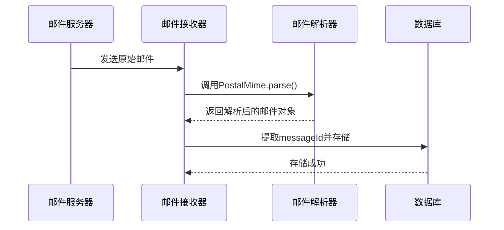
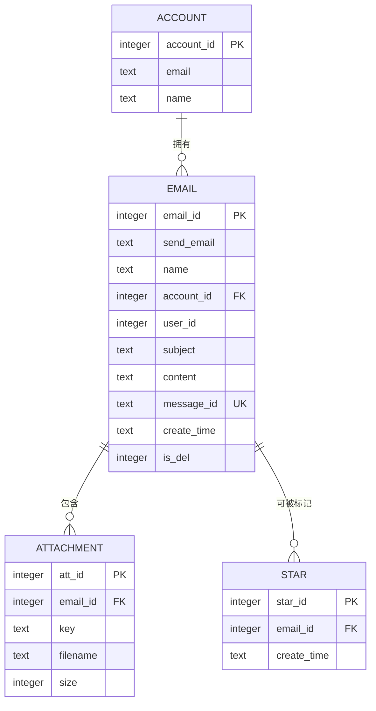

# 邮件实体 (Email)

<cite>
**本文档中引用的文件**  
- [email.js](file://mail-worker/src/entity/email.js)
- [att.js](file://mail-worker/src/entity/att.js)
- [star.js](file://mail-worker/src/entity/star.js)
- [account.js](file://mail-worker/src/entity/account.js)
- [email.js](file://mail-worker/src/email/email.js)
- [email-service.js](file://mail-worker/src/service/email-service.js)
- [att-service.js](file://mail-worker/src/service/att-service.js)
</cite>

## 目录
1. [简介](#简介)
2. [字段定义与约束](#字段定义与约束)
3. [业务规则](#业务规则)
4. [关系模型](#关系模型)
5. [数据示例与序列化](#数据示例与序列化)
6. [结论](#结论)

## 简介

`Email` 实体是本系统中用于存储和管理电子邮件的核心数据结构。它记录了每封邮件的基本信息、发送与接收状态、元数据以及与其他实体的关联关系。该实体在邮件接收、展示、搜索和归档等关键流程中起着中心作用。

**Section sources**
- [email.js](file://mail-worker/src/entity/email.js#L2-L25)

## 字段定义与约束

以下是 `Email` 实体中各字段的详细定义、类型及约束条件：

| 字段名 | 类型 | 约束 | 说明 |
|--------|------|------|------|
| emailId | 整数 | 主键，自增 | 邮件的唯一标识符 |
| sendEmail | 文本 | 可为空 | 发件人邮箱地址 |
| name | 文本 | 可为空 | 发件人姓名 |
| accountId | 整数 | 非空 | 所属账户ID，外键关联 `account` 表 |
| userId | 整数 | 非空 | 所属用户ID |
| subject | 文本 | 可为空 | 邮件主题 |
| text | 文本 | 可为空 | 邮件纯文本内容 |
| content | 文本 | 可为空 | 邮件HTML内容 |
| cc | 文本 | 默认值 `'[]'` | 抄送人列表，JSON格式字符串 |
| bcc | 文本 | 默认值 `'[]'` | 密送人列表，JSON格式字符串 |
| recipient | 文本 | 可为空 | 收件人列表，JSON格式字符串 |
| toEmail | 文本 | 非空，默认 `''` | 主收件人邮箱 |
| toName | 文本 | 非空，默认 `''` | 主收件人姓名 |
| inReplyTo | 文本 | 默认 `''` | 引用的原始邮件Message-ID |
| relation | 文本 | 默认 `''` | 邮件引用链（References头） |
| messageId | 文本 | 默认 `''` | 邮件唯一ID，通常来自邮件头的Message-ID，**具有唯一性约束** |
| type | 整数 | 非空，默认 `0` | 邮件类型（0: 接收，1: 发送） |
| status | 整数 | 非空，默认 `0` | 邮件状态（如保存中、已接收、无人接收等） |
| resendEmailId | 文本 | 可为空 | 重发服务返回的ID |
| message | 文本 | 可为空 | 邮件处理过程中的消息或错误信息 |
| createTime | 文本 | 非空，默认 `CURRENT_TIMESTAMP` | 邮件创建时间，存储为ISO8601格式的时间戳 |
| isDel | 整数 | 非空，默认 `0` | 删除标记（0: 正常，1: 已删除） |

**Section sources**
- [email.js](file://mail-worker/src/entity/email.js#L2-L25)

## 业务规则

### 读取状态管理
系统中并未直接使用 `isRead` 字段，而是通过其他机制（如前端状态或独立的已读标记表）来管理邮件的读取状态。当前 `Email` 实体通过 `status` 字段间接反映邮件处理状态。

### 附件标识逻辑
系统中没有 `hasAttachment` 字段。附件的存在通过关联的 `Attachment` 实体来判断。当一封邮件包含附件时，系统会解析原始邮件内容，并将每个附件信息存入 `attachments` 表。`hasAttachment` 的逻辑由业务层在查询时通过检查是否存在关联的附件记录来实现。

### 邮件大小管理
系统中没有直接的 `size` 字段。邮件大小可以通过 `content` 字段的长度或所有附件的总大小来计算。附件的大小在 `att` 表中通过 `size` 字段记录。

### msgId 生成策略
`messageId` 字段的值直接来源于接收到的原始邮件头部的 `Message-ID` 字段。在邮件接收流程中，系统使用 `PostalMime` 库解析原始邮件，并将其 `messageId` 提取后存入数据库。此ID是邮件的全球唯一标识，用于防止重复接收和构建邮件会话。



**Diagram sources**
- [email.js](file://mail-worker/src/email/email.js#L19-L225)
- [email.js](file://mail-worker/src/entity/email.js#L2-L25)

## 关系模型

`Email` 实体与多个其他实体存在关联关系，构成了系统的核心数据模型。



**Diagram sources**
- [email.js](file://mail-worker/src/entity/email.js#L2-L25)
- [att.js](file://mail-worker/src/entity/att.js#L3-L19)
- [star.js](file://mail-worker/src/entity/star.js#L3-L10)
- [account.js](file://mail-worker/src/entity/account.js#L2-L11)

### 详细关系说明

- **与 Account 的关系**：`Email` 通过 `accountId` 字段与 `Account` 实体建立外键关联，表示该邮件属于哪个邮箱账户。一个账户可以拥有多个邮件（一对多关系）。
- **与 Attachment 的关系**：`Email` 通过 `emailId` 字段与 `Attachment` 实体建立外键关联，表示该邮件包含的附件。一个邮件可以有零个或多个附件（一对多关系）。
- **与 Star 的关系**：`Email` 通过 `emailId` 字段与 `Star` 实体建立外键关联，表示该邮件是否被标记为星标。一个邮件最多有一个星标记录（一对一关系，但通过外键实现）。

## 数据示例与序列化

### 典型邮件数据 JSON 示例

```json
{
  "emailId": 12345,
  "sendEmail": "sender@example.com",
  "name": "发件人姓名",
  "accountId": 678,
  "userId": 90,
  "subject": "这是一封测试邮件",
  "content": "<p>你好，这是一封测试邮件。</p>",
  "text": "你好，这是一封测试邮件。",
  "cc": "[{\"address\": \"cc1@example.com\", \"name\": \"抄送1\"}]",
  "bcc": "[]",
  "recipient": "[{\"address\": \"user@domain.com\", \"name\": \"收件人\"}]",
  "toEmail": "user@domain.com",
  "toName": "收件人",
  "inReplyTo": "<original-message-id@example.com>",
  "relation": "<prev-message-id@example.com> <original-message-id@example.com>",
  "messageId": "<unique-message-id@domain.com>",
  "type": 0,
  "status": 1,
  "createTime": "2023-10-01T12:34:56.789Z",
  "isDel": 0,
  "attList": [
    {
      "attId": 54321,
      "filename": "document.pdf",
      "size": 102400,
      "mimeType": "application/pdf"
    }
  ],
  "star": true
}
```

### 列表展示与详情查看的数据序列化差异

- **列表展示**：在邮件列表页面，为了提高性能和减少数据传输量，API 通常只返回邮件的核心元数据，如 `emailId`, `sendEmail`, `name`, `subject`, `createTime`, `isRead`（通过其他方式计算）, `hasAttachment`（通过查询附件表计算）等。附件列表（`attList`）和完整内容（`content`）通常不包含在内。
- **详情查看**：在查看邮件详情时，API 会返回完整的邮件对象，包括 `content`, `text`, `cc`, `bcc` 等完整信息，并且会通过关联查询填充 `attList` 数组和 `star` 标记状态，以提供完整的邮件视图。

**Section sources**
- [email-service.js](file://mail-worker/src/service/email-service.js#L416-L471)
- [att-service.js](file://mail-worker/src/service/att-service.js#L130-L201)

## 结论

`Email` 实体是本邮件系统的核心，它不仅存储了邮件的基本信息，还通过外键与账户、附件和星标等实体建立了紧密的联系。其设计充分利用了JSON字段来存储结构化数据（如收件人列表），并通过 `messageId` 确保了邮件的唯一性。业务逻辑层通过服务类（如 `email-service` 和 `att-service`）对这些实体进行操作，实现了邮件的接收、存储、查询和删除等完整功能。理解该实体的结构和关系对于维护和扩展系统至关重要。