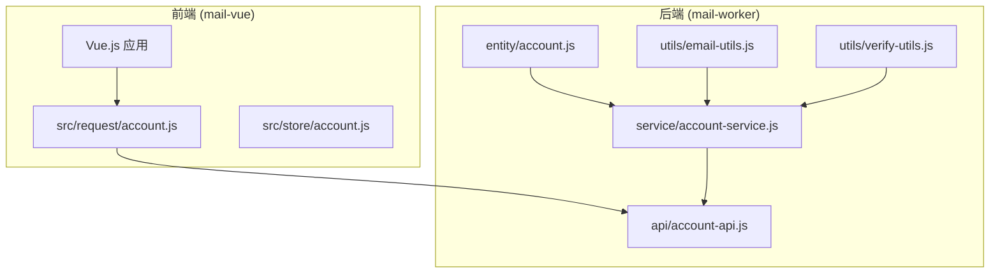
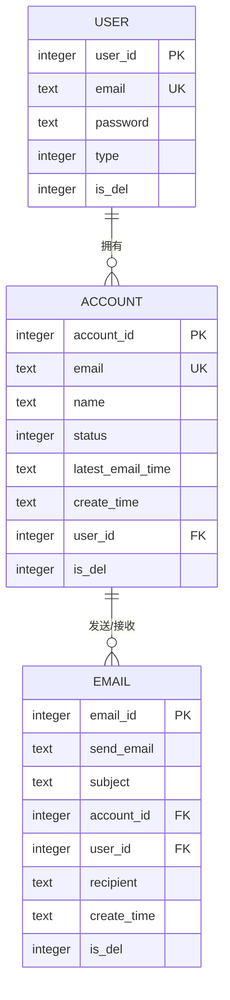
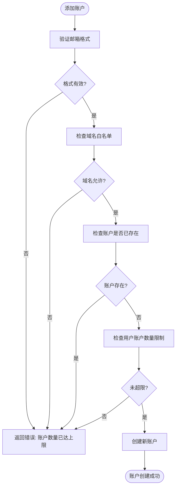
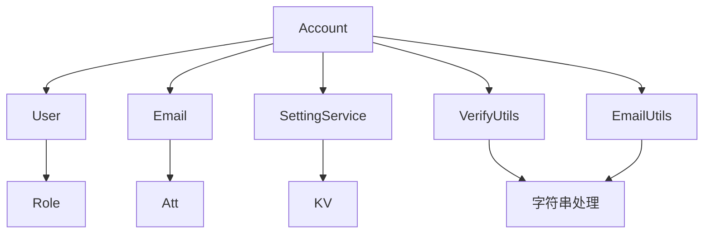

# 邮箱账户实体 (Account)

<cite>
**本文档中引用的文件**  
- [account.js](file://mail-worker/src/entity/account.js)
- [account-service.js](file://mail-worker/src/service/account-service.js)
- [user.js](file://mail-worker/src/entity/user.js)
- [email.js](file://mail-worker/src/entity/email.js)
- [setting-service.js](file://mail-worker/src/service/setting-service.js)
- [email-utils.js](file://mail-worker/src/utils/email-utils.js)
- [verify-utils.js](file://mail-worker/src/utils/verify-utils.js)
</cite>

## 目录
1. [简介](#简介)
2. [项目结构](#项目结构)
3. [核心组件](#核心组件)
4. [架构概述](#架构概述)
5. [详细组件分析](#详细组件分析)
6. [依赖分析](#依赖分析)
7. [性能考虑](#性能考虑)
8. [故障排除指南](#故障排除指南)
9. [结论](#结论)

## 简介
`Account` 实体是本系统中用于管理用户关联邮箱地址的核心数据模型。它支持多账户管理功能，允许用户配置不同邮件服务商的 SMTP/IMAP 信息。该实体与 `User` 实体形成一对多关系，并作为 `Email` 实体收发邮件的载体。本文档详细说明其字段定义、业务逻辑、数据关系及 API 交互方式。

## 项目结构
项目采用前后端分离架构，前端位于 `mail-vue` 目录，后端逻辑与实体定义位于 `mail-worker/src` 目录。`Account` 实体定义于 `entity/account.js`，其业务逻辑由 `service/account-service.js` 实现，通过 `api/account-api.js` 提供 REST 接口。



**Diagram sources**
- [account.js](file://mail-worker/src/entity/account.js#L2-L11)
- [account-service.js](file://mail-worker/src/service/account-service.js#L15-L228)
- [account-api.js](file://mail-worker/src/api/account-api.js#L6-L23)

**Section sources**
- [account.js](file://mail-worker/src/entity/account.js#L2-L11)
- [account-service.js](file://mail-worker/src/service/account-service.js#L15-L228)

## 核心组件
`Account` 实体是用户进行邮件收发的核心载体。它不仅存储用户的邮箱地址，还通过与 `User` 和 `Email` 实体的关联，实现多账户管理和邮件同步功能。其设计支持灵活的权限控制和域名策略。

**Section sources**
- [account.js](file://mail-worker/src/entity/account.js#L2-L11)
- [user.js](file://mail-worker/src/entity/user.js#L2-L22)
- [email.js](file://mail-worker/src/entity/email.js#L2-L27)

## 架构概述
系统采用微服务架构，`Account` 作为核心实体，与 `User`（用户）、`Email`（邮件）共同构成数据模型的主干。前端通过 API 与后端交互，后端服务层处理业务逻辑并操作数据库。



**Diagram sources**
- [user.js](file://mail-worker/src/entity/user.js#L2-L22)
- [account.js](file://mail-worker/src/entity/account.js#L2-L11)
- [email.js](file://mail-worker/src/entity/email.js#L2-L27)

## 详细组件分析

### Account 实体分析
`Account` 实体定义了用户邮箱账户的核心属性，是实现多邮箱管理的基础。

#### 字段定义
| 字段名 | 数据类型 | 约束 | 业务含义 |
| :--- | :--- | :--- | :--- |
| `accountId` | integer | 主键，自增 | 账户唯一标识符 |
| `email` | text | 非空，唯一 | 用户的邮箱地址，用于登录和通信 |
| `name` | text | 非空，默认空字符串 | 账户显示名称，通常为邮箱用户名 |
| `status` | integer | 非空，默认0 | 账户状态（0: 正常, 1: 禁用） |
| `latestEmailTime` | text | 可为空 | 记录该账户最后一次同步邮件的时间戳 |
| `createTime` | text | 非空，默认当前时间 | 账户创建时间 |
| `userId` | integer | 非空，外键 | 关联的用户ID，建立与User实体的一对多关系 |
| `isDel` | integer | 非空，默认0 | 软删除标记（0: 正常, 1: 已删除） |

**Section sources**
- [account.js](file://mail-worker/src/entity/account.js#L2-L11)

#### 业务逻辑与约束
- **邮箱格式校验**：在创建账户前，系统调用 `verifyUtils.isEmail()` 方法验证邮箱格式的合法性。
- **域名白名单校验**：系统通过 `c.env.domain` 配置允许注册的域名列表，新账户的邮箱域名必须在此列表中。
- **用户关联约束**：一个 `User` 可以拥有多个 `Account`，但一个 `Account` 只能属于一个 `User`。用户不能删除其主账户（即注册邮箱对应的账户）。
- **账户数量限制**：用户的账户数量受其角色（`role`）的 `accountCount` 属性限制。



**Diagram sources**
- [account-service.js](file://mail-worker/src/service/account-service.js#L15-L65)
- [verify-utils.js](file://mail-worker/src/utils/verify-utils.js#L1-L3)
- [email-utils.js](file://mail-worker/src/utils/email-utils.js#L4-L14)

### 账户同步机制分析
`lastSync` 字段（在代码中为 `latestEmailTime`）用于记录账户最后一次同步邮件的时间。该字段的更新逻辑如下：
1.  当系统执行邮件同步任务时，会查询该账户的 `latestEmailTime`。
2.  邮件客户端（如 IMAP）根据此时间戳，仅拉取在此时间之后的新邮件。
3.  同步完成后，系统会将 `latestEmailTime` 更新为当前时间戳，为下一次增量同步做准备。

此机制确保了邮件同步的高效性，避免了重复拉取历史邮件。

**Section sources**
- [account.js](file://mail-worker/src/entity/account.js#L7)
- [email.js](file://mail-worker/src/entity/email.js#L27)

### API 交互分析
#### 典型 JSON 请求/响应示例
**创建账户请求 (POST /account/add)**
```json
{
  "email": "user@example.com",
  "token": "turnstile_token"
}
```

**获取账户列表响应 (GET /account/list)**
```json
{
  "list": [
    {
      "accountId": 1,
      "email": "user@example.com",
      "name": "user",
      "status": 0,
      "latestEmailTime": "2023-10-27T10:00:00Z",
      "createTime": "2023-10-27T09:00:00Z",
      "userId": 1,
      "isDel": 0
    }
  ],
  "total": 1
}
```

#### 敏感信息处理策略
- **密码**：`Account` 实体本身不存储密码，用户的密码存储在 `User` 实体中，并使用 `saltHashUtils.hashPassword()` 进行哈希加密。
- **传输安全**：所有 API 交互均通过 HTTPS 进行，确保数据在传输过程中的机密性和完整性。
- **API 响应**：在返回给前端的账户信息中，不会包含任何敏感字段（如密码、令牌等），仅暴露必要的业务数据。

**Section sources**
- [account-api.js](file://mail-worker/src/api/account-api.js#L6-L23)
- [user.js](file://mail-worker/src/entity/user.js#L5)
- [security.js](file://mail-worker/src/security/security.js)

## 依赖分析
`Account` 实体与其他核心组件存在紧密的依赖关系。



**Diagram sources**
- [account-service.js](file://mail-worker/src/service/account-service.js#L1-L231)
- [user.js](file://mail-worker/src/entity/user.js#L2-L22)
- [email.js](file://mail-worker/src/entity/email.js#L2-L27)

## 性能考虑
- **数据库索引**：`email` 字段和 `userId` 字段应建立索引，以加速账户查询和用户账户列表查询。
- **分页查询**：`list` 和 `allAccount` 接口均实现了分页（`size` <= 30），防止一次性加载过多数据导致性能下降。
- **批量操作**：`insertList` 方法支持批量插入账户，提高了数据初始化或迁移的效率。

## 故障排除指南
- **无法添加账户**：检查邮箱格式、域名白名单、账户是否已存在以及用户账户数量是否已达上限。
- **账户列表为空**：确认 `userId` 参数正确，并检查账户的 `isDel` 状态是否为正常（0）。
- **同步时间未更新**：检查邮件同步任务是否正常执行，以及 `latestEmailTime` 的更新逻辑是否有异常。

**Section sources**
- [biz-error.js](file://mail-worker/src/error/biz-error.js#L0-L6)
- [account-service.js](file://mail-worker/src/service/account-service.js#L15-L228)

## 结论
`Account` 实体是本邮件系统实现多账户管理和个性化配置的核心。其设计清晰地体现了与 `User` 和 `Email` 实体的关系，并通过完善的服务层逻辑处理了账户的增删改查、权限校验和同步状态管理。系统的安全策略确保了敏感信息在存储和传输过程中的安全。