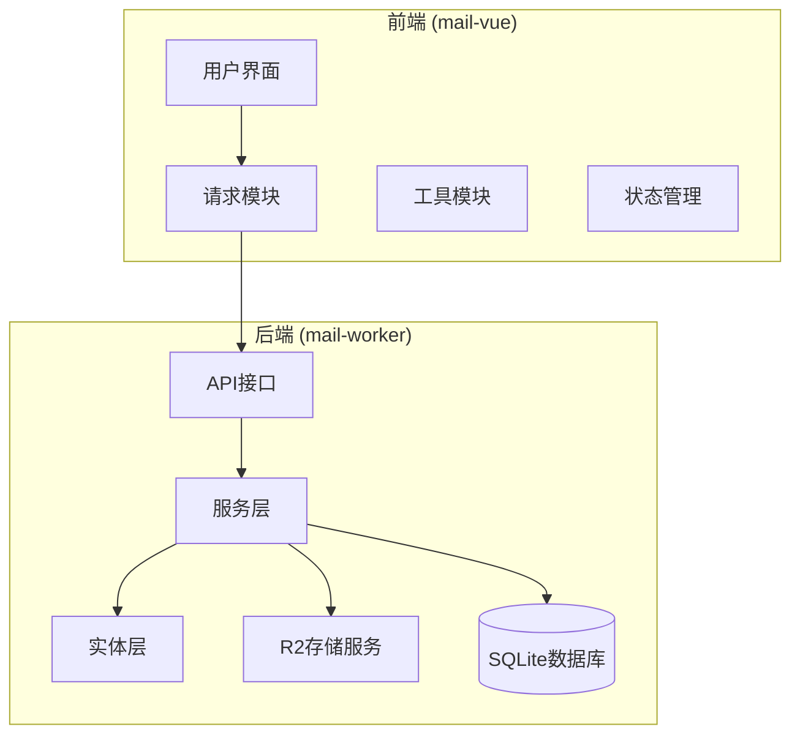
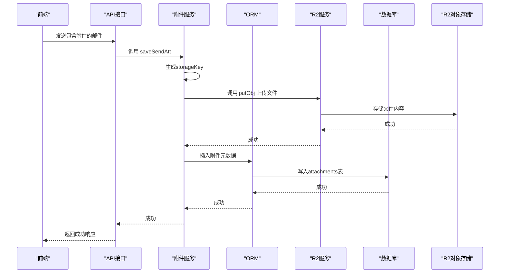
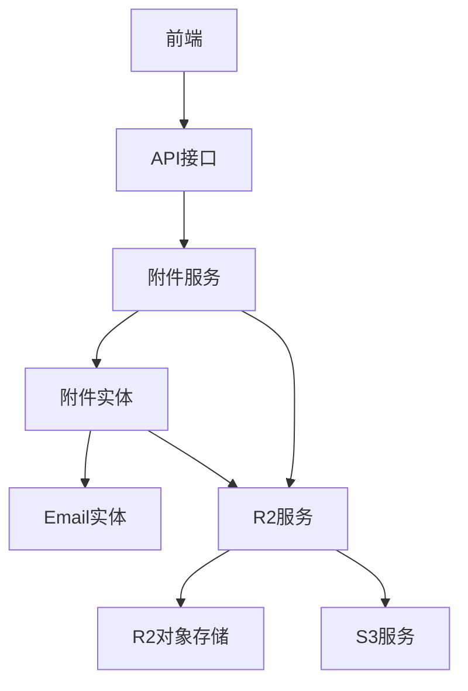

# 附件实体 (Attachment)

<cite>
**本文档中引用的文件**  
- [att.js](file://mail-worker/src/entity/att.js)
- [att-service.js](file://mail-worker/src/service/att-service.js)
- [entity-const.js](file://mail-worker/src/const/entity-const.js)
- [r2-service.js](file://mail-worker/src/service/r2-service.js)
- [constant.js](file://mail-worker/src/const/constant.js)
- [icon-utils.js](file://mail-vue/src/utils/icon-utils.js)
- [email.js](file://mail-worker/src/entity/email.js)
</cite>

## 目录
1. [简介](#简介)
2. [项目结构](#项目结构)
3. [核心组件](#核心组件)
4. [架构概述](#架构概述)
5. [详细组件分析](#详细组件分析)
6. [依赖分析](#依赖分析)
7. [性能考虑](#性能考虑)
8. [故障排除指南](#故障排除指南)
9. [结论](#结论)

## 简介
本文档详细描述了云邮件系统中的附件实体（Attachment），其在邮件附件管理中的核心作用。文档涵盖附件实体的字段定义、业务逻辑、与邮件实体的关联方式、文件持久化机制、前端渲染策略以及典型使用场景。通过代码分析，说明附件上传时存储键（storageKey）的生成规则、下载计数（downloadCount）的递增机制（注：当前代码中未实现下载计数功能，但可扩展），以及如何通过R2对象存储服务实现文件的高效存储与管理。

## 项目结构
系统由前端（mail-vue）和后端（mail-worker）两部分组成。附件实体相关的逻辑主要集中在后端`mail-worker`模块中，具体位于`src/entity`（数据模型）、`src/service`（业务逻辑）和`src/const`（常量定义）目录下。前端`mail-vue`模块则负责附件的上传、展示和图标渲染。

**Diagram sources**
- [att.js](file://mail-worker/src/entity/att.js)
- [att-service.js](file://mail-worker/src/service/att-service.js)
- [r2-service.js](file://mail-worker/src/service/r2-service.js)

**Section sources**
- [att.js](file://mail-worker/src/entity/att.js)
- [att-service.js](file://mail-worker/src/service/att-service.js)

## 核心组件
附件实体（Attachment）是邮件系统中用于管理邮件所携带文件的核心数据结构。它定义了附件的元数据（如文件名、大小、类型）和存储信息（如R2对象键名），并通过外键`emailId`与邮件实体（Email）建立关联，实现附件与邮件的绑定。附件服务（att-service）封装了附件的增删改查、文件上传至R2、内联图片处理等核心业务逻辑。

**Section sources**
- [att.js](file://mail-worker/src/entity/att.js)
- [att-service.js](file://mail-worker/src/service/att-service.js)

## 架构概述
附件管理功能的架构遵循典型的分层模式。前端发起请求，后端API接收并调用附件服务（att-service）。服务层负责协调数据库操作（通过ORM）和对象存储操作（通过r2-service）。附件元数据存储在SQLite数据库的`attachments`表中，而文件内容则持久化在R2对象存储中。这种分离设计提高了系统的可扩展性和可靠性。

**Diagram sources**
- [att-service.js](file://mail-worker/src/service/att-service.js)
- [r2-service.js](file://mail-worker/src/service/r2-service.js)
- [att.js](file://mail-worker/src/entity/att.js)

## 详细组件分析

### 附件实体 (Attachment Entity) 分析
附件实体定义了存储在数据库中的附件元数据。

#### 字段定义与约束
附件实体的每个字段都有明确的定义和约束，确保数据的完整性和一致性。

| 字段名 (Field) | 数据库列名 (Column) | 类型 | 约束与说明 |
| :--- | :--- | :--- | :--- |
| `attId` | `att_id` | 整数 | 主键，自增。唯一标识一个附件记录。 |
| `userId` | `user_id` | 整数 | 非空。关联到用户ID，确保附件属于特定用户。 |
| `emailId` | `email_id` | 整数 | 非空。外键，关联到`email`表的`emailId`，表示此附件属于哪封邮件。 |
| `accountId` | `account_id` | 整数 | 非空。关联到邮件账户ID。 |
| `key` | `key` | 文本 | 非空。对应R2对象存储中的键名（Key），是文件内容的唯一标识。 |
| `filename` | `filename` | 文本 | 文件的原始名称。 |
| `mimeType` | `mime_type` | 文本 | 文件的MIME类型，如`image/png`、`application/pdf`。 |
| `size` | `size` | 整数 | 文件大小（字节）。 |
| `status` | `status` | 文本 | 状态码，默认为0（正常）。参考`attConst.status`。 |
| `type` | `type` | 整数 | 附件类型：0表示普通附件（ATT），1表示内联嵌入（EMBED，如邮件中的图片）。参考`attConst.type`。 |
| `disposition` | `disposition` | 文本 | 内容处置方式，如`attachment;filename=xxx`。 |
| `related` | `related` | 文本 | 用于关联内联内容。 |
| `contentId` | `content_id` | 文本 | 内容ID，用于HTML邮件中``的引用。为空时为普通附件。 |
| `encoding` | `encoding` | 文本 | 编码方式。 |
| `createTime` | `create_time` | 文本 | 创建时间，默认为当前时间戳。 |

**Section sources**
- [att.js](file://mail-worker/src/entity/att.js)

### 附件服务 (Attachment Service) 分析
附件服务（att-service）是处理附件业务逻辑的核心模块。

#### 附件上传与storageKey生成规则
当用户发送带有附件的邮件时，前端将文件内容以Base64编码的形式发送。后端服务`saveSendAtt`方法处理此请求：
1.  **内容转换**：将Base64编码的内容转换为二进制缓冲区（`buff`）。
2.  **生成storageKey**：
    *   使用`fileUtils.getBuffHash(buff)`计算文件内容的哈希值（如SHA-256）。
    *   获取文件的扩展名（`fileUtils.getExtFileName(att.filename)`）。
    *   将常量`ATTACHMENT_PREFIX`（值为`attachments/`）、哈希值和扩展名拼接成最终的`key`。
    *   例如：`attachments/a1b2c3d4e5f6.jpg`。
3.  **持久化存储**：调用`r2Service.putObj`将文件内容（`buff`）上传到R2，并设置`contentType`和`contentDisposition`等元数据。
4.  **元数据存储**：将附件的元数据（包括生成的`key`）插入数据库。

此规则确保了**内容寻址**（Content-Addressing）：相同的文件内容总是生成相同的`key`，避免了重复存储。

#### 附件与Email实体的关联方式
附件通过`emailId`字段与`Email`实体建立关联。这是一个典型的**外键关系**。
*   在`att.js`中，`emailId`字段被定义为`integer('email_id').notNull()`。
*   当查询某封邮件的附件时，服务层会执行一个SQL查询，条件为`WHERE email_id = ?`，从而获取该邮件的所有附件记录。
*   这种设计实现了附件与邮件的松耦合，一封邮件可以有零个或多个附件。

#### R2服务实现文件持久化
文件的持久化由`r2-service.js`模块负责，它作为R2对象存储的抽象层。
*   `putObj`方法：将文件内容（`content`）和元数据（`metadata`）上传到指定的`key`。
*   `getObj`方法：根据`key`从R2获取文件对象。
*   `delete`方法：根据`key`删除R2中的文件。
*   该服务还支持非Cloudflare R2的S3兼容存储，通过`hasOSS`方法判断配置。

#### 下载计数 (downloadCount) 机制
**注意**：根据当前代码分析，系统**并未实现**`downloadCount`字段的递增机制。`att.js`实体中没有`downloadCount`字段，`att-service.js`中也没有相关的计数逻辑。如果需要此功能，可以在`att`表中添加`download_count`整数字段，并在每次通过API提供附件下载时，在查询数据库后执行一次`UPDATE`语句来递增该计数。

**Section sources**
- [att-service.js](file://mail-worker/src/service/att-service.js)
- [r2-service.js](file://mail-worker/src/service/r2-service.js)
- [att.js](file://mail-worker/src/entity/att.js)
- [constant.js](file://mail-worker/src/const/constant.js)

### 前端附件渲染分析
前端负责根据附件的`contentType`或文件名来渲染不同的文件图标，提升用户体验。

#### 前端文件图标渲染逻辑
`icon-utils.js`文件中的`getIconByName`函数实现了图标映射逻辑：
1.  通过`getExtName(filename)`函数提取文件的扩展名。
2.  使用`switch-case`或`if-else`结构，根据扩展名匹配预定义的图标库（如`mdi`、`fluent`等）中的图标。
3.  返回包含图标名称、尺寸和颜色的对象。

例如：
*   `.jpg`, `.png` -> 图片图标
*   `.pdf` -> PDF图标
*   `.zip` -> 压缩包图标
*   其他未知类型 -> 默认回形针图标

**Section sources**
- [icon-utils.js](file://mail-vue/src/utils/icon-utils.js)

## 依赖分析
附件管理功能依赖于多个内部和外部组件。

**Diagram sources**
- [att.js](file://mail-worker/src/entity/att.js)
- [email.js](file://mail-worker/src/entity/email.js)
- [r2-service.js](file://mail-worker/src/service/r2-service.js)
- [att-service.js](file://mail-worker/src/service/att-service.js)

**Section sources**
- [att.js](file://mail-worker/src/entity/att.js)
- [email.js](file://mail-worker/src/entity/email.js)
- [r2-service.js](file://mail-worker/src/service/r2-service.js)

## 性能考虑
*   **内容寻址**：通过文件内容哈希生成`key`，天然去重，节省存储空间。
*   **批量操作**：`removeAttByField`方法使用数据库批处理（batch）来删除多条记录，提高效率。
*   **大文件删除**：`batchDelete`方法对R2的删除请求进行分批（每批1000个），避免单次请求过大。
*   **前端压缩**：`file-utils.js`中的`compressImage`函数可在上传前对大图片进行压缩，减少网络传输和存储开销。

## 故障排除指南
*   **问题：上传附件失败，但邮件发送成功。**
  *   检查：确认R2或S3存储服务的配置（如`bucket`, `endpoint`, `accessKey`）是否正确且网络可达。
  *   检查：查看`r2-service.js`的`putObj`方法是否有异常抛出。
*   **问题：附件无法下载或显示。**
  *   检查：确认`key`是否正确，并能在R2控制台中找到对应的对象。
  *   检查：确认`emailId`是否正确，数据库中的附件记录是否与邮件匹配。
*   **问题：内联图片不显示。**
  *   检查：`contentId`字段是否生成并正确写入HTML的``中。
  *   检查：`disposition`和`cacheControl`元数据是否按`inline`类型设置。

**Section sources**
- [r2-service.js](file://mail-worker/src/service/r2-service.js)
- [att-service.js](file://mail-worker/src/service/att-service.js)

## 结论
附件实体是云邮件系统中不可或缺的一部分，它通过清晰的字段定义和与邮件实体的外键关联，有效地管理了邮件附件的元数据。系统利用R2对象存储实现了文件内容的高效、可靠持久化，并通过内容哈希生成唯一的存储键，优化了存储空间。前端通过文件扩展名智能匹配图标，提供了良好的用户体验。整体设计合理，具备良好的扩展性，未来可轻松添加如下载计数、附件预览等新功能。