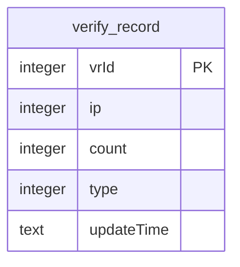
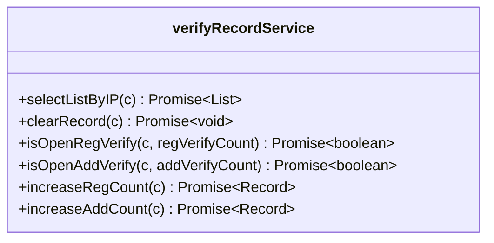
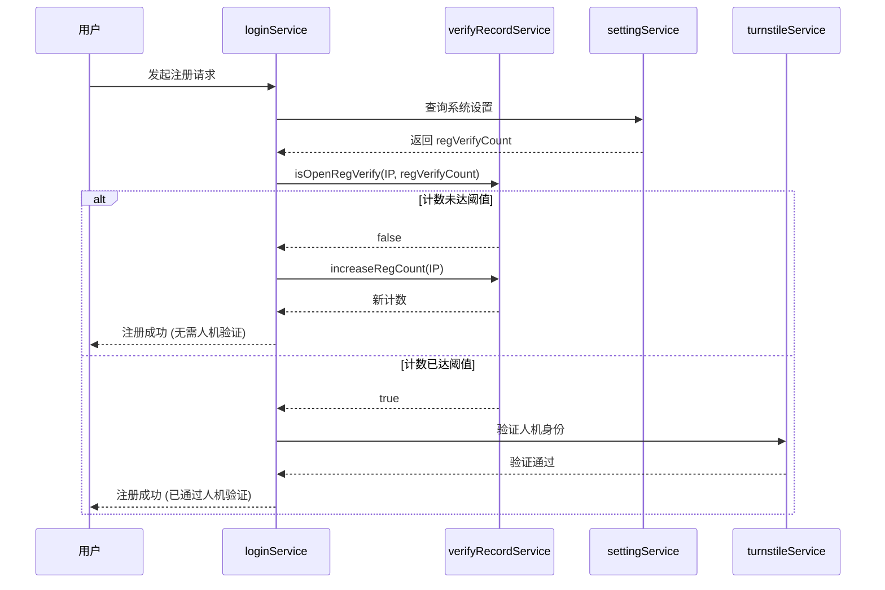

# 验证记录实体 (VerifyRecord)

<cite>
**Referenced Files in This Document**   
- [verify-record.js](file://mail-worker/src/entity/verify-record.js)
- [verify-record-service.js](file://mail-worker/src/service/verify-record-service.js)
- [entity-const.js](file://mail-worker/src/const/entity-const.js)
- [setting-service.js](file://mail-worker/src/service/setting-service.js)
- [login-service.js](file://mail-worker/src/service/login-service.js)
</cite>

## 目录
1. [简介](#简介)
2. [实体结构与字段定义](#实体结构与字段定义)
3. [业务规则与安全机制](#业务规则与安全机制)
4. [核心服务方法分析](#核心服务方法分析)
5. [在注册流程中的应用](#在注册流程中的应用)
6. [防止暴力破解攻击](#防止暴力破解攻击)
7. [总结](#总结)

## 简介

`VerifyRecord` 实体是系统安全验证流程中的核心数据追踪组件，专门用于记录与IP地址相关的验证操作行为。该实体主要服务于邮箱验证、用户注册等关键场景，通过记录操作次数和类型，为系统提供防止滥用和暴力破解攻击的依据。本文档将深入分析其数据结构、业务规则及在用户注册流程中的具体应用。

**Section sources**
- [verify-record.js](file://mail-worker/src/entity/verify-record.js#L0-L10)
- [verify-record-service.js](file://mail-worker/src/service/verify-record-service.js#L0-L90)

## 实体结构与字段定义

`VerifyRecord` 实体定义了用于追踪验证操作的关键数据字段，其结构设计简洁而高效，专注于记录IP级别的操作统计。

**Diagram sources**
- [verify-record.js](file://mail-worker/src/entity/verify-record.js#L0-L10)

### 字段说明

| 字段名 | 类型 | 说明 |
| :--- | :--- | :--- |
| `vrId` | integer | 主键，自增的记录ID，唯一标识每条验证记录。 |
| `ip` | integer | 发起验证请求的客户端IP地址（以整数形式存储），用于关联特定来源的操作。 |
| `count` | integer | 该IP地址在特定类型下的累计操作次数，默认值为1。 |
| `type` | integer | 记录的验证类型，区分不同的业务场景（如注册、添加邮箱）。 |
| `updateTime` | text | 记录最后更新的时间戳，自动设置为当前时间。 |

**Section sources**
- [verify-record.js](file://mail-worker/src/entity/verify-record.js#L0-L10)
- [entity-const.js](file://mail-worker/src/const/entity-const.js#L112-L115)

## 业务规则与安全机制

`VerifyRecord` 实体的业务逻辑围绕着两种核心验证类型展开，通过计数机制实现动态的安全策略。

### 验证类型 (verifyRecordType)

系统通过 `verifyRecordType` 常量定义了两种验证场景：
- **REG (0)**: 代表用户注册 (`register`) 场景。
- **ADD (1)**: 代表添加邮箱 (`add email`) 场景。

这些类型作为 `type` 字段的值，用于在数据库中区分不同业务的记录。

### 核心业务规则

1.  **操作计数 (`count`)**: 系统会为每个IP地址在每种验证类型下维护一个计数器。每当该IP发起一次相关操作，计数器就会递增。
2.  **阈值触发**: 系统配置中存在 `regVerifyCount` 和 `addVerifyCount` 等参数，定义了触发额外安全验证（如人机验证）的阈值。当 `count` 字段的值达到或超过此阈值时，系统将要求用户完成更严格的身份验证。
3.  **时间窗口**: 虽然实体本身不直接存储过期时间，但其记录的生命周期通常由上层业务逻辑或数据清理任务管理，确保数据不会无限期累积。

**Section sources**
- [entity-const.js](file://mail-worker/src/const/entity-const.js#L112-L115)
- [verify-record-service.js](file://mail-worker/src/service/verify-record-service.js#L20-L87)

## 核心服务方法分析

`verifyRecordService` 提供了对 `VerifyRecord` 实体的完整操作接口，实现了原子性的数据读写。

**Diagram sources**
- [verify-record-service.js](file://mail-worker/src/service/verify-record-service.js#L7-L87)

### 关键方法说明

#### `isOpenRegVerify(c, regVerifyCount)`
此方法检查指定IP在注册场景下的操作次数是否已达到阈值。
- **输入**: 上下文 `c` 和配置的阈值 `regVerifyCount`。
- **逻辑**: 查询该IP在 `type=REG` 下的记录，若存在且 `count >= regVerifyCount`，则返回 `true`。
- **用途**: 决定是否对注册用户开启人机验证。

#### `increaseRegCount(c)`
此方法以原子性方式递增注册操作的计数。
- **逻辑**: 
    1.  查询该IP在 `type=REG` 下的记录。
    2.  若记录存在，则使用SQL的 `+ 1` 操作原子性地更新 `count` 并刷新 `updateTime`。
    3.  若记录不存在，则创建一条新记录，`count` 初始化为1。
- **原子性保证**: 通过数据库的 `UPDATE ... SET count = count + 1` 操作，避免了读取-修改-写入的竞态条件。

#### `selectListByIP(c)`
此方法查询指定IP发起的所有验证记录，用于在获取系统设置时，向管理员展示该IP的活动情况。

**Section sources**
- [verify-record-service.js](file://mail-worker/src/service/verify-record-service.js#L7-L87)

## 在注册流程中的应用

`VerifyRecord` 实体在用户注册流程中扮演着至关重要的角色，其工作流程如下：

**Diagram sources**
- [login-service.js](file://mail-worker/src/service/login-service.js#L0-L258)
- [verify-record-service.js](file://mail-worker/src/service/verify-record-service.js#L7-L87)

### 完整数据示例

假设系统配置 `regVerifyCount = 3`，一个IP地址的注册流程数据变化如下：

| 步骤 | 操作 | `vrId` | `ip` | `count` | `type` | `updateTime` |
| :--- | :--- | :--- | :--- | :--- | :--- | :--- |
| 1 | 第一次注册 | 1 | 123456789 | 1 | 0 (REG) | 2024-01-01 10:00:00 |
| 2 | 第二次注册 | 1 | 123456789 | 2 | 0 (REG) | 2024-01-01 10:05:00 |
| 3 | 第三次注册 | 1 | 123456789 | 3 | 0 (REG) | 2024-01-01 10:10:00 |
| 4 | 第四次注册 | - | - | - | - | - |
| 4a | 查询 `isOpenRegVerify` | - | - | - | - | - |
| 4b | 返回 `true`，要求人机验证 | - | - | - | - | - |

**Section sources**
- [login-service.js](file://mail-worker/src/service/login-service.js#L97-L152)
- [setting-service.js](file://mail-worker/src/service/setting-service.js#L51-L89)

## 防止暴力破解攻击

`VerifyRecord` 实体是系统防御暴力破解攻击的第一道防线。其防攻击机制体现在：

1.  **基于IP的速率限制**: 通过将 `count` 与 `regVerifyCount` 阈值比较，系统可以识别出在短时间内从同一IP发起的大量注册请求。
2.  **动态提升验证强度**: 当检测到可疑的高频操作时，系统会动态地要求用户完成人机验证（Turnstile），这极大地增加了自动化脚本或机器人攻击的成本和难度。
3.  **数据驱动的决策**: 所有安全决策都基于 `VerifyRecord` 中存储的实际数据，而非简单的静态规则，使得防护策略更加灵活和精准。

**Section sources**
- [login-service.js](file://mail-worker/src/service/login-service.js#L120-L130)
- [verify-record-service.js](file://mail-worker/src/service/verify-record-service.js#L20-L35)

## 总结

`VerifyRecord` 实体是一个轻量级但功能强大的安全组件。它通过简单地记录IP地址的操作次数和类型，为系统提供了实施动态安全策略的基础。其与 `verifyRecordService` 服务的紧密结合，确保了数据操作的原子性和一致性。在用户注册等关键流程中，它有效地平衡了用户体验与系统安全，通过智能地触发人机验证，显著提升了系统抵御自动化攻击的能力。