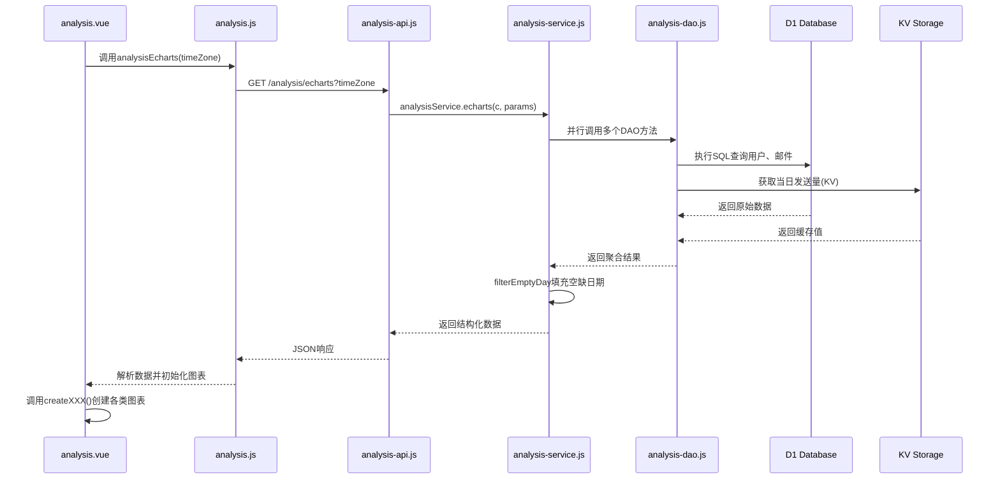

# 数据分析

<cite>
**本文档中引用的文件**  
- [analysis.vue](file://mail-vue/src/views/analysis/index.vue)
- [analysis.js](file://mail-vue/src/request/analysis.js)
- [analysis-api.js](file://mail-worker/src/api/analysis-api.js)
- [analysis-service.js](file://mail-worker/src/service/analysis-service.js)
- [analysis-dao.js](file://mail-worker/src/dao/analysis-dao.js)
- [index.js](file://mail-vue/src/echarts/index.js)
- [kv-const.js](file://mail-worker/src/const/kv-const.js)
</cite>

## 目录
1. [简介](#简介)
2. [前端可视化实现](#前端可视化实现)
3. [前后端数据交互流程](#前后端数据交互流程)
4. [后端数据聚合与查询](#后端数据聚合与查询)
5. [性能优化策略](#性能优化策略)
6. [ECharts配置封装与主题支持](#echarts配置封装与主题支持)
7. [自定义报表扩展指南](#自定义报表扩展指南)
8. [常见问题排查与优化建议](#常见问题排查与优化建议)
9. [结论](#结论)

## 简介
`cloud-mail`系统的数据分析模块通过前端ECharts图表与后端D1数据库查询相结合，实现了对邮件增长趋势、用户活跃度等关键指标的可视化展示。该模块从前端`analysis.vue`组件发起请求，经由API层调用服务逻辑，最终通过DAO层执行SQL聚合查询，完成从数据获取到图表渲染的完整流程。系统支持按日/周/月统计邮件收发量、新用户注册数等核心指标，并采用KV缓存、预计算等手段优化查询性能。

## 前端可视化实现

`analysis.vue`作为数据分析页面的主组件，基于Vue 3与Element Plus构建UI框架，利用ECharts实现多种图表类型的渲染，包括折线图、柱状图、饼图和仪表盘。

该组件展示了四大核心指标：
- 邮件接收总数（含已删除与活跃）
- 邮件发送总数（含已删除与活跃）
- 邮箱账户总数（含已删除与活跃）
- 用户总数（含已删除与活跃）

同时，页面通过以下图表展示趋势分析：
- **用户增长折线图**：显示过去15天的新用户注册趋势
- **邮件增长柱状图**：对比每日邮件收发数量
- **发件人来源饼图**：展示主要发件人分布
- **当日发送量仪表盘**：实时显示今日已发送邮件数

所有图表均支持暗色/亮色主题切换，响应式布局适配不同屏幕尺寸，并在窗口大小变化或主题切换时自动重新渲染。

**Section sources**
- [analysis.vue](file://mail-vue/src/views/analysis/index.vue#L0-L799)

## 前后端数据交互流程

数据分析模块采用标准的前后端分离架构，数据流从用户界面发起，逐层向下传递至数据库，再逐层返回渲染。



**Diagram sources**
- [analysis.vue](file://mail-vue/src/views/analysis/index.vue#L0-L799)
- [analysis.js](file://mail-vue/src/request/analysis.js#L0-L5)
- [analysis-api.js](file://mail-worker/src/api/analysis-api.js#L0-L9)
- [analysis-service.js](file://mail-worker/src/service/analysis-service.js#L0-L91)
- [analysis-dao.js](file://mail-worker/src/dao/analysis-dao.js#L0-L105)

**Section sources**
- [analysis.vue](file://mail-vue/src/views/analysis/index.vue#L0-L799)
- [analysis.js](file://mail-vue/src/request/analysis.js#L0-L5)
- [analysis-api.js](file://mail-worker/src/api/analysis-api.js#L0-L9)

## 后端数据聚合与查询

后端通过`analysis-service.js`协调多个DAO方法，实现高效的数据聚合。核心查询逻辑分布在`analysis-dao.js`中，基于D1数据库执行SQL语句。

### 核心指标查询
`numberCount`方法通过单条SQL语句一次性计算所有基础计数指标：

```sql
SELECT
    COALESCE(e.receiveTotal, 0) AS receiveTotal,
    COALESCE(e.sendTotal, 0) AS sendTotal,
    ...
FROM
    (SELECT SUM(CASE WHEN type = 0 THEN 1 ELSE 0 END) AS receiveTotal, ...) e
CROSS JOIN (SELECT COUNT(*) AS userTotal, ...) u
CROSS JOIN (SELECT COUNT(*) AS accountTotal, ...) a
```

此查询使用`CASE WHEN`条件聚合与`CROSS JOIN`连接用户、账户、邮件三张表的统计结果，避免多次查询。

### 时间序列数据查询
对于趋势分析，系统按本地时区对数据进行分组统计：

```sql
SELECT
    DATE(create_time,'+${diffHours} hours') AS date,
    COUNT(*) AS total
FROM user
WHERE DATE(create_time,'+${diffHours} hours') 
    BETWEEN DATE('now', '-15 days', '+${diffHours} hours') 
    AND DATE('now','-1 day','+${diffHours} hours')
GROUP BY DATE(create_time,'+${diffHours} hours')
ORDER BY date ASC
```

`diffHours`参数用于将UTC时间转换为客户端所在时区，确保日期统计符合用户本地时间习惯。

**Section sources**
- [analysis-service.js](file://mail-worker/src/service/analysis-service.js#L0-L91)
- [analysis-dao.js](file://mail-worker/src/dao/analysis-dao.js#L0-L105)

## 性能优化策略

系统采用多层优化策略保障数据分析性能，避免全表扫描与高延迟查询。

### 预计算与KV缓存
每日发送邮件总数通过KV存储预计算并缓存：

```javascript
c.env.kv.get(kvConst.SEND_DAY_COUNT + dayjs().format('YYYY-MM-DD'))
```

该值在邮件发送成功后由其他服务异步更新，确保实时性。`kvConst.SEND_DAY_COUNT`前缀定义于`kv-const.js`中。

### 并行查询
`analysisService.echarts`使用`Promise.all`并行执行五个独立查询：
- `numberCount`: 基础计数
- `nameRatio`: 发件人分布
- `userDayCount`: 用户日增
- `receiveDayCount`: 接收邮件日统计
- `sendDayCount`: 发送邮件日统计
- KV缓存读取

此举将串行耗时降至最低，显著提升接口响应速度。

### 空日期填充
为保证图表连续性，`filterEmptyDay`方法对过去15天中无数据的日期补零：

```javascript
return previousDays.map(day => {
    const index = data.findIndex(item => item.date === day)
    const total = index > -1 ? data[index].total : 0
    return {date: day, total}
})
```

此处理避免了折线图因数据缺失而中断，提升可视化效果。

**Section sources**
- [analysis-service.js](file://mail-worker/src/service/analysis-service.js#L50-L90)
- [analysis-dao.js](file://mail-worker/src/dao/analysis-dao.js#L48-L103)
- [kv-const.js](file://mail-worker/src/const/kv-const.js#L0-L7)

## ECharts配置封装与主题支持

前端通过`echarts/index.js`统一管理ECharts实例的注册与使用，实现模块化封装。

```javascript
import * as echarts from 'echarts/core';
import { BarChart, PieChart, LineChart, GaugeChart } from 'echarts/charts';
import { TooltipComponent, GridComponent, LegendComponent } from 'echarts/components';
import { CanvasRenderer } from 'echarts/renderers';

echarts.use([
    GaugeChart,
    LegendComponent,
    PieChart,
    TooltipComponent,
    GridComponent,
    BarChart,
    LineChart,
    CanvasRenderer
]);

export default echarts
```

该封装按需引入图表类型与组件，减少打包体积。`analysis.vue`中通过`topic`计算属性动态注入主题颜色：

```javascript
const topic = computed(() => ({
    color: uiStore.dark ? '#E5EAF3' : '#303133',
    background: uiStore.dark ? '#141414' : '#FFFFFF',
    ...
}))
```

所有图表配置引用`topic.value`中的颜色变量，实现暗色/亮色主题无缝切换。响应式布局通过`window.onresize`事件与`debounce`防抖确保性能。

**Section sources**
- [index.js](file://mail-vue/src/echarts/index.js#L0-L26)
- [analysis.vue](file://mail-vue/src/views/analysis/index.vue#L0-L799)

## 自定义报表扩展指南

### 新增统计维度
1. 在`analysis-dao.js`中添加新的SQL查询方法
2. 在`analysis-service.js`的`echarts`方法中调用新DAO方法
3. 将结果添加到返回对象中
4. 在前端`analysis.vue`中接收新数据并创建对应图表

### 修改时间粒度
将SQL中的`DATE(create_time)`改为：
- 按周：`strftime('%Y-%W', create_time)`
- 按月：`strftime('%Y-%m', create_time)`
同时调整前端日期格式化逻辑。

### 导出CSV功能开发路径
1. 新增API端点`/analysis/export`
2. 复用现有DAO查询获取原始数据
3. 使用`json2csv`等库转换为CSV格式
4. 设置响应头`Content-Type: text/csv`并返回文件流
5. 前端调用该接口并触发下载

## 常见问题排查与优化建议

### 数据延迟
- **现象**：图表数据未反映最新操作
- **原因**：KV缓存未及时更新或时区计算偏差
- **排查**：检查`kvConst.SEND_DAY_COUNT`键是否存在，确认`diffHours`计算正确
- **优化**：确保所有写操作后更新KV缓存，增加缓存失效机制

### 图表渲染卡顿
- **现象**：页面加载慢或交互不流畅
- **原因**：ECharts未正确销毁旧实例或数据量过大
- **排查**：确认每次渲染前调用`dispose()`释放资源
- **优化**：对大数据集启用`progressive`渐进渲染，限制查询范围

### 时区错乱
- **现象**：日期显示与本地时间不符
- **原因**：`timeZone`参数未正确传递或解析
- **排查**：检查前端是否传入`Intl.DateTimeFormat().resolvedOptions().timeZone`
- **优化**：在服务端增加时区验证逻辑，提供默认时区 fallback

## 结论
`cloud-mail`数据分析模块通过前后端协同设计，实现了高效、美观的关键指标可视化。系统采用并行查询、KV缓存、预计算等优化手段保障性能，ECharts封装支持主题切换与响应式布局。未来可扩展更多维度分析，增加导出、告警等功能，进一步提升数据分析能力。