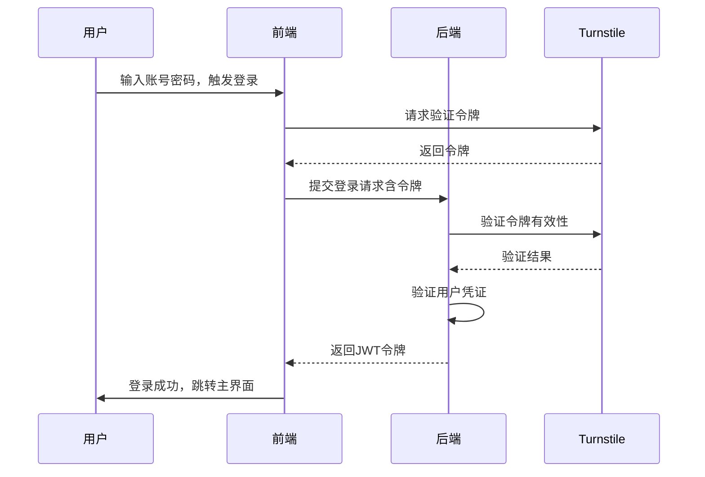
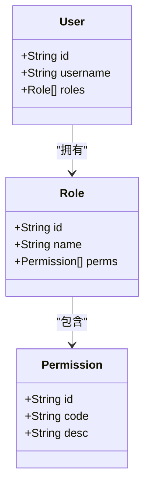
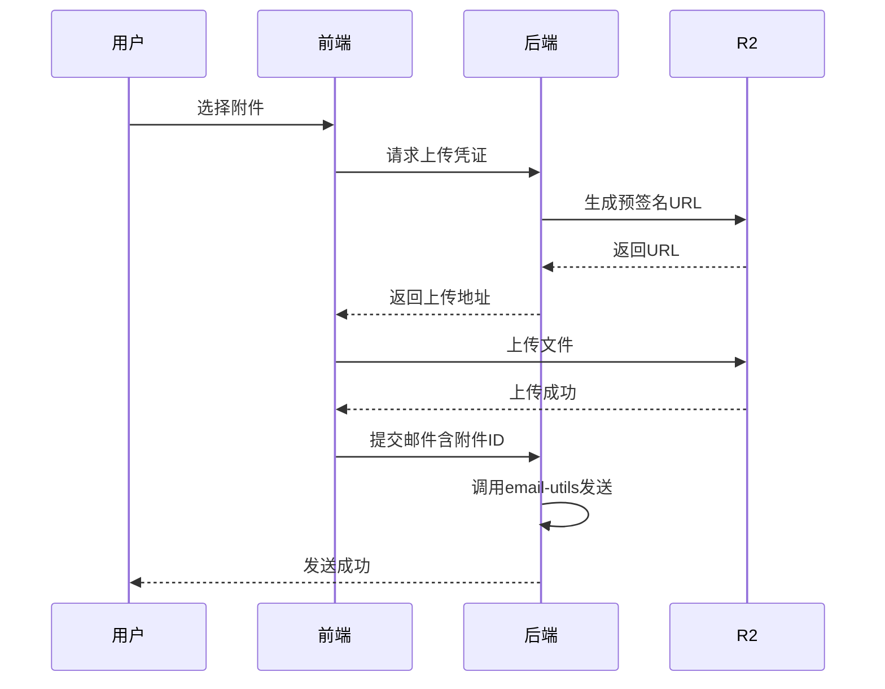
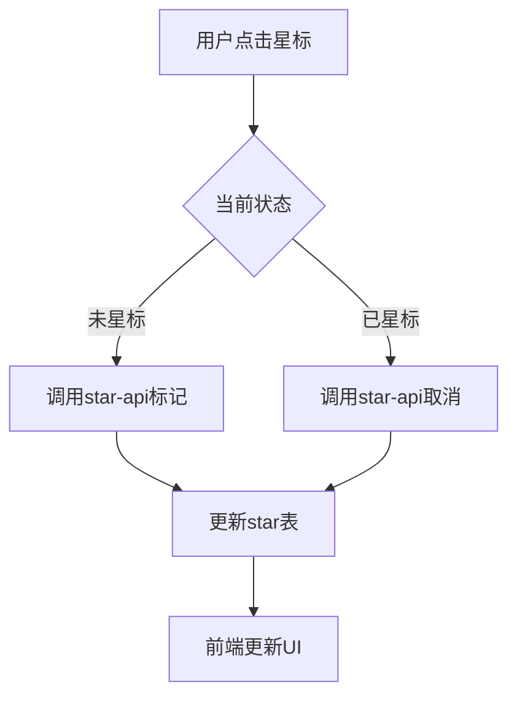
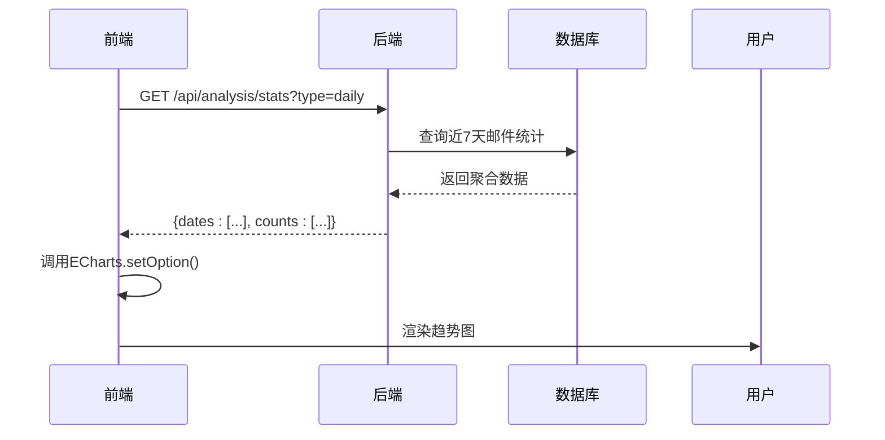

# 核心功能模块详解

<cite>
**本文档引用文件**  
- [login.js](file://mail-vue/src/request/login.js)
- [user.js](file://mail-vue/src/request/user.js)
- [analysis.js](file://mail-vue/src/request/analysis.js)
- [setting.js](file://mail-vue/src/request/setting.js)
- [login-service.js](file://mail-worker/src/service/login-service.js)
- [user-service.js](file://mail-worker/src/service/user-service.js)
- [analysis-service.js](file://mail-worker/src/service/analysis-service.js)
- [setting-service.js](file://mail-worker/src/service/setting-service.js)
- [login-api.js](file://mail-worker/src/api/login-api.js)
- [user-api.js](file://mail-worker/src/api/user-api.js)
- [analysis-api.js](file://mail-worker/src/api/analysis-api.js)
- [setting-api.js](file://mail-worker/src/api/setting-api.js)
- [turnstile-service.js](file://mail-worker/src/service/turnstile-service.js)
- [email-service.js](file://mail-worker/src/service/email-service.js)
- [r2-service.js](file://mail-worker/src/service/r2-service.js)
- [star-service.js](file://mail-worker/src/service/star-service.js)
- [role-service.js](file://mail-worker/src/service/role-service.js)
- [perm.js](file://mail-worker/src/entity/perm.js)
- [role.js](file://mail-worker/src/entity/role.js)
- [att.js](file://mail-worker/src/entity/att.js)
- [email.js](file://mail-worker/src/entity/email.js)
- [setting.js](file://mail-worker/src/entity/setting.js)
</cite>

## 目录
1. [引言](#引言)
2. [用户系统](#用户系统)
   - [注册与登录流程（集成Turnstile）](#注册与登录流程集成turnstile)
   - [多账户管理](#多账户管理)
   - [RBAC权限分配机制](#rbac权限分配机制)
3. [邮件功能](#邮件功能)
   - [邮件发送（含附件上传至R2）](#邮件发送含附件上传至r2)
   - [邮件接收](#邮件接收)
   - [星标与删除操作](#星标与删除操作)
4. [系统管理](#系统管理)
   - [用户与角色管理](#用户与角色管理)
   - [注册密钥管理](#注册密钥管理)
   - [系统设置（标题、背景图）](#系统设置标题背景图)
5. [数据分析](#数据分析)
   - [ECharts数据调用与图表渲染](#echarts数据调用与图表渲染)
6. [结论](#结论)

## 引言
cloud-mail 是一个基于前后端分离架构的云邮件系统，支持多账户管理、角色权限控制、邮件收发、附件存储于Cloudflare R2以及数据可视化分析。本文档系统性地解析其四大核心功能模块：用户系统、邮件功能、系统管理与数据分析，涵盖关键流程、状态转换、协作机制与典型使用场景。

## 用户系统

### 注册与登录流程（集成Turnstile）
系统在登录与注册环节集成Cloudflare Turnstile人机验证服务，防止自动化脚本攻击。前端在提交登录表单前调用Turnstile API获取验证令牌，后端通过 `turnstile-service.js` 验证令牌有效性。

**图示来源**  
- [login.js](file://mail-vue/src/request/login.js#L1-L30)
- [login-api.js](file://mail-worker/src/api/login-api.js#L10-L40)
- [login-service.js](file://mail-worker/src/service/login-service.js#L15-L50)
- [turnstile-service.js](file://mail-worker/src/service/turnstile-service.js#L5-L25)

### 多账户管理
用户可通过账户管理界面添加、切换或删除关联的邮箱账户。每个账户独立配置SMTP/IMAP参数，数据隔离存储于数据库。前端通过 `account.js` 请求管理账户，后端 `account-service.js` 处理账户CRUD操作。

**典型场景**：用户A同时管理个人邮箱（a@gmail.com）和工作邮箱（a@company.com），可在系统内无缝切换收发邮件。

**图示来源**  
- [account.js](file://mail-vue/src/request/account.js#L1-L20)
- [account-service.js](file://mail-worker/src/service/account-service.js#L10-L40)

### RBAC权限分配机制
系统采用基于角色的访问控制（RBAC）模型，通过 `role.js` 和 `perm.js` 定义角色与权限实体。权限以字符串标识（如 `user:read`, `setting:write`），角色绑定多个权限，用户关联一个或多个角色。

权限校验由 `perm-service.js` 在API调用前通过中间件完成，确保用户仅能访问授权资源。

**图示来源**  
- [role.js](file://mail-worker/src/entity/role.js#L1-L15)
- [perm.js](file://mail-worker/src/entity/perm.js#L1-L12)
- [role-service.js](file://mail-worker/src/service/role-service.js#L20-L60)
- [perm-service.js](file://mail-worker/src/service/perm-service.js#L5-L30)

## 邮件功能

### 邮件发送（含附件上传至R2）
用户在富文本编辑器中撰写邮件，上传附件时前端调用 `r2-api.js` 获取临时上传URL，文件直传至Cloudflare R2，元数据（文件名、大小、R2路径）存入数据库 `att.js`。

**图示来源**  
- [email.js](file://mail-vue/src/request/email.js#L20-L50)
- [r2-service.js](file://mail-worker/src/service/r2-service.js#L10-L40)
- [att.js](file://mail-worker/src/entity/att.js#L1-L10)
- [email-service.js](file://mail-worker/src/service/email-service.js#L30-L70)

### 邮件接收
系统通过定时任务轮询各账户IMAP服务器，拉取新邮件并解析存储至 `email.js` 实体。前端通过 `all-email.js` 获取邮件列表，支持分页与搜索。

**状态转换**：  
`未读` →（用户打开）→ `已读`  
`已接收` →（用户标记）→ `星标` →（用户取消）→ `已接收`

**图示来源**  
- [email-api.js](file://mail-worker/src/api/email-api.js#L15-L35)
- [email-service.js](file://mail-worker/src/service/email-service.js#L10-L25)
- [email.js](file://mail-worker/src/entity/email.js#L1-L20)

### 星标与删除操作
用户可对邮件进行星标或删除操作。星标状态变更通过 `star-api.js` 更新数据库 `star.js` 记录；删除操作将邮件标记为软删除（`is_deleted = true`），保留数据用于恢复。

**图示来源**  
- [star.js](file://mail-vue/src/request/star.js#L1-L15)
- [star-service.js](file://mail-worker/src/service/star-service.js#L5-L25)
- [star.js](file://mail-worker/src/entity/star.js#L1-L8)

## 系统管理

### 用户与角色管理
管理员可通过管理界面增删改查用户与角色。`user-api.js` 和 `role-api.js` 提供REST接口，`user-service.js` 与 `role-service.js` 处理业务逻辑，权限校验确保仅管理员可操作。

**典型场景**：管理员创建“客服”角色，赋予 `email:read`, `email:reply` 权限，并分配给新入职员工。

**图示来源**  
- [user.js](file://mail-vue/src/request/user.js#L1-L20)
- [role.js](file://mail-vue/src/request/role.js#L1-L20)
- [user-service.js](file://mail-worker/src/service/user-service.js#L25-L60)
- [role-service.js](file://mail-worker/src/service/role-service.js#L10-L35)

### 注册密钥管理
为控制用户注册权限，系统启用注册密钥机制。新用户需输入有效密钥方可完成注册。密钥由管理员生成，存储于 `reg-key.js`，支持设置有效期与使用次数。

**图示来源**  
- [reg-key.js](file://mail-vue/src/request/reg-key.js#L1-L15)
- [reg-key-service.js](file://mail-worker/src/service/reg-key-service.js#L5-L30)
- [reg-key.js](file://mail-worker/src/entity/reg-key.js#L1-L12)

### 系统设置（标题、背景图）
系统支持自定义标题与背景图，配置信息存储于 `setting.js` 实体。前端通过 `setting.js` 请求获取当前设置，管理员在“系统设置”页面更新后调用 `setting-api.js` 持久化。

**图示来源**  
- [setting.js](file://mail-vue/src/request/setting.js#L1-L15)
- [setting-service.js](file://mail-worker/src/service/setting-service.js#L10-L25)
- [setting.js](file://mail-worker/src/entity/setting.js#L1-L10)

## 数据分析

### ECharts数据调用与图表渲染
前端通过 `analysis.js` 调用 `/api/analysis/stats` 接口，后端 `analysis-service.js` 从数据库聚合邮件收发量、用户活跃度等数据，返回JSON格式趋势数据。前端使用 `echarts/index.js` 初始化图表并渲染。

**图示来源**  
- [analysis.js](file://mail-vue/src/request/analysis.js#L1-L20)
- [analysis-service.js](file://mail-worker/src/service/analysis-service.js#L15-L45)
- [analysis-api.js](file://mail-worker/src/api/analysis-api.js#L5-L20)
- [echarts/index.js](file://mail-vue/src/echarts/index.js#L1-L10)

## 结论
cloud-mail 通过清晰的前后端分离架构与模块化设计，实现了完整的邮件系统核心功能。用户系统安全可靠，邮件功能稳定高效，系统管理灵活可控，数据分析直观可视。各模块通过标准化API协作，具备良好的可维护性与扩展性。