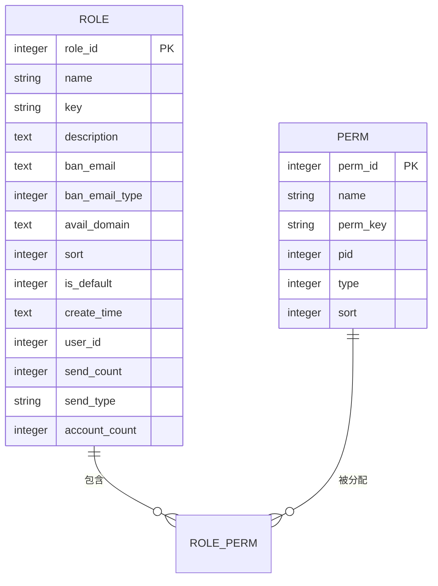
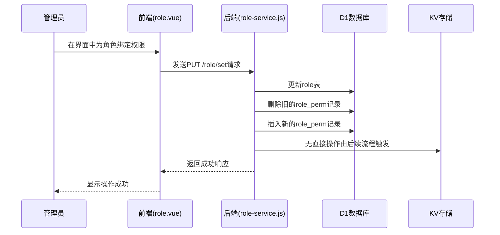
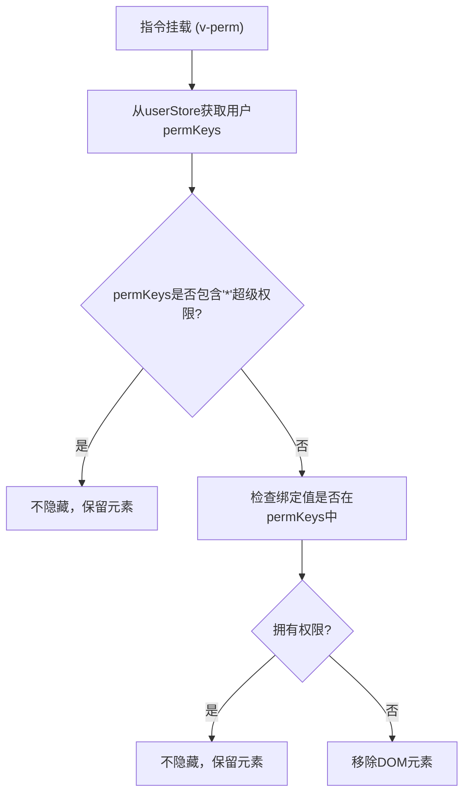
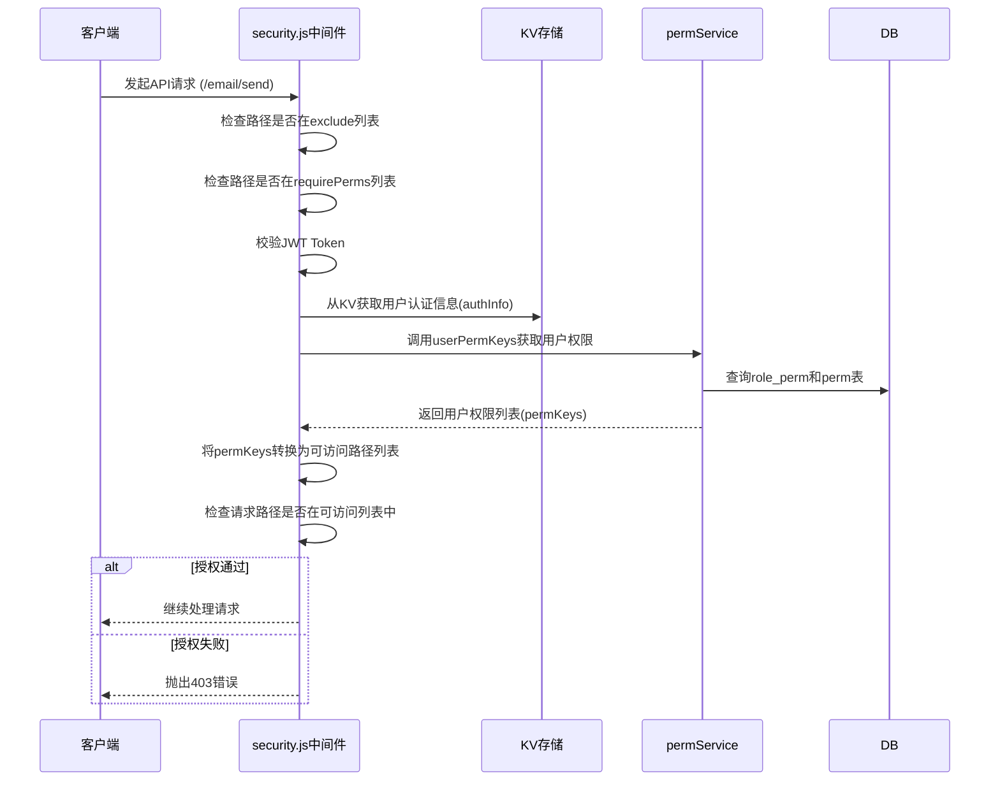

# RBAC权限控制

<cite>
**本文档引用文件**  
- [role.js](file://mail-worker/src/entity/role.js)
- [perm.js](file://mail-worker/src/entity/perm.js)
- [perm.js](file://mail-vue/src/perm/perm.js)
- [role-service.js](file://mail-worker/src/service/role-service.js)
- [security.js](file://mail-worker/src/security/security.js)
- [role.js](file://mail-vue/src/request/role.js)
- [role.js](file://mail-vue/src/store/role.js)
</cite>

## 目录
1. [引言](#引言)
2. [数据结构设计](#数据结构设计)
3. [权限分配流程](#权限分配流程)
4. [前端权限指令实现](#前端权限指令实现)
5. [后端安全拦截机制](#后端安全拦截机制)
6. [权限变更后的状态同步](#权限变更后的状态同步)
7. [典型使用场景](#典型使用场景)
8. [常见问题排查](#常见问题排查)
9. [结论](#结论)

## 引言
cloud-mail系统采用基于角色的访问控制（RBAC）模型实现细粒度的权限管理。该模型通过角色（Role）与权限（Perm）的解耦设计，支持管理员灵活配置用户权限，确保系统安全与操作合规。本文档系统性地阐述该权限控制体系的设计与实现，涵盖数据结构、前后端交互流程、安全校验机制及典型应用场景。

## 数据结构设计

### 角色与权限实体定义
系统在D1数据库中通过`role`和`perm`两张表定义核心权限数据结构。`role`表存储角色信息，`perm`表存储权限信息，两者通过中间表`role_perm`建立多对多关联。

**Diagram sources**  
- [role.js](file://mail-worker/src/entity/role.js#L1-L20)
- [perm.js](file://mail-worker/src/entity/perm.js#L1-L11)

### 字段说明与关联逻辑
- **角色表 (role)**: `roleId`为主键，`key`为角色唯一标识，`banEmail`和`availDomain`用于限制邮件收发范围，`isDefault`标记默认角色。
- **权限表 (perm)**: `permId`为主键，`permKey`为权限唯一标识（如`email:send`），`pid`表示父权限ID，`type`区分菜单与按钮权限。
- **关联逻辑**: 一个角色可拥有多个权限，一个权限也可分配给多个角色。通过`rolePerm`实体在数据库中建立关联。

**Section sources**
- [role.js](file://mail-worker/src/entity/role.js#L1-L20)
- [perm.js](file://mail-worker/src/entity/perm.js#L1-L11)

## 权限分配流程

### 管理员操作界面
管理员通过前端`role.vue`界面进行权限分配。该界面提供角色列表、权限树形选择器，支持创建、编辑、删除角色，并为角色绑定或解绑权限。

**Diagram sources**  
- [role.vue](file://mail-vue/src/views/role/index.vue)
- [role-service.js](file://mail-worker/src/service/role-service.js#L60-L90)

### 后端处理与缓存
后端`role-service.js`中的`setRole`方法处理权限更新请求。其核心逻辑包括：
1.  校验角色名称非空。
2.  更新`role`表中的角色基本信息。
3.  删除该角色原有的所有权限关联（`rolePerm`）。
4.  根据传入的`permIds`列表，批量插入新的权限关联。
5.  **缓存更新**: 权限变更后，相关用户的权限信息在下次登录或刷新时从数据库重新加载并缓存至KV存储。

**Section sources**
- [role-service.js](file://mail-worker/src/service/role-service.js#L60-L90)

## 前端权限指令实现

### `v-perm`指令原理
前端通过自定义指令`v-perm`实现UI元素的动态显示与隐藏。该指令在`perm.js`中定义，其核心逻辑如下：
1.  **获取用户权限**: 指令挂载时，从Pinia状态管理（`userStore`）中获取当前用户的`permKeys`数组。
2.  **权限校验**: 将指令绑定的值（单个权限key或数组）与用户的`permKeys`进行比对。
3.  **DOM操作**: 若用户不拥有指定权限，则直接从DOM树中移除该元素。

**Diagram sources**  
- [perm.js](file://mail-vue/src/perm/perm.js#L1-L25)

### 动态路由生成
`permsToRouter`函数根据用户的权限列表，从预定义的`routers`映射中筛选出可访问的路由，实现菜单的动态生成。

**Section sources**
- [perm.js](file://mail-vue/src/perm/perm.js#L1-L122)

## 后端安全拦截机制

### 中间件校验流程
系统在`security.js`中通过Hono中间件对所有API请求进行统一的安全校验。其流程如下：

**Diagram sources**  
- [security.js](file://mail-worker/src/security/security.js#L30-L172)

### 核心校验逻辑
1.  **路径排除**: 对`/login`、`/register`等公开路径直接放行。
2.  **Token校验**: 验证JWT的有效性，并检查其是否存在于KV存储的活跃会话中。
3.  **权限映射**: 利用`premKey`对象将权限标识（如`email:send`）映射到具体的API路径（如`/email/send`）。
4.  **访问决策**: 若请求路径属于`requirePerms`列表，则检查用户权限映射出的可访问路径是否包含当前请求路径，否则拒绝访问。

**Section sources**
- [security.js](file://mail-worker/src/security/security.js#L30-L172)

## 权限变更后的状态同步

当管理员修改角色权限后，系统通过以下机制保证状态同步：
1.  **后端**: 权限数据直接持久化到D1数据库。
2.  **前端**: 无实时推送机制。用户需通过刷新页面或重新登录，触发前端重新拉取最新的权限数据。
3.  **缓存**: 用户的权限信息缓存在KV中，其有效期与会话绑定。会话过期或被踢出后，下次登录将重新加载最新权限。

**Section sources**
- [role-service.js](file://mail-worker/src/service/role-service.js#L75-L85)
- [security.js](file://mail-worker/src/security/security.js#L150-L160)

## 典型使用场景

### 场景一：创建自定义角色并分配“邮件发送”权限
1.  管理员进入`/role`管理界面。
2.  点击“新增角色”，输入角色名称（如“邮件专员”）。
3.  在权限树中勾选`email:send`权限。
4.  保存后，拥有“邮件专员”角色的用户即可访问发送邮件功能。

### 场景二：禁用用户的特定操作权限
1.  管理员编辑目标用户所属的角色。
2.  在权限列表中取消勾选需要禁用的权限（如`user:delete`）。
3.  保存更新。该角色下的所有用户将失去执行相应操作的权限。

**Section sources**
- [role-service.js](file://mail-worker/src/service/role-service.js#L60-L90)
- [security.js](file://mail-worker/src/security/security.js#L100-L140)

## 常见问题排查

### 问题一：权限变更后前端界面未更新
**原因**: 前端权限数据已缓存，未触发刷新。
**解决方案**: 引导用户刷新页面或重新登录。

### 问题二：`v-perm`指令无效，元素未隐藏
**原因**: 指令绑定的权限key拼写错误，或用户拥有`*`超级权限。
**解决方案**: 检查模板中`v-perm`的绑定值是否与`perm.js`中定义的`permKey`完全一致。

**Section sources**
- [perm.js](file://mail-vue/src/perm/perm.js#L1-L25)
- [security.js](file://mail-worker/src/security/security.js#L150-L160)

## 结论
cloud-mail的RBAC权限控制系统设计清晰，实现了角色、权限与用户的有效分离。通过D1数据库持久化核心数据，前端指令实现UI级控制，后端中间件保障API安全，形成了一套完整的权限管理闭环。该系统具备良好的灵活性和安全性，能够满足多用户场景下的精细化权限管理需求。