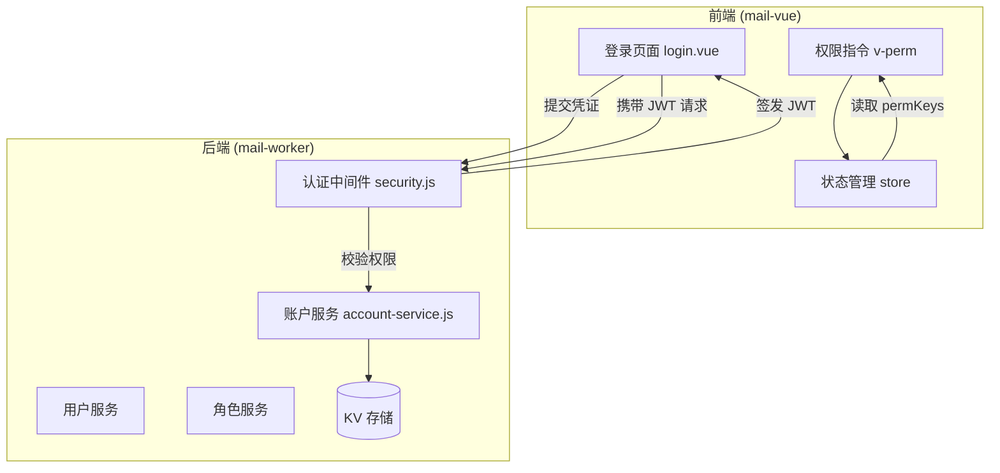
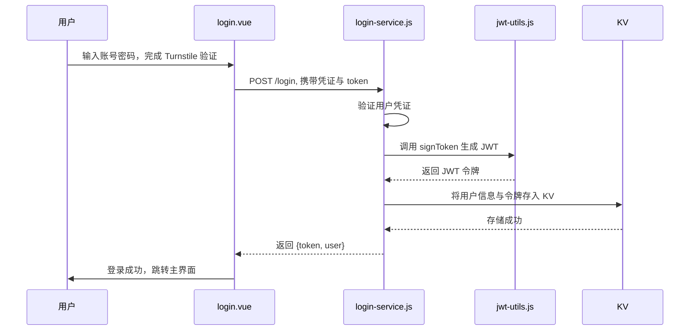
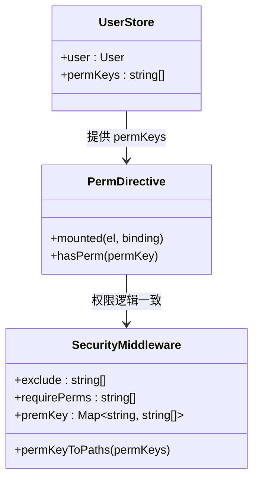
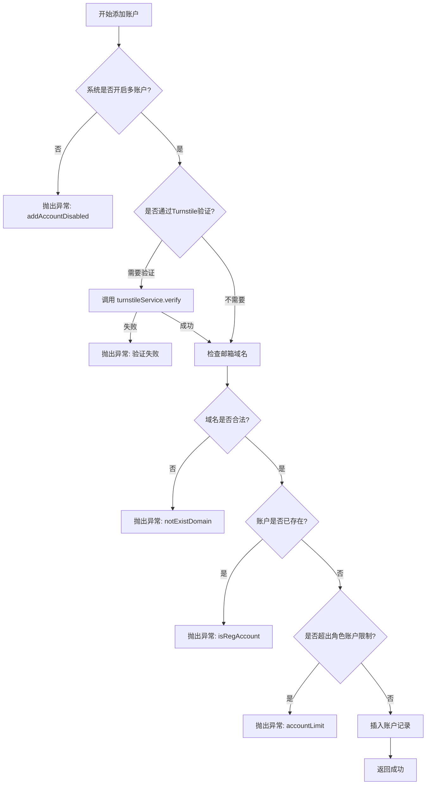
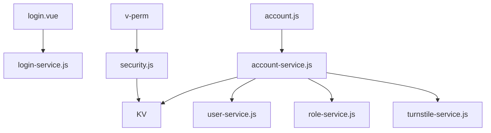

# 用户系统

<cite>
**本文档引用文件**  
- [login.vue](file://mail-vue/src/views/login/index.vue)
- [security.js](file://mail-worker/src/security/security.js)
- [role.js](file://mail-worker/src/entity/role.js)
- [perm.js](file://mail-worker/src/entity/perm.js)
- [perm.js](file://mail-vue/src/perm/perm.js)
- [account-service.js](file://mail-worker/src/service/account-service.js)
- [account.js](file://mail-worker/src/entity/account.js)
- [account.js](file://mail-vue/src/store/account.js)
- [login-service.js](file://mail-worker/src/service/login-service.js)
</cite>

## 目录
1. [简介](#简介)
2. [项目结构](#项目结构)
3. [核心组件](#核心组件)
4. [架构概览](#架构概览)
5. [详细组件分析](#详细组件分析)
6. [依赖分析](#依赖分析)
7. [性能考虑](#性能考虑)
8. [故障排除指南](#故障排除指南)
9. [结论](#结论)

## 简介
本文档系统性地描述了 cloud-mail 系统的用户管理模块，涵盖用户注册、登录认证、基于角色的权限控制（RBAC）以及多邮箱账户支持机制。重点说明前端通过 Turnstile 人机验证防止自动化攻击的实现方式，结合 JWT 无状态认证流程，详细阐述前后端如何协同实现权限控制与账户管理。

## 项目结构
cloud-mail 项目分为前端（mail-vue）与后端（mail-worker）两个主要模块。前端采用 Vue 3 框架，通过 Vite 构建，权限控制通过自定义指令 `v-perm` 实现；后端基于 Hono 框架运行于 Cloudflare Workers，使用 Drizzle ORM 操作 SQLite 数据库，通过 KV 存储用户会话与配置信息。

**Section sources**
- [main.js](file://mail-vue/src/main.js)
- [index.js](file://mail-worker/src/index.js)

## 核心组件
本系统核心用户功能由以下组件构成：
- **登录与注册**：`login.vue` 处理用户界面，`login-service.js` 实现后端逻辑。
- **权限控制**：前端 `perm.js` 实现指令级权限判断，后端 `security.js` 在请求中间件中校验 JWT 与权限。
- **角色与权限模型**：`role.js` 与 `perm.js` 定义数据结构，`role-service.js` 提供业务逻辑。
- **多账户管理**：`account-service.js` 处理账户绑定、删除与查询，`account.js` 为实体定义。

**Section sources**
- [login.vue](file://mail-vue/src/views/login/index.vue)
- [security.js](file://mail-worker/src/security/security.js)
- [perm.js](file://mail-vue/src/perm/perm.js)
- [account-service.js](file://mail-worker/src/service/account-service.js)

## 架构概览
系统采用前后端分离架构，前端通过 HTTP API 与后端交互。用户认证采用 JWT 令牌机制，结合 Cloudflare KV 实现会话状态管理。权限控制采用 RBAC 模型，权限信息在用户登录时注入 JWT 并缓存于 KV，前后端分别进行权限校验。

**Diagram sources**
- [login.vue](file://mail-vue/src/views/login/index.vue)
- [security.js](file://mail-worker/src/security/security.js)
- [account-service.js](file://mail-worker/src/service/account-service.js)

## 详细组件分析

### 登录与认证流程
用户登录时，前端 `login.vue` 收集用户名、密码及 Turnstile 验证令牌。后端 `login-service.js` 验证凭证后，调用 `jwtUtils` 签发包含用户 ID 与权限密钥（permKeys）的 JWT。令牌同时存储于 KV（`KvConst.AUTH_INFO + userId`），用于会话状态管理。

**Diagram sources**
- [login.vue](file://mail-vue/src/views/login/index.vue)
- [login-service.js](file://mail-worker/src/service/login-service.js)
- [security.js](file://mail-worker/src/security/security.js)

### RBAC 权限模型
系统采用基于角色的访问控制（RBAC）模型。`role.js` 定义角色实体，包含 `key` 字段作为权限标识；`perm.js` 定义权限项，通过 `permKey` 与角色关联。`security.js` 中的中间件根据请求路径判断是否需要权限校验，并通过 `permKeyToPaths` 映射权限密钥到具体 API 路径。

#### 前端权限控制
前端通过 `v-perm` 指令控制 UI 元素显示。`perm.js` 中的 `hasPerm` 函数检查当前用户 `permKeys` 是否包含指定权限密钥。若用户拥有 `*` 权限，则视为超级管理员，可访问所有功能。

**Diagram sources**
- [perm.js](file://mail-vue/src/perm/perm.js)
- [security.js](file://mail-worker/src/security/security.js)
- [user.js](file://mail-vue/src/store/user.js)

### 多账户管理
用户可绑定多个邮箱账户，由 `account-service.js` 提供支持。`account.js` 实体定义账户信息，包括 `email`、`userId`（外键）和 `isDel`（软删除标记）。`add` 方法在添加账户前校验域名、账户数量限制及可用域名权限。

#### 账户绑定与切换
新账户绑定需通过 Turnstile 验证，验证频率由系统设置 `addEmailVerify` 控制。管理员可禁用用户账户，用户可切换主账户。`allAccount` 接口返回用户所有非主账户，用于账户切换列表。

**Diagram sources**
- [account-service.js](file://mail-worker/src/service/account-service.js)
- [account.js](file://mail-worker/src/entity/account.js)
- [turnstile-service.js](file://mail-worker/src/service/turnstile-service.js)

## 依赖分析
系统前后端通过 RESTful API 通信，依赖关系清晰。前端依赖后端提供的用户、角色、账户等 API；后端服务间通过内部调用协作，如 `accountService` 依赖 `userService` 和 `roleService` 进行权限检查。外部依赖包括 Cloudflare Turnstile 用于人机验证，KV 用于会话存储。

**Diagram sources**
- [go.mod](file://mail-worker/package.json)
- [security.js](file://mail-worker/src/security/security.js)
- [account-service.js](file://mail-worker/src/service/account-service.js)

## 性能考虑
- **KV 缓存**：用户权限与会话信息存储于 KV，读写速度快，降低数据库压力。
- **JWT 无状态**：减少服务器会话存储开销，提升横向扩展能力。
- **权限预加载**：用户登录时一次性加载所有权限密钥，避免频繁查询数据库。
- **软删除**：账户删除采用软删除机制，保留数据完整性，但需定期清理。

## 故障排除指南
### Token 过期处理
当用户长时间未操作，JWT 过期后，前端应捕获 401 错误并重定向至登录页。`security.js` 中通过检查 KV 中的 `authInfo` 是否存在及令牌是否匹配来判断会话有效性。

**Section sources**
- [security.js](file://mail-worker/src/security/security.js)

### 权限缓存不同步
若用户权限变更后前端未及时更新，可能导致 UI 显示异常或请求被拒。解决方案是在权限变更后强制刷新页面或重新获取用户信息，更新 `userStore` 中的 `permKeys`。

**Section sources**
- [perm.js](file://mail-vue/src/perm/perm.js)
- [user.js](file://mail-vue/src/store/user.js)

### Turnstile 验证失败
确保前端正确集成 Turnstile 脚本并传递 `token` 参数。后端 `turnstile-service.js` 需配置正确的站点密钥。若验证频率限制开启，检查 `verify-record-service.js` 中的计数逻辑。

**Section sources**
- [login.vue](file://mail-vue/src/views/login/index.vue)
- [turnstile-service.js](file://mail-worker/src/service/turnstile-service.js)

## 结论
cloud-mail 的用户系统设计合理，安全可靠。通过 JWT + KV 实现无状态认证，结合 RBAC 模型提供细粒度权限控制。前端指令与后端中间件协同工作，确保了 UI 与 API 层的安全性。多账户支持灵活，配合 Turnstile 有效防御自动化攻击。建议定期审查权限分配，优化 KV 存储策略以提升性能。