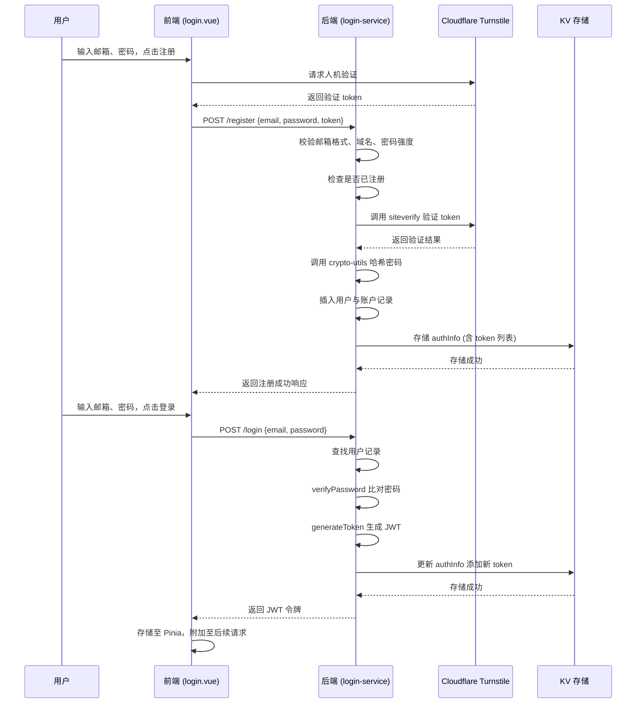

# 认证机制

<cite>
**本文档引用文件**  
- [login.vue](file://mail-vue/src/views/login/index.vue)
- [login.js](file://mail-vue/src/request/login.js)
- [login-api.js](file://mail-worker/src/api/login-api.js)
- [login-service.js](file://mail-worker/src/service/login-service.js)
- [turnstile-service.js](file://mail-worker/src/service/turnstile-service.js)
- [security.js](file://mail-worker/src/security/security.js)
- [crypto-utils.js](file://mail-worker/src/utils/crypto-utils.js)
- [jwt-utils.js](file://mail-worker/src/utils/jwt-utils.js)
</cite>

## 目录
1. [简介](#简介)
2. [用户注册与登录流程总览](#用户注册与登录流程总览)
3. [前端人机验证集成](#前端人机验证集成)
4. [密码安全与存储策略](#密码安全与存储策略)
5. [JWT令牌机制](#jwt令牌机制)
6. [认证时序图](#认证时序图)
7. [关键代码示例](#关键代码示例)
8. [安全防护措施](#安全防护措施)
9. [常见问题与解决方案](#常见问题与解决方案)

## 简介
本文件深入文档化 cloud-mail 系统的用户认证流程，涵盖注册与登录全过程。系统采用前后端分离架构，前端基于 Vue 框架实现交互逻辑，后端使用 Hono 构建 RESTful API 接口。认证机制结合 Cloudflare Turnstile 实现人机验证，防止自动化注册攻击，并通过 JWT 实现无状态身份认证。密码采用哈希加密存储，确保用户数据安全。

## 用户注册与登录流程总览
用户认证流程包括两个核心操作：注册与登录。

- **注册流程**：用户填写邮箱、密码，通过 Turnstile 验证后提交表单。后端校验邮箱格式、域名白名单、密码强度，并检查是否已注册。若开启注册密钥（regKey），需提供有效密钥。通过验证后，系统对密码进行哈希处理并存储用户信息。
- **登录流程**：用户输入邮箱与密码，后端查找用户记录并验证密码哈希。验证成功后生成 JWT 令牌，存储于 KV 数据库中，并返回给前端。

该流程确保了系统的安全性与可扩展性。

**Section sources**
- [login-service.js](file://mail-worker/src/service/login-service.js#L1-L258)

## 前端人机验证集成
前端通过 `login.vue` 组件集成 Cloudflare Turnstile 验证组件，防止机器人自动化注册。在用户提交注册表单前，Turnstile 会生成一个一次性验证令牌（token），该令牌随表单一同提交至后端。

后端通过 `turnstile-service.js` 调用 Cloudflare 的验证接口 `/turnstile/v0/siteverify`，使用预设的 `secretKey` 完成验证。验证过程中还会提取客户端 IP 地址（`cf-connecting-ip`）以增强安全性。

若验证失败或未提供 token，系统将抛出“人机验证失败”错误，阻止注册流程继续执行。

**Section sources**
- [login.vue](file://mail-vue/src/views/login/index.vue)
- [turnstile-service.js](file://mail-worker/src/service/turnstile-service.js#L1-L35)

## 密码安全与存储策略
系统采用安全的密码存储策略，避免明文存储用户密码。

- **哈希算法**：使用 `crypto-utils.js` 中的 `hashPassword` 方法对密码进行加盐哈希处理。该方法基于加密安全的哈希函数（如 Argon2 或 PBKDF2）生成不可逆的密码摘要。
- **验证机制**：登录时，系统调用 `verifyPassword` 方法，使用相同的盐值对输入密码重新哈希，并与数据库中存储的哈希值比对。
- **长度限制**：密码长度限制为 6–30 位，防止过短或过长的密码带来安全风险。

此策略有效防止密码泄露后的彩虹表攻击。

**Section sources**
- [crypto-utils.js](file://mail-worker/src/utils/crypto-utils.js)
- [login-service.js](file://mail-worker/src/service/login-service.js#L200-L210)

## JWT令牌机制
系统采用 JWT（JSON Web Token）实现无状态认证。

- **令牌签发**：用户登录成功后，后端调用 `security.js` 中的 `generateToken` 方法生成 JWT。令牌载荷包含 `userId` 和唯一 `token`（UUID），有效期由常量 `TOKEN_EXPIRE` 控制。
- **令牌存储**：前端收到 JWT 后，将其存储于 Pinia 状态管理中，并自动附加到后续所有 API 请求的 `Authorization` 头部。
- **令牌校验**：每次请求时，后端通过中间件解析 JWT，提取 `userId` 并查询 KV 存储中的 `authInfo`，验证令牌是否在有效列表中。
- **登出机制**：登出时，后端从 KV 中移除当前 token，实现即时失效。

该机制支持分布式部署，无需服务器端会话存储。

**Section sources**
- [security.js](file://mail-worker/src/security/security.js)
- [jwt-utils.js](file://mail-worker/src/utils/jwt-utils.js)
- [login-service.js](file://mail-worker/src/service/login-service.js#L220-L250)

## 认证时序图

**Diagram sources**
- [login.vue](file://mail-vue/src/views/login/index.vue)
- [login.js](file://mail-vue/src/request/login.js)
- [login-api.js](file://mail-worker/src/api/login-api.js)
- [login-service.js](file://mail-worker/src/service/login-service.js)

## 关键代码示例

### 登录接口调用
前端通过 `login.js` 封装的 `login(email, password)` 方法发起登录请求，返回 Promise。

[SPEC SYMBOL](file://mail-vue/src/request/login.js#L3-L5)

### Token刷新机制
每次登录生成新的 UUID 作为 token，并加入 KV 存储的 `tokens` 数组。旧 token 保留最多 10 个，超出则自动移除最旧的记录。

[SPEC SYMBOL](file://mail-worker/src/service/login-service.js#L230-L240)

### 登出操作清除本地状态
前端调用 `logout()` 方法登出，后端从 KV 中移除当前 token，前端同步清除 Pinia 中的用户状态。

[SPEC SYMBOL](file://mail-vue/src/request/login.js#L7-L9)
[SPEC SYMBOL](file://mail-worker/src/service/login-service.js#L250-L258)

## 安全防护措施
系统实施多层次安全策略：

- **人机验证**：注册时强制 Turnstile 验证，防止自动化脚本注册。
- **密码策略**：限制长度、加盐哈希存储。
- **账号锁定**：支持封禁（BAN）状态，阻止异常用户登录。
- **令牌管理**：每个登录会话生成独立 token，登出即失效。
- **域名限制**：仅允许配置域名内的邮箱注册，防止外部滥用。
- **注册密钥**：可选开启 regKey，控制注册权限。

这些措施共同构建了健壮的安全防线。

**Section sources**
- [login-service.js](file://mail-worker/src/service/login-service.js#L1-L258)
- [settingService.js](file://mail-worker/src/service/setting-service.js)

## 常见问题与解决方案

### Token过期处理
前端应监听 401 响应，触发重新登录流程。建议实现静默刷新机制：在 token 过期前主动调用登录接口（若支持 refresh token）或引导用户重新认证。

### 跨域认证失败
确保后端 API 正确配置 CORS 策略，允许前端域名访问，并支持 `Authorization` 头部。Cloudflare Workers 需在 `hono.js` 中设置响应头。

### Turnstile验证失败
检查 `secretKey` 是否正确配置于系统设置中。确保前端 token 正确传递，且服务器时间同步，避免因时间偏差导致验证失败。

### 登录频繁失败锁定
系统未实现登录失败次数限制，建议在 `login-service.js` 中增加基于 IP 或用户维度的失败计数机制，防止暴力破解。