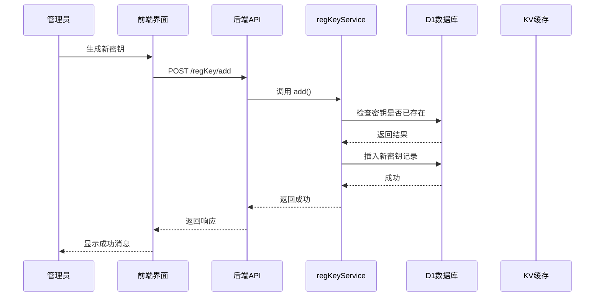
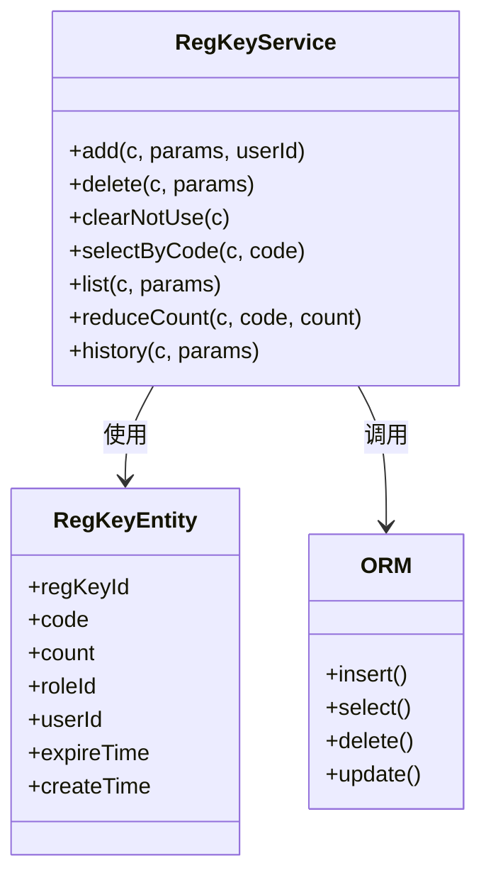
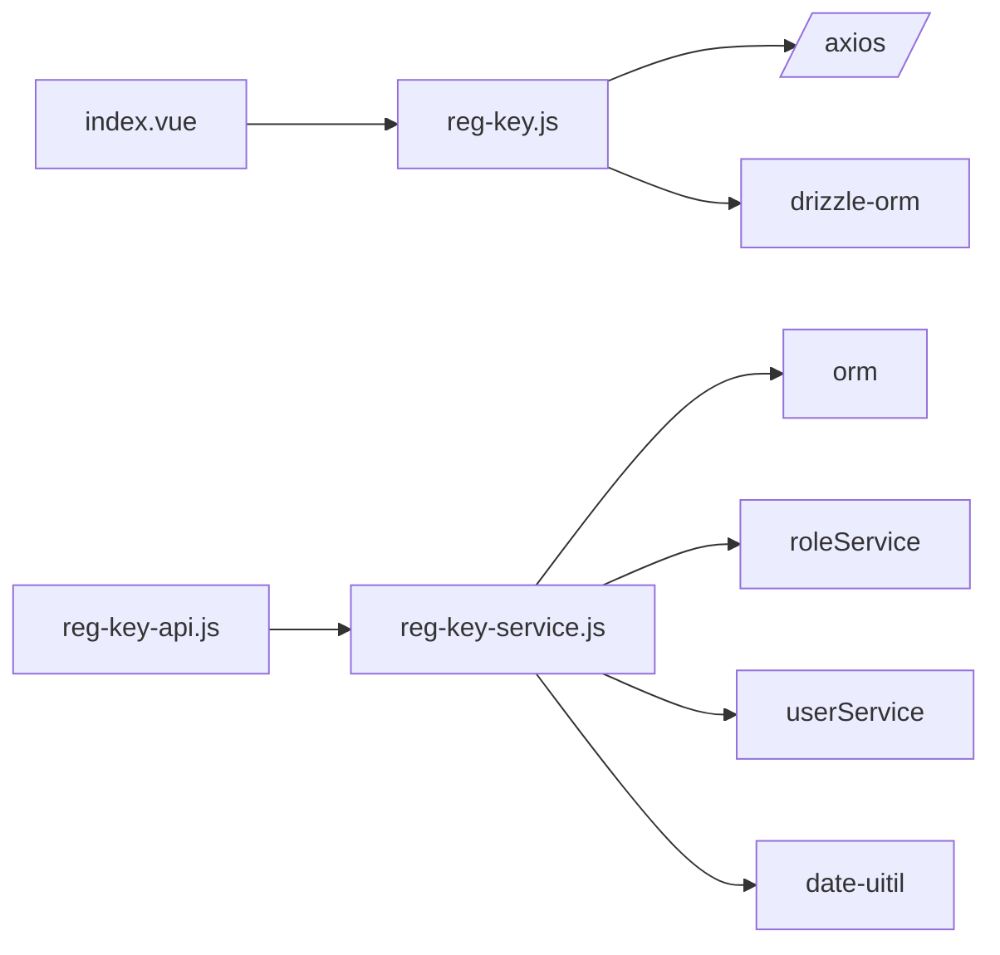

# 注册密钥管理

<cite>
**本文档引用文件**  
- [index.vue](file://mail-vue/src/views/reg-key/index.vue)
- [reg-key-service.js](file://mail-worker/src/service/reg-key-service.js)
- [reg-key.js](file://mail-worker/src/entity/reg-key.js)
- [reg-key.js](file://mail-vue/src/request/reg-key.js)
- [reg-key-api.js](file://mail-worker/src/api/reg-key-api.js)
</cite>

## 目录
1. [简介](#简介)
2. [项目结构](#项目结构)
3. [核心组件](#核心组件)
4. [架构概览](#架构概览)
5. [详细组件分析](#详细组件分析)
6. [依赖分析](#依赖分析)
7. [性能考虑](#性能考虑)
8. [故障排除指南](#故障排除指南)
9. [结论](#结论)

## 简介
本文档系统化地描述了注册密钥（RegKey）的全生命周期管理机制。涵盖管理员如何通过前端界面生成、查看、删除和清理注册密钥，后端服务如何实现密钥的生成、持久化、验证与统计，以及在密钥泄露时的应急响应流程。同时提供高并发场景下的优化建议。

## 项目结构
注册密钥功能分布在前后端两个主要模块中：前端位于 `mail-vue/src/views/reg-key/`，后端逻辑位于 `mail-worker/src/service/reg-key-service.js` 及相关实体与API文件。

```mermaid
graph TB
subgraph "前端 (mail-vue)"
UI[index.vue] --> API[reg-key.js]
API --> HTTP[/regKey/add, /regKey/list/]
end
subgraph "后端 (mail-worker)"
HTTP_API[reg-key-api.js] --> SERVICE[reg-key-service.js]
SERVICE --> DB[(reg_key 表)]
SERVICE --> KV[(KV 缓存)]
end
UI < --> HTTP_API
```

**Diagram sources**
- [index.vue](file://mail-vue/src/views/reg-key/index.vue)
- [reg-key-api.js](file://mail-worker/src/api/reg-key-api.js)

**Section sources**
- [index.vue](file://mail-vue/src/views/reg-key/index.vue)
- [reg-key-api.js](file://mail-worker/src/api/reg-key-api.js)

## 核心组件
核心组件包括前端界面 `index.vue`、前端API请求模块 `reg-key.js`、后端服务 `reg-key-service.js`、数据库实体 `reg-key.js` 和API路由 `reg-key-api.js`。这些组件协同完成密钥的生成、管理、验证和统计。

**Section sources**
- [index.vue](file://mail-vue/src/views/reg-key/index.vue)
- [reg-key-service.js](file://mail-worker/src/service/reg-key-service.js)
- [reg-key.js](file://mail-worker/src/entity/reg-key.js)

## 架构概览
系统采用前后端分离架构。前端通过Vue组件提供用户界面，调用Axios封装的API与后端通信。后端基于Hono框架接收请求，由`reg-key-service.js`处理业务逻辑，使用Drizzle ORM操作D1数据库进行持久化，并通过KV缓存提升验证性能。



**Diagram sources**
- [reg-key-api.js](file://mail-worker/src/api/reg-key-api.js)
- [reg-key-service.js](file://mail-worker/src/service/reg-key-service.js)

## 详细组件分析

### 前端界面分析
`index.vue` 是注册密钥管理的主界面，提供密钥列表展示、搜索、新增、删除和清理未使用密钥的功能。支持查看密钥使用历史，并动态调整表格列宽以优化显示。

```mermaid
flowchart TD
A[打开 reg-key/index.vue] --> B[加载密钥列表]
B --> C{是否有搜索条件?}
C --> |是| D[调用 regKeyList(params)]
C --> |否| E[调用 regKeyList()]
D --> F[显示密钥列表]
E --> F
F --> G[用户点击“新增”]
G --> H[生成随机码]
H --> I[填写角色、有效期、使用次数]
I --> J[提交表单]
J --> K[调用 regKeyAdd(form)]
K --> L[刷新列表]
```

**Diagram sources**
- [index.vue](file://mail-vue/src/views/reg-key/index.vue)

**Section sources**
- [index.vue](file://mail-vue/src/views/reg-key/index.vue)

### 密钥生成与持久化分析
`reg-key-service.js` 的 `add` 方法负责密钥的生成与存储。首先校验输入参数，检查密钥是否已存在及角色是否有效，然后将密钥信息持久化到D1数据库。



**Diagram sources**
- [reg-key-service.js](file://mail-worker/src/service/reg-key-service.js)
- [reg-key.js](file://mail-worker/src/entity/reg-key.js)

**Section sources**
- [reg-key-service.js](file://mail-worker/src/service/reg-key-service.js)
- [reg-key.js](file://mail-worker/src/entity/reg-key.js)

### 实体设计分析
`reg-key.js` 实体定义了数据库表 `reg_key` 的结构。关键字段包括：
- `code`: 密钥字符串，唯一标识，非空
- `count`: 剩余使用次数，初始值为配置值，每次使用递减
- `roleId`: 关联的角色ID，决定使用该密钥注册的用户权限
- `expireTime`: 过期时间，UTC时间字符串
- `createTime`: 创建时间，自动填充

该设计支持基于使用次数和时间的双重限制，确保密钥的安全性和时效性。

**Section sources**
- [reg-key.js](file://mail-worker/src/entity/reg-key.js)

### 原子性校验逻辑
系统通过数据库事务和原子性更新操作防止并发超用。当用户使用密钥注册时，服务层调用 `reduceCount` 方法，该方法使用SQL的原子减操作 `count = count - 1`，并在WHERE子句中检查当前 `count > 0`，确保即使在高并发下也不会出现负数或超额使用。

```sql
UPDATE reg_key 
SET count = count - 1 
WHERE code = ? AND count > 0;
```

**Section sources**
- [reg-key-service.js](file://mail-worker/src/service/reg-key-service.js)

### 应急响应流程
当发生密钥泄露时，管理员应立即采取以下措施：
1. **立即禁用**：在管理界面中删除该密钥，使其无法再被使用。
2. **审计日志追踪**：通过 `regKeyHistory(regKeyId)` 接口查询该密钥的使用历史，获取所有通过该密钥注册的用户信息，评估影响范围。
3. **重新生成策略**：创建新的密钥并分发，同时审查密钥生成和分发流程，防止再次泄露。

**Section sources**
- [reg-key-service.js](file://mail-worker/src/service/reg-key-service.js)
- [reg-key.js](file://mail-vue/src/request/reg-key.js)

### 高并发性能优化
- **KV缓存**：虽然当前代码未直接体现，但可通过将活跃密钥的 `code` 和 `count` 缓存在KV中，实现快速验证，减少数据库查询压力。
- **数据库索引**：确保 `code` 字段有唯一索引，`expireTime` 和 `count` 字段有适当索引，以加速查询和清理操作。
- **批量操作**：`clearNotUse` 方法批量清理过期或已用完的密钥，减少数据库碎片。

**Section sources**
- [reg-key-service.js](file://mail-worker/src/service/reg-key-service.js)

### 数据统计集成
`reg-key.js` 实体与 `analysis-dao.js` 通过用户注册行为间接集成。当用户使用密钥注册时，`userService` 会记录用户信息，`analysis-dao` 可以统计不同密钥来源的用户增长数据，用于分析市场活动效果。

**Section sources**
- [reg-key-service.js](file://mail-worker/src/service/reg-key-service.js)
- [analysis-dao.js](file://mail-worker/src/dao/analysis-dao.js)

## 依赖分析


**Diagram sources**
- [reg-key.js](file://mail-vue/src/request/reg-key.js)
- [reg-key-api.js](file://mail-worker/src/api/reg-key-api.js)
- [reg-key-service.js](file://mail-worker/src/service/reg-key-service.js)

**Section sources**
- [reg-key.js](file://mail-vue/src/request/reg-key.js)
- [reg-key-api.js](file://mail-worker/src/api/reg-key-api.js)

## 性能考虑
- **数据库查询优化**：`list` 方法使用 `LIKE` 进行前缀搜索，应确保索引有效。
- **内存使用**：前端使用 `reactive` 存储列表数据，对于大量密钥需考虑分页加载。
- **API响应时间**：`history` 接口可能返回大量用户数据，建议增加分页支持。

## 故障排除指南
- **密钥无法生成**：检查 `code` 是否为空或已存在，`roleId` 是否有效，`expireTime` 是否已填写。
- **密钥使用次数未减少**：确认 `reduceCount` 被正确调用，且数据库更新成功。
- **历史记录无法显示**：检查 `regKeyHistory` API 是否返回数据，前端表格绑定是否正确。

**Section sources**
- [reg-key-service.js](file://mail-worker/src/service/reg-key-service.js)
- [index.vue](file://mail-vue/src/views/reg-key/index.vue)

## 结论
注册密钥管理系统实现了从生成、管理到使用的完整闭环。通过前后端协同、数据库原子操作和合理的实体设计，确保了密钥的安全性和可靠性。未来可进一步集成KV缓存以提升高并发性能，并完善数据统计功能。