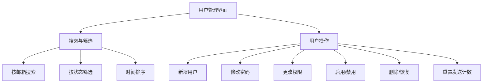
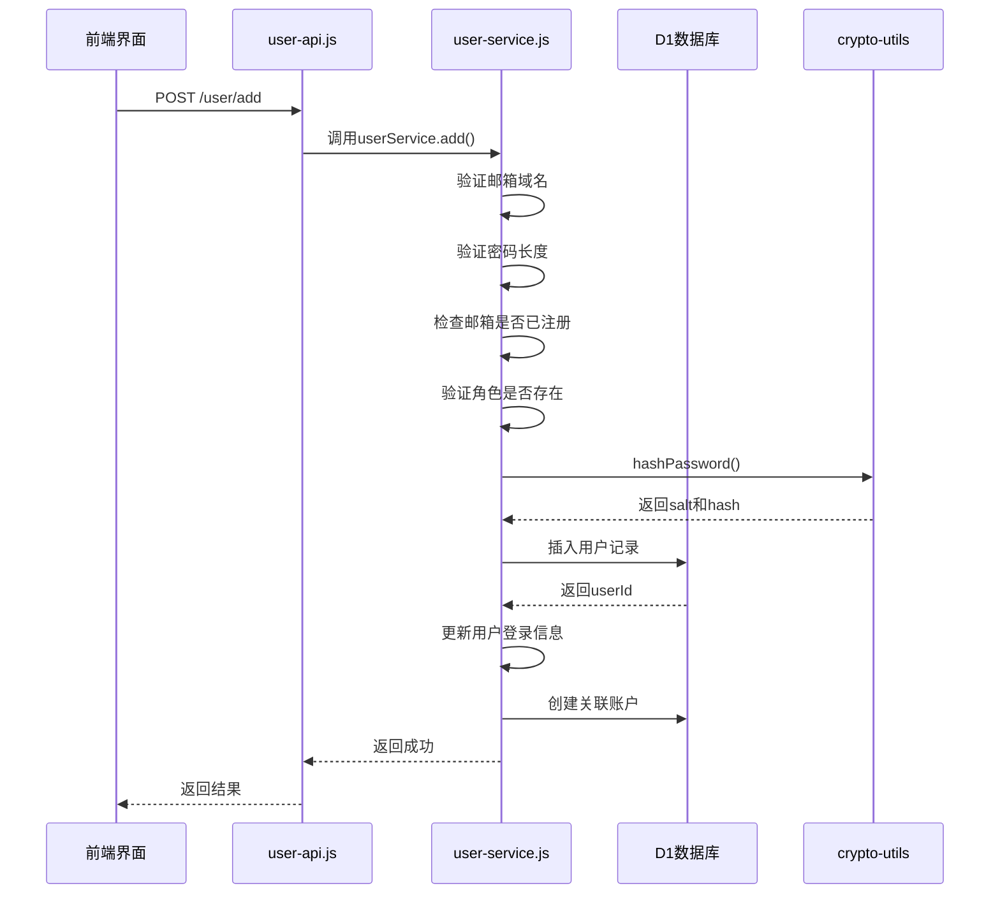
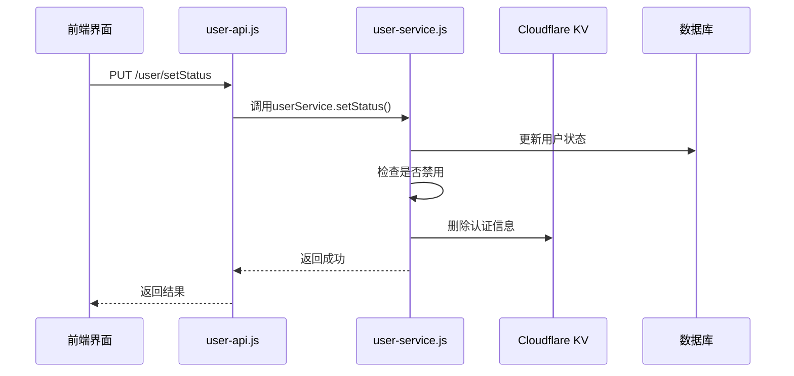
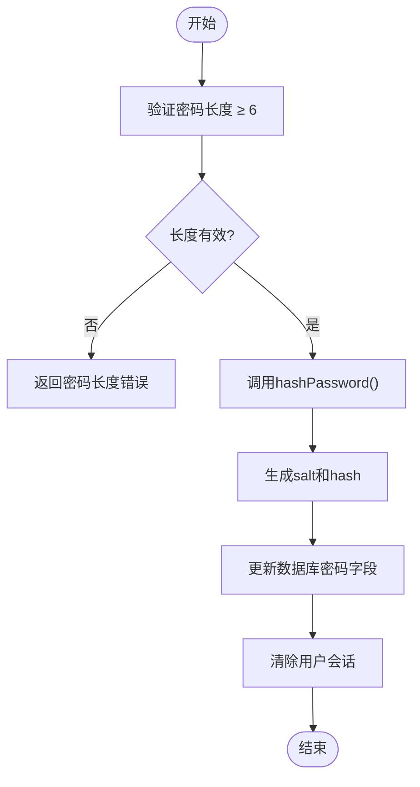
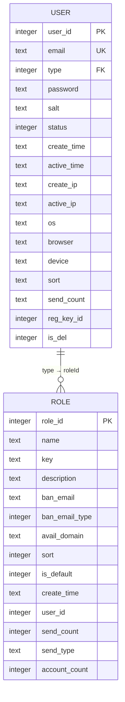
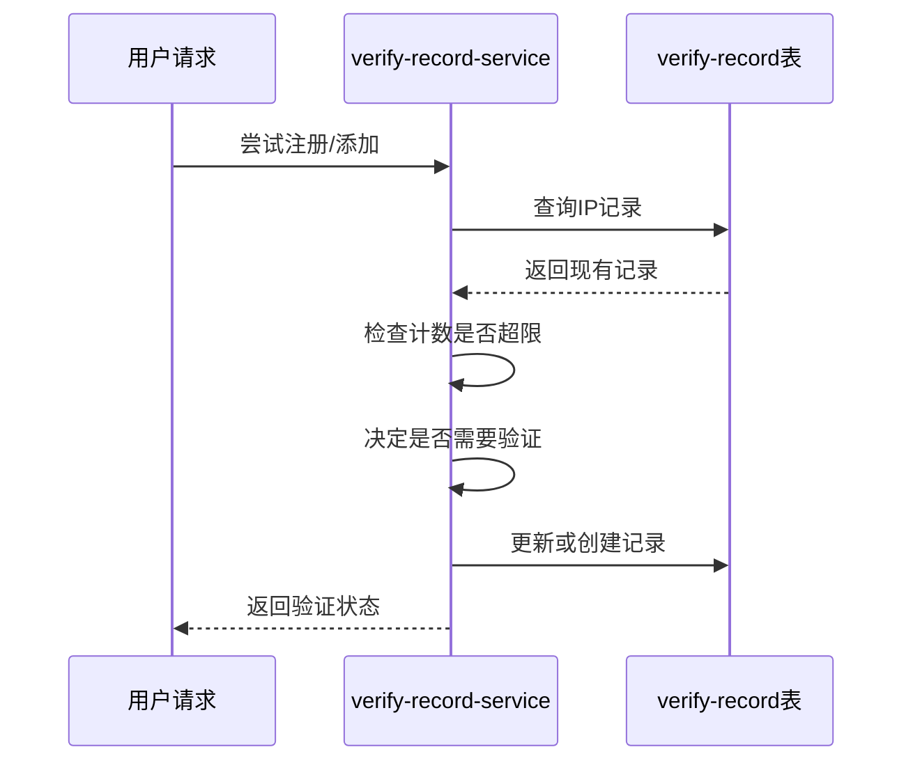

# 用户管理

<cite>
**本文档引用文件**   
- [user/index.vue](file://mail-vue/src/views/user/index.vue)
- [user-service.js](file://mail-worker/src/service/user-service.js)
- [user.js](file://mail-worker/src/entity/user.js)
- [user-api.js](file://mail-worker/src/api/user-api.js)
- [crypto-utils.js](file://mail-worker/src/utils/crypto-utils.js)
- [verify-record.js](file://mail-worker/src/entity/verify-record.js)
- [verify-record-service.js](file://mail-worker/src/service/verify-record-service.js)
- [entity-const.js](file://mail-worker/src/const/entity-const.js)
- [role.js](file://mail-worker/src/entity/role.js)
- [role-service.js](file://mail-worker/src/service/role-service.js)
- [user.js](file://mail-vue/src/request/user.js)
</cite>

## 目录
1. [简介](#简介)
2. [前端用户界面操作](#前端用户界面操作)
3. [后端用户管理逻辑](#后端用户管理逻辑)
4. [用户实体与数据库结构](#用户实体与数据库结构)
5. [API接口说明](#api接口说明)
6. [安全审计与验证机制](#安全审计与验证机制)
7. [常见问题与解决方案](#常见问题与解决方案)
8. [总结](#总结)

## 简介
本文档全面说明cloud-mail系统的用户管理功能，涵盖管理员通过前端界面执行用户增删改查、密码重置、账户启用/禁用等操作的完整流程。详细解释后端用户创建、状态更新、密码加密存储及与D1数据库交互的实现逻辑。描述用户实体字段定义及其与角色表的外键关联，并提供API接口调用示例。包含常见问题排查步骤和安全审计机制说明。

## 前端用户界面操作

管理员通过`user/index.vue`界面执行用户管理操作，支持分页查询、条件筛选和批量操作。



**Diagram sources**
- [user/index.vue](file://mail-vue/src/views/user/index.vue#L1-L799)

**Section sources**
- [user/index.vue](file://mail-vue/src/views/user/index.vue#L1-L799)
- [user.js](file://mail-vue/src/request/user.js#L1-L44)

## 后端用户管理逻辑

### 用户创建流程
后端`user-service.js`处理用户创建逻辑，包括邮箱验证、密码加密和数据库交互。



**Diagram sources**
- [user-service.js](file://mail-worker/src/service/user-service.js#L240-L280)
- [crypto-utils.js](file://mail-worker/src/utils/crypto-utils.js#L6-L14)
- [user-api.js](file://mail-worker/src/api/user-api.js#L23-L27)

**Section sources**
- [user-service.js](file://mail-worker/src/service/user-service.js#L240-L280)
- [crypto-utils.js](file://mail-worker/src/utils/crypto-utils.js#L6-L14)

### 用户状态更新
实现用户状态（启用/禁用）的更新逻辑，包括会话清理。



**Diagram sources**
- [user-service.js](file://mail-worker/src/service/user-service.js#L170-L185)
- [user-api.js](file://mail-worker/src/api/user-api.js#L13-L17)

**Section sources**
- [user-service.js](file://mail-worker/src/service/user-service.js#L170-L185)

### 密码重置流程
处理用户密码重置请求，使用crypto-utils进行密码加密。



**Diagram sources**
- [user-service.js](file://mail-worker/src/service/user-service.js#L40-L50)
- [crypto-utils.js](file://mail-worker/src/utils/crypto-utils.js#L6-L14)

**Section sources**
- [user-service.js](file://mail-worker/src/service/user-service.js#L40-L50)

## 用户实体与数据库结构

### 用户实体字段定义
用户实体`user.js`定义了完整的用户信息字段。

| 字段名 | 类型 | 默认值 | 说明 |
|--------|------|--------|------|
| userId | integer | 自增 | 用户ID，主键 |
| email | text | 无 | 邮箱地址，必填 |
| type | integer | 1 | 角色ID，外键关联角色表 |
| password | text | 无 | 加密后的密码，必填 |
| salt | text | 无 | 密码盐值，必填 |
| status | integer | 0 | 状态：0-启用，1-禁用 |
| createTime | text | CURRENT_TIMESTAMP | 创建时间 |
| activeTime | text | null | 最近活动时间 |
| createIp | text | null | 注册IP地址 |
| activeIp | text | null | 最近登录IP |
| os | text | null | 操作系统信息 |
| browser | text | null | 浏览器信息 |
| device | text | null | 设备信息 |
| sort | text | 0 | 排序字段 |
| sendCount | text | 0 | 发送邮件计数 |
| regKeyId | integer | 0 | 注册密钥ID |
| isDel | integer | 0 | 删除状态：0-正常，1-已删除 |

**Section sources**
- [user.js](file://mail-worker/src/entity/user.js#L1-L23)

### 用户与角色关联
用户表通过type字段与角色表建立外键关联。



**Diagram sources**
- [user.js](file://mail-worker/src/entity/user.js#L1-L23)
- [role.js](file://mail-worker/src/entity/role.js#L1-L20)

**Section sources**
- [user.js](file://mail-worker/src/entity/user.js#L1-L23)
- [role.js](file://mail-worker/src/entity/role.js#L1-L20)

## API接口说明

### 用户管理API接口
`user-api.js`定义了用户管理相关的RESTful API接口。

| 接口路径 | HTTP方法 | 功能 | 请求参数 | 响应 |
|---------|--------|------|----------|------|
| /user/list | GET | 获取用户列表 | num, size, email, timeSort, status | 用户列表及总数 |
| /user/add | POST | 添加用户 | email, type, password | 成功状态 |
| /user/setPwd | PUT | 设置密码 | userId, password | 成功状态 |
| /user/setStatus | PUT | 设置状态 | userId, status | 成功状态 |
| /user/setType | PUT | 设置角色 | userId, type | 成功状态 |
| /user/resetSendCount | PUT | 重置发送计数 | userId | 成功状态 |
| /user/restore | PUT | 恢复用户 | userId, type | 成功状态 |
| /user/delete | DELETE | 物理删除用户 | userId | 成功状态 |
| /user/allAccount | GET | 获取用户所有账户 | userId, num, size | 账户列表及总数 |
| /user/deleteAccount | DELETE | 删除用户账户 | accountId | 成功状态 |

**Section sources**
- [user-api.js](file://mail-worker/src/api/user-api.js#L1-L58)
- [user.js](file://mail-vue/src/request/user.js#L1-L44)

### API调用示例
#### 分页查询用户
```javascript
// 获取第1页，每页15条，按邮箱搜索
GET /user/list?num=1&size=15&email=user@example.com&status=0
```

#### 条件筛选
```javascript
// 筛选已启用用户，按创建时间升序
GET /user/list?num=1&size=20&status=0&timeSort=1
```

#### 批量操作
```javascript
// 批量重置多个用户的发送计数
PUT /user/resetSendCount
Body: { userId: 123 }

// 批量禁用用户
PUT /user/setStatus
Body: { userId: 123, status: 1 }
```

## 安全审计与验证机制

### 密码加密存储
使用`crypto-utils.js`实现安全的密码加密存储。

```mermaid
classDiagram
class CryptoUtils {
+generateSalt(length=16) string
+hashPassword(password) {salt, hash}
+genHashPassword(password, salt) string
+verifyPassword(inputPassword, salt, storedHash) boolean
+genRandomPwd(length=8) string
}
class UserService {
+resetPassword(c, params, userId) void
+setPwd(c, params) void
}
CryptoUtils --> UserService : "被调用"
```

**Diagram sources**
- [crypto-utils.js](file://mail-worker/src/utils/crypto-utils.js#L2-L37)
- [user-service.js](file://mail-worker/src/service/user-service.js#L40-L50)

**Section sources**
- [crypto-utils.js](file://mail-worker/src/utils/crypto-utils.js#L2-L37)

### 验证记录机制
通过`verify-record`表实现安全审计日志功能。

| 字段名 | 类型 | 说明 |
|--------|------|------|
| vrId | integer | 主键，自增 |
| ip | text | IP地址 |
| count | integer | 计数 |
| type | integer | 类型：0-注册，1-添加 |
| updateTime | text | 更新时间 |



**Diagram sources**
- [verify-record.js](file://mail-worker/src/entity/verify-record.js#L1-L11)
- [verify-record-service.js](file://mail-worker/src/service/verify-record-service.js#L1-L90)

**Section sources**
- [verify-record.js](file://mail-worker/src/entity/verify-record.js#L1-L11)
- [verify-record-service.js](file://mail-worker/src/service/verify-record-service.js#L1-L90)

## 常见问题与解决方案

### 用户无法登录排查
1. **检查账户状态**：确认用户状态是否为"启用"
2. **验证凭据**：确认邮箱和密码输入正确
3. **检查IP限制**：查看是否因频繁操作被限制
4. **清除缓存**：尝试清除浏览器缓存和Cookie
5. **联系管理员**：如问题持续，联系系统管理员

### 误删用户恢复方案
1. **立即停止操作**：避免进一步数据丢失
2. **联系管理员**：通过`user/restore`接口恢复
3. **验证恢复**：检查用户及其关联账户是否正常
4. **记录事件**：在审计日志中记录恢复操作

### 密码策略配置建议
1. **最小长度**：建议设置不少于6个字符
2. **复杂度要求**：鼓励使用大小写字母、数字和特殊字符组合
3. **定期更换**：建议每90天更换一次密码
4. **历史密码**：避免重复使用最近5次的密码
5. **安全提示**：教育用户不要在多个平台使用相同密码

## 总结
cloud-mail的用户管理功能提供了完整的用户生命周期管理能力，从前端界面操作到后端业务逻辑，再到数据库交互和安全审计，形成了一个完整的闭环系统。通过清晰的API接口设计和安全的密码加密机制，确保了用户数据的安全性和系统的可靠性。管理员可以高效地执行用户管理任务，同时系统提供了完善的审计日志和问题排查指南，保障了系统的稳定运行。