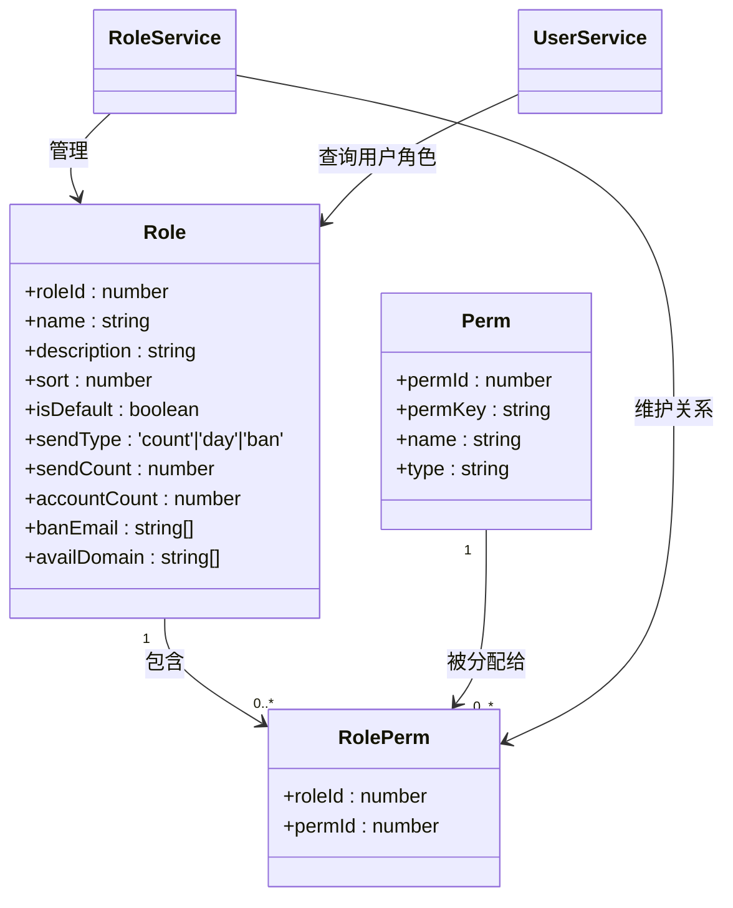
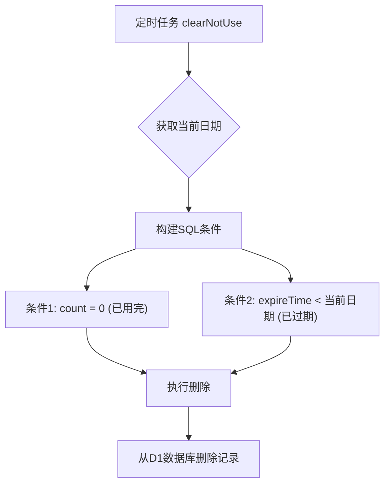

# 系统管理

<cite>
**本文档引用文件**  
- [user.vue](file://mail-vue/src/views/user/index.vue)
- [user-service.js](file://mail-worker/src/service/user-service.js)
- [role.vue](file://mail-vue/src/views/role/index.vue)
- [role-service.js](file://mail-worker/src/service/role-service.js)
- [reg-key-service.js](file://mail-worker/src/service/reg-key-service.js)
- [setting-service.js](file://mail-worker/src/service/setting-service.js)
- [sys-setting.vue](file://mail-vue/src/views/sys-setting/index.vue)
</cite>

## 目录
1. [简介](#简介)
2. [用户管理](#用户管理)
3. [角色与权限配置](#角色与权限配置)
4. [注册密钥管理](#注册密钥管理)
5. [系统级设置](#系统级设置)
6. [运维与安全指南](#运维与安全指南)

## 简介
本系统管理模块为`cloud-mail`平台提供全面的后台管理功能，涵盖用户生命周期管理、基于角色的访问控制（RBAC）、注册密钥分发及全局系统配置。管理员可通过直观的前端界面执行核心管理任务，所有操作均由后端微服务协同处理，确保数据一致性与操作安全性。系统采用D1数据库持久化核心数据，并利用KV存储实现高频访问数据的缓存，以优化性能。

## 用户管理

该模块允许管理员对用户账户进行全生命周期管理，包括增删、状态变更、密码重置等操作。

### 前端交互流程
管理员通过`user.vue`界面执行操作：
- **新增用户**：点击“添加”按钮，填写邮箱、密码并选择角色，提交后调用`userAdd` API。
- **状态控制**：通过下拉菜单选择“启用/禁用”或“恢复”，触发`userSetStatus`或`userRestore` API。
- **密码重置**：在用户操作菜单中选择“修改密码”，输入新密码后调用`userSetPwd` API。
- **数据查看**：可展开行查看用户的发送统计、账户详情、登录信息等。

### 后端实现逻辑
所有用户管理操作由`user-service.js`处理，核心逻辑如下：

```mermaid
sequenceDiagram
participant 前端 as user.vue
participant 后端 as user-service.js
participant 数据库 as D1
participant KV as KV存储
前端->>后端 : userAdd({email, password, type})
后端->>后端 : 验证邮箱域名、密码强度
后端->>数据库 : 插入用户记录
后端->>数据库 : 插入主账户记录
后端-->>前端 : 返回成功
前端->>后端 : userSetStatus({userId, status})
否则
后端->>数据库 : 更新用户状态
后端->>KV : 删除用户认证缓存(auth-info)
后端-->>前端 : 返回成功
end
前端->>后端 : userSetPwd({userId, password})
后端->>后端 : 使用crypto-utils生成盐值和哈希
后端->>数据库 : 更新密码和盐值
后端-->>前端 : 返回成功
```

**关键点说明**：
- **软删除机制**：删除用户时，`isDel`字段被标记为删除状态，而非物理删除，以保留审计线索。
- **缓存同步**：当用户被禁用（`status=1`）时，其在KV中的认证信息（`auth-info`）会被立即清除，强制其下线。
- **权限继承**：超级管理员（`c.env.admin`）的权限为硬编码的`*`，不受角色权限配置影响。

**Section sources**
- [user.vue](file://mail-vue/src/views/user/index.vue#L0-L799)
- [user-service.js](file://mail-worker/src/service/user-service.js#L0-L363)

## 角色与权限配置

系统采用RBAC（基于角色的访问控制）模型，通过`role.vue`界面实现角色与权限的动态绑定。

### 权限树与角色创建
- **权限树加载**：`role.vue`在初始化时调用`rolePermTree` API，获取完整的权限树结构并渲染为可勾选的树形控件。
- **角色创建/编辑**：管理员在表单中填写角色名称、描述、排序，并在权限树中勾选所需权限。对于`email:send`权限，可额外配置发送限额（总量或每日）和账户创建限额。

### 后端动态绑定机制
`role-service.js`负责权限的持久化与查询：



**核心流程**：
1. **创建角色**：`roleAdd` API接收参数，先验证角色名唯一性，然后将角色信息插入`role`表，并将勾选的权限ID与角色ID的映射关系批量插入`role-perm`关联表。
2. **更新角色**：`roleSet` API先更新`role`表，然后**删除**旧的`role-perm`记录，再**插入**新的映射关系，确保权限集合的原子性更新。
3. **权限查询**：`user-service.js`在查询用户列表时，会并行查询`roleService.selectByIdsHasPermKey`，将角色ID映射为具体的权限键（如`email:send`）及其配置（`sendType`, `sendCount`），一并返回给前端。

**边界情况处理**：
- **权限继承冲突**：一个用户只能拥有一个角色。当角色权限变更时，所有该角色的用户在下次登录或刷新时会自动获得新权限。
- **角色循环依赖**：本系统未实现角色继承，因此不存在循环依赖问题。角色间为平级关系。

**Section sources**
- [role.vue](file://mail-vue/src/views/role/index.vue#L0-L566)
- [role-service.js](file://mail-worker/src/service/role-service.js#L0-L180)

## 注册密钥管理

注册密钥（reg-key）用于控制新用户的注册流程，提供额外的安全层和访问控制。

### 密钥的生成与使用
- **生成**：管理员在后台生成一个唯一的密钥码（code），并指定其关联的角色、使用次数上限和过期时间。
- **有效期控制**：`reg-key-service.js`在`list`方法中，会将过期时间早于当前日期的密钥的`expireTime`字段设为`null`，在前端显示为“已过期”。
- **使用次数限制**：每当有新用户使用该密钥注册，`reg-key-service.js`的`reduceCount`方法会被调用，通过SQL的原子减操作（`count = count - 1`）来递减剩余次数。

### 与KV缓存的交互
系统通过定期任务清理无效密钥，以减轻数据库负担：

此操作直接在D1数据库上执行，不涉及KV缓存，因为注册密钥本身不被缓存。其使用状态的变更（`reduceCount`）是直接对数据库的更新。

**Section sources**
- [reg-key-service.js](file://mail-worker/src/service/reg-key-service.js#L0-L102)

## 系统级设置

系统设置模块允许管理员自定义平台的全局行为和外观。

### 配置项与数据流
管理员通过`sys-setting.vue`界面修改配置，数据流如下：
1. **前端提交**：表单数据通过`setting-service.js`的`set` API提交。
2. **后端处理**：
   - **普通设置**：如`title`、`register`开关等，直接更新D1数据库中的`setting`表。
   - **敏感信息**：`siteKey`、`secretKey`等在返回给前端时会被部分掩码（`******`）。
   - **背景图上传**：若上传了新背景图，`setBackground`方法会：
     - 将Base64数据转换为文件。
     - 计算文件哈希作为唯一文件名。
     - 上传至R2对象存储。
     - 更新数据库中的`background`字段为R2的URL。
     - 删除旧的背景图文件。
3. **缓存更新**：`refresh`方法在每次设置变更后被调用，将最新的`setting`数据从D1读取并存入KV存储（`KvConst.SETTING`），同时设置在当前请求上下文（`c.set`）中，实现热更新。

### 热更新机制
系统优先从KV缓存读取设置（`settingService.query`），若缓存中不存在，则从D1读取并回填缓存。这确保了高频访问的配置项（如`websiteConfig`）能快速响应，同时`refresh`操作保证了KV与D1的数据最终一致性。

**Section sources**
- [setting-service.js](file://mail-worker/src/service/setting-service.js#L0-L180)
- [sys-setting.vue](file://mail-vue/src/views/sys-setting/index.vue)

## 运维与安全指南

### 管理员误操作恢复
- **误删用户**：可通过“恢复”功能将`isDel`状态从`1`改回`0`，并选择是否同时恢复其关联的邮件和账户数据。
- **误删角色**：系统会强制将所有该角色的用户迁移至默认角色，此操作不可逆。建议在删除前确认无用户使用。

### 密钥泄露应急响应
1. **立即行动**：在管理后台找到泄露的注册密钥。
2. **停止使用**：将其使用次数手动设为`0`，或直接删除该密钥。
3. **生成新密钥**：为受影响的用户组创建新的、更安全的密钥。
4. **审计**：通过`reg-key-service.js`的`history` API，查询该密钥的历史使用记录，排查异常注册。

### 设置项热更新
所有系统设置的变更都会触发`refresh`操作，自动更新KV缓存。管理员无需重启服务或手动刷新，变更通常在几秒内对所有用户生效。