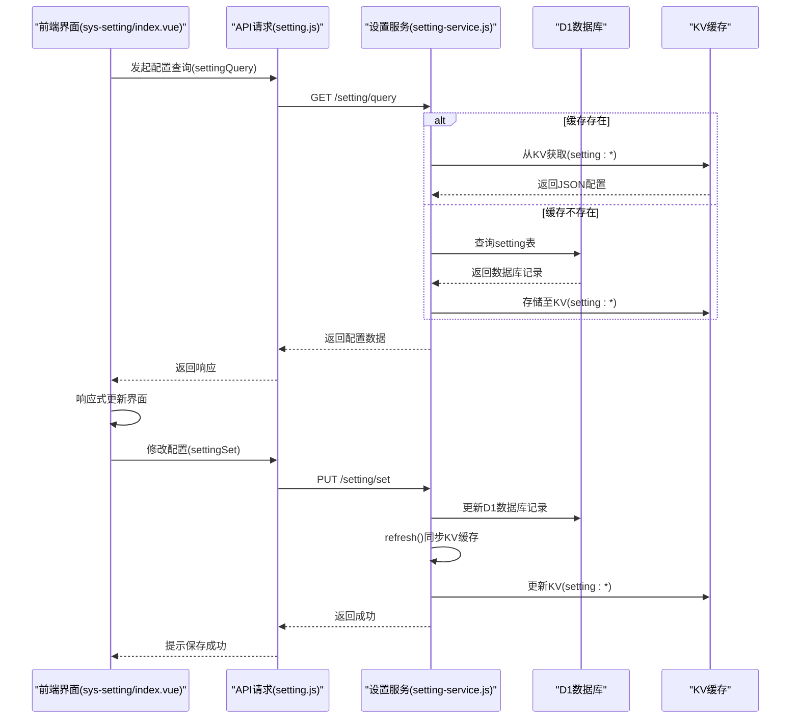
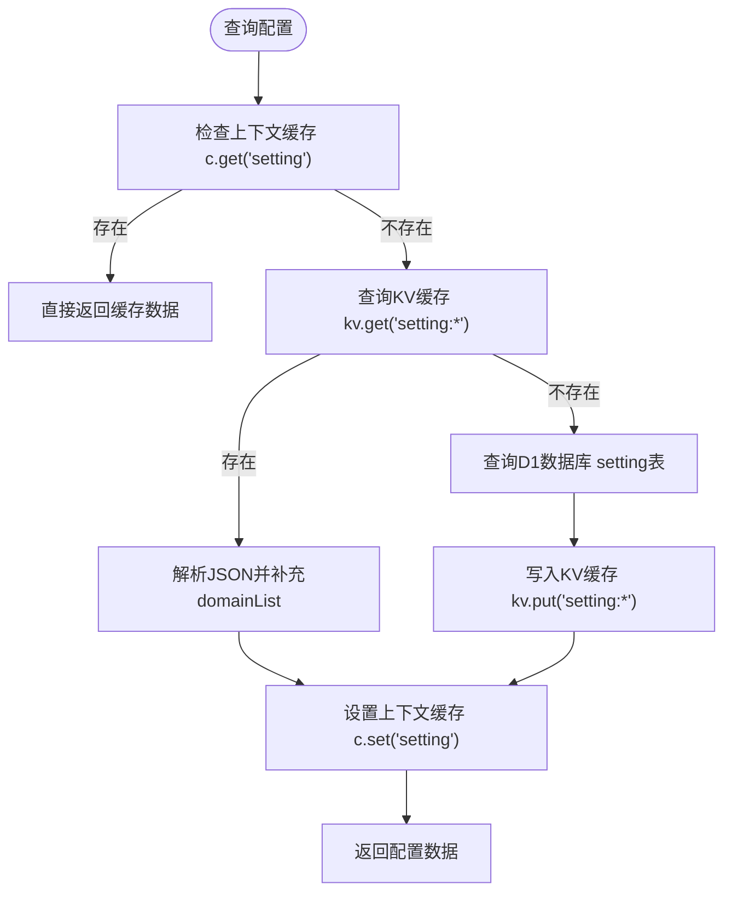
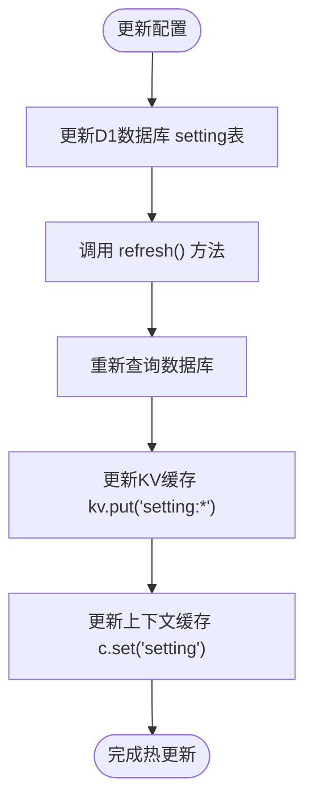

# 系统设置管理

<cite>
**本文档中引用的文件**  
- [sys-setting/index.vue](file://mail-vue/src/views/sys-setting/index.vue)
- [setting-service.js](file://mail-worker/src/service/setting-service.js)
- [setting.js](file://mail-worker/src/entity/setting.js)
- [init.js](file://mail-vue/src/init/init.js)
- [setting.js](file://mail-vue/src/request/setting.js)
- [kv-const.js](file://mail-worker/src/const/kv-const.js)
- [entity-const.js](file://mail-worker/src/const/entity-const.js)
</cite>

## 目录
1. [简介](#简介)
2. [项目结构](#项目结构)
3. [核心组件](#核心组件)
4. [架构概览](#架构概览)
5. [详细组件分析](#详细组件分析)
6. [依赖分析](#依赖分析)
7. [性能考虑](#性能考虑)
8. [故障排除指南](#故障排除指南)
9. [结论](#结论)

## 简介
`cloud-mail` 系统提供了一套完整的系统级设置管理功能，支持通过 `sys-setting/index.vue` 界面进行可视化配置。系统配置项涵盖系统标题、登录页背景图、注册开关、邮件发送速率限制等关键参数。配置数据通过 `setting-service.js` 写入 D1 数据库，并同步更新至 KV 缓存以实现热更新。`setting.js` 实体定义了键值对结构，系统启动时由 `init.js` 加载至前端。本文档全面阐述该系统的配置管理机制，包括默认值设定、数据类型校验、前端响应式更新、安全校验策略、冲突解决方法及远程同步与备份恢复能力。

## 项目结构

```mermaid
graph TB
subgraph "前端 (mail-vue)"
A[sys-setting/index.vue]
B[setting.js (request)]
C[init.js]
end
subgraph "后端 (mail-worker)"
D[setting-service.js]
E[setting.js (entity)]
F[kv-const.js]
G[entity-const.js]
end
A --> B --> D
C --> D
D --> E
D --> F
D --> G
```

**Diagram sources**  
- [sys-setting/index.vue](file://mail-vue/src/views/sys-setting/index.vue)
- [setting-service.js](file://mail-worker/src/service/setting-service.js)
- [setting.js](file://mail-worker/src/entity/setting.js)
- [init.js](file://mail-vue/src/init/init.js)

**Section sources**  
- [sys-setting/index.vue](file://mail-vue/src/views/sys-setting/index.vue)
- [setting-service.js](file://mail-worker/src/service/setting-service.js)
- [setting.js](file://mail-worker/src/entity/setting.js)
- [init.js](file://mail-vue/src/init/init.js)

## 核心组件

系统设置管理功能由前端界面、API 请求、后端服务与数据库实体共同构成。`sys-setting/index.vue` 提供用户交互界面，`setting-service.js` 处理业务逻辑与数据持久化，`setting.js` 定义数据结构，`init.js` 负责系统初始化时的配置加载。

**Section sources**  
- [sys-setting/index.vue](file://mail-vue/src/views/sys-setting/index.vue#L1-L1676)
- [setting-service.js](file://mail-worker/src/service/setting-service.js#L1-L181)
- [setting.js](file://mail-worker/src/entity/setting.js#L1-L45)
- [init.js](file://mail-vue/src/init/init.js#L1-L72)

## 架构概览



**Diagram sources**  
- [sys-setting/index.vue](file://mail-vue/src/views/sys-setting/index.vue#L1-L1676)
- [setting.js](file://mail-vue/src/request/setting.js#L1-L21)
- [setting-service.js](file://mail-worker/src/service/setting-service.js#L1-L181)

## 详细组件分析

### 系统设置界面分析

`sys-setting/index.vue` 是系统设置的主界面，采用 Vue 3 Composition API 和 Element Plus 组件库构建。界面分为多个功能卡片，支持以下配置项：

- **网站设置**：注册开关、登录域名、注册密钥、添加账户、多邮箱支持
- **个性化设置**：系统标题、登录框透明度、登录背景图
- **邮件设置**：接收邮件、自动刷新、发送邮件、无收件人发送
- **对象存储**：R2域名、S3配置
- **邮件推送**：Telegram机器人、其他邮箱、转发规则
- **验证码设置**：注册/添加邮箱验证、Site Key、Secret Key
- **通知设置**：通知弹窗、弹窗配置

所有配置项均通过 `v-model` 与 `setting` 对象双向绑定，实现响应式更新。

**Section sources**  
- [sys-setting/index.vue](file://mail-vue/src/views/sys-setting/index.vue#L1-L1676)

### 配置服务与数据持久化

`setting-service.js` 是核心服务层，负责配置的查询、更新和缓存同步。

#### 配置查询与缓存机制



**Diagram sources**  
- [setting-service.js](file://mail-worker/src/service/setting-service.js#L10-L38)

#### 配置更新与热刷新



**Diagram sources**  
- [setting-service.js](file://mail-worker/src/service/setting-service.js#L1-L181)

### 配置实体与数据结构

`setting.js` (entity) 使用 Drizzle ORM 定义了 `setting` 表的结构，采用键值对设计模式，每个配置项为一个独立字段。

| 配置项 | 字段名 | 数据类型 | 默认值 | 说明 |
|--------|--------|----------|--------|------|
| 系统标题 | title | text | '' | 网站显示标题 |
| 登录背景图 | background | text | null | 图片URL或R2路径 |
| 注册开关 | register | integer | 0 | 0=开启, 1=关闭 |
| 邮件发送限制 | send | integer | 1 | 0=开启, 1=关闭 |
| 登录框透明度 | loginOpacity | integer | 0.88 | 浮点数，0-1 |
| 自动刷新时间 | autoRefreshTime | integer | 0 | 秒数，0=关闭 |
| R2域名 | r2Domain | text | null | 对象存储自定义域名 |
| Telegram机器人状态 | tgBotStatus | integer | 1 | 0=开启, 1=关闭 |
| 转发规则类型 | ruleType | integer | 0 | 0=全部转发, 1=按规则 |

**Diagram sources**  
- [setting.js](file://mail-worker/src/entity/setting.js#L1-L45)

### 系统初始化与前端加载

`init.js` 在系统启动时负责加载配置并初始化应用状态。

```mermaid
flowchart TD
Start([系统初始化 init()]) --> CheckToken["检查本地Token"]
CheckToken --> |已登录| FetchData["并行请求: websiteConfig + loginUserInfo"]
CheckToken --> |未登录| FetchConfig["仅请求 websiteConfig"]
FetchData --> SetStore["将配置存入 Pinia Store"]
FetchConfig --> SetStore
SetStore --> SetTitle["设置 document.title"]
SetStore --> SetLang["设置 i18n 语言"]
SetStore --> AddRoutes["根据权限动态添加路由"]
AddRoutes --> RemoveLoading["移除启动加载动画"]
SetTitle --> RemoveLoading
```

**Diagram sources**  
- [init.js](file://mail-vue/src/init/init.js#L1-L72)

## 依赖分析

```mermaid
graph LR
A[sys-setting/index.vue] --> B[setting.js (request)]
B --> C[setting-service.js]
C --> D[setting.js (entity)]
C --> E[kv-const.js]
C --> F[entity-const.js]
C --> G[r2-service.js]
C --> H[orm.js]
I[init.js] --> C
I --> J[websiteConfig API]
```

**Diagram sources**  
- [sys-setting/index.vue](file://mail-vue/src/views/sys-setting/index.vue)
- [setting-service.js](file://mail-worker/src/service/setting-service.js)
- [setting.js](file://mail-worker/src/entity/setting.js)
- [init.js](file://mail-vue/src/init/init.js)

**Section sources**  
- [sys-setting/index.vue](file://mail-vue/src/views/sys-setting/index.vue#L1-L1676)
- [setting-service.js](file://mail-worker/src/service/setting-service.js#L1-L181)
- [setting.js](file://mail-worker/src/entity/setting.js#L1-L45)
- [init.js](file://mail-vue/src/init/init.js#L1-L72)

## 性能考虑

系统通过多层缓存机制优化性能：
1. **上下文缓存**：Hono 的 `c.get()` 和 `c.set()` 提供请求级缓存，避免重复查询。
2. **KV 缓存**：Cloudflare KV 提供持久化缓存，`setting:*** 键实现配置热更新。
3. **并行加载**：`init.js` 中使用 `Promise.all` 并行加载用户信息和网站配置，减少启动时间。
4. **惰性加载**：敏感配置（如 Secret Key）在 `get()` 方法中进行脱敏处理，仅在需要时返回完整信息。

## 故障排除指南

- **配置不生效**：检查 `setting-service.js` 的 `refresh()` 方法是否被正确调用，确认 KV 缓存已更新。
- **背景图上传失败**：确认 `r2` 绑定存在且 `r2Domain` 已配置，检查文件大小和格式。
- **页面加载缓慢**：检查网络请求，确认 `websiteConfig` 接口响应正常，排查 KV 或 D1 延迟。
- **配置项显示异常**：检查 `entity-const.js` 中的常量定义与前端 `$t()` 国际化键是否匹配。
- **热更新失效**：确保 `c.set('setting')` 和 `c.env.kv.put()` 在事务中正确执行，检查 Hono 上下文生命周期。

**Section sources**  
- [setting-service.js](file://mail-worker/src/service/setting-service.js#L1-L181)
- [setting.js](file://mail-worker/src/entity/setting.js#L1-L45)
- [init.js](file://mail-vue/src/init/init.js#L1-L72)

## 结论

`cloud-mail` 的系统设置管理功能设计合理，实现了配置的持久化、缓存化和热更新。通过 `D1 + KV` 的组合，兼顾了数据一致性与访问性能。前端响应式设计与后端服务解耦清晰，`init.js` 的初始化流程确保了应用状态的正确加载。整体架构具备良好的可维护性和扩展性，为系统的稳定运行提供了坚实基础。