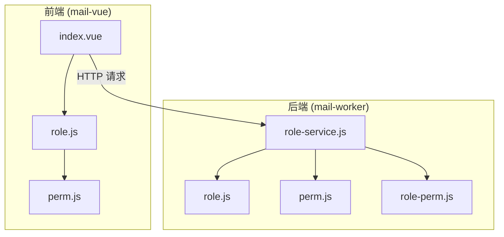
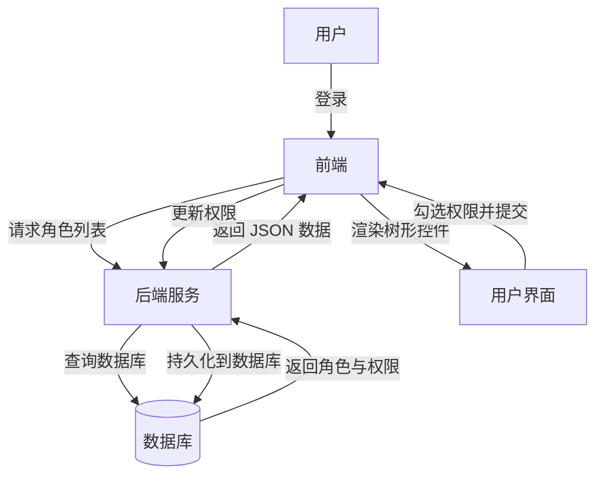
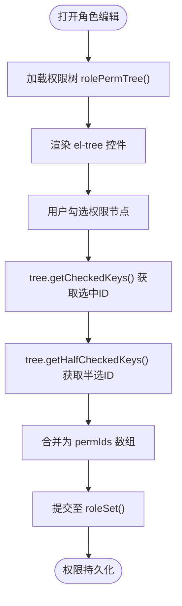
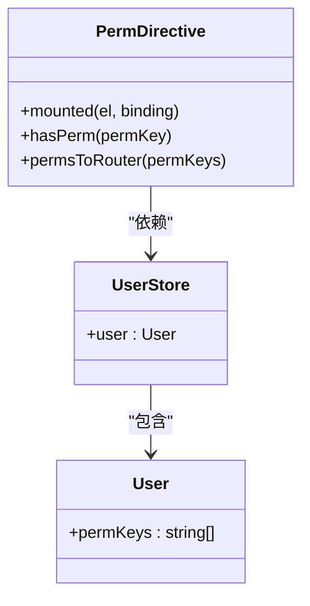
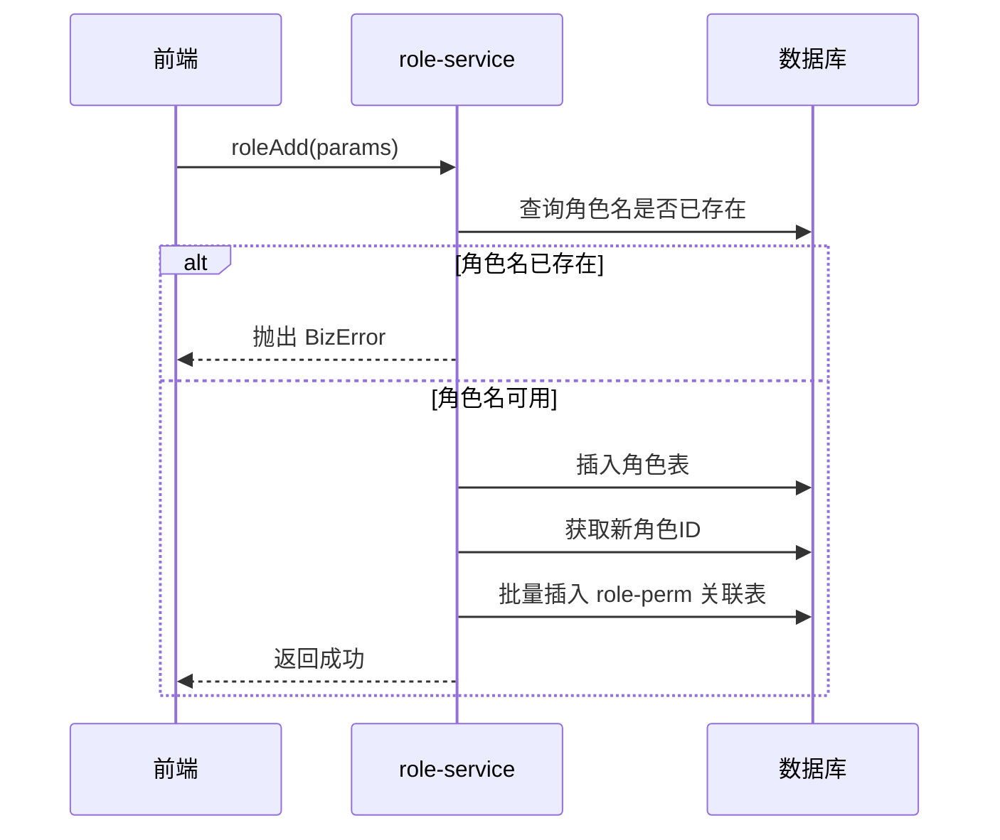
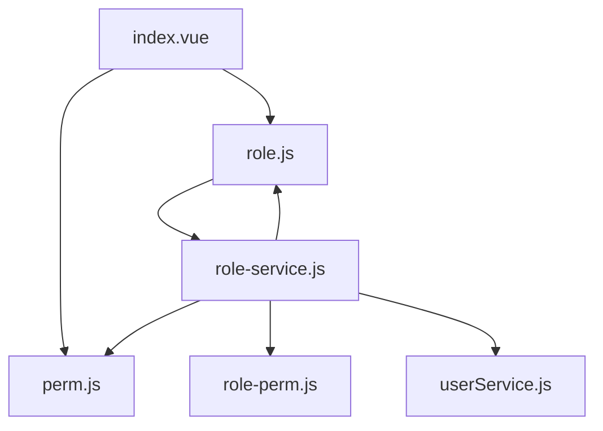

# 角色与权限管理

<cite>
**本文档引用的文件**
- [index.vue](file://mail-vue/src/views/role/index.vue)
- [role.js](file://mail-vue/src/request/role.js)
- [perm.js](file://mail-vue/src/perm/perm.js)
- [role.js](file://mail-worker/src/entity/role.js)
- [perm.js](file://mail-worker/src/entity/perm.js)
- [role-service.js](file://mail-worker/src/service/role-service.js)
</cite>

## 目录
1. [简介](#简介)
2. [项目结构](#项目结构)
3. [核心组件](#核心组件)
4. [架构概览](#架构概览)
5. [详细组件分析](#详细组件分析)
6. [依赖分析](#依赖分析)
7. [性能考虑](#性能考虑)
8. [故障排除指南](#故障排除指南)
9. [结论](#结论)

## 简介
本文档深入解析 cloud-mail 系统中基于 RBAC 模型的角色与权限管理系统。涵盖前端角色管理界面如何通过树形控件展示权限节点，支持动态勾选并提交至后端服务进行持久化；详述后端角色服务中角色创建、权限分配、继承机制的实现；解释权限码（perm code）的设计原则及其在前端 `v-perm` 指令中的校验流程；并提供权限粒度控制的最佳实践，包括页面级与按钮级权限的配置方法。同时，文档还涵盖角色循环依赖检测、权限继承冲突解决、超级管理员特殊处理等边界场景说明，以及权限变更后 KV 缓存更新策略。

## 项目结构
cloud-mail 项目采用前后端分离架构，前端基于 Vue3 + Vite 构建，后端使用 Hono 框架运行于 Cloudflare Workers 环境。权限管理功能主要分布在以下目录：

- `mail-vue/src/views/role/index.vue`：前端角色管理界面，提供角色列表展示、新增、编辑、删除及权限分配功能。
- `mail-vue/src/request/role.js`：前端 API 请求封装，定义与角色服务交互的 HTTP 接口。
- `mail-vue/src/perm/perm.js`：权限指令实现，包含 `v-perm` 自定义指令及权限校验逻辑。
- `mail-worker/src/entity/role.js` 和 `perm.js`：后端数据库实体定义，描述角色与权限的数据结构。
- `mail-worker/src/service/role-service.js`：核心业务逻辑，实现角色的增删改查、权限分配及用户角色继承等操作。

该结构体现了清晰的分层设计，前端负责交互与展示，后端负责数据处理与业务逻辑，确保系统的可维护性与扩展性。

**图示来源**
- [index.vue](file://mail-vue/src/views/role/index.vue#L0-L566)
- [role.js](file://mail-vue/src/request/role.js#L0-L30)
- [role-service.js](file://mail-worker/src/service/role-service.js#L0-L180)

**本节来源**
- [mail-vue/src/views/role/index.vue](file://mail-vue/src/views/role/index.vue)
- [mail-worker/src/service/role-service.js](file://mail-worker/src/service/role-service.js)

## 核心组件
系统的核心组件围绕角色（Role）与权限（Permission）展开，通过 `role-service.js` 实现业务逻辑，`index.vue` 提供用户界面，`perm.js` 实现前端权限控制。角色实体包含名称、描述、排序、默认标识及发送限制等属性；权限实体采用树形结构，支持父子层级关系，便于组织复杂权限体系。角色与权限通过中间表 `role-perm` 建立多对多映射关系，实现灵活的权限分配。

**本节来源**
- [role.js](file://mail-worker/src/entity/role.js#L0-L19)
- [perm.js](file://mail-worker/src/entity/perm.js#L0-L10)
- [role-service.js](file://mail-worker/src/service/role-service.js#L0-L180)

## 架构概览
系统采用标准的 RBAC（基于角色的访问控制）模型，用户通过角色间接获得权限。整体架构分为三层：表现层（Vue 前端）、服务层（Hono 后端）、数据层（SQLite 数据库）。前端通过 `role.js` 中的 API 方法与后端通信，后端 `role-service.js` 处理业务逻辑并操作数据库实体。权限码（如 `email:send`）作为权限的唯一标识，在前后端之间传递，确保权限校验的一致性。

**图示来源**
- [index.vue](file://mail-vue/src/views/role/index.vue#L0-L566)
- [role.js](file://mail-vue/src/request/role.js#L0-L30)
- [role-service.js](file://mail-worker/src/service/role-service.js#L0-L180)

## 详细组件分析

### 前端角色管理界面分析
`index.vue` 是角色管理的核心组件，使用 Element Plus 的 `el-table` 展示角色列表，并通过 `el-dialog` 弹窗进行角色的新增与编辑。权限分配通过 `el-tree` 树形控件实现，支持全选、半选状态，用户可直观地勾选所需权限节点。

#### 树形权限控件实现

**图示来源**
- [index.vue](file://mail-vue/src/views/role/index.vue#L0-L566)

#### 权限码与指令校验
前端通过 `v-perm` 指令实现细粒度权限控制。该指令在 `perm.js` 中定义，通过比对用户权限集合 `permKeys` 与指令传入的权限码（如 `'email:send'`），决定是否渲染对应 DOM 元素。若用户拥有 `*` 权限，则视为超级管理员，跳过所有校验。

**图示来源**
- [perm.js](file://mail-vue/src/perm/perm.js#L0-L121)

**本节来源**
- [index.vue](file://mail-vue/src/views/role/index.vue#L0-L566)
- [perm.js](file://mail-vue/src/perm/perm.js#L0-L121)

### 后端角色服务分析
`role-service.js` 是权限管理的业务核心，封装了角色的全生命周期管理。

#### 角色创建与权限分配流程

**图示来源**
- [role-service.js](file://mail-worker/src/service/role-service.js#L0-L180)

#### 权限继承与默认角色机制
系统支持通过设置默认角色实现权限继承。当用户未被显式分配角色时，将自动继承默认角色的权限。`setDefault` 方法确保系统中仅存在一个默认角色，`delete` 方法在删除角色时会将关联用户的角色重置为默认角色，防止权限丢失。

**本节来源**
- [role-service.js](file://mail-worker/src/service/role-service.js#L0-L180)

## 依赖分析
系统各组件间依赖关系清晰。前端 `index.vue` 依赖 `role.js` 进行 API 调用，并依赖 `perm.js` 实现权限指令。后端 `role-service.js` 依赖 `role`、`perm`、`role-perm` 三个实体进行数据库操作，并依赖 `userService` 处理用户角色更新。这种低耦合设计有利于模块独立开发与测试。

**图示来源**
- [index.vue](file://mail-vue/src/views/role/index.vue#L0-L566)
- [role.js](file://mail-vue/src/request/role.js#L0-L30)
- [role-service.js](file://mail-worker/src/service/role-service.js#L0-L180)

**本节来源**
- [role-service.js](file://mail-worker/src/service/role-service.js#L0-L180)

## 性能考虑
- **权限树缓存**：前端在组件初始化时一次性加载权限树 `rolePermTree`，避免频繁请求。
- **批量操作**：后端在分配权限时使用 `insert().values().run()` 批量插入 `role-perm` 表，提升数据库写入效率。
- **索引优化**：数据库应在 `role.name`、`perm.permKey`、`role-perm.roleId` 等字段建立索引，加速查询。

## 故障排除指南
- **权限不生效**：检查用户 `permKeys` 是否正确加载，确认 `v-perm` 指令传入的权限码与后端定义一致。
- **角色删除失败**：检查是否尝试删除默认角色，系统禁止删除默认角色以保证基础权限可用。
- **权限树为空**：确认后端 `/role/permTree` 接口返回数据正常，检查 `perm` 表中是否存在数据。
- **邮箱拦截规则无效**：检查 `banEmail` 字段格式是否正确，确保输入为有效邮箱、域名或通配符 `*`。

**本节来源**
- [role-service.js](file://mail-worker/src/service/role-service.js#L0-L180)
- [index.vue](file://mail-vue/src/views/role/index.vue#L0-L566)

## 结论
cloud-mail 的 RBAC 权限管理系统设计合理，实现了角色、权限、用户的高效管理。前端界面友好，支持树形权限分配；后端逻辑严谨，保障了数据一致性与系统稳定性。通过 `v-perm` 指令实现了细粒度的前端权限控制，结合默认角色机制，满足了多场景下的权限管理需求。建议未来可增加权限继承可视化、操作日志审计等功能，进一步提升系统安全性与可维护性。