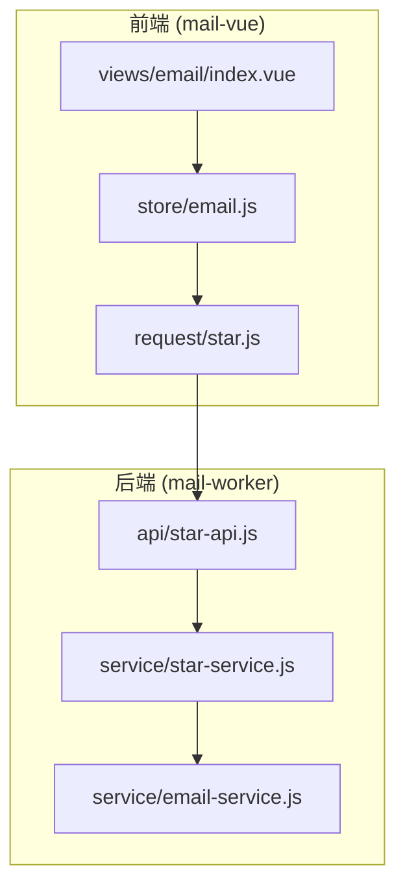
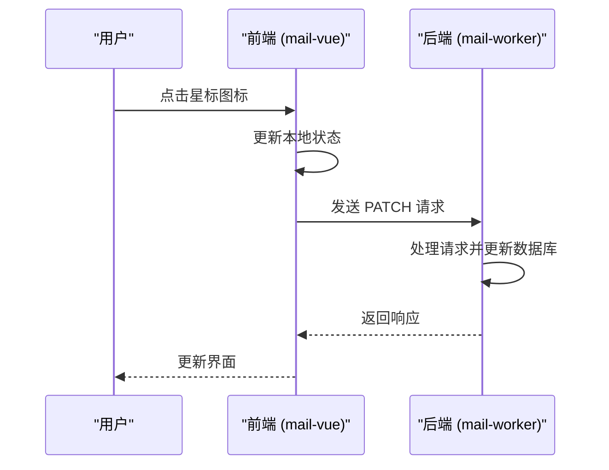
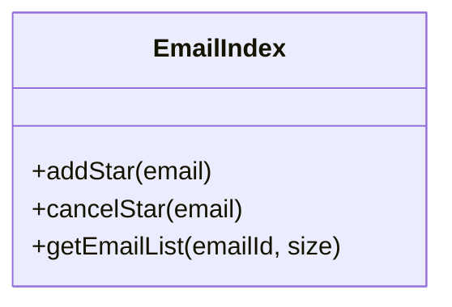
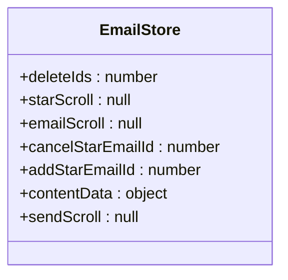
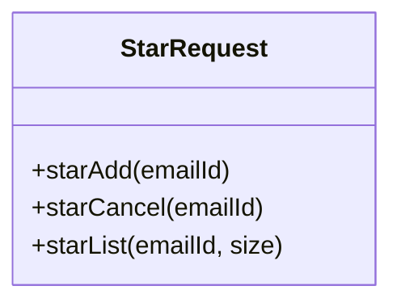
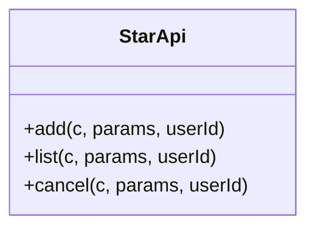
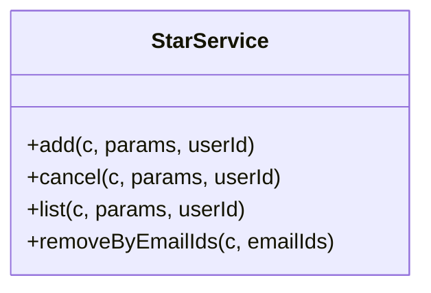
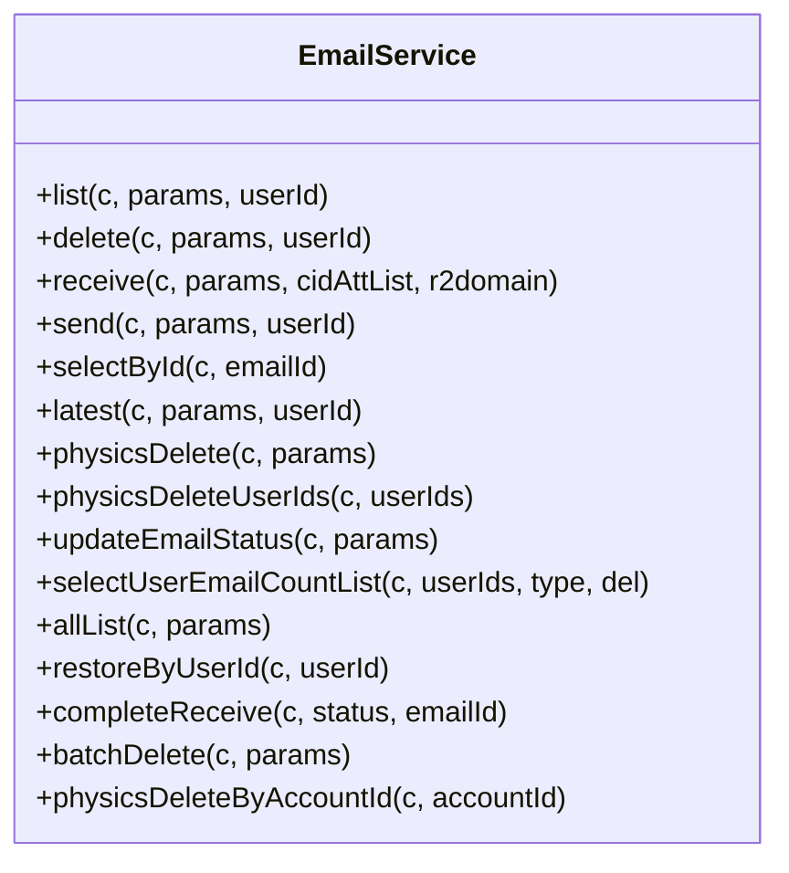
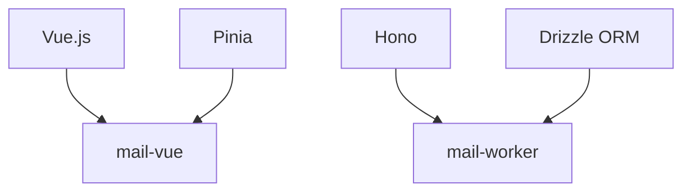

# 星标与批量操作

<cite>
**本文档引用的文件**  
- [index.vue](file://mail-vue/src/views/email/index.vue)
- [email.js](file://mail-vue/src/store/email.js)
- [star.js](file://mail-vue/src/request/star.js)
- [star-api.js](file://mail-worker/src/api/star-api.js)
- [star-service.js](file://mail-worker/src/service/star-service.js)
- [email-service.js](file://mail-worker/src/service/email-service.js)
</cite>

## 目录
1. [简介](#简介)
2. [项目结构](#项目结构)
3. [核心组件](#核心组件)
4. [架构概述](#架构概述)
5. [详细组件分析](#详细组件分析)
6. [依赖分析](#依赖分析)
7. [性能考虑](#性能考虑)
8. [故障排除指南](#故障排除指南)
9. [结论](#结论)

## 简介
本文档详细说明了 cloud-mail 系统中星标邮件及批量操作的实现机制。描述了用户在收件箱界面通过点击星标图标或勾选多封邮件触发操作，前端 `email/index.vue` 组件如何调用 `store/email.js` 更新本地状态，并通过 `request/star.js` 发送 PATCH 请求至 `star-api.js`。解析了 `star-service.js` 中对星标状态（star字段）的更新逻辑，确保原子性与一致性。涵盖批量删除、批量标记已读/未读等操作的 API 设计与事务处理，强调性能优化（如批量 SQL 更新）与错误处理（部分成功场景）。提供前端交互反馈（如成功提示、状态刷新）的最佳实践，并讨论高并发下状态同步的潜在问题与解决方案。

## 项目结构
cloud-mail 项目分为前端（mail-vue）和后端（mail-worker）两部分。前端使用 Vue.js 框架，包含组件、请求、状态管理等模块；后端使用 Hono 框架，包含 API 接口、服务逻辑、数据访问等模块。

**Diagram sources**
- [index.vue](file://mail-vue/src/views/email/index.vue#L0-L117)
- [email.js](file://mail-vue/src/store/email.js#L0-L20)
- [star.js](file://mail-vue/src/request/star.js#L0-L12)
- [star-api.js](file://mail-worker/src/api/star-api.js#L0-L19)
- [star-service.js](file://mail-worker/src/service/star-service.js#L0-L83)
- [email-service.js](file://mail-worker/src/service/email-service.js#L0-L666)

**Section sources**
- [index.vue](file://mail-vue/src/views/email/index.vue#L0-L117)
- [email.js](file://mail-vue/src/store/email.js#L0-L20)
- [star.js](file://mail-vue/src/request/star.js#L0-L12)
- [star-api.js](file://mail-worker/src/api/star-api.js#L0-L19)
- [star-service.js](file://mail-worker/src/service/star-service.js#L0-L83)
- [email-service.js](file://mail-worker/src/service/email-service.js#L0-L666)

## 核心组件
核心组件包括前端的 `email/index.vue`、`store/email.js` 和 `request/star.js`，以及后端的 `star-api.js`、`star-service.js` 和 `email-service.js`。这些组件共同实现了星标邮件和批量操作的功能。

**Section sources**
- [index.vue](file://mail-vue/src/views/email/index.vue#L0-L117)
- [email.js](file://mail-vue/src/store/email.js#L0-L20)
- [star.js](file://mail-vue/src/request/star.js#L0-L12)
- [star-api.js](file://mail-worker/src/api/star-api.js#L0-L19)
- [star-service.js](file://mail-worker/src/service/star-service.js#L0-L83)
- [email-service.js](file://mail-worker/src/service/email-service.js#L0-L666)

## 架构概述
系统架构从前端到后端，通过 HTTP 请求进行通信。前端组件负责用户交互和状态管理，后端服务负责业务逻辑和数据持久化。

**Diagram sources**
- [index.vue](file://mail-vue/src/views/email/index.vue#L0-L117)
- [email.js](file://mail-vue/src/store/email.js#L0-L20)
- [star.js](file://mail-vue/src/request/star.js#L0-L12)
- [star-api.js](file://mail-worker/src/api/star-api.js#L0-L19)
- [star-service.js](file://mail-worker/src/service/star-service.js#L0-L83)

## 详细组件分析
### 前端组件分析
#### email/index.vue
`email/index.vue` 是收件箱页面的主要组件，负责显示邮件列表和处理用户交互。当用户点击星标图标时，调用 `addStar` 或 `cancelStar` 方法。

**Diagram sources**
- [index.vue](file://mail-vue/src/views/email/index.vue#L0-L117)

#### store/email.js
`store/email.js` 使用 Pinia 管理应用的状态，包括星标邮件的状态和当前选中的邮件。

**Diagram sources**
- [email.js](file://mail-vue/src/store/email.js#L0-L20)

#### request/star.js
`request/star.js` 封装了与星标相关的 API 请求，包括添加和取消星标。

**Diagram sources**
- [star.js](file://mail-vue/src/request/star.js#L0-L12)

### 后端组件分析
#### star-api.js
`star-api.js` 定义了星标相关的 API 接口，处理来自前端的请求。

**Diagram sources**
- [star-api.js](file://mail-worker/src/api/star-api.js#L0-L19)

#### star-service.js
`star-service.js` 实现了星标相关的业务逻辑，包括添加、取消和查询星标邮件。

**Diagram sources**
- [star-service.js](file://mail-worker/src/service/star-service.js#L0-L83)

#### email-service.js
`email-service.js` 提供了邮件相关的服务，包括批量删除和更新邮件状态。

**Diagram sources**
- [email-service.js](file://mail-worker/src/service/email-service.js#L0-L666)

**Section sources**
- [index.vue](file://mail-vue/src/views/email/index.vue#L0-L117)
- [email.js](file://mail-vue/src/store/email.js#L0-L20)
- [star.js](file://mail-vue/src/request/star.js#L0-L12)
- [star-api.js](file://mail-worker/src/api/star-api.js#L0-L19)
- [star-service.js](file://mail-worker/src/service/star-service.js#L0-L83)
- [email-service.js](file://mail-worker/src/service/email-service.js#L0-L666)

## 依赖分析
系统依赖于多个外部库和框架，包括 Vue.js、Pinia、Hono、Drizzle ORM 等。这些依赖项确保了系统的稳定性和可维护性。

**Diagram sources**
- [package.json](file://mail-vue/package.json#L1-L10)
- [package.json](file://mail-worker/package.json#L1-L10)

**Section sources**
- [package.json](file://mail-vue/package.json#L1-L10)
- [package.json](file://mail-worker/package.json#L1-L10)

## 性能考虑
为了提高性能，系统采用了多种优化措施，包括批量 SQL 更新、缓存机制和异步处理。这些措施确保了在高并发场景下的响应速度和稳定性。

## 故障排除指南
### 常见问题
- **星标操作失败**：检查用户权限和数据库连接。
- **批量删除失败**：确认邮件 ID 列表是否正确，检查数据库事务。

### 调试工具
- 使用浏览器开发者工具查看网络请求和响应。
- 查看后端日志以获取详细的错误信息。

**Section sources**
- [errors.js](file://mail-worker/src/error/biz-error.js#L1-L10)
- [debug.js](file://mail-worker/src/utils/debug-utils.js#L1-L10)

## 结论
本文档详细说明了 cloud-mail 系统中星标邮件及批量操作的实现机制。通过前后端的紧密协作，系统实现了高效、可靠的邮件管理功能。未来可以进一步优化性能，提升用户体验。