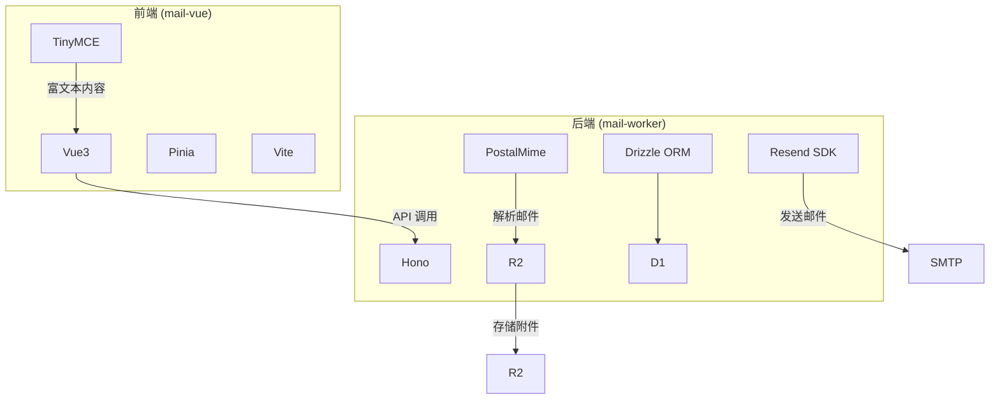
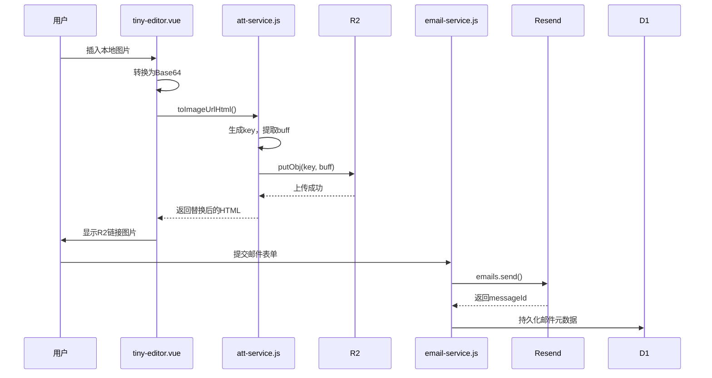
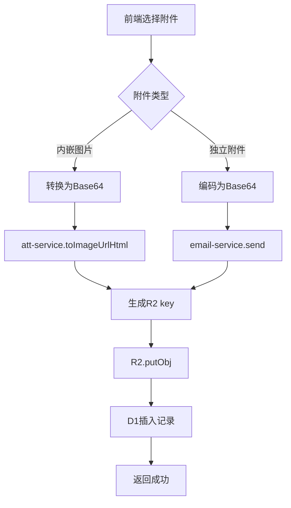
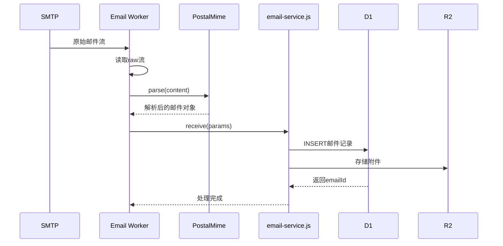

# 邮件功能

<cite>
**本文档引用的文件**  
- [tiny-editor.vue](file://mail-vue/src/components/tiny-editor/index.vue)
- [send.js](file://mail-vue/src/store/send.js)
- [email-service.js](file://mail-worker/src/service/email-service.js)
- [att-service.js](file://mail-worker/src/service/att-service.js)
- [star-api.js](file://mail-worker/src/api/star-api.js)
- [resend-service.js](file://mail-worker/src/service/resend-service.js)
- [email.js](file://mail-worker/src/email/email.js)
- [resend-api.js](file://mail-worker/src/api/resend-api.js)
</cite>

## 目录
1. [简介](#简介)
2. [项目结构](#项目结构)
3. [核心组件](#核心组件)
4. [邮件发送流程](#邮件发送流程)
5. [附件上传与管理](#附件上传与管理)
6. [邮件接收机制](#邮件接收机制)
7. [星标与批量操作](#星标与批量操作)
8. [高级实践与错误处理](#高级实践与错误处理)
9. [结论](#结论)

## 简介
本项目 `cloud-mail` 是一个基于 Vue 前端与 Hono 后端的现代化邮件系统，支持富文本编辑、附件上传、R2 存储集成、Resend 邮件服务调用以及 D1 数据库持久化。系统从前端 TinyMCE 编辑器集成开始，贯穿邮件编写、发送、接收、存储、状态更新等完整生命周期。本文档深入解析其全流程，涵盖前后端交互、MIME 构建、内嵌图片处理、Webhook 回调、权限控制等关键机制。

## 项目结构
项目分为两个主要模块：`mail-vue` 为前端应用，基于 Vue3 + Pinia + Vite 构建；`mail-worker` 为后端服务，运行于 Cloudflare Workers 环境，使用 Hono 框架处理 HTTP 请求与邮件接收事件。

**图示来源**  
- [tiny-editor.vue](file://mail-vue/src/components/tiny-editor/index.vue)
- [email-service.js](file://mail-worker/src/service/email-service.js)
- [att-service.js](file://mail-worker/src/service/att-service.js)

**本节来源**  
- [mail-vue/src/components/tiny-editor/index.vue](file://mail-vue/src/components/tiny-editor/index.vue)
- [mail-worker/src/service/email-service.js](file://mail-worker/src/service/email-service.js)

## 核心组件
系统核心组件包括前端富文本编辑器 `tiny-editor.vue`、邮件发送服务 `email-service.js`、附件处理服务 `att-service.js`、星标 API `star-api.js` 以及邮件接收处理器 `email.js`。这些组件协同工作，实现完整的邮件功能闭环。

**本节来源**  
- [tiny-editor.vue](file://mail-vue/src/components/tiny-editor/index.vue)
- [email-service.js](file://mail-worker/src/service/email-service.js)
- [att-service.js](file://mail-worker/src/service/att-service.js)
- [star-api.js](file://mail-worker/src/api/star-api.js)

## 邮件发送流程
邮件发送流程从前端用户在 `tiny-editor.vue` 中编写 HTML 邮件开始，经由 `send.js` 触发 API 调用，最终由后端 `email-service.js` 完成构建与发送。

### 富文本编辑与内嵌图片处理
`tiny-editor.vue` 集成 TinyMCE 编辑器，支持用户插入图片。当用户上传图片时，前端通过 `file_picker_callback` 回调将图片压缩后转换为 Base64 数据 URL。随后，`att-service.js` 的 `toImageUrlHtml` 方法识别这些 `data:image` 链接，生成唯一键名并上传至 R2 存储，同时将 HTML 中的图片链接替换为 R2 域名路径。

**图示来源**  
- [tiny-editor.vue](file://mail-vue/src/components/tiny-editor/index.vue#L180-L230)
- [att-service.js](file://mail-worker/src/service/att-service.js#L45-L85)
- [email-service.js](file://mail-worker/src/service/email-service.js#L196-L330)

**本节来源**  
- [tiny-editor.vue](file://mail-vue/src/components/tiny-editor/index.vue)
- [att-service.js](file://mail-worker/src/service/att-service.js)
- [email-service.js](file://mail-worker/src/service/email-service.js)

## 附件上传与管理
系统支持两种附件：正文内嵌图片（CID）和独立附件。前端通过分片或 Base64 编码上传，后端统一由 `att-service.js` 处理。

### 附件上传流程
1. 前端将附件内容编码为 Base64。
2. 调用 `email-service.js` 的发送接口，携带附件数组。
3. 服务端调用 `saveSendAtt` 方法，计算哈希生成唯一键名，存入 D1 数据库。
4. 同时调用 `r2-service.js` 将二进制数据上传至 R2。
5. 发送成功后，附件信息与邮件记录关联。

**图示来源**  
- [att-service.js](file://mail-worker/src/service/att-service.js#L87-L135)
- [email-service.js](file://mail-worker/src/service/email-service.js#L264-L330)

**本节来源**  
- [att-service.js](file://mail-worker/src/service/att-service.js)
- [email-service.js](file://mail-worker/src/service/email-service.js)

## 邮件接收机制
系统通过 Cloudflare Email Worker 接收原始邮件流，由 `email.js` 处理器解析并持久化。

### 接收与解析流程
1. `email.js` 监听 `email(message, env, ctx)` 入口。
2. 读取 `message.raw` 流并解码为字符串。
3. 使用 `postal-mime` 库解析 MIME 结构，提取发件人、收件人、主题、正文、附件等。
4. 查询收件账户，验证接收权限。
5. 调用 `email-service.receive()` 将邮件元数据存入 D1。
6. 若有附件，调用 `att-service.addAtt()` 存储至 R2。

此外，系统通过 `/webhooks` 端点接收 Resend 的投递状态事件（如已送达、退信、投诉等），由 `resend-service.js` 更新邮件状态。

**图示来源**  
- [email.js](file://mail-worker/src/email/email.js#L0-L53)
- [resend-api.js](file://mail-worker/src/api/resend-api.js#L0-L9)
- [resend-service.js](file://mail-worker/src/service/resend-service.js#L0-L45)

**本节来源**  
- [email.js](file://mail-worker/src/email/email.js)
- [resend-api.js](file://mail-worker/src/api/resend-api.js)
- [resend-service.js](file://mail-worker/src/service/resend-service.js)

## 星标与批量操作
系统提供星标、批量删除、搜索过滤等功能，增强用户体验。

### 星标操作流程
1. 前端调用 `/star/add` 或 `/star/cancel`。
2. `star-api.js` 接收请求，获取用户 ID。
3. 调用 `star-service.js` 在数据库中插入或删除星标记录。
4. 列表查询时通过左连接 `star` 表判断是否已星标。

批量删除通过 `/email/delete` 接口，传入邮件 ID 列表，服务端更新 `isDel` 标志为删除状态。搜索功能由 `email-service.js` 的 `allList` 方法实现，支持按发件人、收件人、主题、时间范围等条件模糊查询。

**本节来源**  
- [star-api.js](file://mail-worker/src/api/star-api.js)
- [email-service.js](file://mail-worker/src/service/email-service.js#L0-L666)

## 高级实践与错误处理
系统在设计上考虑了多种高级场景与容错机制。

### 发送失败重试策略
系统本身未实现自动重试，但通过 Webhook 机制可感知投递状态。建议在外部监控系统中监听 `email.bounced` 或 `email.delivery_delayed` 事件，触发人工或自动化重试流程。

### 大附件上传优化
所有附件均通过 R2 存储，避免 Workers 内存限制。前端应限制单个附件大小，服务端通过 `r2Service.hasOSS()` 验证存储配置完整性，确保上传链路畅通。

### 垃圾邮件识别建议
系统未内置垃圾邮件识别，但可通过以下方式增强：
- 验证发件人域名 SPF/DKIM 记录。
- 集成第三方反垃圾服务（如 SpamAssassin）。
- 设置接收规则（`ruleEmail`, `ruleType`）过滤特定发件人。

### 典型错误码处理
| 错误码 | 错误信息 | 处理建议 |
|--------|--------|--------|
| 403 | disabledSend | 检查系统设置中邮件发送是否被禁用 |
| 403 | bannedSend | 用户角色被禁止发送邮件 |
| 403 | noDomainPermSend | 用户无权使用该发件域名 |
| - | noResendToken | 检查 Resend API 密钥配置 |
| - | notExistEmailReply | 回复的原始邮件不存在或已被删除 |

**本节来源**  
- [email-service.js](file://mail-worker/src/service/email-service.js)
- [resend-service.js](file://mail-worker/src/service/resend-service.js)

## 结论
`cloud-mail` 系统通过前后端紧密协作，实现了功能完整的邮件服务。从前端富文本编辑到后端 MIME 构建、R2 存储、Resend 发送、D1 持久化，再到 Webhook 状态回传，整个流程设计清晰、职责分明。系统具备良好的扩展性与健壮性，适合在 Cloudflare 平台上稳定运行。未来可进一步增强垃圾邮件过滤、邮件加密、多语言支持等特性，提升整体安全性与用户体验。