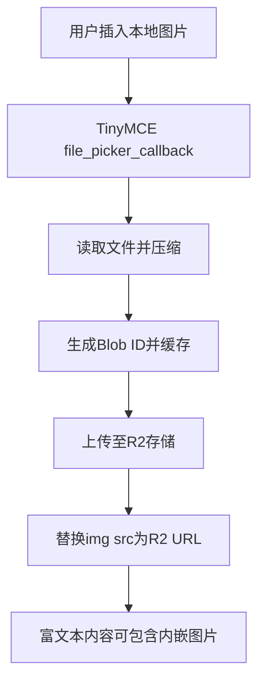
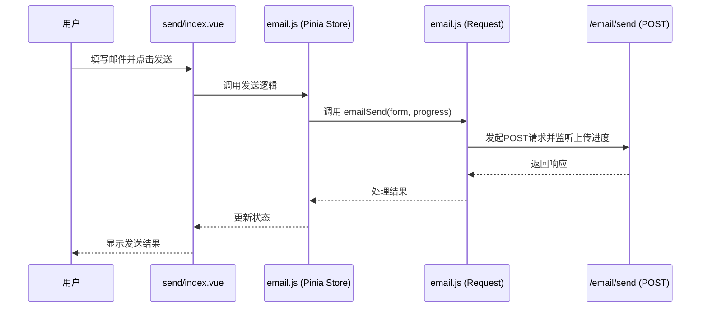
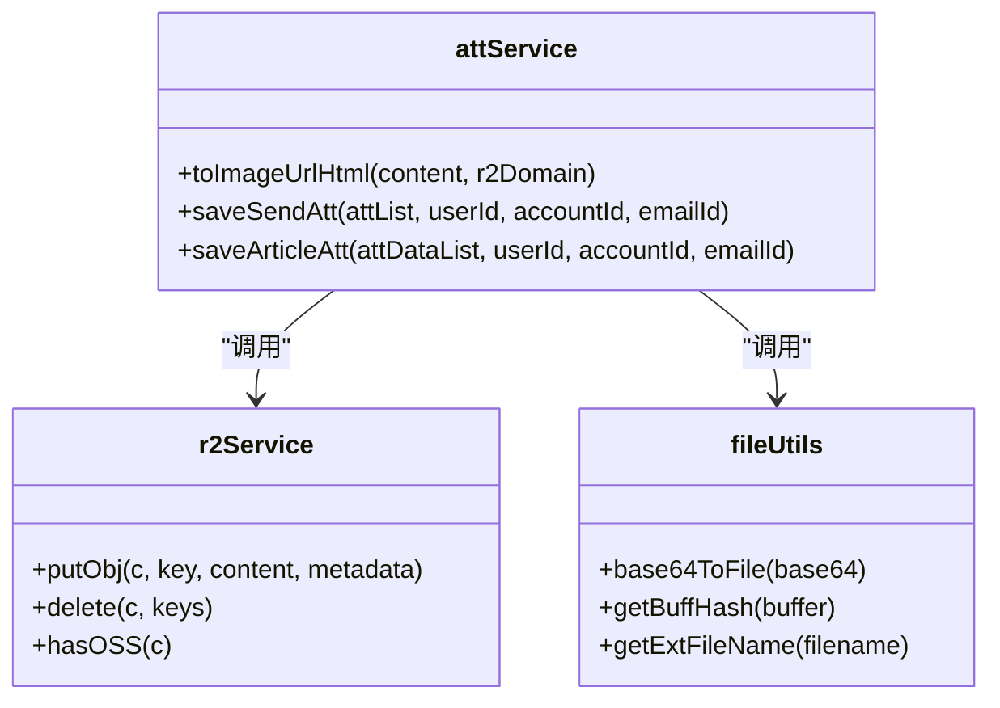

# 邮件发送

<cite>
**本文档中引用的文件**  
- [tiny-editor/index.vue](file://mail-vue/src/components/tiny-editor/index.vue)
- [send/index.vue](file://mail-vue/src/views/send/index.vue)
- [email.js](file://mail-vue/src/request/email.js)
- [email.js](file://mail-vue/src/store/email.js)
- [email-api.js](file://mail-worker/src/api/email-api.js)
- [email-service.js](file://mail-worker/src/service/email-service.js)
- [resend-service.js](file://mail-worker/src/service/resend-service.js)
- [att-service.js](file://mail-worker/src/service/att-service.js)
- [r2-service.js](file://mail-worker/src/service/r2-service.js)
</cite>

## 目录
1. [简介](#简介)
2. [前端富文本编辑与图片上传](#前端富文本编辑与图片上传)
3. [邮件发送请求流程](#邮件发送请求流程)
4. [后端邮件服务处理逻辑](#后端邮件服务处理逻辑)
5. [权限校验与配额控制](#权限校验与配额控制)
6. [附件与内嵌图片处理](#附件与内嵌图片处理)
7. [邮件发送与状态更新](#邮件发送与状态更新)
8. [错误处理与前端响应](#错误处理与前端响应)
9. [总结](#总结)

## 简介
本文详细阐述 cloud-mail 系统中邮件发送的完整流程。从用户在前端界面填写收件人、主题和正文开始，到邮件通过 Resend API 成功发送并持久化至数据库的全过程。涵盖前端 TinyMCE 编辑器集成、内嵌图片上传至 R2 存储并替换为 CID 引用、Pinia 状态管理、HTTP 请求发起、后端业务逻辑处理、权限校验、附件管理及错误反馈等关键环节。

## 前端富文本编辑与图片上传
系统使用 TinyMCE 富文本编辑器支持 HTML 内容编辑。用户在 `tiny-editor.vue` 组件中编辑内容时，可插入本地图片。当用户选择图片后，系统会触发 `file_picker_callback` 回调函数，读取文件并压缩后上传至 R2 存储。

上传过程中，系统生成唯一 Blob ID，并通过 TinyMCE 的 `blobCache` 缓存机制管理图片资源。上传成功后，图片的 `src` 属性被替换为指向 R2 的 URL，从而实现内嵌图片的在线展示。



**Diagram sources**
- [tiny-editor/index.vue](file://mail-vue/src/components/tiny-editor/index.vue#L180-L220)

**Section sources**
- [tiny-editor/index.vue](file://mail-vue/src/components/tiny-editor/index.vue#L1-L233)

## 邮件发送请求流程
用户在 `send/index.vue` 页面填写完邮件信息后，点击发送按钮。前端通过 Pinia 的 `email.js` store 调用 `request/email.js` 中的 `emailSend` 方法发起 POST 请求至 `/email/send` 接口。

该请求携带邮件表单数据（包括收件人、主题、正文、附件等）以及上传进度回调函数，用于实时反馈上传状态。



**Diagram sources**
- [send/index.vue](file://mail-vue/src/views/send/index.vue#L1-L82)
- [email.js](file://mail-vue/src/store/email.js#L1-L22)
- [email.js](file://mail-vue/src/request/email.js#L1-L22)

**Section sources**
- [send/index.vue](file://mail-vue/src/views/send/index.vue#L1-L82)
- [email.js](file://mail-vue/src/store/email.js#L1-L22)
- [email.js](file://mail-vue/src/request/email.js#L1-L22)

## 后端邮件服务处理逻辑
后端通过 Hono 框架监听 `/email/send` 路由，由 `email-api.js` 接收请求并调用 `email-service.js` 中的 `send` 方法处理业务逻辑。

核心流程包括：
1. 参数解析与基础校验
2. 获取系统设置（如 Resend Token、R2 域名）
3. 用户身份与角色权限验证
4. 发送配额检查（按日或总量限制）
5. 构建符合 RFC 标准的 MIME 邮件内容
6. 调用 Resend API 发送邮件
7. 将邮件元数据持久化至 D1 数据库

```mermaid
flowchart TD
A[/email/send POST] --> B[email-api.js]
B --> C[email-service.js send()]
C --> D[权限与配额校验]
D --> E{校验通过?}
E --> |否| F[抛出BizError]
E --> |是| G[构建邮件内容]
G --> H[调用Resend API]
H --> I{发送成功?}
I --> |否| J[抛出错误]
I --> |是| K[持久化邮件数据]
K --> L[更新用户发送计数]
L --> M[返回成功结果]
```

**Diagram sources**
- [email-api.js](file://mail-worker/src/api/email-api.js#L1-L32)
- [email-service.js](file://mail-worker/src/service/email-service.js#L1-L667)

**Section sources**
- [email-api.js](file://mail-worker/src/api/email-api.js#L1-L32)
- [email-service.js](file://mail-worker/src/service/email-service.js#L1-L667)

## 权限校验与配额控制
系统在发送前执行严格的权限控制。首先检查全局发送功能是否启用，随后验证当前用户角色是否被禁止发送。

若角色配置了发送限制（`sendCount`），系统会检查用户当日或累计发送量是否超出配额。若超出，则抛出 403 错误，前端据此提示“日发送额度不足”或“总发送额度不足”。

此外，系统还校验发件账户归属权及域名权限，确保用户只能使用授权域名发送邮件。

**Section sources**
- [email-service.js](file://mail-worker/src/service/email-service.js#L100-L150)

## 附件与内嵌图片处理
对于正文中内嵌的 Base64 图片，系统通过 `att-service.js` 的 `toImageUrlHtml` 方法提取并转换。每张图片生成唯一 Key，上传至 R2 存储，并将 HTML 中的 `src` 替换为 R2 的 URL。

该过程同时生成附件元数据列表，后续随邮件一并保存至数据库。对于手动添加的大附件，同样先上传至 R2，再通过 Resend API 的 `attachments` 字段嵌入邮件。



**Diagram sources**
- [att-service.js](file://mail-worker/src/service/att-service.js#L1-L203)
- [r2-service.js](file://mail-worker/src/service/r2-service.js#L1-L47)
- [file-utils.js](file://mail-vue/src/utils/file-utils.js#L1-L20)

**Section sources**
- [att-service.js](file://mail-worker/src/service/att-service.js#L1-L203)

## 邮件发送与状态更新
邮件通过 Resend API 发送成功后，系统将邮件关键信息（发件人、收件人、主题、HTML 内容、Resend 邮件 ID 等）写入 D1 数据库的 `email` 表。同时，关联的附件信息也存入 `attachments` 表。

系统还通过 KV 存储记录每日发送总量，用于配额统计。若为分批发送（`manyType=divide`），则为每个收件人生成独立的邮件记录。

**Section sources**
- [email-service.js](file://mail-worker/src/service/email-service.js#L250-L350)

## 错误处理与前端响应
后端使用 `BizError` 统一抛出业务异常，如配额超限（403）、无权限、附件配置缺失等。Hono 中间件捕获这些异常并返回标准化 JSON 响应。

前端根据 HTTP 状态码和错误信息进行差异化提示。例如，403 触发“发送权限受限”提示，500 则显示“发送失败，请重试”。上传进度回调也用于展示大附件上传状态，提升用户体验。

**Section sources**
- [email-service.js](file://mail-worker/src/service/email-service.js#L80-L95)
- [email.js](file://mail-vue/src/request/email.js#L1-L22)

## 总结
cloud-mail 的邮件发送流程实现了从前端交互到后端服务的完整闭环。通过 TinyMCE 与 R2 的集成，支持富文本与内嵌图片；通过 Pinia 与 Axios 的协作，确保请求可靠发起；通过精细化的权限与配额控制，保障系统安全；最终借助 Resend API 与 D1 数据库，完成邮件的高效发送与持久化存储。整个流程设计合理，具备良好的可维护性与扩展性。