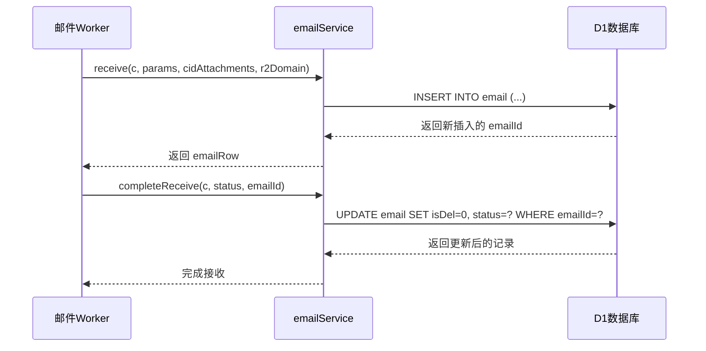
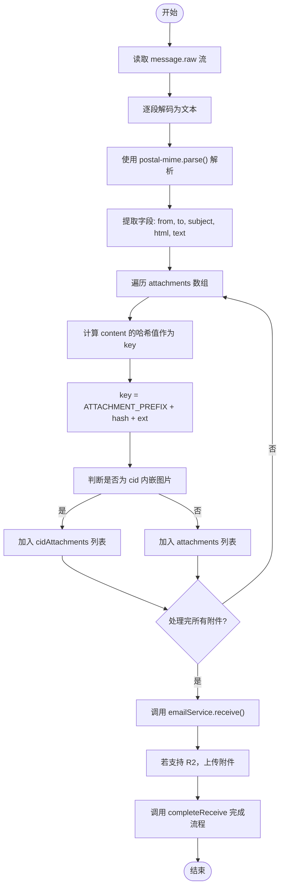
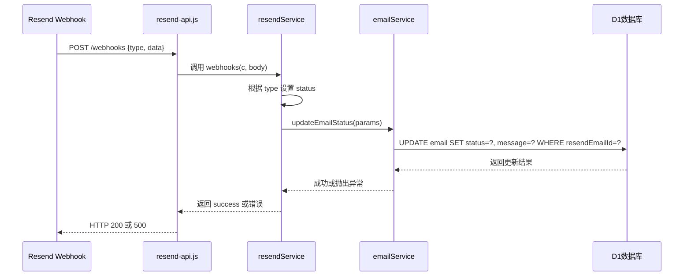
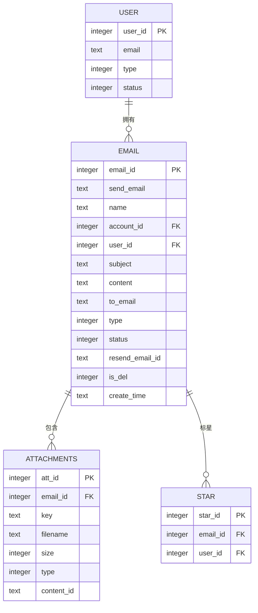
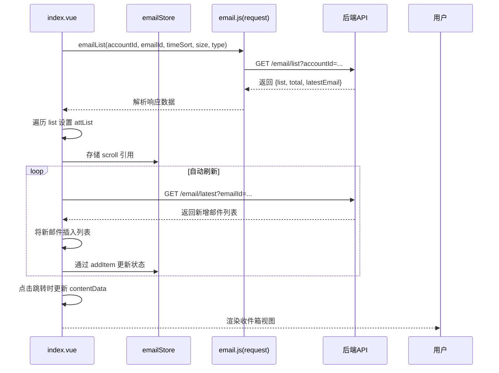

# 邮件接收

<cite>
**本文档中引用的文件**  
- [email.js](file://mail-worker/src/email/email.js)
- [email-service.js](file://mail-worker/src/service/email-service.js)
- [entity-const.js](file://mail-worker/src/const/entity-const.js)
- [email.js](file://mail-worker/src/entity/email.js)
- [resend-api.js](file://mail-worker/src/api/resend-api.js)
- [resend-service.js](file://mail-worker/src/service/resend-service.js)
- [index.vue](file://mail-vue/src/views/email/index.vue)
- [email.js](file://mail-vue/src/store/email.js)
- [email.js](file://mail-vue/src/request/email.js)
</cite>

## 目录
1. [引言](#引言)
2. [邮件接收机制概述](#邮件接收机制概述)
3. [核心处理流程](#核心处理流程)
4. [邮件状态同步与事件处理](#邮件状态同步与事件处理)
5. [邮件列表查询接口设计](#邮件列表查询接口设计)
6. [前端收件箱渲染逻辑](#前端收件箱渲染逻辑)
7. [数据持久化与去重策略](#数据持久化与去重策略)
8. [异常处理与排查指南](#异常处理与排查指南)
9. [结论](#结论)

## 引言
本文件全面解析 cloud-mail 系统的邮件接收机制，涵盖从外部邮件接入、内容解析、数据持久化到前端展示的完整流程。重点分析基于 Resend Inbound Webhook 的接收逻辑，深入探讨 `email-service.js` 中 `receive` 和 `completeReceive` 方法的实现细节，并结合 Mermaid 流程图展示数据流转过程。同时说明邮件列表查询接口的设计原理及前端视图的数据消费方式。

## 邮件接收机制概述

```mermaid
flowchart TD
A[外部邮件到达] --> B{接收功能是否开启?}
B -- 否 --> C[拒绝邮件]
B -- 是 --> D[读取原始邮件流]
D --> E[使用 postal-mime 解析]
E --> F[提取发件人/主题/正文]
F --> G[处理内嵌图片与附件]
G --> H[调用 receive 方法写入临时记录]
H --> I[上传附件至 R2]
I --> J[调用 completeReceive 更新状态]
J --> K[触发 Telegram 转发?]
K -- 是 --> L[发送 Telegram 消息]
K -- 否 --> M[结束]
J --> N[启用邮箱转发?]
N -- 是 --> O[调用 message.forward()]
N -- 否 --> M
```

**图示来源**  
- [email.js](file://mail-worker/src/email/email.js#L19-L225)

**本节来源**  
- [email.js](file://mail-worker/src/email/email.js#L19-L225)
- [entity-const.js](file://mail-worker/src/const/entity-const.js#L46-L58)

## 核心处理流程

### receive 与 completeReceive 方法分析



**图示来源**  
- [email-service.js](file://mail-worker/src/service/email-service.js#L226-L236)
- [email-service.js](file://mail-worker/src/service/email-service.js#L648-L657)

**本节来源**  
- [email-service.js](file://mail-worker/src/service/email-service.js#L226-L236)
- [email-service.js](file://mail-worker/src/service/email-service.js#L648-L657)
- [email.js](file://mail-worker/src/email/email.js#L19-L225)

### 邮件解析与附件处理



**图示来源**  
- [email.js](file://mail-worker/src/email/email.js#L19-L225)
- [email-service.js](file://mail-worker/src/service/email-service.js#L226-L236)

**本节来源**  
- [email.js](file://mail-worker/src/email/email.js#L19-L225)
- [email-service.js](file://mail-worker/src/service/email-service.js#L226-L236)
- [file-utils.js](file://mail-worker/src/utils/file-utils.js)

## 邮件状态同步与事件处理



**图示来源**  
- [resend-api.js](file://mail-worker/src/api/resend-api.js#L1-L10)
- [resend-service.js](file://mail-worker/src/service/resend-service.js#L1-L46)

**本节来源**  
- [resend-api.js](file://mail-worker/src/api/resend-api.js#L1-L10)
- [resend-service.js](file://mail-worker/src/service/resend-service.js#L1-L46)
- [email-service.js](file://mail-worker/src/service/email-service.js#L473-L482)
- [entity-const.js](file://mail-worker/src/const/entity-const.js#L46-L58)

## 邮件列表查询接口设计



**图示来源**  
- [email.js](file://mail-worker/src/entity/email.js#L1-L27)
- [att.js](file://mail-worker/src/entity/att.js#L1-L19)
- [star.js](file://mail-worker/src/entity/star.js)

**本节来源**  
- [email-service.js](file://mail-worker/src/service/email-service.js#L32-L103)
- [email-service.js](file://mail-worker/src/service/email-service.js#L542-L592)
- [email-api.js](file://mail-worker/src/api/email-api.js#L1-L10)
- [all-email-api.js](file://mail-worker/src/api/all-email-api.js#L1-L17)

## 前端收件箱渲染逻辑



**图示来源**  
- [index.vue](file://mail-vue/src/views/email/index.vue#L1-L117)
- [email.js](file://mail-vue/src/request/email.js#L2-L4)
- [email.js](file://mail-vue/src/store/email.js#L1-L21)

**本节来源**  
- [index.vue](file://mail-vue/src/views/email/index.vue#L1-L117)
- [email.js](file://mail-vue/src/request/email.js#L2-L4)
- [email.js](file://mail-vue/src/store/email.js#L1-L21)
- [email-service.js](file://mail-worker/src/service/email-service.js#L32-L103)

## 数据持久化与去重策略

### 数据库表结构与状态字段

| 字段名 | 类型 | 默认值 | 说明 |
|-------|------|--------|------|
| emailId | INTEGER | 自增主键 | 邮件唯一标识 |
| sendEmail | TEXT | NULL | 发件人邮箱 |
| name | TEXT | NULL | 发件人姓名 |
| subject | TEXT | NULL | 邮件主题 |
| content | TEXT | NULL | HTML 正文 |
| text | TEXT | NULL | 纯文本正文 |
| recipient | TEXT | [] | 收件人列表(JSON) |
| toEmail | TEXT | '' | 主要收件邮箱 |
| type | INTEGER | 0 | 0=接收, 1=发送 |
| status | INTEGER | 6 | 0=已接收, 6=保存中, 7=无账户 |
| isDel | INTEGER | 0 | 0=正常, 1=逻辑删除 |
| createTime | TEXT | CURRENT_TIMESTAMP | 创建时间 |

**本节来源**  
- [email.js](file://mail-worker/src/entity/email.js#L1-L27)
- [entity-const.js](file://mail-worker/src/const/entity-const.js#L46-L58)

### 去重与垃圾邮件识别建议

系统通过以下机制实现基础去重与安全控制：

1. **Message-ID 唯一性检查**：利用 `messageId` 字段防止重复入库（需扩展唯一索引）
2. **账户存在性验证**：通过 `accountService.selectByEmailIncludeDel` 验证收件账户
3. **域名权限控制**：`roleService.hasAvailDomainPerm` 限制可接收的域名
4. **黑名单过滤**：
   - 支持邮箱地址精确匹配
   - 支持域名级别屏蔽
   - 支持通配符 `*` 全局禁用
5. **内容净化策略**：
   - `banEmailType=CONTENT`：保留邮件但清除正文与附件
   - `banEmailType=ALL`：直接拒绝接收

建议增强垃圾邮件识别：
- 引入 SPF/DKIM/DMARC 验证
- 添加基于内容的评分系统
- 实现机器学习分类模型
- 集成第三方反垃圾服务 API

**本节来源**  
- [email.js](file://mail-worker/src/email/email.js#L19-L225)
- [role-service.js](file://mail-worker/src/service/role-service.js)
- [entity-const.js](file://mail-worker/src/const/entity-const.js#L23-L34)

## 异常处理与排查指南

### 典型异常场景及排查方法

| 异常类型 | 可能原因 | 排查步骤 |
|---------|--------|--------|
| 邮件解析失败 | 原始邮件格式错误、postal-mime 解析异常 | 检查 `console.error('邮件接收异常')` 日志，验证原始邮件 RFC 标准符合性 |
| 写入冲突 | 并发插入相同 messageId、数据库约束冲突 | 检查 D1 是否存在唯一索引，确认 `receive` 方法事务隔离级别 |
| 附件上传失败 | R2 配置缺失、权限不足、网络问题 | 验证 `r2Domain` 设置，检查 `r2Service.hasOSS()` 返回值，查看 Cloudflare Workers 日志 |
| 状态更新失败 | resendEmailId 不匹配、记录不存在 | 确认 `updateEmailStatus` 条件字段正确性，检查 Webhook 数据完整性 |
| 重复邮件 | 缺少 messageId 唯一索引 | 在 D1 中为 `messageId` 字段添加 UNIQUE 约束 |
| 内嵌图片显示异常 | CID 解析失败、R2 域名未替换 | 检查 `imgReplace` 方法逻辑，确认 `r2domain` 参数传递正确 |

### 日志监控关键点

- `console.error('邮件接收异常: ', e)`：捕获所有未处理异常
- `console.error('转发 Telegram 失败')`：通知渠道异常
- `console.error('转发邮箱 ${email} 失败')`：邮箱转发失败
- `console.error(e)` in `attService.addAtt`：附件上传错误

**本节来源**  
- [email.js](file://mail-worker/src/email/email.js#L223-L225)
- [email.js](file://mail-worker/src/email/email.js#L178-L195)
- [email.js](file://mail-worker/src/email/email.js#L200-L208)
- [email.js](file://mail-worker/src/email/email.js#L155-L157)

## 结论
cloud-mail 系统通过 Resend Inbound Webhook 实现高效的邮件接收机制，采用 `receive` + `completeReceive` 两阶段提交模式确保数据一致性。系统完整实现了邮件解析、附件处理、状态管理、事件通知等核心功能，并通过 D1 数据库持久化存储。前端通过 Pinia 状态管理与自动轮询机制提供流畅的收件箱体验。建议未来增强唯一性约束以防止重复邮件，并引入更智能的垃圾邮件过滤机制。