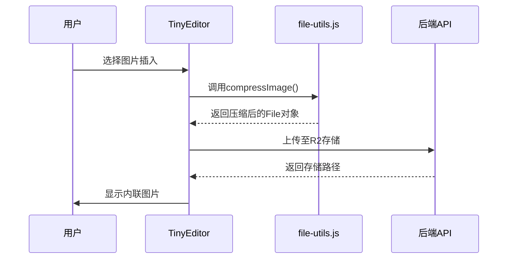
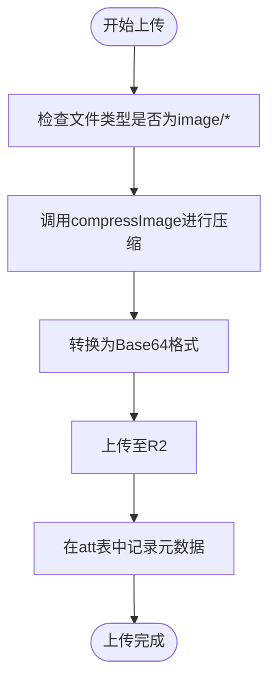
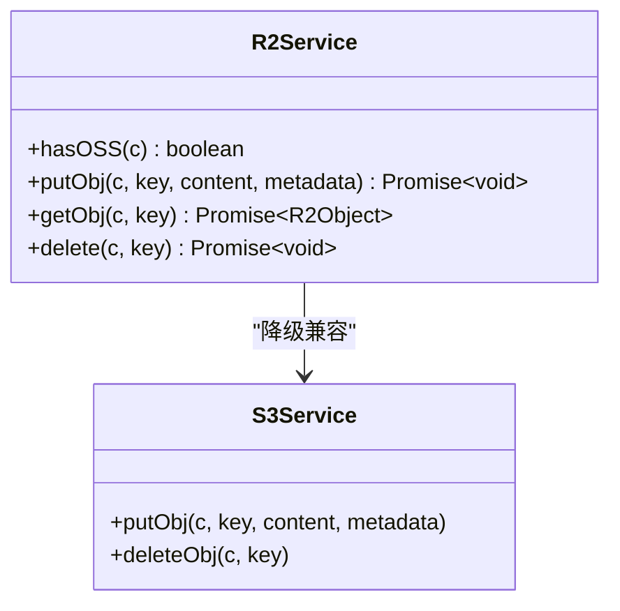
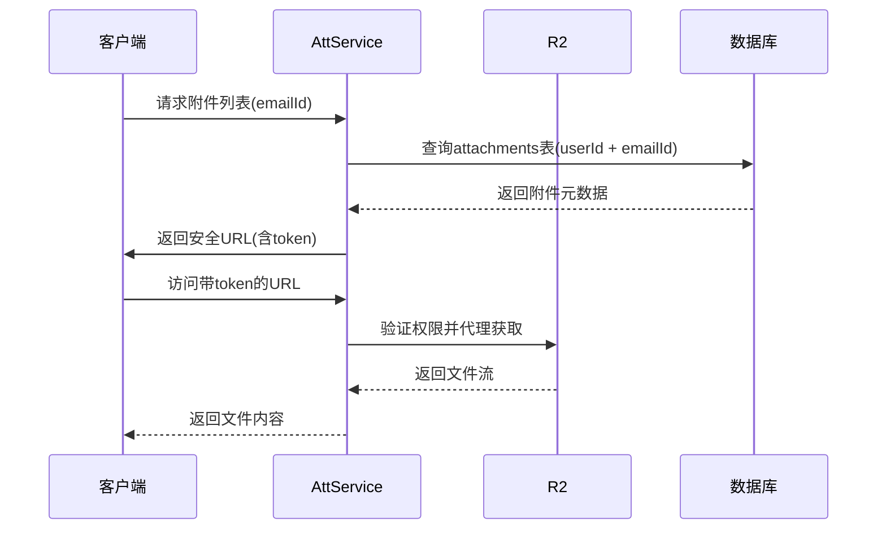

# 附件管理

<cite>
**本文档引用的文件**
- [tiny-editor.vue](file://mail-vue/src/components/tiny-editor/index.vue)
- [file-utils.js](file://mail-vue/src/utils/file-utils.js)
- [file-utils.js](file://mail-worker/src/utils/file-utils.js)
- [r2-service.js](file://mail-worker/src/service/r2-service.js)
- [att-service.js](file://mail-worker/src/service/att-service.js)
- [att.js](file://mail-worker/src/entity/att.js)
- [r2-api.js](file://mail-worker/src/api/r2-api.js)
</cite>

## 目录
1. [简介](#简介)
2. [前端附件处理流程](#前端附件处理流程)
3. [文件分片与类型校验机制](#文件分片与类型校验机制)
4. [R2对象存储交互逻辑](#r2对象存储交互逻辑)
5. [安全访问令牌与权限控制](#安全访问令牌与权限控制)
6. [附件数据模型设计](#附件数据模型设计)
7. [前端展示与用户体验](#前端展示与用户体验)
8. [高级实践建议](#高级实践建议)

## 简介
本系统实现了完整的邮件附件上传、存储与访问控制机制。从前端TinyMCE编辑器的文件选择触发，到后端Cloudflare R2对象存储的持久化保存，再到基于令牌的安全访问控制，整个流程设计严谨，兼顾性能与安全性。系统支持图片内联展示、附件列表管理、大文件优化上传等功能，确保用户在使用过程中获得流畅体验。

## 前端附件处理流程

当用户在`tiny-editor.vue`中通过编辑器插入图片时，系统会触发`file_picker_callback`回调函数。该函数创建一个隐藏的文件输入元素，并限制仅允许选择图像文件（`accept='image/*'`）。一旦用户选择文件，系统立即调用`compressImage`方法对图像进行压缩处理，以减少上传体积并提升加载速度。

**Diagram sources**
- [tiny-editor.vue](file://mail-vue/src/components/tiny-editor/index.vue#L180-L210)
- [file-utils.js](file://mail-vue/src/utils/file-utils.js#L37-L57)

**Section sources**
- [tiny-editor.vue](file://mail-vue/src/components/tiny-editor/index.vue#L160-L230)

## 文件分片与类型校验机制

前端`file-utils.js`提供了基础的文件处理能力，包括获取文件扩展名（`getExtName`）、格式化字节大小（`formatBytes`）以及Base64编码转换。对于图像文件，系统使用`compressorjs`库进行自动压缩，若文件小于1MB则不压缩直接上传，否则按0.8质量压缩为JPEG格式。

后端`file-utils.js`进一步增强了文件处理能力，支持将Base64数据自动解析为File对象，并正确识别MIME类型和扩展名。同时提供SHA-256哈希计算功能，用于生成唯一文件标识，避免重复存储。

**Diagram sources**
- [file-utils.js](file://mail-vue/src/utils/file-utils.js#L37-L57)
- [file-utils.js](file://mail-worker/src/utils/file-utils.js#L1-L61)

**Section sources**
- [file-utils.js](file://mail-vue/src/utils/file-utils.js#L1-L57)
- [file-utils.js](file://mail-worker/src/utils/file-utils.js#L1-L61)

## R2对象存储交互逻辑

`r2-service.js`封装了与Cloudflare R2的交互逻辑，支持原生R2环境和兼容S3接口的第三方存储。系统通过`hasOSS`方法检测当前是否配置了有效的对象存储服务。上传操作由`putObj`方法完成，支持自定义HTTP元数据，如Content-Type和Content-Disposition。

上传时，系统会根据附件类型设置不同的元数据策略：
- 普通附件：设置`attachment;filename=xxx`，强制浏览器下载
- 内联图片：设置`inline;filename=xxx`并启用缓存（max-age=259200）

**Diagram sources**
- [r2-service.js](file://mail-worker/src/service/r2-service.js#L1-L53)
- [s3-service.js](file://mail-worker/src/service/s3-service.js)

**Section sources**
- [r2-service.js](file://mail-worker/src/service/r2-service.js#L1-L53)

## 安全访问令牌与权限控制

`att-service.js`负责生成安全的访问令牌，实现附件下载链接的权限控制。所有附件访问必须经过身份验证，防止未授权访问。系统通过以下机制保障安全：

1. **唯一对象键生成**：使用`constant.ATTACHMENT_PREFIX + SHA256(fileBuffer) + ext`生成全局唯一且不可预测的存储路径。
2. **数据库外键约束**：每个附件记录关联`userId`、`emailId`和`accountId`，确保只能访问所属资源。
3. **访问控制检查**：`list`方法强制校验`userId`，防止跨用户访问。
4. **批量删除保护**：`removeAttByField`方法采用双阶段删除机制，先查询再删除，避免误删共享文件。

**Diagram sources**
- [att-service.js](file://mail-worker/src/service/att-service.js#L1-L202)

**Section sources**
- [att-service.js](file://mail-worker/src/service/att-service.js#L1-L202)

## 附件数据模型设计

`att.js`定义了附件的核心数据模型，采用SQLite表结构，关键字段如下：

| 字段名 | 类型 | 说明 |
|--------|------|------|
| attId | integer | 主键，自增 |
| userId | integer | 所属用户ID，外键约束 |
| emailId | integer | 关联邮件ID，外键约束 |
| accountId | integer | 邮箱账户ID，外键约束 |
| key | text | R2存储对象键，唯一索引 |
| filename | text | 原始文件名 |
| mimeType | text | MIME类型 |
| size | integer | 文件大小（字节） |
| type | integer | 类型：ATT(0)或EMBED(1) |
| contentId | text | 内联内容ID，为空表示普通附件 |
| createTime | text | 创建时间，默认CURRENT_TIMESTAMP |

该设计实现了附件与邮件的强关联，支持同一文件在多个邮件中复用而不会重复存储。通过`type`字段区分普通附件与内联资源，满足HTML邮件中图片嵌入的需求。

**Section sources**
- [att.js](file://mail-worker/src/entity/att.js#L1-L21)

## 前端展示与用户体验

前端通过`tiny-editor.vue`集成TinyMCE编辑器，支持拖拽或点击插入图片。上传过程中显示加载动画，提升交互反馈。系统自动处理图片尺寸，添加`max-width:100%`样式，确保响应式显示。

对于附件列表展示，可通过调用`list`接口获取当前邮件的所有附件，并结合`formatBytes`方法格式化显示文件大小。建议实现下载进度条功能，利用浏览器原生ProgressEvent监听上传状态。

图片类附件支持预览功能，可直接在邮件正文中渲染显示；非图片附件则显示图标与文件名，点击后触发安全下载流程。

**Section sources**
- [tiny-editor.vue](file://mail-vue/src/components/tiny-editor/index.vue#L1-L233)
- [file-utils.js](file://mail-vue/src/utils/file-utils.js#L10-L18)

## 高级实践建议

### 大文件上传优化
建议实现分片续传机制：
1. 前端对大文件（>10MB）进行分片
2. 每片独立上传并记录状态
3. 所有分片完成后触发合并请求
4. 支持断点续传，记录已上传分片

### 存储成本控制
1. **去重存储**：基于文件内容哈希判断是否已存在，避免重复上传
2. **生命周期管理**：定期清理超过30天的草稿邮件附件
3. **冷热分离**：高频访问附件保留在R2，低频访问归档至更低成本存储

### 附件生命周期管理
系统已实现自动清理机制：
- 删除邮件时，通过`removeByEmailIds`清理关联附件
- 注销用户时，通过`removeByUserIds`批量删除
- 解绑账户时，通过`removeByAccountId`清除数据

建议增加定时任务，扫描孤立的R2对象（数据库无引用）并清理，防止资源泄露。

**Section sources**
- [att-service.js](file://mail-worker/src/service/att-service.js#L100-L150)
- [r2-service.js](file://mail-worker/src/service/r2-service.js#L40-L53)