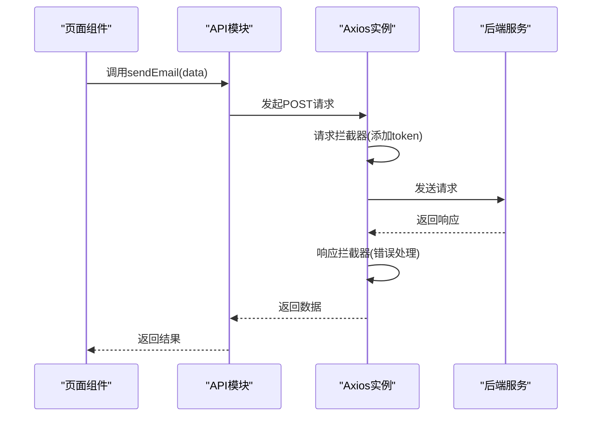

# 前端目录结构详解

<cite>
**本文档引用文件**  
- [main.js](file://mail-vue/src/main.js)
- [App.vue](file://mail-vue/src/App.vue)
- [vite.config.js](file://mail-vue/vite.config.js)
- [router/index.js](file://mail-vue/src/router/index.js)
- [store/user.js](file://mail-vue/src/store/user.js)
- [store/email.js](file://mail-vue/src/store/email.js)
- [store/setting.js](file://mail-vue/src/store/setting.js)
- [request/email.js](file://mail-vue/src/request/email.js)
- [request/user.js](file://mail-vue/src/request/user.js)
- [utils/time-utils.js](file://mail-vue/src/utils/time-utils.js)
- [utils/file-utils.js](file://mail-vue/src/utils/file-utils.js)
- [utils/verify-utils.js](file://mail-vue/src/utils/verify-utils.js)
- [i18n/index.js](file://mail-vue/src/i18n/index.js)
- [i18n/zh.js](file://mail-vue/src/i18n/zh.js)
- [i18n/en.js](file://mail-vue/src/i18n/en.js)
- [layout/index.vue](file://mail-vue/src/layout/index.vue)
- [components/tiny-editor/index.vue](file://mail-vue/src/components/tiny-editor/index.vue)
- [components/hamburger/index.vue](file://mail-vue/src/components/hamburger/index.vue)
- [components/send-percent/index.vue](file://mail-vue/src/components/send-percent/index.vue)
- [views/login/index.vue](file://mail-vue/src/views/login/index.vue)
- [views/email/index.vue](file://mail-vue/src/views/email/index.vue)
- [views/analysis/index.vue](file://mail-vue/src/views/analysis/index.vue)
</cite>

## 目录结构

mail-vue前端应用采用标准的Vue 3 + Vite工程化架构，整体目录结构清晰，按功能模块划分。核心源码位于`mail-vue/src`目录下，主要包含以下模块：

- `components/`：存放可复用的UI组件
- `views/`：页面级组件，与路由一一对应
- `store/`：Pinia状态管理模块
- `request/`：API请求封装
- `router/`：路由配置
- `utils/`：通用工具函数
- `layout/`：布局组件
- `i18n/`：国际化语言包
- `assets/`：静态资源（未显式列出）
- `public/`：公共静态资源，包含TinyMCE富文本编辑器资源

项目入口为`main.js`，根组件为`App.vue`，构建配置由`vite.config.js`定义。

**Section sources**
- [main.js](file://mail-vue/src/main.js)
- [App.vue](file://mail-vue/src/App.vue)
- [vite.config.js](file://mail-vue/vite.config.js)

## 应用入口初始化流程

`src/main.js`作为应用的唯一入口，负责初始化Vue应用实例、集成Pinia状态管理、配置路由系统，并加载全局配置。该文件通过`createApp`创建Vue实例，挂载Pinia实例以启用全局状态管理，并引入路由配置实现页面导航。同时，该文件还负责初始化全局配置，如Axios默认设置、全局组件注册等，确保应用启动时具备完整的运行环境。

**Section sources**
- [main.js](file://mail-vue/src/main.js)

## 根组件与布局机制

`App.vue`是整个应用的根组件，采用`<router-view>`插槽机制动态渲染当前路由对应的页面组件。其布局结构简洁，通常包含全局Header、Sidebar及主内容区域，通过CSS Grid或Flex布局实现响应式设计。该组件不包含具体业务逻辑，仅作为路由视图的容器，确保页面切换时保持一致的外观和交互体验。

**Section sources**
- [App.vue](file://mail-vue/src/App.vue)

## 可复用UI组件分析

### TinyEditor富文本编辑器组件

`components/tiny-editor/index.vue`是对TinyMCE编辑器的Vue封装，提供富文本输入功能。该组件通过props接收配置项，利用`init`事件初始化编辑器实例，并通过`v-model`实现内容双向绑定。封装原则包括：隔离外部依赖、提供默认配置、暴露必要事件钩子，确保组件的高内聚与低耦合。

**Section sources**
- [components/tiny-editor/index.vue](file://mail-vue/src/components/tiny-editor/index.vue)

### Hamburger菜单切换组件

`components/hamburger/index.vue`是一个简单的图标按钮组件，用于切换侧边栏的展开与收起状态。该组件接收`is-active`布尔值props，动态切换菜单图标的视觉状态（三线图标与X形关闭图标），通过`@click`事件向外发射`toggle`事件，实现父子组件间的通信。

**Section sources**
- [components/hamburger/index.vue](file://mail-vue/src/components/hamburger/index.vue)

### SendPercent发送进度组件

`components/send-percent/index.vue`用于可视化展示邮件发送进度。该组件接收`percent`数值props，通过CSS动画或SVG进度条直观显示当前发送完成比例。设计上注重轻量化与可复用性，适用于批量发送场景的进度反馈。

**Section sources**
- [components/send-percent/index.vue](file://mail-vue/src/components/send-percent/index.vue)

## 页面组件与路由映射

`views`目录下的每个子目录对应一个独立的页面组件，如`login/`、`email/`、`analysis/`等，均以`index.vue`作为默认导出组件。这些页面组件通过`router/index.js`中的路由配置进行映射，实现URL与视图的绑定。路由采用懒加载（`defineAsyncComponent`或动态import）策略，优化首屏加载性能。

**Section sources**
- [views/login/index.vue](file://mail-vue/src/views/login/index.vue)
- [views/email/index.vue](file://mail-vue/src/views/email/index.vue)
- [views/analysis/index.vue](file://mail-vue/src/views/analysis/index.vue)
- [router/index.js](file://mail-vue/src/router/index.js)

## Pinia状态管理模块

`store`目录下按功能域划分多个Pinia模块，如`user.js`、`email.js`、`setting.js`等，分别管理用户信息、邮件数据、系统设置等全局状态。各模块遵循单一职责原则，定义`state`、`getters`、`actions`，并通过`persist`插件实现关键状态的本地持久化（如用户登录态、主题偏好），确保页面刷新后状态不丢失。

```mermaid
classDiagram
class UserStore {
+state : { userInfo, token, isLoggedIn }
+getters : { getUserInfo(), getToken() }
+actions : { login(), logout(), fetchUserInfo() }
}
class EmailStore {
+state : { emailList, currentEmail, unreadCount }
+getters : { getUnreadCount(), getCurrentEmail() }
+actions : { fetchEmails(), readEmail(), sendEmail() }
}
class SettingStore {
+state : { theme, language, autoRefresh }
+getters : { getTheme(), getLanguage() }
+actions : { updateTheme(), changeLanguage(), toggleAutoRefresh() }
}
```

**Diagram sources**
- [store/user.js](file://mail-vue/src/store/user.js)
- [store/email.js](file://mail-vue/src/store/email.js)
- [store/setting.js](file://mail-vue/src/store/setting.js)

## 动态路由与权限控制

`router/index.js`实现了基于用户权限的动态路由注册机制。系统启动时，首先加载静态路由（如登录页、404页），用户登录成功后，根据其角色权限从后端获取可访问的路由列表，动态添加至路由表中。权限过滤逻辑通过`perm.js`辅助函数实现，确保用户只能访问其权限范围内的页面，提升应用安全性。

**Section sources**
- [router/index.js](file://mail-vue/src/router/index.js)
- [perm/perm.js](file://mail-vue/src/perm/perm.js)

## API请求封装规范

`request`目录下按业务模块组织API请求文件，如`email.js`、`user.js`等。每个文件封装了对应模块的HTTP请求方法，统一使用Axios实例，并配置了请求/响应拦截器。拦截器用于处理全局loading状态、错误码统一处理（如401跳转登录）、请求头自动携带token等，确保API调用的一致性与健壮性。



**Diagram sources**
- [request/email.js](file://mail-vue/src/request/email.js)
- [request/user.js](file://mail-vue/src/request/user.js)
- [axios/index.js](file://mail-vue/src/axios/index.js)

## 通用工具函数抽象

`utils`目录集中管理各类通用工具函数，实现功能复用：
- `time-utils.js`：时间格式化、相对时间计算
- `file-utils.js`：文件大小转换、类型校验
- `verify-utils.js`：表单验证逻辑（邮箱、密码强度等）
- `convert.js`：数据结构转换
- `day.js`：日期处理辅助
- `icon-utils.js`：图标映射逻辑

这些工具函数无副作用，便于在不同组件间安全调用。

**Section sources**
- [utils/time-utils.js](file://mail-vue/src/utils/time-utils.js)
- [utils/file-utils.js](file://mail-vue/src/utils/file-utils.js)
- [utils/verify-utils.js](file://mail-vue/src/utils/verify-utils.js)

## 国际化语言包管理

`i18n`模块通过`index.js`统一管理多语言支持。`zh.js`和`en.js`分别定义中文与英文语言包，包含应用内所有可翻译的文本。`index.js`初始化Vue I18n实例，根据用户偏好或系统设置动态切换语言环境，并提供`$t`方法在模板中调用翻译文本，实现无缝的国际化体验。

**Section sources**
- [i18n/index.js](file://mail-vue/src/i18n/index.js)
- [i18n/zh.js](file://mail-vue/src/i18n/zh.js)
- [i18n/en.js](file://mail-vue/src/i18n/en.js)

## 布局组件复用模式

`layout`目录提供多种布局模板，如`main/index.vue`（主应用布局）、`account/index.vue`（账户相关布局）、`write/index.vue`（邮件撰写布局）等。这些布局组件通过`<slot>`机制接收页面内容，在不同场景下复用，避免重复代码。例如，主布局包含侧边栏与顶部导航，而撰写布局可能为全屏编辑模式。

**Section sources**
- [layout/index.vue](file://mail-vue/src/layout/index.vue)
- [layout/main/index.vue](file://mail-vue/src/layout/main/index.vue)
- [layout/write/index.vue](file://mail-vue/src/layout/write/index.vue)

## 构建配置与开发服务器

`vite.config.js`定义了项目的核心构建配置：
- **别名设置**：配置`@`指向`src`目录，简化模块导入路径
- **开发服务器代理**：配置`/api`前缀的请求代理至后端服务，解决开发环境跨域问题
- **插件集成**：引入Vue、JSX、SVG等Vite插件
- **构建优化**：配置代码压缩、资源打包规则

该文件是工程化配置的核心，直接影响开发体验与生产构建结果。

**Section sources**
- [vite.config.js](file://mail-vue/vite.config.js)