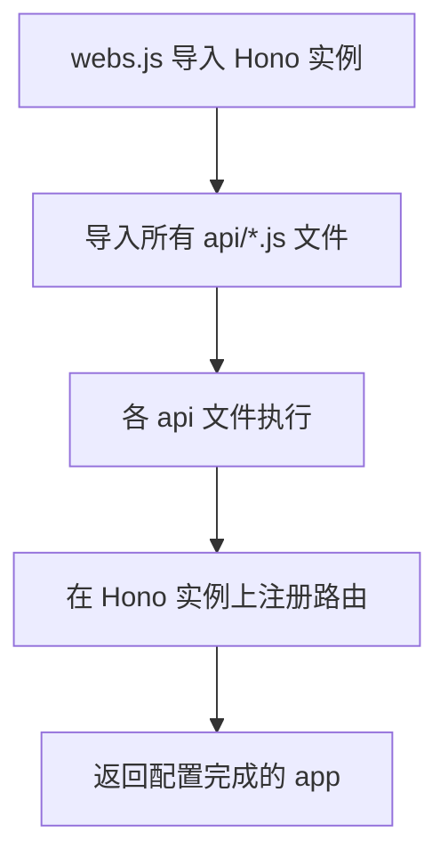
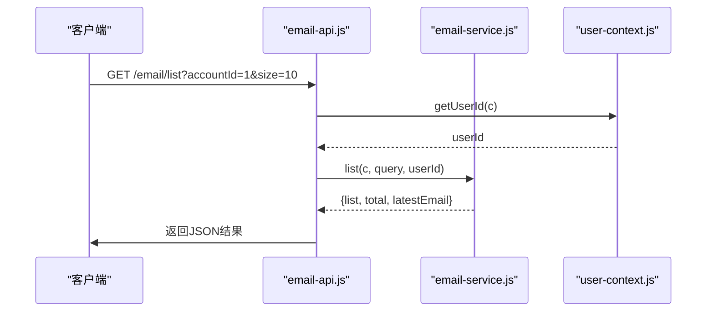
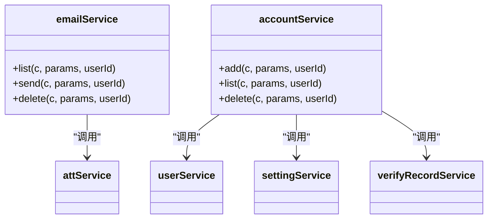
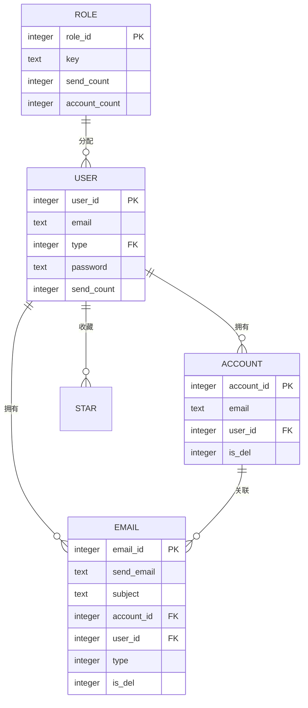
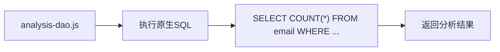

# 后端目录结构详解

<cite>
**本文档中引用的文件**  
- [src/index.js](file://mail-worker/src/index.js)
- [src/hono/webs.js](file://mail-worker/src/hono/webs.js)
- [src/hono/hono.js](file://mail-worker/src/hono/hono.js)
- [src/api/email-api.js](file://mail-worker/src/api/email-api.js)
- [src/api/user-api.js](file://mail-worker/src/api/user-api.js)
- [src/service/email-service.js](file://mail-worker/src/service/email-service.js)
- [src/service/account-service.js](file://mail-worker/src/service/account-service.js)
- [src/entity/orm.js](file://mail-worker/src/entity/orm.js)
- [src/entity/email.js](file://mail-worker/src/entity/email.js)
- [src/entity/user.js](file://mail-worker/src/entity/user.js)
- [src/entity/role.js](file://mail-worker/src/entity/role.js)
- [src/dao/analysis-dao.js](file://mail-worker/src/dao/analysis-dao.js)
- [src/utils/crypto-utils.js](file://mail-worker/src/utils/crypto-utils.js)
- [src/utils/date-uitil.js](file://mail-worker/src/utils/date-uitil.js)
- [src/security/security.js](file://mail-worker/src/security/security.js)
- [src/init/init.js](file://mail-worker/src/init/init.js)
- [wrangler.toml](file://mail-worker/wrangler.toml)
</cite>

## 目录结构

本项目采用清晰的分层架构设计，`mail-worker` 作为后端服务核心，遵循模块化组织原则。主要目录结构如下：

```
mail-worker/
├── src/
│   ├── api/            # API路由层：HTTP接口定义
│   ├── service/        # 业务逻辑层：核心处理逻辑
│   ├── entity/         # 数据模型层：Drizzle ORM实体定义
│   ├── dao/            # 数据访问层：原生SQL操作封装
│   ├── hono/           # 框架初始化与中间件
│   ├── security/       # 安全机制：JWT、权限校验
│   ├── utils/          # 工具类：加密、日期、请求处理
│   ├── const/          # 常量定义
│   ├── model/          # 响应模型
│   ├── init/           # 初始化逻辑
│   └── index.js        # 入口文件
├── wrangler.toml       # Cloudflare平台资源配置
```

该结构实现了关注点分离，便于维护和扩展。

## 入口文件与Hono框架初始化

`src/index.js` 是Cloudflare Worker的入口文件，负责请求路由分发与定时任务调度。它通过`fetch`方法拦截所有请求，将`/api/`前缀的请求转发至Hono应用实例，其余请求交由静态资源处理。

Hono框架的初始化在 `src/hono/hono.js` 中完成。通过`new Hono()`创建应用实例，并全局注册`cors`中间件以支持跨域请求。同时，统一错误处理机制捕获业务异常与平台资源未绑定错误（如D1、KV），返回结构化错误响应。

**Section sources**  
- [src/index.js](file://mail-worker/src/index.js#L1-L24)  
- [src/hono/hono.js](file://mail-worker/src/hono/hono.js#L1-L33)

## API路由集中注册机制

`src/hono/webs.js` 实现了API路由的集中注册。该文件导入Hono应用实例，并通过批量导入所有`api/*.js`模块的方式，触发各API文件内部的路由定义。这种模式实现了路由的自动注册，无需手动逐个挂载。



**Diagram sources**  
- [src/hono/webs.js](file://mail-worker/src/hono/webs.js#L1-L21)

**Section sources**  
- [src/hono/webs.js](file://mail-worker/src/hono/webs.js#L1-L21)

## 接口层与业务逻辑调用

API层文件（如`email-api.js`、`user-api.js`）负责接收HTTP请求，解析参数，并调用对应的Service层方法。例如，`email-api.js`中的`/email/list`接口，通过`c.req.query()`获取查询参数，利用`userContext.getUserId(c)`获取当前用户ID，然后调用`emailService.list()`执行业务逻辑，最后使用`result.ok()`封装成功响应。



**Diagram sources**  
- [src/api/email-api.js](file://mail-worker/src/api/email-api.js#L1-L31)  
- [src/service/email-service.js](file://mail-worker/src/service/email-service.js#L1-L666)  
- [src/security/user-context.js](file://mail-worker/src/security/user-context.js)

**Section sources**  
- [src/api/email-api.js](file://mail-worker/src/api/email-api.js#L1-L31)  
- [src/api/user-api.js](file://mail-worker/src/api/user-api.js#L1-L57)

## 业务逻辑层与数据协调

Service层是业务逻辑的核心。以`email-service.js`为例，它协调`entity`数据模型与`dao`数据访问对象。该服务使用`orm(c)`获取Drizzle ORM实例，构建SQL查询。例如，`list`方法联合查询`email`表和`star`表，判断邮件是否被收藏，并通过`attService`获取附件列表。

`account-service.js`则展示了更复杂的业务规则，如添加账户时检查域名权限、用户角色配额，并根据配置决定是否启用验证码验证。



**Diagram sources**  
- [src/service/email-service.js](file://mail-worker/src/service/email-service.js#L1-L666)  
- [src/service/account-service.js](file://mail-worker/src/service/account-service.js#L1-L231)

**Section sources**  
- [src/service/email-service.js](file://mail-worker/src/service/email-service.js#L1-L666)  
- [src/service/account-service.js](file://mail-worker/src/service/account-service.js#L1-L231)

## 数据模型与Drizzle ORM集成

`entity`目录定义了核心数据模型，使用Drizzle ORM的`sqliteTable`函数声明。例如，`email.js`定义了邮件表的字段，包括`emailId`（主键）、`sendEmail`、`subject`、`type`（收件/发件）等，并使用`sql`模板字面量设置默认值（如`CURRENT_TIMESTAMP`）。

`user.js`和`role.js`分别定义了用户和角色模型，通过`type`字段建立关联。`role`模型中的`sendCount`和`accountCount`字段用于实现发送配额和账户数量限制。



**Diagram sources**  
- [src/entity/email.js](file://mail-worker/src/entity/email.js#L1-L27)  
- [src/entity/user.js](file://mail-worker/src/entity/user.js#L1-L22)  
- [src/entity/role.js](file://mail-worker/src/entity/role.js#L1-L19)

**Section sources**  
- [src/entity/email.js](file://mail-worker/src/entity/email.js#L1-L27)  
- [src/entity/user.js](file://mail-worker/src/entity/user.js#L1-L22)  
- [src/entity/role.js](file://mail-worker/src/entity/role.js#L1-L19)

## 数据访问层DAO

`dao`层用于封装对D1数据库的原生SQL操作。`analysis-dao.js`提供了多个分析查询，如`numberCount`通过复杂的`SELECT`语句一次性统计邮件、用户、账户的总数及状态分布。`userDayCount`、`receiveDayCount`、`sendDayCount`则使用`DATE`函数和`GROUP BY`按天统计注册和收发件数量，支持时区偏移（`diffHours`）。



**Diagram sources**  
- [src/dao/analysis-dao.js](file://mail-worker/src/dao/analysis-dao.js#L1-L104)

**Section sources**  
- [src/dao/analysis-dao.js](file://mail-worker/src/dao/analysis-dao.js#L1-L104)

## 工具类复用

`utils`目录提供通用能力复用。`crypto-utils.js`实现了密码加盐哈希（SHA-256）、密码验证和随机密码生成。`date-uitil.js`基于`dayjs`库提供日期格式化和UTC时区转换功能，确保时间处理的一致性。

**Section sources**  
- [src/utils/crypto-utils.js](file://mail-worker/src/utils/crypto-utils.js#L1-L40)  
- [src/utils/date-uitil.js](file://mail-worker/src/utils/date-uitil.js#L1-L13)

## 安全机制实现

`security`模块实现了JWT验证和用户上下文提取。`security.js`作为中间件，在请求处理前验证JWT令牌，解析出用户ID并注入请求上下文。`user-context.js`提供`getUserId(c)`方法，供各Service层安全地获取当前用户身份，实现数据隔离。

**Section sources**  
- [src/security/security.js](file://mail-worker/src/security/security.js)  
- [src/security/user-context.js](file://mail-worker/src/security/user-context.js)

## 初始化流程

`init`目录下的`init.js`和`init-api.js`负责系统初始化。`init-api.js`提供的API用于创建数据库表结构（通过Drizzle ORM的迁移功能）和插入默认配置（如管理员账户、默认角色）。这确保了服务在首次部署时能自动完成环境搭建。

**Section sources**  
- [src/init/init.js](file://mail-worker/src/init/init.js)  
- [src/api/init-api.js](file://mail-worker/src/api/init-api.js)

## Cloudflare平台资源配置

`wrangler.toml`文件定义了Cloudflare Workers的平台资源绑定。关键配置包括：
- **环境变量 (vars)**: 如`admin`邮箱、域名白名单。
- **KV命名空间 (kv_namespaces)**: 绑定`KV`用于存储键值对（如每日发送统计）。
- **R2存储桶 (r2_buckets)**: 绑定`R2`用于存储邮件附件。
- **D1数据库 (d1_databases)**: 绑定`D1`数据库实例，作为主数据存储。

这些配置将无服务器函数与Cloudflare的后端服务紧密集成，构成了完整的后端工程结构。

**Section sources**  
- [wrangler.toml](file://mail-worker/wrangler.toml)  
- [wrangler-dev.toml](file://mail-worker/wrangler-dev.toml)  
- [wrangler-test.toml](file://mail-worker/wrangler-test.toml)  
- [wrangler-action.toml](file://mail-worker/wrangler-action.toml)