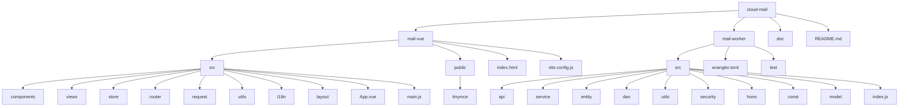
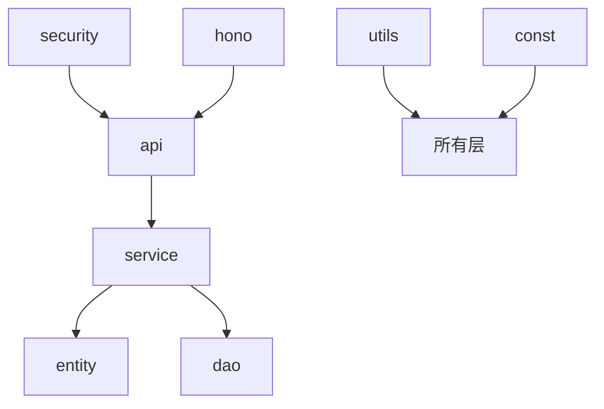

# 目录结构详解

<cite>
**本文档引用的文件**  
- [main.js](file://mail-vue/src/main.js)
- [App.vue](file://mail-vue/src/App.vue)
- [vite.config.js](file://mail-vue/vite.config.js)
- [wrangler.toml](file://mail-worker/wrangler.toml)
- [index.js](file://mail-worker/src/index.js)
- [hono.js](file://mail-worker/src/hono/hono.js)
- [api/account-api.js](file://mail-worker/src/api/account-api.js)
- [service/account-service.js](file://mail-worker/src/service/account-service.js)
- [entity/account.js](file://mail-worker/src/entity/account.js)
- [utils/crypto-utils.js](file://mail-worker/src/utils/crypto-utils.js)
- [security/security.js](file://mail-worker/src/security/security.js)
- [request/account.js](file://mail-vue/src/request/account.js)
- [store/account.js](file://mail-vue/src/store/account.js)
- [views/account/index.vue](file://mail-vue/src/views/account/index.vue)
- [layout/index.vue](file://mail-vue/src/layout/index.vue)
- [public/tinymce](file://mail-vue/public/tinymce)
</cite>

## 目录结构

cloud-mail项目采用前后端分离架构，包含两个核心模块：前端`mail-vue`（Vue.js应用）和后端`mail-worker`（基于Hono的Cloudflare Worker服务）。整体结构清晰，职责分明。

**Diagram sources**  
- [mail-vue](file://mail-vue)
- [mail-worker](file://mail-worker)

## 前端结构解析

### src/components
存放可复用的UI组件，如`hamburger`（汉堡菜单）、`loading`（加载动画）、`tiny-editor`（富文本编辑器封装）等。这些组件不包含业务逻辑，仅负责展示和交互，通过props接收数据，通过事件向外通信。

**Section sources**  
- [components](file://mail-vue/src/components)

### src/views
存放页面级组件，每个`.vue`文件对应一个路由视图，如`login/index.vue`、`email/index.vue`。这些组件通常包含业务逻辑，负责数据获取、状态管理和用户交互。

**Section sources**  
- [views](file://mail-vue/src/views)

### src/store
采用Vuex进行全局状态管理，按功能模块划分命名空间，如`user.js`管理用户信息，`email.js`管理邮件列表状态。各模块独立维护自身状态，避免状态混乱。

**Section sources**  
- [store](file://mail-vue/src/store)

### src/router
定义前端路由规则，通过`index.js`配置路径与`views`组件的映射关系，实现单页应用的页面跳转。

**Section sources**  
- [router/index.js](file://mail-vue/src/router/index.js)

### src/request
封装API请求，按业务领域组织文件，如`user.js`包含用户相关接口调用。统一处理请求拦截、响应解析和错误处理，确保网络通信的一致性。

**Section sources**  
- [request](file://mail-vue/src/request)

### src/utils
提供通用工具函数，如`time-utils.js`处理时间格式化，`verify-utils.js`进行表单验证。这些函数无副作用，便于在项目中复用。

**Section sources**  
- [utils](file://mail-vue/src/utils)

### src/i18n
实现国际化支持，包含`zh.js`（中文）和`en.js`（英文）语言包，通过`index.js`统一导出，支持多语言切换。

**Section sources**  
- [i18n](file://mail-vue/src/i18n)

### src/layout
定义应用的整体布局结构，如`header`（页头）、`aside`（侧边栏）、`main`（主内容区）。`index.vue`作为布局容器，组合各部分形成完整页面框架。

**Section sources**  
- [layout](file://mail-vue/src/layout)

### 应用入口：App.vue 与 main.js
`main.js`是前端应用的入口文件，负责创建Vue实例，挂载`App.vue`，并引入`router`、`store`等插件。`App.vue`作为根组件，通过`<router-view>`渲染当前路由对应的`views`组件，是整个UI的容器。

**Section sources**  
- [main.js](file://mail-vue/src/main.js)
- [App.vue](file://mail-vue/src/App.vue)

## 后端结构解析

### 分层架构设计
后端遵循Clean Architecture（清洁架构）原则，各层职责清晰，依赖关系单向：

**Diagram sources**  
- [mail-worker/src/api](file://mail-worker/src/api)
- [mail-worker/src/service](file://mail-worker/src/service)
- [mail-worker/src/entity](file://mail-worker/src/entity)
- [mail-worker/src/dao](file://mail-worker/src/dao)
- [mail-worker/src/security](file://mail-worker/src/security)
- [mail-worker/src/utils](file://mail-worker/src/utils)
- [mail-worker/src/const](file://mail-worker/src/const)
- [mail-worker/src/hono](file://mail-worker/src/hono)

#### api
API层，直接处理HTTP请求。每个`*-api.js`文件对应一组REST接口，负责解析请求参数、调用`service`层处理业务逻辑，并返回标准化响应。例如`account-api.js`处理用户账户相关API。

**Section sources**  
- [api](file://mail-worker/src/api)

#### service
服务层，封装核心业务逻辑。每个`*-service.js`文件提供具体业务功能，如`account-service.js`处理用户注册、登录等。该层调用`entity`进行数据操作，调用`dao`访问持久化存储。

**Section sources**  
- [service](file://mail-worker/src/service)

#### entity
实体层，定义数据模型和业务规则。`account.js`等文件定义了用户、邮件等核心对象的结构和方法，是业务逻辑的载体，体现了领域驱动设计（DDD）思想。

**Section sources**  
- [entity](file://mail-worker/src/entity)

#### dao
数据访问对象层，负责与数据库或KV存储交互。`analysis-dao.js`等文件封装了对Cloudflare KV、R2等服务的底层操作，为`service`层提供数据存取接口。

**Section sources**  
- [dao](file://mail-worker/src/dao)

#### utils
工具层，提供通用函数，如`crypto-utils.js`处理加密解密，`email-utils.js`验证邮箱格式。这些工具被各层复用，提高代码效率。

**Section sources**  
- [utils](file://mail-worker/src/utils)

#### security
安全层，处理身份认证和权限控制。`security.js`实现JWT验证、请求鉴权等机制，`user-context.js`管理当前用户上下文，保障系统安全。

**Section sources**  
- [security](file://mail-worker/src/security)

#### hono
框架适配层，封装Hono框架的初始化和中间件。`hono.js`创建Hono应用实例，`webs.js`可能处理WebSocket等高级功能，隔离框架细节。

**Section sources**  
- [hono](file://mail-worker/src/hono)

## 静态资源与配置文件

### public/tinymce
集成TinyMCE富文本编辑器的静态资源。将TinyMCE的完整文件夹（css、langs、plugins、skins等）直接放入`public`目录，前端通过相对路径引用，实现开箱即用的富文本编辑功能。

**Section sources**  
- [public/tinymce](file://mail-vue/public/tinymce)

### vite.config.js
前端构建配置文件，定义Vite开发服务器、构建输出、插件等设置。配置了路径别名、代理等开发便利功能。

**Section sources**  
- [vite.config.js](file://mail-vue/vite.config.js)

### wrangler.toml
后端部署配置文件，用于Cloudflare Workers。定义了Worker的名称、入口文件、环境变量、绑定的服务（如KV、R2）等，是部署到Cloudflare边缘网络的关键。

**Section sources**  
- [wrangler.toml](file://mail-worker/wrangler.toml)