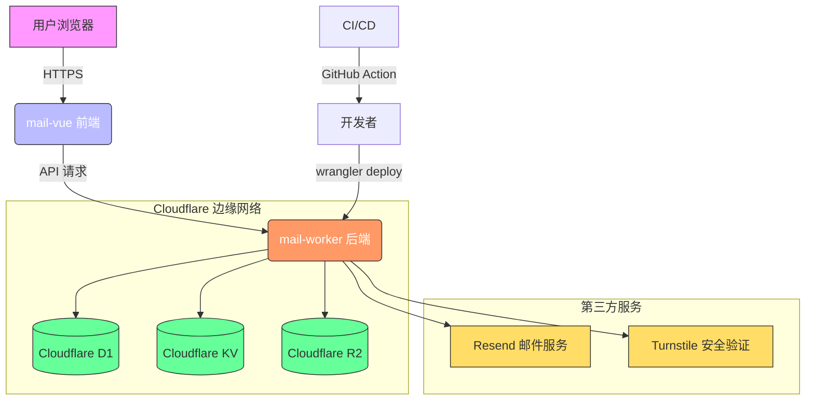

# 系统概述

<cite>
**本文档引用的文件**  
- [README.md](file://README.md)  
- [mail-vue/src/main.js](file://mail-vue/src/main.js)  
- [mail-vue/src/router/index.js](file://mail-vue/src/router/index.js)  
- [mail-vue/src/store/user.js](file://mail-vue/src/store/user.js)  
- [mail-worker/src/index.js](file://mail-worker/src/index.js)  
- [mail-worker/src/hono/hono.js](file://mail-worker/src/hono/hono.js)  
- [mail-worker/src/service/email-service.js](file://mail-worker/src/service/email-service.js)  
- [mail-worker/src/entity/email.js](file://mail-worker/src/entity/email.js)  
- [mail-worker/src/const/constant.js](file://mail-worker/src/const/constant.js)  
- [mail-worker/wrangler.toml](file://mail-worker/wrangler.toml)  
- [mail-vue/src/request/email.js](file://mail-vue/src/request/email.js)  
- [mail-vue/src/views/email/index.vue](file://mail-vue/src/views/email/index.vue)  
- [mail-worker/src/api/email-api.js](file://mail-worker/src/api/email-api.js)  
- [mail-worker/src/service/resend-service.js](file://mail-worker/src/service/resend-service.js)  
- [mail-worker/src/dao/analysis-dao.js](file://mail-worker/src/dao/analysis-dao.js)  
- [mail-vue/src/echarts/index.js](file://mail-vue/src/echarts/index.js)  
- [mail-vue/src/views/analysis/index.vue](file://mail-vue/src/views/analysis/index.vue)
</cite>

## 目录
1. [简介](#简介)  
2. [项目结构](#项目结构)  
3. [核心功能全景](#核心功能全景)  
4. [前后端分离架构](#前后端分离架构)  
5. [技术栈与云服务集成](#技术栈与云服务集成)  
6. [典型用户场景流程](#典型用户场景流程)  
7. [系统上下文与架构示意图](#系统上下文与架构示意图)  
8. [系统边界与扩展能力](#系统边界与扩展能力)  
9. [结论](#结论)

## 简介

cloud-mail 是一个现代化的无服务器邮箱系统，基于 Vue3 和 Cloudflare Workers 构建，旨在提供轻量、高效、可扩展的邮件管理解决方案。该项目采用前后端完全分离的架构设计，前端（mail-vue）负责用户界面展示与交互，后端（mail-worker）运行在 Cloudflare Workers 上，处理所有业务逻辑与数据交互。

系统支持完整的邮件收发功能、多账户管理、细粒度权限控制以及数据可视化分析，适用于个人用户、团队协作及轻量级企业邮件场景。通过集成 Cloudflare D1（SQLite 数据库）、KV（键值存储）、R2（对象存储）以及第三方邮件服务 Resend，cloud-mail 实现了高性能、低成本、全球分布的部署模型。

本系统概述将为初学者提供清晰的项目背景与价值说明，同时为高级开发者深入分析系统架构、技术选型、部署模型与扩展能力。

## 项目结构

项目整体分为两个核心模块：`mail-vue` 和 `mail-worker`，分别代表前端与后端服务。

- **mail-vue**：基于 Vue3 + Vite 构建的单页应用（SPA），使用 Composition API 和 Pinia（类 Vuex 状态管理）实现响应式数据流。包含路由管理、组件库、请求封装、权限控制逻辑及 ECharts 数据可视化集成。
- **mail-worker**：基于 Hono 框架的 Cloudflare Worker 服务，使用 TypeScript 编写，通过 Wrangler 部署。包含 RESTful API 接口、业务服务层、实体模型、数据库操作、安全认证（JWT）、文件存储（R2）及邮件发送（Resend）等功能。

此外，项目包含 `doc` 目录用于存放文档，以及 README 文件提供基础说明。

**Section sources**  
- [mail-vue](file://mail-vue)  
- [mail-worker](file://mail-worker)  
- [doc/github-action.md](file://doc/github-action.md)

## 核心功能全景

cloud-mail 提供以下核心功能：

- **邮件收发**：支持富文本编辑（集成 TinyMCE）、附件上传（通过 R2 存储）、邮件发送（通过 Resend API）与接收（模拟或轮询机制）。
- **多账户管理**：用户可注册并管理多个邮箱账户，支持账户切换与独立配置。
- **权限控制**：基于角色（Role）与权限（Permission）的访问控制模型，支持管理员与普通用户分级管理。
- **数据可视化**：通过 ECharts 展示邮件发送统计、用户活跃度、账户使用情况等分析图表。
- **系统设置**：支持全局配置、注册密钥管理、安全验证（如 Turnstile）等后台功能。
- **草稿与星标**：支持邮件草稿保存、星标标记与分类查看。

这些功能通过前后端协同实现，形成完整的邮件系统闭环。

**Section sources**  
- [mail-vue/src/views](file://mail-vue/src/views)  
- [mail-worker/src/api](file://mail-worker/src/api)  
- [mail-worker/src/service](file://mail-worker/src/service)  
- [mail-worker/src/entity](file://mail-worker/src/entity)

## 前后端分离架构

cloud-mail 采用典型的前后端分离架构，前端 `mail-vue` 与后端 `mail-worker` 通过 RESTful API 进行通信，各自独立开发、部署与扩展。

### 前端（mail-vue）
- 使用 Vue3 + Composition API 构建响应式 UI。
- 通过 `axios` 封装 HTTP 请求，统一处理认证头（Authorization）与错误响应。
- 使用 `Pinia` 管理用户状态、邮件列表、权限信息等全局数据。
- 路由由 `vue-router` 控制，实现页面跳转与权限拦截。
- 富文本编辑器集成 TinyMCE，支持离线使用。
- 数据可视化通过 `ECharts` 实现，图表数据由后端 API 提供。

### 后端（mail-worker）
- 基于 `Hono` 框架构建轻量级 Web 服务，专为 Cloudflare Workers 优化。
- 所有 API 接口位于 `src/api` 目录，统一返回标准化响应结构（通过 `model/result.js`）。
- 业务逻辑封装在 `service` 层，如 `email-service.js` 处理邮件发送与查询。
- 实体模型定义在 `entity` 目录，映射数据库表结构（D1）。
- 安全认证通过 JWT 实现，用户上下文由 `security/user-context.js` 管理。
- 文件上传通过 `R2` 存储，邮件发送通过 `Resend` 服务完成。

前后端通过 HTTPS 协议通信，前端在请求头中携带 JWT Token 进行身份验证，后端验证通过后返回 JSON 数据。

**Section sources**  
- [mail-vue/src/main.js](file://mail-vue/src/main.js)  
- [mail-vue/src/request](file://mail-vue/src/request)  
- [mail-vue/src/store](file://mail-vue/src/store)  
- [mail-worker/src/index.js](file://mail-worker/src/index.js)  
- [mail-worker/src/hono/hono.js](file://mail-worker/src/hono/hono.js)  
- [mail-worker/src/security/user-context.js](file://mail-worker/src/security/user-context.js)

## 技术栈与云服务集成

cloud-mail 充分利用 Cloudflare 的边缘计算生态，实现高性能、低成本、全球分布的部署。

### Cloudflare D1（SQLite 数据库）
- 用于持久化存储用户信息、邮件元数据、权限配置等结构化数据。
- 通过 D1 API 在 Worker 中直接执行 SQL 查询，无需独立数据库服务器。
- 支持迁移脚本（migrations），便于版本控制与部署。

### Cloudflare KV（键值存储）
- 用于缓存高频访问数据，如用户会话、配置项、验证码等。
- 低延迟、高可用，适合读多写少的场景。
- 在 `const/kv-const.js` 中定义键名常量。

### Cloudflare R2（对象存储）
- 用于存储邮件附件，替代传统 S3，避免出口费用。
- 通过 `r2-service.js` 封装上传、下载、删除操作。
- 与 `att-service.js` 协同，管理附件元数据与实际文件。

### Resend（邮件发送服务）
- 第三方邮件 API，用于可靠地发送外发邮件。
- 通过 `resend-service.js` 封装发送逻辑，支持模板、附件、批量发送。
- 替代传统 SMTP，简化配置与维护。

### Hono（Worker 框架）
- 轻量级、类型安全的 Web 框架，专为 Workers 设计。
- 支持中间件、路由分组、请求验证。
- 与 TypeScript 深度集成，提升开发效率。

### Vue3 + Vite（前端框架）
- 前端采用现代前端工程化方案，支持热更新、按需加载。
- 使用 `vite.config.js` 配置代理，解决开发环境跨域问题。

**Section sources**  
- [mail-worker/wrangler.toml](file://mail-worker/wrangler.toml)  
- [mail-worker/src/const/constant.js](file://mail-worker/src/const/constant.js)  
- [mail-worker/src/service/r2-service.js](file://mail-worker/src/service/r2-service.js)  
- [mail-worker/src/service/resend-service.js](file://mail-worker/src/service/resend-service.js)  
- [mail-worker/src/dao/analysis-dao.js](file://mail-worker/src/dao/analysis-dao.js)  
- [mail-vue/vite.config.js](file://mail-vue/vite.config.js)

## 典型用户场景流程

### 1. 用户注册与登录
- 用户访问前端登录页，填写信息并提交。
- 前端调用 `/api/login/register` 接口，后端验证后创建用户并返回 JWT。
- 前端将 Token 存入本地状态，跳转至主界面。

### 2. 发送邮件
- 用户在富文本编辑器中撰写邮件，添加附件。
- 前端调用 `/api/email/send` 接口，携带收件人、主题、内容及附件元数据。
- 后端验证权限，将附件上传至 R2，调用 Resend 发送邮件，同时将邮件元数据存入 D1。
- 返回发送结果，前端更新界面。

### 3. 查看邮件与数据分析
- 用户进入“收件箱”或“数据分析”页面。
- 前端调用 `/api/email/list` 或 `/api/analysis/stats` 接口。
- 后端从 D1 查询数据，返回邮件列表或统计结果。
- 前端使用 ECharts 渲染图表，展示发送趋势、用户分布等。

### 4. 多账户切换与权限管理
- 管理员用户可进入“账户管理”页面，创建子账户。
- 通过角色（Role）分配权限，如“仅发送”、“可查看报表”等。
- 权限信息由 `perm-service.js` 管理，前端根据权限动态渲染菜单。

**Section sources**  
- [mail-vue/src/request/login.js](file://mail-vue/src/request/login.js)  
- [mail-vue/src/request/email.js](file://mail-vue/src/request/email.js)  
- [mail-vue/src/views/analysis/index.vue](file://mail-vue/src/views/analysis/index.vue)  
- [mail-worker/src/api/email-api.js](file://mail-worker/src/api/email-api.js)  
- [mail-worker/src/service/email-service.js](file://mail-worker/src/service/email-service.js)  
- [mail-worker/src/service/role-service.js](file://mail-worker/src/service/role-service.js)

## 系统上下文与架构示意图

**Diagram sources**  
- [mail-vue](file://mail-vue)  
- [mail-worker](file://mail-worker)  
- [wrangler.toml](file://mail-worker/wrangler.toml)  
- [resend-service.js](file://mail-worker/src/service/resend-service.js)  
- [r2-service.js](file://mail-worker/src/service/r2-service.js)

## 系统边界与扩展能力

### 系统边界
- **前端边界**：负责 UI 展示与用户交互，不处理业务逻辑。
- **后端边界**：运行在 Cloudflare Workers 上，处理所有 API 请求，访问 D1、KV、R2 及外部服务。
- **数据边界**：用户数据存储于 D1，文件存储于 R2，缓存存储于 KV。
- **安全边界**：通过 JWT 认证、Turnstile 验证码、CORS 策略保障安全。

### 扩展能力
- **水平扩展**：Cloudflare Workers 天然支持全球分布，无需额外配置。
- **功能扩展**：可通过新增 API 与前端页面支持新功能，如日历、联系人、任务等。
- **存储扩展**：R2 支持海量文件存储，D1 支持 SQL 查询优化。
- **集成扩展**：可接入更多第三方服务，如 OAuth 登录、Slack 通知、Webhook 回调等。

系统设计具有良好的模块化与松耦合特性，便于持续迭代与维护。

**Section sources**  
- [mail-worker/src/index.js](file://mail-worker/src/index.js)  
- [mail-worker/src/hono/hono.js](file://mail-worker/src/hono/hono.js)  
- [mail-worker/src/security/security.js](file://mail-worker/src/security/security.js)  
- [mail-vue/src/router/index.js](file://mail-vue/src/router/index.js)

## 结论

cloud-mail 是一个基于 Vue3 与 Cloudflare Workers 的现代化无服务器邮箱系统，具备邮件收发、多账户管理、权限控制与数据可视化等完整功能。其前后端分离架构清晰，技术栈先进，充分利用 Cloudflare D1、KV、R2 及 Resend 等服务，实现了高性能、低成本、全球分布的部署模型。

对于初学者，该项目提供了清晰的学习路径，涵盖前端开发、后端 API 设计、云服务集成与安全认证。对于高级开发者，系统具备良好的扩展性与可维护性，适合作为轻量级邮件系统的参考实现。

未来可进一步优化方向包括：支持 IMAP/POP3 接收邮件、增强搜索功能、引入 AI 内容生成、支持多语言国际化等。