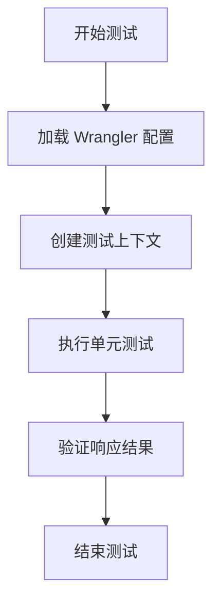

# CI/CD集成

<cite>
**本文档中引用的文件**  
- [github-action.md](file://doc/github-action.md)
- [wrangler-action.toml](file://mail-worker/wrangler-action.toml)
- [wrangler.toml](file://mail-worker/wrangler.toml)
- [wrangler-dev.toml](file://mail-worker/wrangler-dev.toml)
- [wrangler-test.toml](file://mail-worker/wrangler-test.toml)
- [package.json](file://mail-worker/package.json)
- [vitest.config.js](file://mail-worker/vitest.config.js)
- [test/index.spec.js](file://mail-worker/test/index.spec.js)
- [vite.config.js](file://mail-vue/vite.config.js)
</cite>

## 目录
1. [简介](#简介)
2. [GitHub Actions 部署配置](#github-actions-部署配置)
3. [工作流阶段解析](#工作流阶段解析)
4. [wrangler-action.toml 生产环境配置](#wrangler-actiontoml-生产环境配置)
5. [前后端并行构建与依赖缓存](#前后端并行构建与依赖缓存)
6. [自动化测试集成（Vitest）](#自动化测试集成vitest)
7. [部署预览与分支策略](#部署预览与分支策略)
8. [常见问题与解决方案](#常见问题与解决方案)
9. [总结](#总结)

## 简介
本指南详细说明了 `cloud-mail` 项目的 CI/CD 集成流程，重点介绍基于 GitHub Actions 的自动化部署机制。通过分析 `github-action.md` 文档和 `wrangler-action.toml` 配置文件，全面解析测试、构建、部署各阶段的实现逻辑。涵盖环境变量注入、权限验证、发布策略、前后端并行构建、依赖缓存、部署预览及自动化测试等关键环节，并提供常见问题的解决方案和推荐的分支管理策略。

## GitHub Actions 部署配置
GitHub Actions 的部署流程始于在仓库设置中配置必要的 Secrets，这些密钥用于连接 Cloudflare 资源并完成自动化部署。

### 必需的 Secrets 配置
根据 `github-action.md` 文档，必须在 GitHub 仓库的 **Settings → Secrets and variables → Actions** 中添加以下密钥：

| 密钥名称 | 用途 |
|--------|------|
| `CLOUDFLARE_API_TOKEN` | Cloudflare API 令牌，需具备 Workers 及相关资源权限 |
| `CLOUDFLARE_ACCOUNT_ID` | Cloudflare 账户 ID |
| `D1_DATABASE_ID` | D1 数据库的 ID |
| `KV_NAMESPACE_ID` | KV 命名空间的 ID |
| `R2_BUCKET_NAME` | R2 存储桶的名称 |
| `DOMAIN` | 邮件服务使用的域名（支持多域名，用逗号分隔） |
| `ADMIN` | 管理员邮箱地址 |
| `JWT_SECRET` | 用于生成和验证 JWT 的随机长字符串 |

**可选密钥**：
- `INIT_URL`：部署后用于初始化数据库的 Worker URL（可选）

**Section sources**
- [github-action.md](file://doc/github-action.md#L0-L22)

## 工作流阶段解析
GitHub Actions 工作流通常包含以下阶段：代码检出、环境准备、依赖安装、测试、构建和部署。虽然未提供 `.github/workflows` 目录下的 YAML 文件，但可通过 `wrangler-action.toml` 和 `package.json` 推断其逻辑。

### 构建命令分析
`wrangler-action.toml` 中的构建命令定义了前后端的构建流程：
```toml
[build]
command = "pnpm --prefix ../mail-vue install && pnpm --prefix ../mail-vue run build"
```
该命令首先在 `mail-vue` 目录安装前端依赖，然后执行构建，生成静态资源至 `dist` 目录。

**Section sources**
- [wrangler-action.toml](file://mail-worker/wrangler-action.toml#L35-L38)

### 测试阶段
项目使用 Vitest 进行单元测试，测试配置位于 `vitest.config.js`，并使用 `@cloudflare/vitest-pool-workers` 插件与 Wrangler 集成。



**Diagram sources**
- [vitest.config.js](file://mail-worker/vitest.config.js#L1-L10)
- [test/index.spec.js](file://mail-worker/test/index.spec.js#L1-L19)

**Section sources**
- [vitest.config.js](file://mail-worker/vitest.config.js#L1-L10)
- [test/index.spec.js](file://mail-worker/test/index.spec.js#L1-L19)

## wrangler-action.toml 生产环境配置
`wrangler-action.toml` 是专为生产环境部署设计的配置文件，通过环境变量注入实现安全与灵活性。

### 核心资源配置
该文件通过占位符 `${}` 引用 GitHub Secrets，实现敏感信息的动态注入：

```toml
[[d1_databases]]
binding = "db"
database_name = "cloud-mail"
database_id = "${D1_DATABASE_ID}"

[[kv_namespaces]]
binding = "kv"
id = "${KV_NAMESPACE_ID}"

[[r2_buckets]]
binding = "r2"
bucket_name = "${R2_BUCKET_NAME}"
```

### 静态资源与触发器
```toml
[assets]
binding = "assets"
directory = "./dist"
not_found_handling = "single-page-application"
run_worker_first = true

[triggers]
crons = ["0 16 * * *"] # 每天 00:00 执行定时任务
```

### 环境变量与构建
`[vars]` 部分被注释，表明这些变量将通过 GitHub Actions 的环境变量或 Secrets 注入，而非硬编码。

**Section sources**
- [wrangler-action.toml](file://mail-worker/wrangler-action.toml#L0-L38)

## 前后端并行构建与依赖缓存
项目采用前后端分离架构，通过 `pnpm` 实现高效的依赖管理与构建。

### 构建流程
1. 后端 (`mail-worker`) 依赖前端构建产物 (`dist`)
2. 使用 `--prefix` 指定路径，确保在正确目录执行命令
3. `pnpm` 支持依赖缓存，加速 CI/CD 中的安装过程

### 依赖缓存建议
在 GitHub Actions 工作流中，应配置 `pnpm` 缓存以提升性能：
```yaml
- name: Cache pnpm modules
  uses: actions/cache@v3
  with:
    path: ~/.pnpm-store
    key: ${{ runner.os }}-pnpm-${{ hashFiles('**/pnpm-lock.yaml') }}
    restore-keys: |
      ${{ runner.os }}-pnpm-
```

**Section sources**
- [wrangler-action.toml](file://mail-worker/wrangler-action.toml#L35-L38)
- [package.json](file://mail-vue/package.json#L0-L42)

## 自动化测试集成（Vitest）
项目已集成 Vitest 作为测试框架，确保代码质量。

### 测试配置
`vitest.config.js` 使用 `@cloudflare/vitest-pool-workers` 提供的 `defineWorkersConfig`，并指向 `wrangler.jsonc` 配置文件（实际为 `.toml` 文件，可能存在配置路径错误）。

### 测试脚本
`package.json` 中的 `test` 脚本为：
```json
"test": "wrangler deploy --config wrangler-test.toml"
```
此配置可能用于部署测试环境，真正的单元测试应通过 `vitest` 命令执行。

**Section sources**
- [vitest.config.js](file://mail-worker/vitest.config.js#L1-L10)
- [package.json](file://mail-worker/package.json#L0-L28)

## 部署预览与分支策略
推荐采用以下分支策略以支持多环境部署：

### 分支策略
- `main` 分支：用于生产环境部署，对应 `wrangler-action.toml`
- `preview` 分支：用于预发布环境，可对应 `wrangler-dev.toml` 或 `wrangler-test.toml`
- `develop` 分支：开发集成分支

### 部署预览
通过 GitHub Actions 的 `on.push` 和 `on.pull_request` 触发，为每个 PR 生成预览部署，便于测试。

**Section sources**
- [wrangler-action.toml](file://mail-worker/wrangler-action.toml#L0-L38)
- [wrangler-dev.toml](file://mail-worker/wrangler-dev.toml#L0-L30)
- [wrangler-test.toml](file://mail-worker/wrangler-test.toml#L0-L40)

## 常见问题与解决方案
### 权限配置错误
**问题**：`CLOUDFLARE_API_TOKEN` 权限不足导致部署失败。  
**解决方案**：确保令牌具有 "Edit Cloudflare Workers" 及 D1、R2、KV 等相关权限。

### 部署超时
**问题**：构建或部署过程超时。  
**解决方案**：
- 优化构建命令，减少不必要的步骤
- 启用依赖缓存
- 检查网络连接或更换镜像源

### 环境变量未注入
**问题**：`${D1_DATABASE_ID}` 等占位符未被替换。  
**解决方案**：确认 GitHub Secrets 名称与配置文件中的占位符完全一致，且大小写匹配。

### 数据库初始化失败
**问题**：部署后数据库未初始化。  
**解决方案**：手动访问 `https://your-domain/api/init/your-jwt-secret` 进行初始化，或配置 `INIT_URL` 自动触发。

**Section sources**
- [github-action.md](file://doc/github-action.md#L0-L22)
- [wrangler-action.toml](file://mail-worker/wrangler-action.toml#L0-L38)

## 总结
`cloud-mail` 项目通过 GitHub Actions 实现了高效的 CI/CD 流程，结合 `wrangler-action.toml` 的环境变量注入机制，确保了生产环境的安全与灵活性。通过前后端并行构建、依赖缓存和自动化测试，提升了部署效率与代码质量。建议采用 `main` 和 `preview` 分支策略，结合部署预览功能，实现稳定可靠的发布流程。