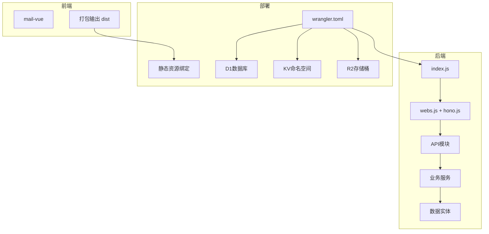
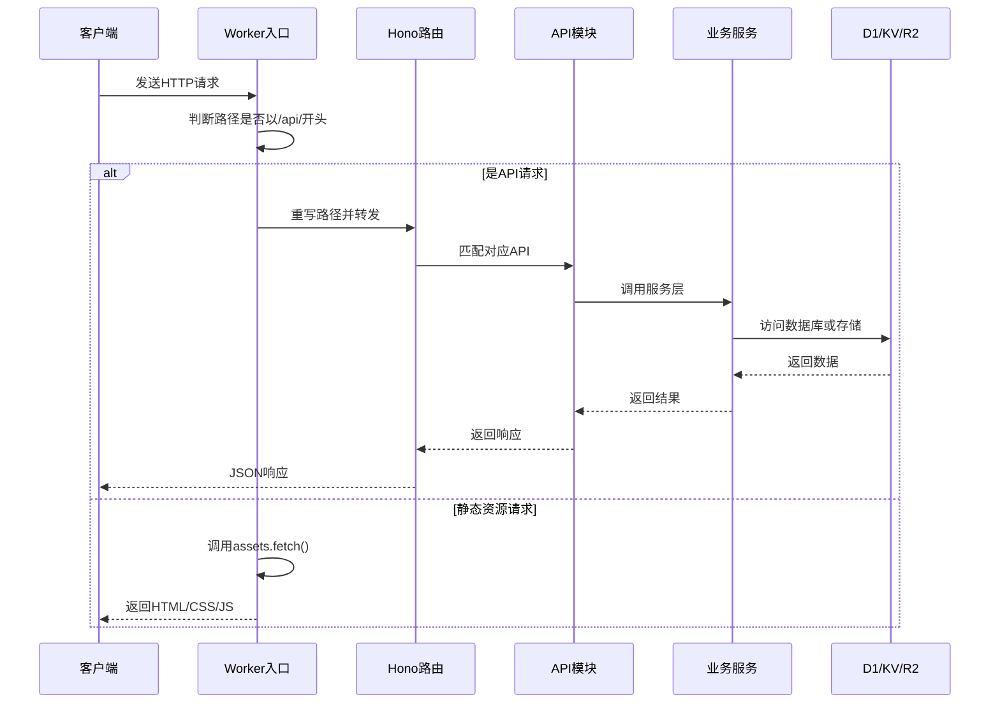
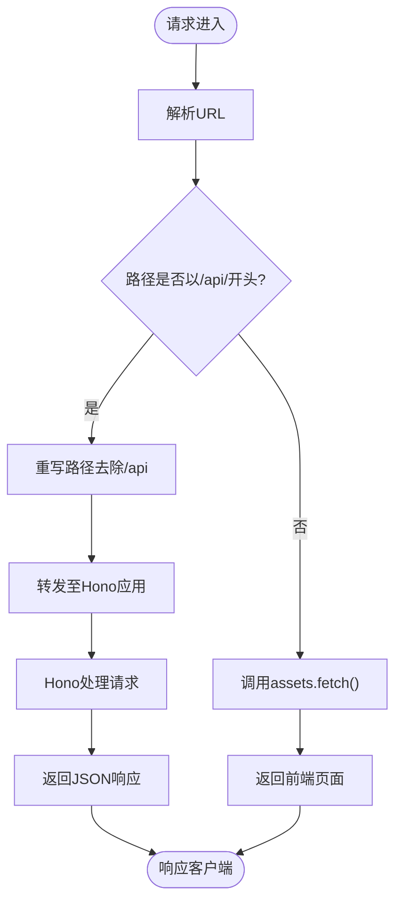
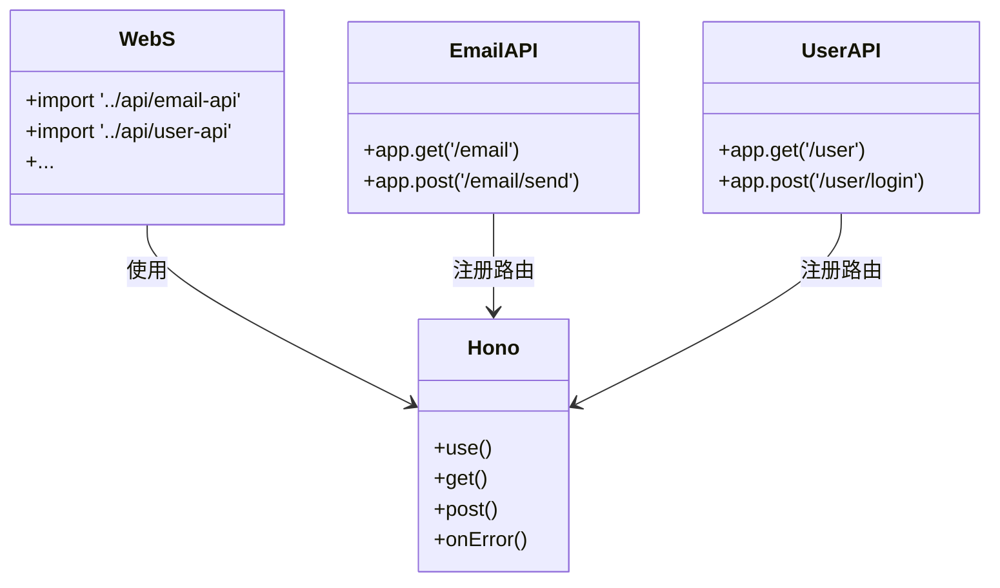
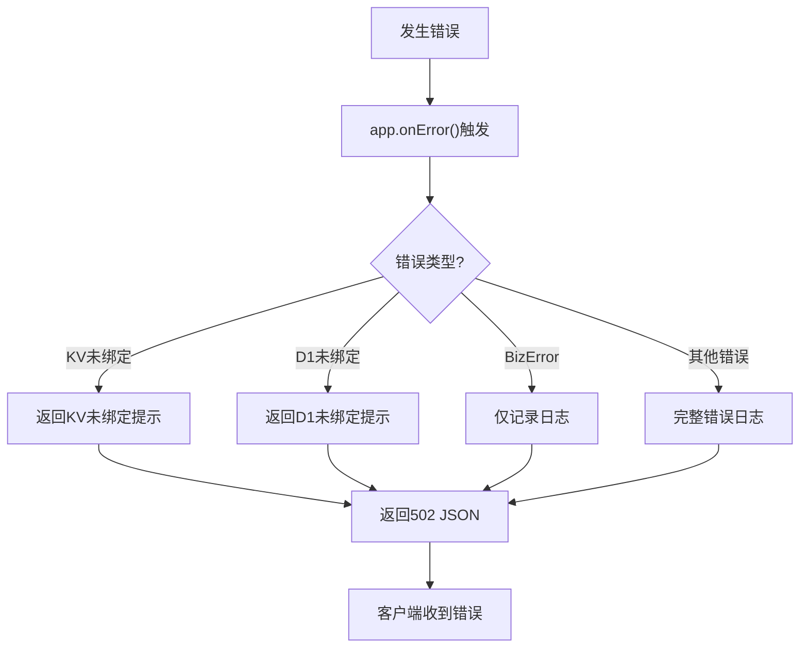
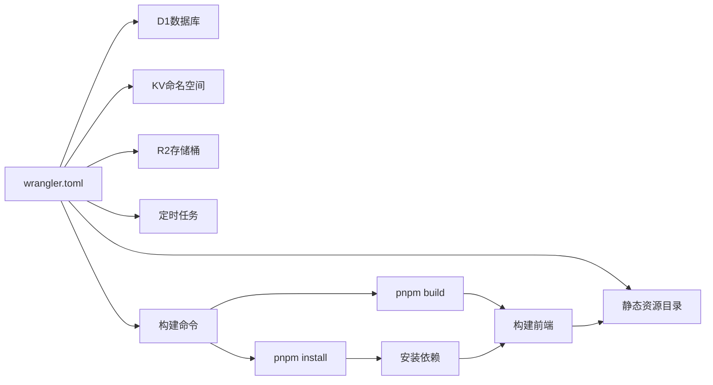

# Worker部署流程

<cite>
**本文档引用文件**  
- [index.js](file://mail-worker/src/index.js)
- [webs.js](file://mail-worker/src/hono/webs.js)
- [hono.js](file://mail-worker/src/hono/hono.js)
- [wrangler.toml](file://mail-worker/wrangler.toml)
- [wrangler-dev.toml](file://mail-worker/wrangler-dev.toml)
- [wrangler-test.toml](file://mail-worker/wrangler-test.toml)
- [wrangler-action.toml](file://mail-worker/wrangler-action.toml)
- [init.js](file://mail-worker/src/init/init.js)
- [i18n.js](file://mail-worker/src/i18n/i18n.js)
- [github-action.md](file://doc/github-action.md)
</cite>

## 目录
1. [简介](#简介)
2. [项目结构](#项目结构)
3. [核心组件](#核心组件)
4. [架构概览](#架构概览)
5. [详细组件分析](#详细组件分析)
6. [依赖分析](#依赖分析)
7. [性能考虑](#性能考虑)
8. [故障排除指南](#故障排除指南)
9. [结论](#结论)

## 简介
本文档提供Cloudflare Worker部署的完整操作指南，涵盖使用Wrangler CLI进行身份认证、环境初始化、资源绑定验证、版本发布等全流程。详细说明`wrangler.toml`配置文件中关键字段的作用，结合`index.js`入口文件与`webs.js`路由注册机制，解析Hono应用的构建与挂载流程，并涵盖自定义域名部署、预览环境创建、部署回滚等高级操作。同时提供日志解读、常见失败原因及解决方案，并给出性能优化建议。

## 项目结构
本项目包含前端Vue应用（`mail-vue`）和后端Worker服务（`mail-worker`），通过Wrangler统一构建与部署。静态资源由Worker托管，实现前后端一体化部署。

**图示来源**  
- [wrangler.toml](file://mail-worker/wrangler.toml#L1-L40)
- [index.js](file://mail-worker/src/index.js#L1-L24)
- [webs.js](file://mail-worker/src/hono/webs.js#L1-L21)

**本节来源**  
- [mail-worker](file://mail-worker)
- [mail-vue](file://mail-vue)

## 核心组件
系统以Hono框架为核心构建REST API，通过`index.js`作为Worker入口，`webs.js`注册所有API路由，`wrangler.toml`定义部署配置。支持定时任务执行数据库清理与用户发送计数重置。

**本节来源**  
- [index.js](file://mail-worker/src/index.js#L1-L24)
- [webs.js](file://mail-worker/src/hono/webs.js#L1-L21)
- [wrangler.toml](file://mail-worker/wrangler.toml#L1-L40)

## 架构概览
系统采用模块化设计，前端Vue应用打包后由Worker通过`assets`绑定提供静态资源服务。API请求以`/api/`为前缀被路由至Hono应用处理，其余请求返回前端页面，支持单页应用（SPA）模式。

**图示来源**  
- [index.js](file://mail-worker/src/index.js#L1-L24)
- [hono.js](file://mail-worker/src/hono/hono.js#L1-L33)
- [webs.js](file://mail-worker/src/hono/webs.js#L1-L21)

## 详细组件分析

### 入口文件分析
`index.js`是Cloudflare Worker的主入口，导出`fetch`处理器和`scheduled`定时任务处理器。所有API请求通过`/api/`前缀识别并转发至Hono应用，其他请求由静态资源处理器响应。

**图示来源**  
- [index.js](file://mail-worker/src/index.js#L1-L24)

**本节来源**  
- [index.js](file://mail-worker/src/index.js#L1-L24)

### 路由注册机制
`webs.js`通过导入各API模块实现路由自动注册。每个API模块在导入时向全局Hono实例注册其路由，无需手动挂载，实现松耦合的模块化设计。

**图示来源**  
- [webs.js](file://mail-worker/src/hono/webs.js#L1-L21)
- [hono.js](file://mail-worker/src/hono/hono.js#L1-L33)

**本节来源**  
- [webs.js](file://mail-worker/src/hono/webs.js#L1-L21)

### 错误处理机制
系统在Hono应用中统一注册错误处理器，识别数据库未绑定等常见错误，并返回结构化JSON响应。同时支持业务异常（BizError）的日志记录。

**图示来源**  
- [hono.js](file://mail-worker/src/hono/hono.js#L1-L30)

**本节来源**  
- [hono.js](file://mail-worker/src/hono/hono.js#L1-L33)

## 依赖分析
项目通过`wrangler.toml`配置文件声明对D1、KV、R2等Cloudflare资源的绑定，并在运行时通过`env`参数注入。前端依赖通过`build.command`自动安装与构建。

**图示来源**  
- [wrangler.toml](file://mail-worker/wrangler.toml#L1-L40)
- [wrangler-dev.toml](file://mail-worker/wrangler-dev.toml#L1-L30)
- [wrangler-test.toml](file://mail-worker/wrangler-test.toml#L1-L40)

**本节来源**  
- [wrangler.toml](file://mail-worker/wrangler.toml#L1-L40)
- [wrangler-dev.toml](file://mail-worker/wrangler-dev.toml#L1-L30)
- [wrangler-test.toml](file://mail-worker/wrangler-test.toml#L1-L40)

## 性能考虑
- **冷启动优化**：减少依赖数量，避免在全局作用域执行耗时操作。
- **缓存策略**：合理使用KV缓存高频数据，减少D1查询压力。
- **静态资源**：通过`assets`绑定直接返回前端资源，降低Worker执行频率。
- **定时任务**：使用`[triggers]`配置每日清理任务，避免手动触发延迟。

## 故障排除指南
### 常见部署失败原因
- **依赖未安装**：确保`build.command`正确执行`pnpm install`。
- **语法错误**：检查TypeScript编译是否通过，避免ES6+语法不兼容。
- **资源未绑定**：确认D1、KV、R2的`binding`名称与代码中一致。
- **环境变量缺失**：开发环境需在`wrangler-dev.toml`中配置`[vars]`。

### 日志解读
- `KV数据库未绑定`：检查`kv`绑定ID是否正确。
- `D1数据库未绑定`：确认`db`绑定配置无误。
- `JWTMismatch`：`/api/init/:secret`接口的`secret`参数与`jwt_secret`环境变量不匹配。

### 初始化失败处理
若初始化失败，可手动访问`https://your-domain/api/init/your-jwt-secret`重新初始化数据库结构。

**本节来源**  
- [hono.js](file://mail-worker/src/hono/hono.js#L1-L30)
- [init.js](file://mail-worker/src/init/init.js#L1-L47)
- [github-action.md](file://doc/github-action.md#L1-L22)

## 结论
本项目通过Wrangler实现Cloudflare Worker的一体化部署，结合Hono框架提供高效API服务。通过多环境配置文件支持开发、测试、生产等不同场景。建议在部署前充分验证资源配置与环境变量，确保系统稳定运行。