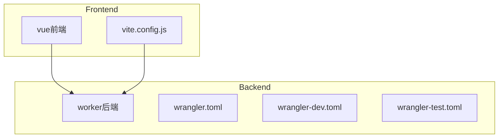
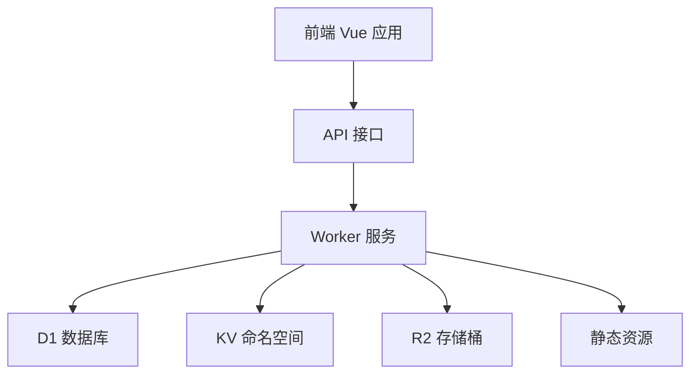
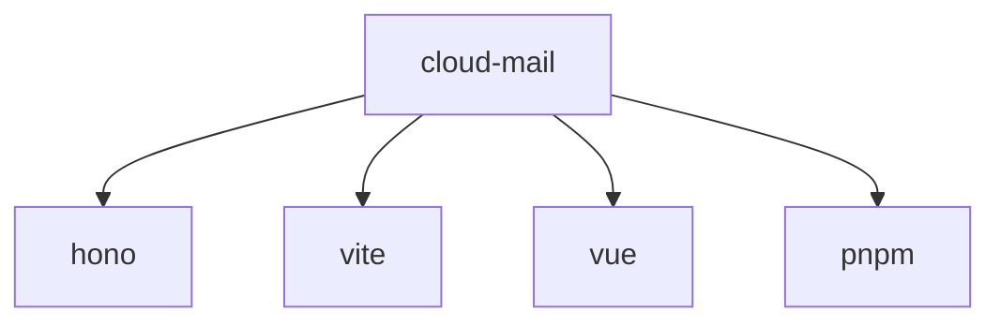

# 环境配置

<cite>
**本文档引用的文件**  
- [wrangler.toml](file://mail-worker/wrangler.toml)
- [wrangler-dev.toml](file://mail-worker/wrangler-dev.toml)
- [wrangler-test.toml](file://mail-worker/wrangler-test.toml)
- [vite.config.js](file://mail-vue/vite.config.js)
- [index.js](file://mail-worker/src/index.js)
- [webs.js](file://mail-worker/src/hono/webs.js)
- [hono.js](file://mail-worker/src/hono/hono.js)
- [result.js](file://mail-worker/src/model/result.js)
</cite>

## 目录
1. [简介](#简介)
2. [项目结构](#项目结构)
3. [核心组件](#核心组件)
4. [架构概览](#架构概览)
5. [详细组件分析](#详细组件分析)
6. [依赖分析](#依赖分析)
7. [性能考虑](#性能考虑)
8. [故障排除指南](#故障排除指南)
9. [结论](#结论)

## 简介
本文档详细说明如何在 `wrangler.toml` 及其变体文件中配置 Cloudflare 平台资源绑定，涵盖 D1 数据库、KV 命名空间、R2 存储桶的声明与绑定方式，以及环境变量（如 RESEND_API_KEY、TURNSTILE_SECRET、ADMIN_EMAIL 等）的设置方法。同时解释多环境配置策略（开发、测试、生产），并通过 `wrangler-dev.toml` 等文件实现环境隔离。还说明 `vite.config.js` 中的开发服务器代理配置，以支持前端本地开发时与 Worker 后端的无缝通信。提供配置示例、常见错误排查方案及安全建议。

## 项目结构
项目包含两个主要子目录：`mail-vue` 和 `mail-worker`。`mail-vue` 是前端 Vue 项目，`mail-worker` 是后端 Worker 项目。`mail-worker` 包含多个配置文件用于不同环境的部署。

**Diagram sources**
- [vite.config.js](file://mail-vue/vite.config.js#L1-L62)
- [wrangler.toml](file://mail-worker/wrangler.toml#L1-L41)
- [wrangler-dev.toml](file://mail-worker/wrangler-dev.toml#L1-L31)
- [wrangler-test.toml](file://mail-worker/wrangler-test.toml#L1-L41)

**Section sources**
- [wrangler.toml](file://mail-worker/wrangler.toml#L1-L41)
- [wrangler-dev.toml](file://mail-worker/wrangler-dev.toml#L1-L31)
- [wrangler-test.toml](file://mail-worker/wrangler-test.toml#L1-L41)
- [vite.config.js](file://mail-vue/vite.config.js#L1-L62)

## 核心组件
本节分析 `wrangler.toml` 文件中的核心配置项，包括 D1 数据库、KV 命名空间、R2 存储桶的绑定方式，以及环境变量的设置。

**Section sources**
- [wrangler.toml](file://mail-worker/wrangler.toml#L1-L41)
- [wrangler-dev.toml](file://mail-worker/wrangler-dev.toml#L1-L31)
- [wrangler-test.toml](file://mail-worker/wrangler-test.toml#L1-L41)

## 架构概览
系统架构包括前端 Vue 应用、后端 Worker 服务、D1 数据库、KV 命名空间和 R2 存储桶。前端通过 API 与后端通信，后端通过绑定的资源与 Cloudflare 平台交互。

**Diagram sources**
- [wrangler.toml](file://mail-worker/wrangler.toml#L1-L41)
- [index.js](file://mail-worker/src/index.js#L1-L25)
- [webs.js](file://mail-worker/src/hono/webs.js#L1-L22)

## 详细组件分析

### D1 数据库配置
D1 数据库通过 `[[d1_databases]]` 配置项绑定，`binding` 指定绑定名称，`database_name` 指定数据库名称，`database_id` 指定数据库 ID。

**Section sources**
- [wrangler.toml](file://mail-worker/wrangler.toml#L7-L10)
- [wrangler-dev.toml](file://mail-worker/wrangler-dev.toml#L7-L10)
- [wrangler-test.toml](file://mail-worker/wrangler-test.toml#L7-L10)

### KV 命名空间配置
KV 命名空间通过 `[[kv_namespaces]]` 配置项绑定，`binding` 指定绑定名称，`id` 指定命名空间 ID。

**Section sources**
- [wrangler.toml](file://mail-worker/wrangler.toml#L12-L14)
- [wrangler-dev.toml](file://mail-worker/wrangler-dev.toml#L12-L14)
- [wrangler-test.toml](file://mail-worker/wrangler-test.toml#L12-L14)

### R2 存储桶配置
R2 存储桶通过 `[[r2_buckets]]` 配置项绑定，`binding` 指定绑定名称，`bucket_name` 指定存储桶名称。

**Section sources**
- [wrangler.toml](file://mail-worker/wrangler.toml#L16-L19)
- [wrangler-test.toml](file://mail-worker/wrangler-test.toml#L16-L19)

### 静态资源配置
静态资源通过 `[assets]` 配置项绑定，`binding` 指定绑定名称，`directory` 指定资源目录。

**Section sources**
- [wrangler.toml](file://mail-worker/wrangler.toml#L21-L24)
- [wrangler-test.toml](file://mail-worker/wrangler-test.toml#L26-L29)

### 环境变量配置
环境变量通过 `[vars]` 配置项设置，包括 `orm_log`、`domain`、`admin`、`jwt_secret` 等。

**Section sources**
- [wrangler-dev.toml](file://mail-worker/wrangler-dev.toml#L20-L24)
- [wrangler-test.toml](file://mail-worker/wrangler-test.toml#L32-L36)

### 多环境配置策略
通过 `wrangler-dev.toml`、`wrangler-test.toml` 和 `wrangler.toml` 实现开发、测试、生产环境的隔离。

**Section sources**
- [wrangler-dev.toml](file://mail-worker/wrangler-dev.toml#L1-L31)
- [wrangler-test.toml](file://mail-worker/wrangler-test.toml#L1-L41)
- [wrangler.toml](file://mail-worker/wrangler.toml#L1-L41)

### 开发服务器代理配置
`vite.config.js` 中的 `server` 配置项用于设置开发服务器的主机、端口和热更新。

**Section sources**
- [vite.config.js](file://mail-vue/vite.config.js#L16-L20)

## 依赖分析
项目依赖包括 `hono`、`vite`、`vue` 等，通过 `package.json` 管理。

**Diagram sources**
- [package.json](file://mail-worker/package.json#L1-L20)
- [package.json](file://mail-vue/package.json#L1-L20)

**Section sources**
- [package.json](file://mail-worker/package.json#L1-L20)
- [package.json](file://mail-vue/package.json#L1-L20)

## 性能考虑
- 使用 `keep_vars = true` 保持环境变量。
- 使用 `compatibility_date` 确保兼容性。
- 使用 `observability` 启用观测性。

[无具体文件分析，不添加 Section sources]

## 故障排除指南
- **绑定名称不匹配**：检查 `binding` 是否正确。
- **权限缺失**：确保 Cloudflare 账户有相应权限。
- **环境变量未设置**：检查 `[vars]` 配置项。

**Section sources**
- [hono.js](file://mail-worker/src/hono/hono.js#L1-L34)
- [result.js](file://mail-worker/src/model/result.js#L1-L10)

## 结论
本文档详细介绍了 `cloud-mail` 项目的环境配置，包括资源绑定、环境变量设置、多环境配置策略和开发服务器代理配置。通过这些配置，可以实现高效、安全的开发和部署。

[无具体文件分析，不添加 Section sources]