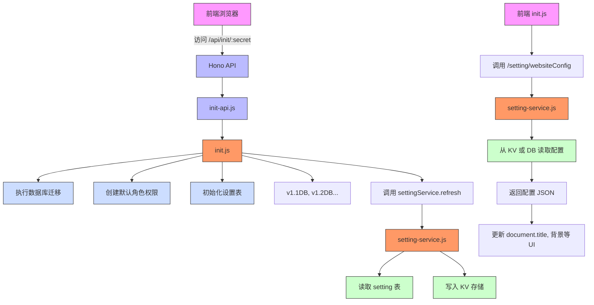
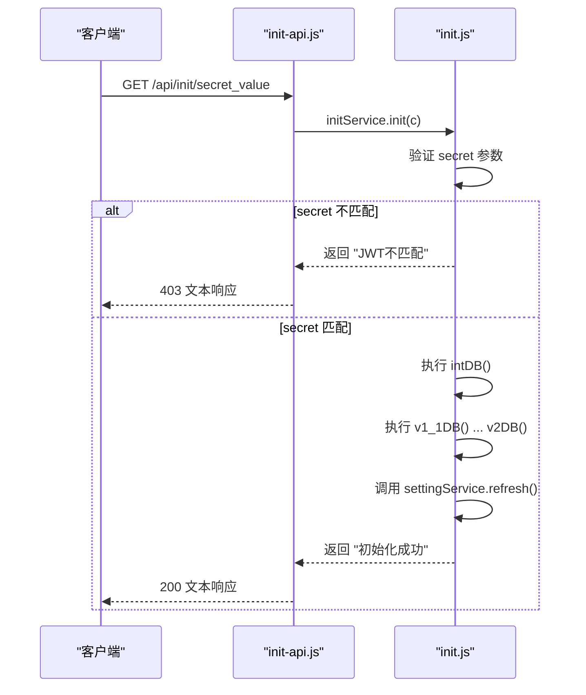
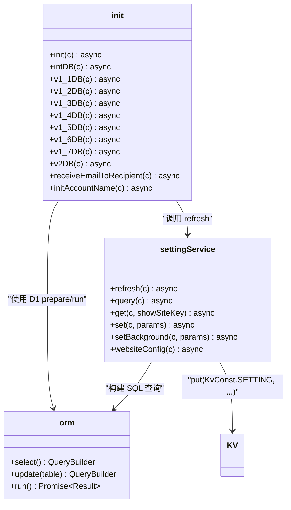
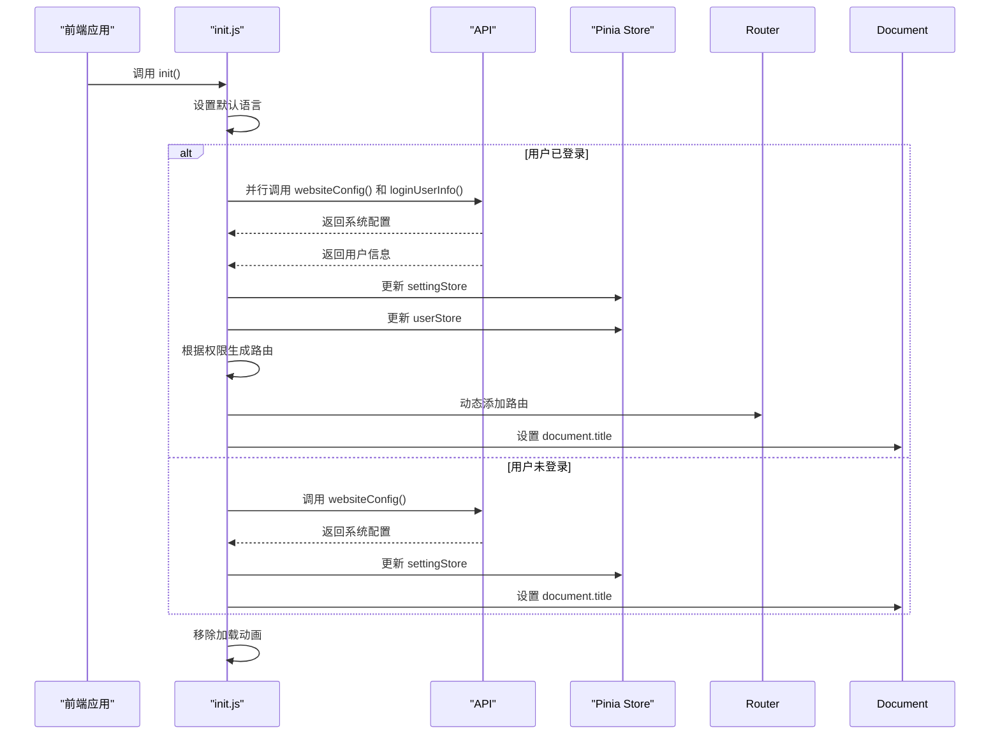

# 系统初始化脚本

<cite>
**本文档引用的文件**  
- [init-api.js](file://mail-worker/src/api/init-api.js)
- [init.js](file://mail-worker/src/init/init.js)
- [init.js](file://mail-vue/src/init/init.js)
- [setting-service.js](file://mail-worker/src/service/setting-service.js)
- [entity-const.js](file://mail-worker/src/const/entity-const.js)
- [setting.js](file://mail-vue/src/request/setting.js)
</cite>

## 目录
1. [简介](#简介)
2. [项目结构](#项目结构)
3. [核心组件](#核心组件)
4. [架构概览](#架构概览)
5. [详细组件分析](#详细组件分析)
6. [依赖分析](#依赖分析)
7. [性能考虑](#性能考虑)
8. [故障排除指南](#故障排除指南)
9. [结论](#结论)

## 简介
`cloud-mail` 系统提供了一套完整的邮件管理解决方案，支持多用户、权限控制、邮件收发及系统配置管理。本系统通过 `/api/init/:secret` 接口实现一次性初始化机制，确保数据库结构创建、默认管理员账户生成、系统设置加载等关键操作的安全执行。前端通过 `init.js` 脚本动态获取系统配置并渲染界面。本文档详细说明该初始化流程的设计与实现，涵盖安全验证、数据结构演进、KV存储同步、异常处理及最佳实践。

## 项目结构
`cloud-mail` 采用前后端分离架构，包含两个主要模块：`mail-vue`（前端）和 `mail-worker`（后端服务）。后端基于 Cloudflare Workers 构建，使用 Hono 框架处理 HTTP 请求，并通过 D1 数据库和 R2 对象存储进行数据持久化。

```mermaid
graph TB
subgraph "前端 (mail-vue)"
A[init.js] --> B[websiteConfig API]
B --> C[/api/setting/websiteConfig]
end
subgraph "后端 (mail-worker)"
C --> D[init-api.js]
D --> E[init.js]
E --> F[D1 Database]
E --> G[KV Storage]
H[setting-service.js] --> G
H --> F
end
```

**图示来源**  
- [init-api.js](file://mail-worker/src/api/init-api.js#L1-L7)
- [init.js](file://mail-worker/src/init/init.js#L1-L533)
- [setting-service.js](file://mail-worker/src/service/setting-service.js#L1-L181)

**本节来源**  
- [mail-vue](file://mail-vue)
- [mail-worker](file://mail-worker)

## 核心组件
系统初始化机制由多个核心组件协同完成：
- **init-api.js**：定义 `/api/init/:secret` 路由，接收初始化请求。
- **init.js (worker)**：执行数据库结构初始化、版本迁移、默认数据插入等逻辑。
- **setting-service.js**：负责系统设置的查询、更新与缓存（KV）同步。
- **init.js (vue)**：前端初始化脚本，调用 `websiteConfig` 获取系统配置并更新 UI。
- **websiteConfig API**：暴露系统配置信息供前端使用。

这些组件共同确保系统在首次部署时能够安全、可靠地完成初始化。

**本节来源**  
- [init-api.js](file://mail-worker/src/api/init-api.js#L1-L7)
- [init.js](file://mail-worker/src/init/init.js#L1-L533)
- [setting-service.js](file://mail-worker/src/service/setting-service.js#L1-L181)
- [init.js](file://mail-vue/src/init/init.js#L1-L72)
- [setting.js](file://mail-vue/src/request/setting.js#L10-L12)

## 架构概览
系统初始化流程涉及前端、API 层、业务逻辑层、数据访问层以及外部存储（D1、KV）。整体架构如下图所示：



**图示来源**  
- [init-api.js](file://mail-worker/src/api/init-api.js#L1-L7)
- [init.js](file://mail-worker/src/init/init.js#L1-L533)
- [setting-service.js](file://mail-worker/src/service/setting-service.js#L1-L181)
- [init.js](file://mail-vue/src/init/init.js#L1-L72)

## 详细组件分析

### 初始化 API 接口分析
`init-api.js` 定义了 `/api/init/:secret` 接口，作为系统初始化的入口点。该接口将请求委托给 `initService.init(c)` 方法处理。



**图示来源**  
- [init-api.js](file://mail-worker/src/api/init-api.js#L1-L7)
- [init.js](file://mail-worker/src/init/init.js#L1-L533)

**本节来源**  
- [init-api.js](file://mail-worker/src/api/init-api.js#L1-L7)

### 后端初始化服务分析
`init.js`（位于 `mail-worker/src/init/`）是初始化逻辑的核心。它包含多个版本迁移方法（`v1_1DB`, `v1_2DB` 等），用于逐步构建数据库结构。

#### 数据库结构初始化
`intDB(c)` 方法创建系统所需的初始表结构，包括 `email`、`user`、`account`、`setting` 等。



**图示来源**  
- [init.js](file://mail-worker/src/init/init.js#L1-L533)
- [setting-service.js](file://mail-worker/src/service/setting-service.js#L1-L181)

#### 安全验证逻辑
初始化的安全性通过 `secret` 参数与环境变量 `jwt_secret` 的比对来保证。只有当两者完全一致时，初始化流程才会继续执行。

```mermaid
flowchart TD
A[收到 /api/init/:secret 请求] --> B{secret == c.env.jwt_secret?}
B --> |否| C[返回 "JWT不匹配"]
B --> |是| D[执行数据库初始化]
D --> E[执行版本迁移]
E --> F[调用 settingService.refresh()]
F --> G[将配置写入 KV]
G --> H[返回 "初始化成功"]
```

**图示来源**  
- [init.js](file://mail-worker/src/init/init.js#L1-L533)

**本节来源**  
- [init.js](file://mail-worker/src/init/init.js#L1-L533)

### 前端初始化脚本分析
`mail-vue/src/init/init.js` 负责前端应用的初始化，包括获取系统配置、设置页面标题、动态加载路由等。

#### 前端初始化流程
该脚本在应用启动时被调用，根据用户登录状态决定加载哪些数据。



**图示来源**  
- [init.js](file://mail-vue/src/init/init.js#L1-L72)
- [setting.js](file://mail-vue/src/request/setting.js#L10-L12)

**本节来源**  
- [init.js](file://mail-vue/src/init/init.js#L1-L72)

## 依赖分析
系统初始化机制涉及多个模块间的依赖关系。

```mermaid
graph TD
A[init-api.js] --> B[init.js]
B --> C[setting-service.js]
C --> D[D1 Database]
C --> E[KV Storage]
F[init.js (vue)] --> G[setting.js]
G --> H[/api/setting/websiteConfig]
H --> C
B --> D
B --> I[entity-const.js]
style A fill:#f96,stroke:#333
style B fill:#f96,stroke:#333
style C fill:#f96,stroke:#333
style D fill:#cfc,stroke:#333
style E fill:#cfc,stroke:#333
style F fill:#f96,stroke:#333
style G fill:#f96,stroke:#333
style H fill:#bbf,stroke:#333
style I fill:#cdf,stroke:#333
```

**图示来源**  
- [init-api.js](file://mail-worker/src/api/init-api.js#L1-L7)
- [init.js](file://mail-worker/src/init/init.js#L1-L533)
- [setting-service.js](file://mail-worker/src/service/setting-service.js#L1-L181)
- [init.js](file://mail-vue/src/init/init.js#L1-L72)
- [setting.js](file://mail-vue/src/request/setting.js#L10-L12)

**本节来源**  
- [init-api.js](file://mail-worker/src/api/init-api.js#L1-L7)
- [init.js](file://mail-worker/src/init/init.js#L1-L533)
- [setting-service.js](file://mail-worker/src/service/setting-service.js#L1-L181)
- [init.js](file://mail-vue/src/init/init.js#L1-L72)

## 性能考虑
- **数据库批处理**：`v2DB` 和 `v1_3DB` 方法使用 `c.env.db.batch()` 批量执行 SQL 语句，减少网络往返开销。
- **并行请求**：前端 `init.js` 使用 `Promise.all()` 并行获取用户信息和系统配置，缩短初始化时间。
- **KV 缓存**：`settingService.refresh()` 将数据库中的设置写入 KV 存储，后续读取直接从 KV 获取，显著提升读取性能。
- **索引优化**：`v1_6DB` 方法为 `account.email` 和 `user.email` 创建了不区分大小写的唯一索引 (`idx_account_email_nocase`)，优化查询性能。

## 故障排除指南
### 初始化失败常见场景及修复

| 问题现象 | 可能原因 | 修复步骤 |
|--------|--------|--------|
| 访问 `/api/init/:secret` 返回 "JWT不匹配" | `secret` 参数与环境变量 `jwt_secret` 不一致 | 检查 `wrangler.toml` 或部署环境中的 `jwt_secret` 值，并确保请求的 `:secret` 参数与之完全相同 |
| 初始化后页面空白或功能异常 | D1 数据库绑定失败 | 检查 `wrangler.toml` 文件，确认 `[[d1_databases]]` 配置正确，且数据库已通过 `wrangler d1 create` 创建 |
| 系统设置无法保存或读取 | KV 命名空间绑定失败 | 检查 `wrangler.toml` 文件，确认 `[[kv_namespaces]]` 配置正确，命名空间已通过 `wrangler kv:namespace create` 创建 |
| 初始化请求超时 | 数据库迁移 SQL 执行时间过长 | 检查 `init.js` 中的 `ADD_COLUMN_SQL_LIST` 和 `batch` 操作，确认没有对大表执行耗时的 `ALTER TABLE` 操作 |
| 背景图无法上传 | R2 存储桶未配置或 `r2_domain` 为空 | 确保 `wrangler.toml` 中配置了 `[[r2_buckets]]`，并在初始化后通过 API 设置正确的 `r2_domain` 值 |

### 最佳实践
- **仅执行一次**：系统初始化应仅在首次部署时执行一次。重复初始化可能导致数据不一致或错误。
- **保护初始化端点**：`/api/init/:secret` 是高危端点，应确保 `jwt_secret` 具有足够强度，并在生产环境中严格保密。
- **环境变量管理**：所有敏感信息（如 `jwt_secret`、数据库连接信息）都应通过环境变量注入，避免硬编码。
- **备份与恢复**：定期备份 D1 数据库，以防止因初始化错误或数据损坏导致的服务中断。

**本节来源**  
- [init.js](file://mail-worker/src/init/init.js#L1-L533)
- [setting-service.js](file://mail-worker/src/service/setting-service.js#L1-L181)

## 结论
`cloud-mail` 系统的初始化机制设计周密，通过 `secret` 参数验证确保了操作的安全性。后端 `init.js` 脚本采用渐进式版本迁移策略，能够灵活应对数据库结构的演进。前端 `init.js` 脚本高效地获取并应用系统配置，实现了动态化的用户界面。结合 D1 和 KV 的优势，系统在保证数据一致性的同时，也提供了良好的读取性能。遵循本文档的最佳实践，可以确保系统稳定、安全地完成初始化并长期可靠运行。